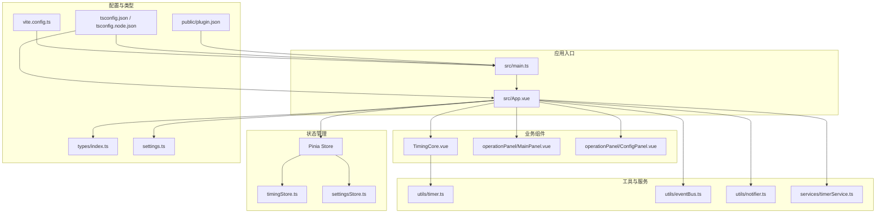
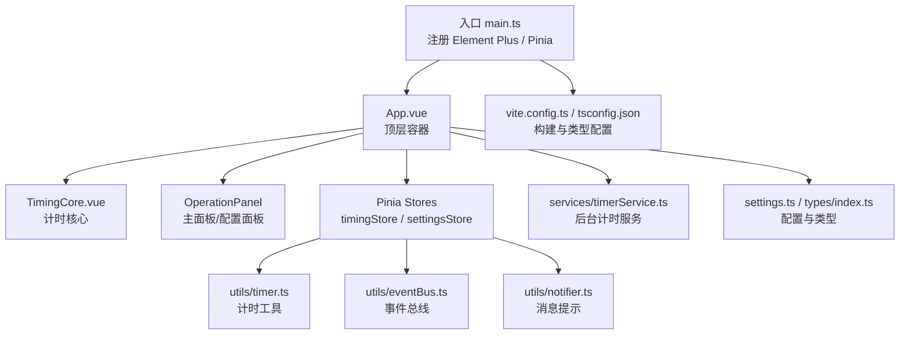
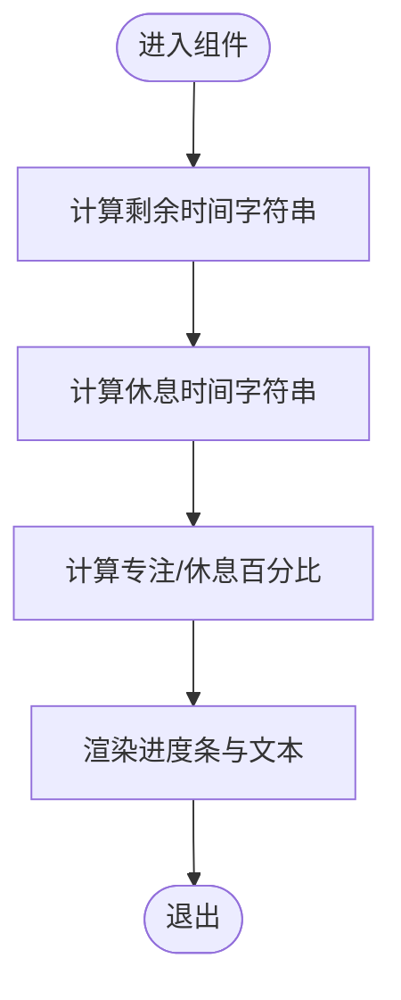
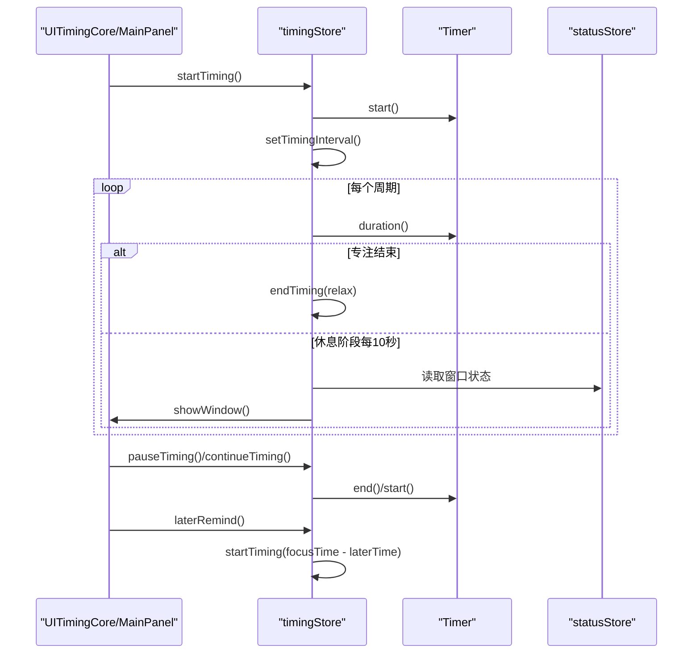
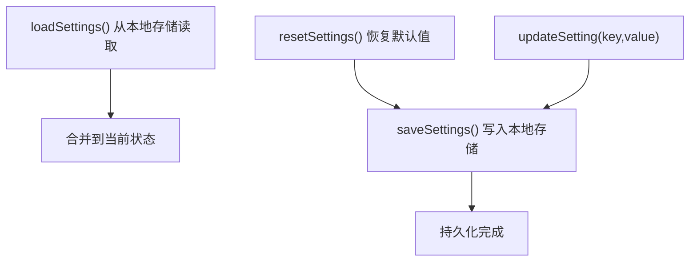
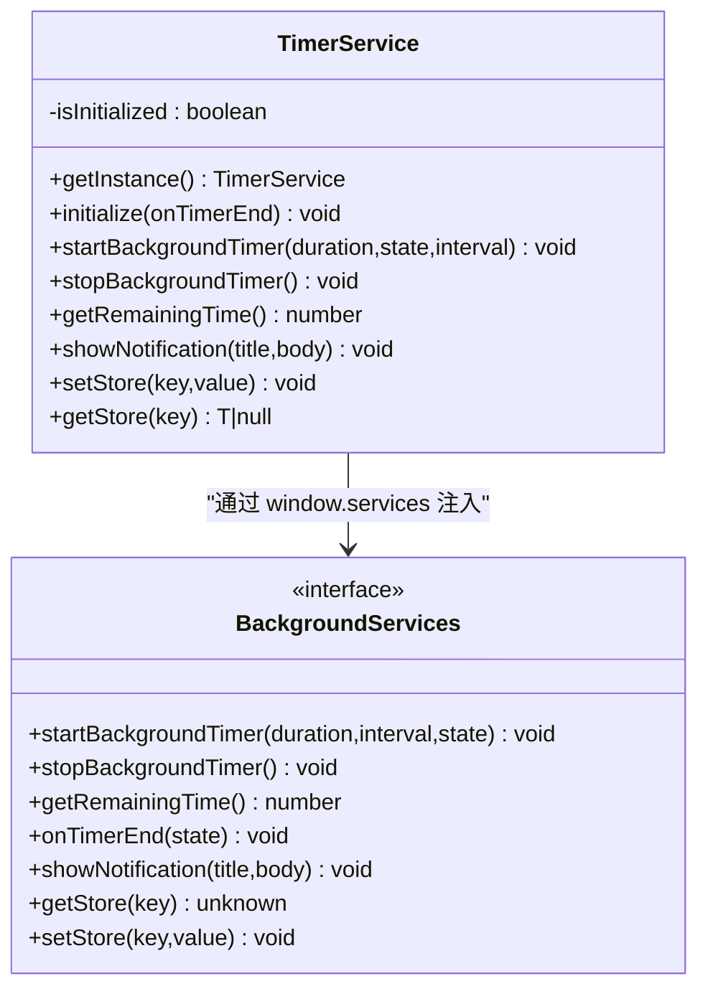
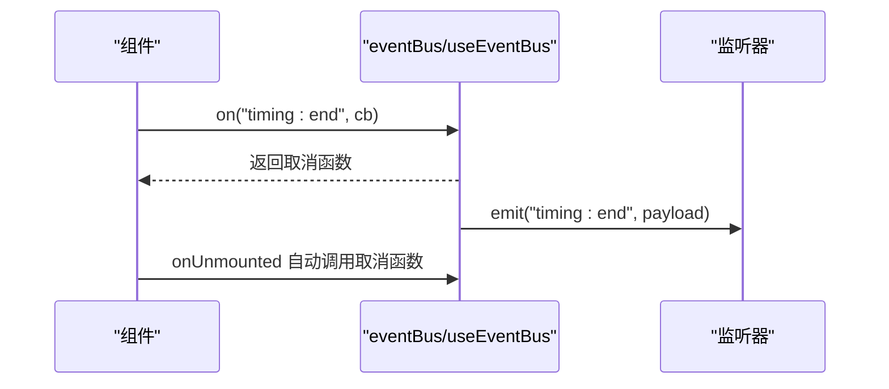
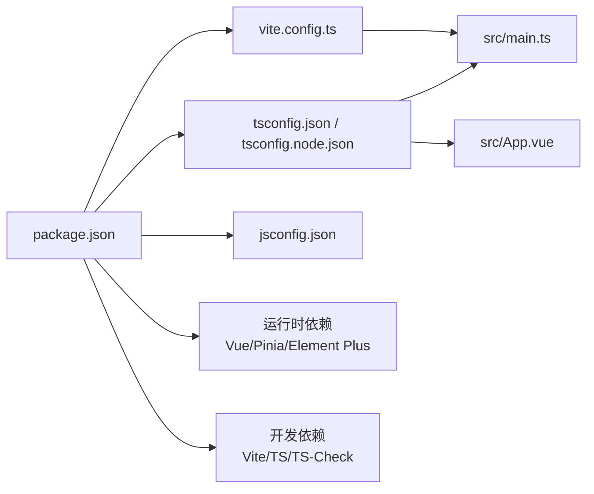

# 开发指南

<cite>
**本文引用的文件**
- [package.json](file://package.json)
- [vite.config.ts](file://vite.config.ts)
- [tsconfig.json](file://tsconfig.json)
- [tsconfig.node.json](file://tsconfig.node.json)
- [jsconfig.json](file://jsconfig.json)
- [src/main.ts](file://src/main.ts)
- [src/App.vue](file://src/App.vue)
- [src/settings.ts](file://src/settings.ts)
- [src/types/index.ts](file://src/types/index.ts)
- [src/utils/timer.ts](file://src/utils/timer.ts)
- [src/utils/eventBus.ts](file://src/utils/eventBus.ts)
- [src/utils/notifier.ts](file://src/utils/notifier.ts)
- [src/services/timerService.ts](file://src/services/timerService.ts)
- [src/stores/timingStore.ts](file://src/stores/timingStore.ts)
- [src/stores/settingsStore.ts](file://src/stores/settingsStore.ts)
- [src/components/TimingCore.vue](file://src/components/TimingCore.vue)
- [src/components/operationPanel/MainPanel.vue](file://src/components/operationPanel/MainPanel.vue)
- [src/components/operationPanel/ConfigPanel.vue](file://src/components/operationPanel/ConfigPanel.vue)
- [public/plugin.json](file://public/plugin.json)
</cite>

## 目录
1. [简介](#简介)
2. [项目结构](#项目结构)
3. [核心组件](#核心组件)
4. [架构总览](#架构总览)
5. [详细组件分析](#详细组件分析)
6. [依赖分析](#依赖分析)
7. [性能考虑](#性能考虑)
8. [故障排查指南](#故障排查指南)
9. [结论](#结论)
10. [附录](#附录)

## 简介
本开发指南面向“休息提醒”项目的开发者与维护者，目标是帮助团队快速搭建一致的开发环境、理解代码架构与数据流、掌握类型系统与构建配置，并建立规范化的编码、测试与发布流程。文档覆盖以下主题：
- 开发环境搭建与配置：Vite 构建工具、TypeScript 编译与类型检查
- Git 版本控制与分支管理策略
- 代码规范与最佳实践：命名、注释、模块组织
- 调试技巧与开发工具使用
- 性能优化与内存管理
- 单元测试与集成测试指南
- 代码审查与质量保证流程
- 团队协作与版本发布标准化工作流

## 项目结构
项目采用基于功能域的模块化组织方式，前端框架为 Vue 3 + Pinia，UI 组件库为 Element Plus；通过 Vite 提供开发服务器与打包能力；TypeScript 提供强类型保障。

图表来源
- [src/main.ts:1-19](file://src/main.ts#L1-L19)
- [src/App.vue:1-145](file://src/App.vue#L1-L145)
- [src/stores/timingStore.ts:1-141](file://src/stores/timingStore.ts#L1-L141)
- [src/stores/settingsStore.ts:1-87](file://src/stores/settingsStore.ts#L1-L87)
- [src/components/TimingCore.vue:1-101](file://src/components/TimingCore.vue#L1-L101)
- [src/components/operationPanel/MainPanel.vue:1-82](file://src/components/operationPanel/MainPanel.vue#L1-L82)
- [src/components/operationPanel/ConfigPanel.vue:1-378](file://src/components/operationPanel/ConfigPanel.vue#L1-L378)
- [src/utils/timer.ts:1-66](file://src/utils/timer.ts#L1-L66)
- [src/utils/eventBus.ts:1-104](file://src/utils/eventBus.ts#L1-L104)
- [src/utils/notifier.ts:1-62](file://src/utils/notifier.ts#L1-L62)
- [src/services/timerService.ts:1-161](file://src/services/timerService.ts#L1-L161)
- [vite.config.ts:1-15](file://vite.config.ts#L1-L15)
- [tsconfig.json:1-26](file://tsconfig.json#L1-L26)
- [tsconfig.node.json:1-12](file://tsconfig.node.json#L1-L12)
- [src/types/index.ts:1-83](file://src/types/index.ts#L1-L83)
- [src/settings.ts:1-50](file://src/settings.ts#L1-L50)
- [public/plugin.json:1-25](file://public/plugin.json#L1-L25)

章节来源
- [src/main.ts:1-19](file://src/main.ts#L1-L19)
- [src/App.vue:1-145](file://src/App.vue#L1-L145)
- [vite.config.ts:1-15](file://vite.config.ts#L1-L15)
- [tsconfig.json:1-26](file://tsconfig.json#L1-L26)
- [tsconfig.node.json:1-12](file://tsconfig.node.json#L1-L12)
- [jsconfig.json:1-13](file://jsconfig.json#L1-L13)
- [public/plugin.json:1-25](file://public/plugin.json#L1-L25)

## 核心组件
- 应用入口与依赖注入：应用在入口处注册 Element Plus、Pinia，并挂载根组件。
- 状态管理：使用 Pinia 定义计时状态与用户设置状态，提供计算属性与动作以驱动 UI 与业务逻辑。
- 计时核心：基于计时器工具类与 Pinia 计时 Store 实现专注/休息状态切换与进度展示。
- 事件总线：提供跨 Store 的松耦合通信机制，自动在组件卸载时清理监听。
- 通知与提示：封装 Element Plus 的消息提示，统一错误/成功/警告等反馈。
- 后台计时服务：封装与 uTools 插件环境交互的后台计时、通知与本地存储访问。
- 配置面板：提供时间参数与功能开关的可视化配置，支持滑块与输入框联动。
- 主面板：提供结束、暂停/继续、稍后提醒等操作入口。
- 类型系统：集中定义计时状态、用户设置、事件映射、计时器状态等类型，确保类型安全。

章节来源
- [src/main.ts:1-19](file://src/main.ts#L1-L19)
- [src/stores/timingStore.ts:1-141](file://src/stores/timingStore.ts#L1-L141)
- [src/stores/settingsStore.ts:1-87](file://src/stores/settingsStore.ts#L1-L87)
- [src/components/TimingCore.vue:1-101](file://src/components/TimingCore.vue#L1-L101)
- [src/components/operationPanel/ConfigPanel.vue:1-378](file://src/components/operationPanel/ConfigPanel.vue#L1-L378)
- [src/components/operationPanel/MainPanel.vue:1-82](file://src/components/operationPanel/MainPanel.vue#L1-L82)
- [src/utils/eventBus.ts:1-104](file://src/utils/eventBus.ts#L1-L104)
- [src/utils/notifier.ts:1-62](file://src/utils/notifier.ts#L1-L62)
- [src/services/timerService.ts:1-161](file://src/services/timerService.ts#L1-L161)
- [src/types/index.ts:1-83](file://src/types/index.ts#L1-L83)

## 架构总览
应用采用“视图层（Vue）+ 状态层（Pinia）+ 工具层（Timer/EventBus/Notifier）+ 服务层（TimerService）+ 配置与类型”的分层架构。入口负责依赖注入与全局初始化；App 组件作为顶层容器协调各子组件与状态；计时核心组件负责 UI 展示与交互；配置与主面板分别处理设置与操作；事件总线与通知器提供横切关注点；后台计时服务桥接 uTools 插件环境。

图表来源
- [src/main.ts:1-19](file://src/main.ts#L1-L19)
- [src/App.vue:1-145](file://src/App.vue#L1-L145)
- [src/components/TimingCore.vue:1-101](file://src/components/TimingCore.vue#L1-L101)
- [src/components/operationPanel/MainPanel.vue:1-82](file://src/components/operationPanel/MainPanel.vue#L1-L82)
- [src/components/operationPanel/ConfigPanel.vue:1-378](file://src/components/operationPanel/ConfigPanel.vue#L1-L378)
- [src/stores/timingStore.ts:1-141](file://src/stores/timingStore.ts#L1-L141)
- [src/stores/settingsStore.ts:1-87](file://src/stores/settingsStore.ts#L1-L87)
- [src/utils/timer.ts:1-66](file://src/utils/timer.ts#L1-L66)
- [src/utils/eventBus.ts:1-104](file://src/utils/eventBus.ts#L1-L104)
- [src/utils/notifier.ts:1-62](file://src/utils/notifier.ts#L1-L62)
- [src/services/timerService.ts:1-161](file://src/services/timerService.ts#L1-L161)
- [src/settings.ts:1-50](file://src/settings.ts#L1-L50)
- [src/types/index.ts:1-83](file://src/types/index.ts#L1-L83)
- [vite.config.ts:1-15](file://vite.config.ts#L1-L15)
- [tsconfig.json:1-26](file://tsconfig.json#L1-L26)

## 详细组件分析

### 计时核心组件（TimingCore）
- 责任：展示圆形进度条与剩余/休息时间，根据当前状态切换颜色与文案。
- 关键逻辑：基于 Pinia 计时 Store 的剩余时间与状态计算百分比与格式化时间。
- 依赖：Timer 工具类、settings、timingStore。

图表来源
- [src/components/TimingCore.vue:62-101](file://src/components/TimingCore.vue#L62-L101)
- [src/utils/timer.ts:46-64](file://src/utils/timer.ts#L46-L64)
- [src/stores/timingStore.ts:68-140](file://src/stores/timingStore.ts#L68-L140)

章节来源
- [src/components/TimingCore.vue:1-101](file://src/components/TimingCore.vue#L1-L101)
- [src/utils/timer.ts:1-66](file://src/utils/timer.ts#L1-L66)
- [src/stores/timingStore.ts:1-141](file://src/stores/timingStore.ts#L1-L141)

### 计时状态管理（timingStore）
- 责任：维护专注/休息状态、计时器间隔、累计时间与轮次时间；提供开始/暂停/继续/结束/稍后提醒等动作。
- 关键点：使用 Timer 工具类记录轮次时间；根据状态与阈值触发结束逻辑；与状态 Store 协作控制窗口显示。
- 依赖：Timer 工具类、settings、statusStore、utools 工具。

图表来源
- [src/stores/timingStore.ts:69-140](file://src/stores/timingStore.ts#L69-L140)
- [src/utils/timer.ts:5-38](file://src/utils/timer.ts#L5-L38)
- [src/App.vue:116-119](file://src/App.vue#L116-L119)

章节来源
- [src/stores/timingStore.ts:1-141](file://src/stores/timingStore.ts#L1-L141)
- [src/utils/timer.ts:1-66](file://src/utils/timer.ts#L1-L66)
- [src/App.vue:116-119](file://src/App.vue#L116-L119)

### 用户设置与持久化（settingsStore）
- 责任：加载/保存用户设置，提供毫秒换算 getter，支持重置默认设置与单项更新。
- 依赖：settings 默认配置、utools 工具（本地存储）。

图表来源
- [src/stores/settingsStore.ts:35-85](file://src/stores/settingsStore.ts#L35-L85)
- [src/settings.ts:1-50](file://src/settings.ts#L1-L50)

章节来源
- [src/stores/settingsStore.ts:1-87](file://src/stores/settingsStore.ts#L1-L87)
- [src/settings.ts:1-50](file://src/settings.ts#L1-L50)

### 后台计时服务（timerService）
- 责任：封装后台计时、通知、存储访问，兼容浏览器/utools 环境。
- 关键点：单例模式；初始化时绑定后台计时结束回调；按环境选择通知与存储实现。
- 依赖：utools API 类型、Element Plus 通知。

图表来源
- [src/services/timerService.ts:24-161](file://src/services/timerService.ts#L24-L161)

章节来源
- [src/services/timerService.ts:1-161](file://src/services/timerService.ts#L1-L161)

### 事件总线（eventBus）
- 责任：提供类型安全的事件订阅/取消/触发，配合 useEventBus Hook 在组件卸载时自动清理。
- 依赖：types 中的 EventMap。

图表来源
- [src/utils/eventBus.ts:12-104](file://src/utils/eventBus.ts#L12-L104)
- [src/types/index.ts:55-59](file://src/types/index.ts#L55-L59)

章节来源
- [src/utils/eventBus.ts:1-104](file://src/utils/eventBus.ts#L1-L104)
- [src/types/index.ts:1-83](file://src/types/index.ts#L1-L83)

### 通知与提示（notifier）
- 责任：统一封装消息提示，支持 info/success/warning/error 与自定义时长。
- 依赖：Element Plus 的消息组件。

章节来源
- [src/utils/notifier.ts:1-62](file://src/utils/notifier.ts#L1-L62)

### 配置面板（ConfigPanel）
- 责任：提供专注/休息/稍后提醒时间设置与功能开关，支持滑块与输入框联动，保存到设置 Store 并同步到计时 Store。
- 依赖：settingsStore、timingStore、settings、notifier。

章节来源
- [src/components/operationPanel/ConfigPanel.vue:1-378](file://src/components/operationPanel/ConfigPanel.vue#L1-L378)

### 主面板（MainPanel）
- 责任：提供结束、暂停/继续、稍后提醒等操作入口，与计时 Store 协作。
- 依赖：timingStore。

章节来源
- [src/components/operationPanel/MainPanel.vue:1-82](file://src/components/operationPanel/MainPanel.vue#L1-L82)

## 依赖分析
- 构建与脚本：Vite 作为开发服务器与打包工具；TypeScript 与 vue-tsc 提供类型检查；Sass-embedded 支持样式预处理；unplugin-vue-components 自动按需引入组件。
- 运行时依赖：Vue 3、Pinia、Element Plus。
- 开发依赖：@vitejs/plugin-vue、utools-api-types、vite、typescript、vue-tsc。
- 路径别名与类型路径：通过 tsconfig.json 的 paths 与 types 字段统一配置。

图表来源
- [package.json:1-23](file://package.json#L1-L23)
- [vite.config.ts:1-15](file://vite.config.ts#L1-L15)
- [tsconfig.json:1-26](file://tsconfig.json#L1-L26)
- [tsconfig.node.json:1-12](file://tsconfig.node.json#L1-L12)
- [jsconfig.json:1-13](file://jsconfig.json#L1-L13)
- [src/main.ts:1-19](file://src/main.ts#L1-L19)

章节来源
- [package.json:1-23](file://package.json#L1-L23)
- [vite.config.ts:1-15](file://vite.config.ts#L1-L15)
- [tsconfig.json:1-26](file://tsconfig.json#L1-L26)
- [tsconfig.node.json:1-12](file://tsconfig.node.json#L1-L12)
- [jsconfig.json:1-13](file://jsconfig.json#L1-L13)

## 性能考虑
- 计时精度与频率：计时循环默认 500ms，窗口隐藏时降为 2000ms，避免不必要的高频计算。
- DOM 与动画：进度条与文本渲染使用 CSS 过渡，减少复杂 JS 动画开销。
- 事件监听：事件总线在组件卸载时自动清理，防止内存泄漏。
- 存储访问：设置与计时状态仅在必要时写入本地存储，避免频繁 IO。
- 打包与懒加载：保持 Vite 默认配置，按需引入组件与样式，避免全量引入导致体积增大。

章节来源
- [src/App.vue:116-119](file://src/App.vue#L116-L119)
- [src/utils/eventBus.ts:92-94](file://src/utils/eventBus.ts#L92-L94)
- [src/stores/settingsStore.ts:53-61](file://src/stores/settingsStore.ts#L53-L61)

## 故障排查指南
- 开发环境无法启动或热更新异常
  - 检查 Vite 配置与端口占用，确认基础路径与别名配置正确。
  - 参考：[vite.config.ts:6-14](file://vite.config.ts#L6-L14)
- TypeScript 类型报错
  - 使用类型检查脚本进行全量检查，定位严格模式下的未使用变量/参数与 switch 漏判等情况。
  - 参考：[package.json:6](file://package.json#L6)、[tsconfig.json:14-17](file://tsconfig.json#L14-L17)
- 插件开发模式下页面空白
  - 确认 plugin.json 的 development.main 指向本地开发服务器地址。
  - 参考：[public/plugin.json:12-14](file://public/plugin.json#L12-L14)
- 后台计时不可用或通知不生效
  - 检查 window.services 是否注入，确认 hasBackgroundSupport 与 initialize 调用顺序。
  - 参考：[src/services/timerService.ts:52-70](file://src/services/timerService.ts#L52-L70)
- 设置未持久化或读取失败
  - 检查本地存储键名与序列化/反序列化逻辑，确保在不同环境下回退到 localStorage。
  - 参考：[src/stores/settingsStore.ts:39-47](file://src/stores/settingsStore.ts#L39-L47)、[src/services/timerService.ts:140-156](file://src/services/timerService.ts#L140-L156)

章节来源
- [vite.config.ts:6-14](file://vite.config.ts#L6-L14)
- [package.json:6](file://package.json#L6)
- [tsconfig.json:14-17](file://tsconfig.json#L14-L17)
- [public/plugin.json:12-14](file://public/plugin.json#L12-L14)
- [src/services/timerService.ts:52-70](file://src/services/timerService.ts#L52-L70)
- [src/stores/settingsStore.ts:39-47](file://src/stores/settingsStore.ts#L39-L47)
- [src/services/timerService.ts:140-156](file://src/services/timerService.ts#L140-L156)

## 结论
本指南提供了从环境搭建到架构设计、从类型系统到性能优化的完整开发参考。建议团队在日常协作中遵循统一的代码风格与提交规范，结合事件总线与 Pinia 状态管理降低组件耦合，利用 Vite 与 TypeScript 提升开发效率与质量。

## 附录

### 开发环境搭建与配置
- 安装依赖：使用包管理器安装项目依赖。
- 启动开发：执行开发脚本启动本地服务器。
- 构建产物：执行构建脚本生成生产包。
- 类型检查：执行类型检查脚本确保类型安全。
- 路径别名与类型：通过 tsconfig.json 的 paths 与 types 字段统一配置，jsconfig.json 支持允许 JavaScript 类型推断。

章节来源
- [package.json:3-6](file://package.json#L3-L6)
- [vite.config.ts:6-14](file://vite.config.ts#L6-L14)
- [tsconfig.json:18-21](file://tsconfig.json#L18-L21)
- [jsconfig.json:4-6](file://jsconfig.json#L4-L6)

### Git 版本控制与分支管理策略
- 分支模型：采用 feature/bugfix/release 等命名规范，主分支仅接受通过评审的变更。
- 提交信息：使用清晰的类型前缀（feat/fix/docs/chore），简述变更并关联问题编号。
- 合并与冲突：优先使用 rebase 合并，解决冲突后再发起评审。

（本节为通用实践建议，无需特定文件引用）

### 代码规范与最佳实践
- 命名约定：组件与 Store 使用帕斯卡命名；工具类使用名词短语；常量使用全大写与下划线；事件键使用冒号分隔的语义化命名。
- 注释规范：公共 API 与复杂逻辑添加注释，说明用途、参数与副作用。
- 模块组织：按功能域划分目录，组件、工具、服务、类型与状态管理分离；使用路径别名缩短导入路径。

章节来源
- [src/types/index.ts:1-83](file://src/types/index.ts#L1-L83)
- [src/utils/eventBus.ts:12-104](file://src/utils/eventBus.ts#L12-L104)

### 调试技巧与开发工具
- 浏览器调试：结合 Vue DevTools 与浏览器开发者工具观察组件树与状态变化。
- 日志与断点：在关键流程（初始化、计时循环、后台计时回调）添加日志，必要时使用断点定位问题。
- 环境差异：区分开发/生产与浏览器/utools 环境，针对不同环境输出差异化日志与行为。

章节来源
- [src/App.vue:70-79](file://src/App.vue#L70-L79)
- [src/services/timerService.ts:63-66](file://src/services/timerService.ts#L63-L66)

### 性能优化与内存管理
- 减少重绘与回流：使用 CSS 过渡与 transform，避免频繁修改布局相关属性。
- 控制计时频率：根据窗口可见性动态调整计时器周期。
- 清理资源：组件卸载时清理计时器与事件监听，避免内存泄漏。

章节来源
- [src/App.vue:116-119](file://src/App.vue#L116-L119)
- [src/utils/eventBus.ts:92-94](file://src/utils/eventBus.ts#L92-L94)

### 单元测试与集成测试
- 单元测试：对纯函数与工具类（如 Timer.format、settings 常量）编写测试用例，验证边界条件与返回值。
- 集成测试：模拟 Pinia Store 的状态变更与副作用，验证计时循环与 UI 更新的一致性。
- 端到端测试：在 uTools 环境中验证后台计时、通知与存储交互。

（本节为通用实践建议，无需特定文件引用）

### 代码审查与质量保证流程
- 提交流程：提交前执行类型检查与构建，确保无语法与类型错误。
- 评审要点：关注状态管理的幂等性、事件总线的生命周期管理、后台服务的降级策略与错误处理。
- 质量门禁：CI 中集成类型检查与构建任务，阻断不合规变更进入主分支。

章节来源
- [package.json:6](file://package.json#L6)
- [src/services/timerService.ts:106-118](file://src/services/timerService.ts#L106-L118)

### 团队协作与版本发布
- 版本号：遵循语义化版本，变更类型对应主/次/补丁号。
- 发布流程：在 release 分支上打标签并推送，生成发布说明，同步至插件商店。
- 回归验证：在 uTools 环境中验证后台计时、通知与设置持久化功能。

章节来源
- [public/plugin.json:2-4](file://public/plugin.json#L2-L4)