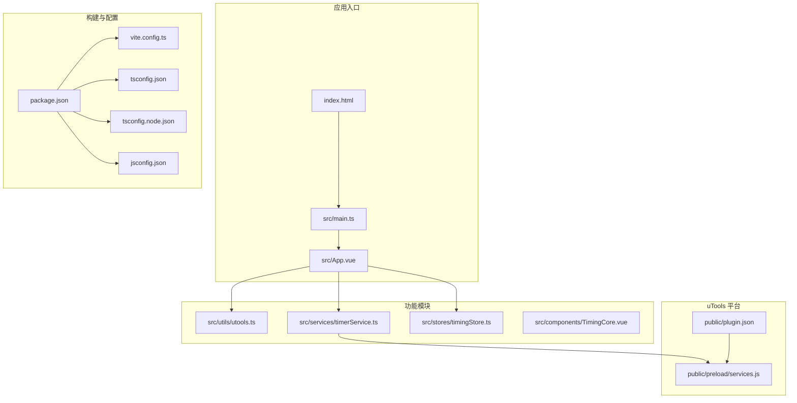
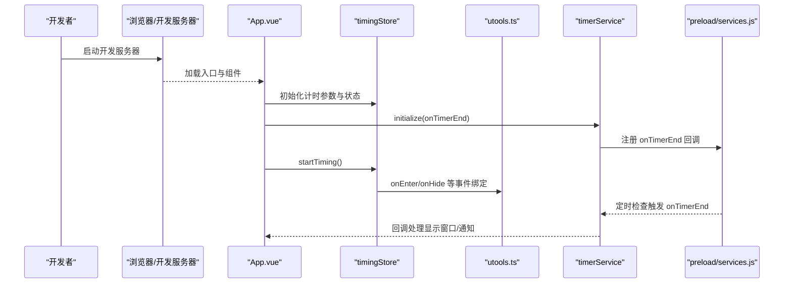
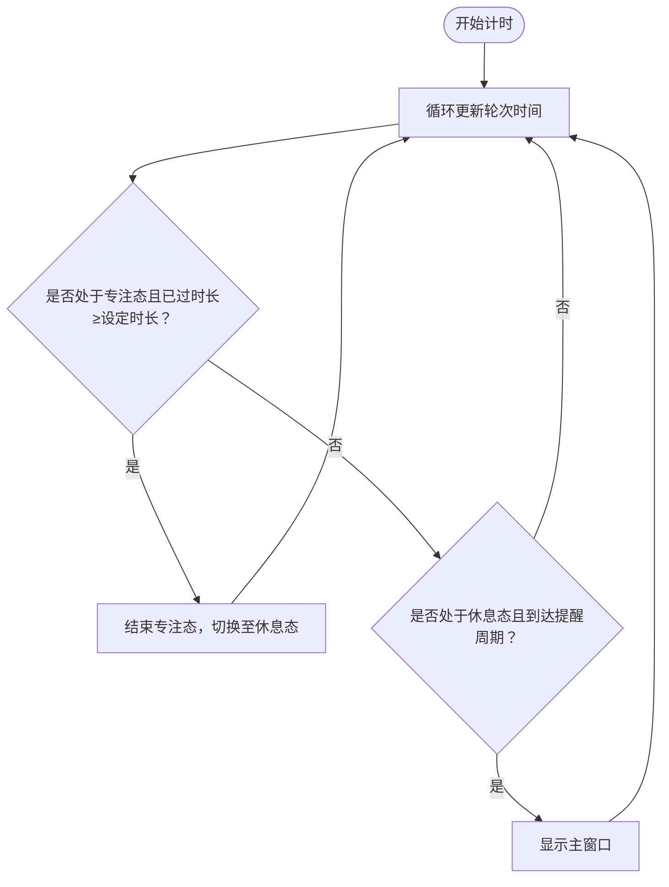
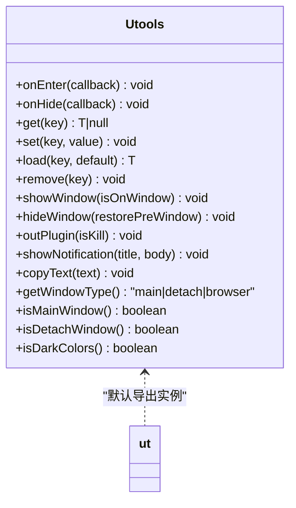
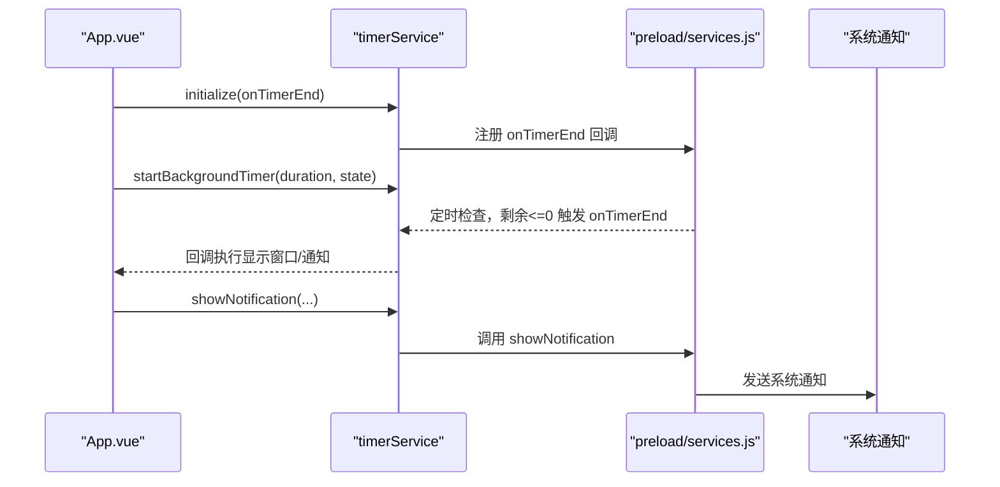
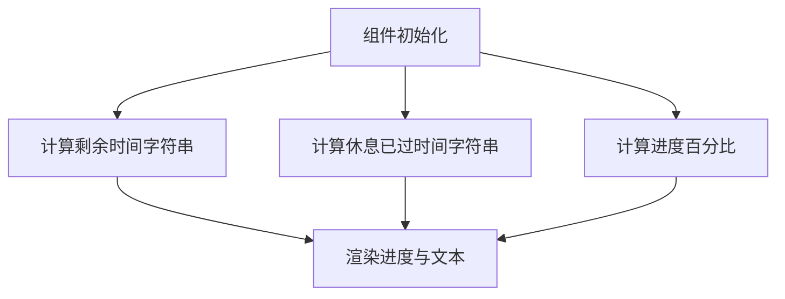
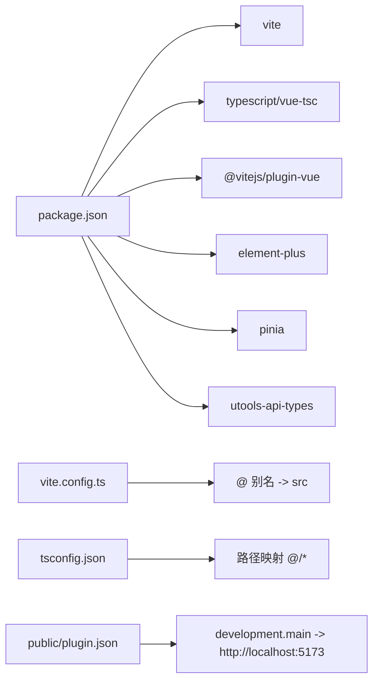

# 快速开始

<cite>
**本文引用的文件**
- [package.json](file://package.json)
- [vite.config.ts](file://vite.config.ts)
- [tsconfig.json](file://tsconfig.json)
- [tsconfig.node.json](file://tsconfig.node.json)
- [jsconfig.json](file://jsconfig.json)
- [index.html](file://index.html)
- [src/main.ts](file://src/main.ts)
- [src/App.vue](file://src/App.vue)
- [src/utils/utools.ts](file://src/utils/utools.ts)
- [src/services/timerService.ts](file://src/services/timerService.ts)
- [src/stores/timingStore.ts](file://src/stores/timingStore.ts)
- [src/components/TimingCore.vue](file://src/components/TimingCore.vue)
- [public/plugin.json](file://public/plugin.json)
- [public/preload/services.js](file://public/preload/services.js)
- [src/settings.ts](file://src/settings.ts)
</cite>

## 目录
1. [简介](#简介)
2. [项目结构](#项目结构)
3. [核心组件](#核心组件)
4. [架构总览](#架构总览)
5. [详细组件分析](#详细组件分析)
6. [依赖关系分析](#依赖关系分析)
7. [性能考虑](#性能考虑)
8. [故障排查指南](#故障排查指南)
9. [结论](#结论)
10. [附录](#附录)

## 简介
本指南面向首次接触“休息提醒”项目的开发者，帮助你在最短时间内完成环境准备、项目克隆与安装、开发服务器启动，并理解如何在 uTools 平台上安装与调试该插件。文档涵盖以下要点：
- 环境要求：Node.js 版本、包管理器建议
- 依赖安装与开发环境配置
- uTools 插件安装与开发模式配置
- Vite 构建工具与 TypeScript 编译配置说明
- 常见问题与解决方案
- 从零到可运行的命令行步骤

## 项目结构
该项目采用 Vue 3 + TypeScript + Pinia + Vite 的前端工程化方案，结合 uTools 插件生态，通过 preload 注入 Electron IPC 能力实现后台计时与系统通知。

图表来源
- [index.html:1-14](file://index.html#L1-L14)
- [src/main.ts:1-19](file://src/main.ts#L1-L19)
- [src/App.vue:1-145](file://src/App.vue#L1-L145)
- [package.json:1-23](file://package.json#L1-L23)
- [vite.config.ts:1-15](file://vite.config.ts#L1-L15)
- [tsconfig.json:1-26](file://tsconfig.json#L1-L26)
- [tsconfig.node.json:1-12](file://tsconfig.node.json#L1-L12)
- [jsconfig.json:1-13](file://jsconfig.json#L1-L13)
- [public/plugin.json:1-25](file://public/plugin.json#L1-L25)
- [public/preload/services.js:1-102](file://public/preload/services.js#L1-L102)
- [src/utils/utools.ts:1-165](file://src/utils/utools.ts#L1-L165)
- [src/services/timerService.ts:1-161](file://src/services/timerService.ts#L1-L161)
- [src/stores/timingStore.ts:1-141](file://src/stores/timingStore.ts#L1-L141)
- [src/components/TimingCore.vue:1-101](file://src/components/TimingCore.vue#L1-L101)

章节来源
- [package.json:1-23](file://package.json#L1-L23)
- [vite.config.ts:1-15](file://vite.config.ts#L1-L15)
- [tsconfig.json:1-26](file://tsconfig.json#L1-L26)
- [tsconfig.node.json:1-12](file://tsconfig.node.json#L1-L12)
- [jsconfig.json:1-13](file://jsconfig.json#L1-L13)
- [index.html:1-14](file://index.html#L1-L14)
- [src/main.ts:1-19](file://src/main.ts#L1-L19)
- [src/App.vue:1-145](file://src/App.vue#L1-L145)
- [public/plugin.json:1-25](file://public/plugin.json#L1-L25)
- [public/preload/services.js:1-102](file://public/preload/services.js#L1-L102)

## 核心组件
- 应用入口与挂载：HTML 引入入口脚本，main.ts 创建 Vue 应用并挂载；App.vue 作为根组件协调状态与 UI。
- 状态管理：Pinia stores 提供计时状态、界面状态、用户设置等。
- 工具与服务：utools.ts 封装 uTools API；timerService.ts 封装前后台计时与存储；preload services.js 提供 Electron IPC 能力。
- UI 组件：TimingCore.vue 展示倒计时进度与剩余时间。
- 构建与类型：Vite 配置别名与基础路径；TypeScript 配置严格模式与路径映射。

章节来源
- [src/main.ts:1-19](file://src/main.ts#L1-L19)
- [src/App.vue:1-145](file://src/App.vue#L1-L145)
- [src/utils/utools.ts:1-165](file://src/utils/utools.ts#L1-L165)
- [src/services/timerService.ts:1-161](file://src/services/timerService.ts#L1-L161)
- [src/stores/timingStore.ts:1-141](file://src/stores/timingStore.ts#L1-L141)
- [src/components/TimingCore.vue:1-101](file://src/components/TimingCore.vue#L1-L101)
- [vite.config.ts:1-15](file://vite.config.ts#L1-L15)
- [tsconfig.json:1-26](file://tsconfig.json#L1-L26)

## 架构总览
下图展示了从浏览器/桌面端到 uTools 插件的交互流程，以及后台计时与通知的关键节点。

图表来源
- [src/App.vue:56-114](file://src/App.vue#L56-L114)
- [src/stores/timingStore.ts:94-131](file://src/stores/timingStore.ts#L94-L131)
- [src/utils/utools.ts:19-30](file://src/utils/utools.ts#L19-L30)
- [src/services/timerService.ts:59-70](file://src/services/timerService.ts#L59-L70)
- [public/preload/services.js:22-67](file://public/preload/services.js#L22-L67)

## 详细组件分析

### 计时与状态管理（Pinia）
- 功能职责：维护专注/休息状态、计时轮次、剩余/已过时间、计时器间隔；提供开始/暂停/继续/结束/稍后提醒等动作。
- 关键点：根据当前状态动态计算百分比与剩余时间；在焦点态结束时自动切换至休息态并重置轮次。

图表来源
- [src/stores/timingStore.ts:75-92](file://src/stores/timingStore.ts#L75-L92)
- [src/stores/timingStore.ts:122-131](file://src/stores/timingStore.ts#L122-L131)

章节来源
- [src/stores/timingStore.ts:1-141](file://src/stores/timingStore.ts#L1-L141)

### uTools API 封装（utools.ts）
- 功能职责：封装 onEnter/onHide、dbStorage、窗口控制、通知、复制、主题检测等能力；在非 uTools 环境提供降级方案（alert/localStorage）。
- 设计要点：统一对外接口，内部按运行环境分支处理。

图表来源
- [src/utils/utools.ts:13-165](file://src/utils/utools.ts#L13-L165)

章节来源
- [src/utils/utools.ts:1-165](file://src/utils/utools.ts#L1-L165)

### 后台计时服务（timerService.ts + preload/services.js）
- 功能职责：在 uTools 环境通过 preload 注入的服务实现后台计时与通知；提供跨环境的存储与通知降级。
- 关键点：initialize 注册 onTimerEnd；startBackgroundTimer/stopBackgroundTimer 控制计时；getRemainingTime 查询剩余时间；showNotification/setStore/getStore 支持多环境。

图表来源
- [src/services/timerService.ts:59-70](file://src/services/timerService.ts#L59-L70)
- [src/services/timerService.ts:75-85](file://src/services/timerService.ts#L75-L85)
- [public/preload/services.js:22-37](file://public/preload/services.js#L22-L37)
- [public/preload/services.js:76-84](file://public/preload/services.js#L76-L84)

章节来源
- [src/services/timerService.ts:1-161](file://src/services/timerService.ts#L1-L161)
- [public/preload/services.js:1-102](file://public/preload/services.js#L1-L102)

### UI 组件（TimingCore.vue）
- 功能职责：以仪表盘进度条展示当前状态的剩余/已过时间，居中显示时间文本。
- 关键点：根据状态动态计算百分比与格式化时间字符串；与 Pinia 状态联动。

图表来源
- [src/components/TimingCore.vue:69-89](file://src/components/TimingCore.vue#L69-L89)

章节来源
- [src/components/TimingCore.vue:1-101](file://src/components/TimingCore.vue#L1-L101)

## 依赖关系分析
- 构建与运行
  - Vite 作为开发服务器与打包工具；Vue 插件用于单文件组件支持；路径别名 @ 指向 src。
  - TypeScript 严格模式与路径映射；tsconfig.node.json 限定 Vite 配置类型检查范围。
- 运行时依赖
  - Vue 3、Element Plus UI、Pinia 状态管理。
- 开发依赖
  - Vite、@vitejs/plugin-vue、typescript、vue-tsc、utools-api-types、sass-embedded、unplugin-vue-components。
- 插件元数据
  - plugin.json 定义插件名称、入口页面、preload 脚本、开发模式主入口地址等。

图表来源
- [package.json:1-23](file://package.json#L1-L23)
- [vite.config.ts:9-13](file://vite.config.ts#L9-L13)
- [tsconfig.json:18-21](file://tsconfig.json#L18-L21)
- [public/plugin.json:12-14](file://public/plugin.json#L12-L14)

章节来源
- [package.json:1-23](file://package.json#L1-L23)
- [vite.config.ts:1-15](file://vite.config.ts#L1-L15)
- [tsconfig.json:1-26](file://tsconfig.json#L1-L26)
- [tsconfig.node.json:1-12](file://tsconfig.node.json#L1-L12)
- [jsconfig.json:1-13](file://jsconfig.json#L1-L13)
- [public/plugin.json:1-25](file://public/plugin.json#L1-L25)

## 性能考虑
- 开发阶段
  - 使用 Vite 的热更新与按需编译，提升开发体验。
  - 在 onEnter/onHide 中根据窗口状态调整计时轮询频率，避免不必要的 CPU 占用。
- 生产构建
  - 合理拆分依赖与组件，减少首屏体积；利用 TypeScript 的严格模式降低运行时错误。
- 通知与存储
  - 在非 uTools 环境使用降级策略（alert/localStorage），避免阻塞主线程。

## 故障排查指南
- 开发服务器无法启动
  - 确认 Node.js 版本满足项目要求；使用推荐的包管理器安装依赖。
  - 检查端口占用，必要时修改 Vite 端口或关闭冲突进程。
- 页面空白或组件不渲染
  - 确认入口 HTML 正确引入 main.ts；检查 Vite 别名配置与路径映射。
- uTools 插件无法加载
  - 确认 plugin.json 的 development.main 指向开发服务器地址。
  - 确保 preload/services.js 已正确注入 window.services。
- 计时器不生效或无通知
  - 检查 preload services.js 是否成功注入；确认 initialize 已调用并注册 onTimerEnd。
  - 在非 uTools 环境下，确认降级逻辑（alert/localStorage）可用。
- TypeScript 类型报错
  - 检查 tsconfig.json 与 jsconfig.json 的 types 与 include 配置；确保 utools-api-types 可用。

章节来源
- [index.html:10-11](file://index.html#L10-L11)
- [vite.config.ts:9-13](file://vite.config.ts#L9-L13)
- [public/plugin.json:12-14](file://public/plugin.json#L12-L14)
- [public/preload/services.js:13-101](file://public/preload/services.js#L13-L101)
- [src/services/timerService.ts:59-70](file://src/services/timerService.ts#L59-L70)
- [tsconfig.json:21-22](file://tsconfig.json#L21-L22)
- [jsconfig.json:4-6](file://jsconfig.json#L4-L6)

## 结论
通过本指南，你可以在本地快速搭建开发环境，启动 Vite 开发服务器，并在 uTools 平台上安装与调试“休息提醒”插件。建议先完成环境准备与依赖安装，再逐步验证插件元数据、preload 注入与计时服务初始化，最后在 uTools 中打开插件进行交互测试。

## 附录

### 环境与工具要求
- Node.js：建议使用长期支持版本（LTS），确保与项目依赖兼容。
- 包管理器：推荐使用 npm 或 pnpm；yarn 在本项目未显式锁定版本时亦可使用。
- 文本编辑器：支持 TypeScript/Vue SFC 的编辑器更佳（如 VS Code）。

### 一键命令清单
- 克隆仓库后进入目录
- 安装依赖
- 启动开发服务器
- 打开浏览器访问开发服务器地址
- 在 uTools 中安装并启用本插件

章节来源
- [package.json:3-7](file://package.json#L3-L7)
- [public/plugin.json:12-14](file://public/plugin.json#L12-L14)

### uTools 平台安装与配置步骤
- 在 uTools 中添加本插件
  - 选择“从本地目录加载”，指向项目根目录。
  - 确认插件元数据与入口页面正确加载。
- 开发模式验证
  - 确认 development.main 指向 http://localhost:5173。
  - 打开插件命令“休息提醒”，观察主窗口与计时行为。
- 预加载脚本注入
  - 确认 preload/services.js 成功注入 window.services。
  - 在控制台查看日志输出，验证后台计时与通知流程。

章节来源
- [public/plugin.json:6-14](file://public/plugin.json#L6-L14)
- [public/preload/services.js:13-101](file://public/preload/services.js#L13-L101)

### 开发工具与配置要点
- Vite
  - 别名：@ 指向 src；基础路径 base 为相对路径。
  - 插件：Vue 单文件组件支持。
- TypeScript
  - 严格模式与路径映射；types 包含 utools-api-types；包含 src/**/*.ts/.tsx/.vue。
  - tsconfig.node.json 仅包含 Vite 配置文件类型检查。
- JS 类型辅助
  - jsconfig.json 为 Vue/JS 文件提供 utools-api-types 类型支持。

章节来源
- [vite.config.ts:6-14](file://vite.config.ts#L6-L14)
- [tsconfig.json:18-22](file://tsconfig.json#L18-L22)
- [tsconfig.node.json:1-12](file://tsconfig.node.json#L1-L12)
- [jsconfig.json:4-6](file://jsconfig.json#L4-L6)