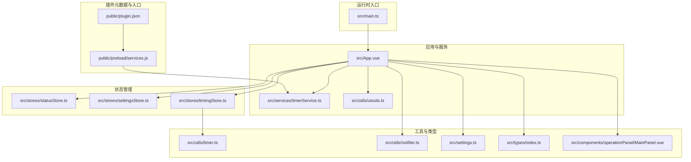
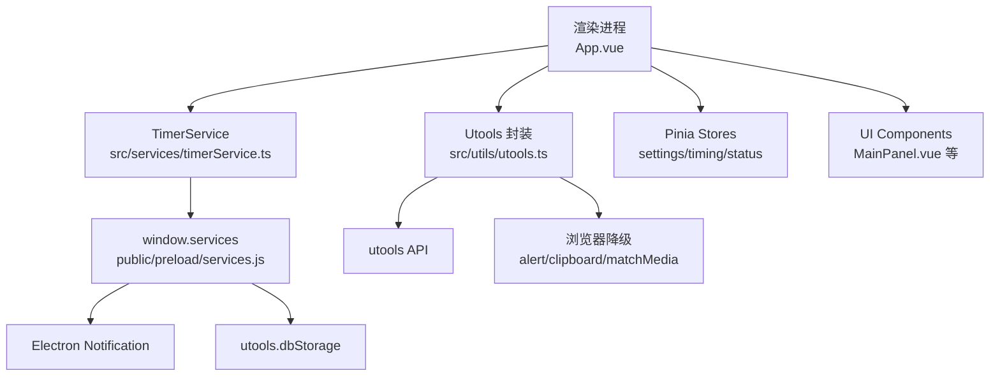
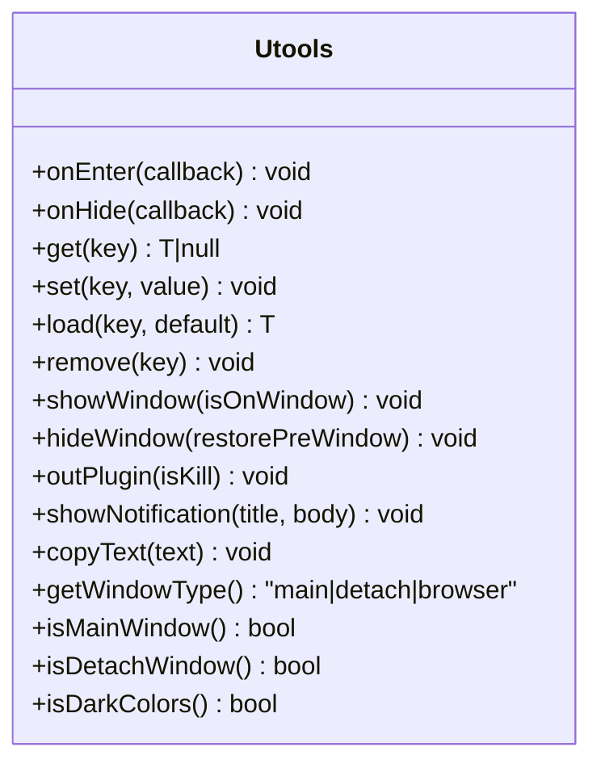
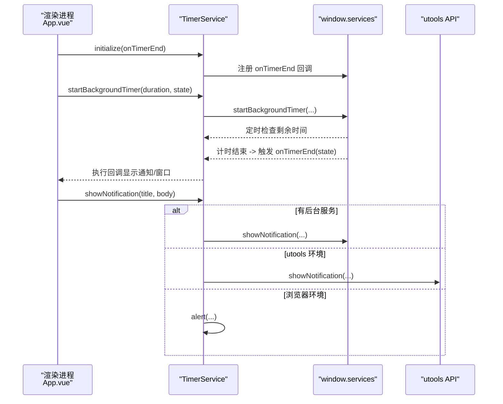
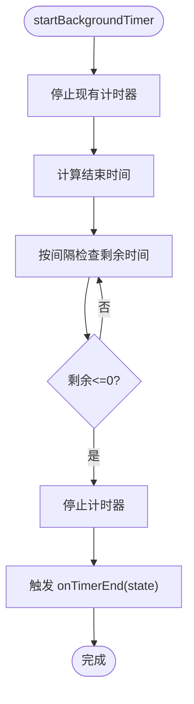
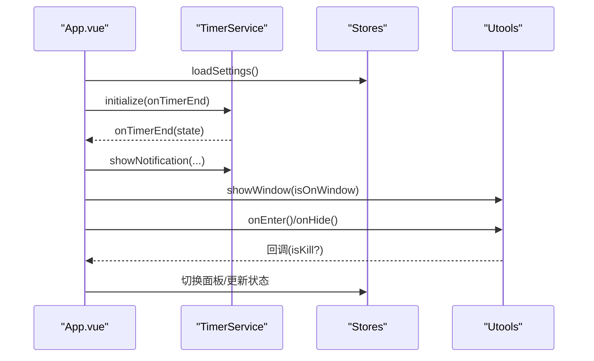
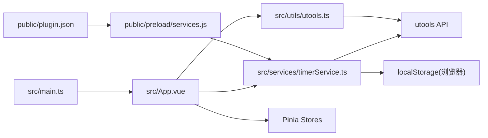

# utools 集成服务

<cite>
**本文引用的文件**
- [package.json](file://package.json)
- [plugin.json](file://public/plugin.json)
- [main.ts](file://src/main.ts)
- [utools.ts](file://src/utils/utools.ts)
- [timerService.ts](file://src/services/timerService.ts)
- [services.js](file://public/preload/services.js)
- [settingsStore.ts](file://src/stores/settingsStore.ts)
- [statusStore.ts](file://src/stores/statusStore.ts)
- [timingStore.ts](file://src/stores/timingStore.ts)
- [App.vue](file://src/App.vue)
- [index.ts](file://src/types/index.ts)
- [timer.ts](file://src/utils/timer.ts)
- [notifier.ts](file://src/utils/notifier.ts)
- [settings.ts](file://src/settings.ts)
- [MainPanel.vue](file://src/components/operationPanel/MainPanel.vue)
</cite>

## 目录
1. [简介](#简介)
2. [项目结构](#项目结构)
3. [核心组件](#核心组件)
4. [架构总览](#架构总览)
5. [详细组件分析](#详细组件分析)
6. [依赖关系分析](#依赖关系分析)
7. [性能考量](#性能考量)
8. [故障排查指南](#故障排查指南)
9. [结论](#结论)
10. [附录：使用示例与最佳实践](#附录使用示例与最佳实践)

## 简介
本项目为一个基于 Vue 3 + Pinia 的 utools 插件，提供“休息提醒”功能，支持定时专注与休息循环、后台计时、系统通知、本地存储、主题适配与窗口控制等特性。插件通过预加载脚本注入 Electron 的 Node.js 能力，结合 utools API 实现跨环境运行与降级兼容。

## 项目结构
- 插件元数据与入口
  - public/plugin.json：定义插件名称、版本、入口页面、预加载脚本、开发模式、功能码等。
  - public/preload/services.js：预加载脚本，向渲染进程注入后台计时器、系统通知与本地存储能力。
- 运行时入口
  - src/main.ts：Vue 应用初始化、Element Plus、Pinia 注册与挂载。
- 功能实现
  - src/App.vue：应用根组件，负责初始化、生命周期事件绑定、计时与通知联动。
  - src/services/timerService.ts：计时服务封装，统一前后台计时与存储访问。
  - src/utils/utools.ts：对 utools API 的统一封装，提供环境检测与降级策略。
  - src/stores/*：状态管理（设置、计时、状态、一言）。
  - src/utils/*：工具模块（计时器、消息通知、环境配置）。
  - src/components/*：UI 组件（操作面板、顶部栏、计时核心等）。
- 类型定义
  - src/types/index.ts：计时状态、用户设置、面板、事件映射等类型定义。

**图表来源**
- [plugin.json:1-25](file://public/plugin.json#L1-L25)
- [services.js:1-102](file://public/preload/services.js#L1-L102)
- [main.ts:1-19](file://src/main.ts#L1-L19)
- [App.vue:1-145](file://src/App.vue#L1-L145)
- [timerService.ts:1-161](file://src/services/timerService.ts#L1-L161)
- [utools.ts:1-165](file://src/utils/utools.ts#L1-L165)
- [statusStore.ts:1-46](file://src/stores/statusStore.ts#L1-L46)
- [settingsStore.ts:1-87](file://src/stores/settingsStore.ts#L1-L87)
- [timingStore.ts:1-141](file://src/stores/timingStore.ts#L1-L141)
- [timer.ts:1-66](file://src/utils/timer.ts#L1-L66)
- [notifier.ts:1-62](file://src/utils/notifier.ts#L1-L62)
- [settings.ts:1-50](file://src/settings.ts#L1-L50)
- [index.ts:1-83](file://src/types/index.ts#L1-L83)
- [MainPanel.vue:1-82](file://src/components/operationPanel/MainPanel.vue#L1-L82)

**章节来源**
- [plugin.json:1-25](file://public/plugin.json#L1-L25)
- [services.js:1-102](file://public/preload/services.js#L1-L102)
- [main.ts:1-19](file://src/main.ts#L1-L19)
- [App.vue:1-145](file://src/App.vue#L1-L145)

## 核心组件
- utools API 封装（Utools）
  - 提供插件生命周期回调注册、窗口控制、系统通知、复制、主题与窗口类型判断、本地存储读写等能力，并在非 utools 环境下提供降级方案。
- 计时服务（TimerService）
  - 通过预加载注入的服务实现后台计时、剩余时间查询、计时结束回调、系统通知与本地存储；在无后台支持时回退至前台计时与 utools API。
- 预加载服务（services.js）
  - 在渲染进程通过 window.services 注入 Electron Notification、utools.dbStorage 以及自定义后台计时器实现。
- 状态管理
  - settingsStore：用户设置持久化与默认值加载。
  - timingStore：专注/休息状态切换、计时器周期、剩余时间计算与定时刷新。
  - statusStore：窗口显示状态与面板切换。
- 工具模块
  - timer：时间戳与格式化工具。
  - notifier：基于 Element Plus 的消息提示。
  - settings：开发环境判断与时间倍率常量。

**章节来源**
- [utools.ts:1-165](file://src/utils/utools.ts#L1-L165)
- [timerService.ts:1-161](file://src/services/timerService.ts#L1-L161)
- [services.js:1-102](file://public/preload/services.js#L1-L102)
- [settingsStore.ts:1-87](file://src/stores/settingsStore.ts#L1-L87)
- [timingStore.ts:1-141](file://src/stores/timingStore.ts#L1-L141)
- [statusStore.ts:1-46](file://src/stores/statusStore.ts#L1-L46)
- [timer.ts:1-66](file://src/utils/timer.ts#L1-L66)
- [notifier.ts:1-62](file://src/utils/notifier.ts#L1-L62)
- [settings.ts:1-50](file://src/settings.ts#L1-L50)

## 架构总览
插件采用“预加载注入 + 统一 API 封装 + 状态驱动”的架构：
- 预加载脚本在渲染进程暴露 window.services，提供 Electron 能力与 utools.dbStorage。
- Utools 封装在运行时根据环境选择原生 utools API 或浏览器降级方案。
- TimerService 统一前后台计时逻辑，按需调用 window.services 或 utools API。
- Pinia 管理用户设置、计时状态与界面状态，驱动 UI 与通知行为。

**图表来源**
- [App.vue:1-145](file://src/App.vue#L1-L145)
- [timerService.ts:1-161](file://src/services/timerService.ts#L1-L161)
- [services.js:1-102](file://public/preload/services.js#L1-L102)
- [utools.ts:1-165](file://src/utils/utools.ts#L1-L165)

## 详细组件分析

### utools API 封装（Utools）
- 环境检测与降级
  - 通过 window.utools 存在性判断是否处于 utools 环境；非 utools 环境下使用 alert、navigator.clipboard、matchMedia 等进行降级。
- 生命周期与窗口控制
  - onEnter/onPluginOut：注册插件进入/隐藏回调；hideMainWindow 支持是否恢复前置窗口。
- 本地存储
  - dbStorage 封装 getItem/setItem/removeItem；load 提供默认值加载与回填。
- 通知与复制
  - showNotification 支持标题与正文；copyText 支持复制文本。
- 主题与窗口类型
  - isDarkColors、getWindowType/isMainWindow/isDetachWindow 用于主题适配与窗口类型判断。

**图表来源**
- [utools.ts:13-165](file://src/utils/utools.ts#L13-L165)

**章节来源**
- [utools.ts:1-165](file://src/utils/utools.ts#L1-L165)

### 计时服务（TimerService）
- 后台计时
  - 通过 window.services.startBackgroundTimer/stopBackgroundTimer 控制计时器；onTimerEnd 回调在计时结束时触发。
- 剩余时间与通知
  - getRemainingTime 返回剩余毫秒数；showNotification 支持多环境降级。
- 存储访问
  - setStore/getStore 优先使用 window.services，其次使用 utools.dbStorage，最后回退到浏览器 localStorage。
- 初始化与单例
  - 单例模式；initialize 注册 onTimerEnd 并标记已初始化。

**图表来源**
- [App.vue:69-114](file://src/App.vue#L69-L114)
- [timerService.ts:59-118](file://src/services/timerService.ts#L59-L118)
- [services.js:22-67](file://public/preload/services.js#L22-L67)
- [utools.ts:101-108](file://src/utils/utools.ts#L101-L108)

**章节来源**
- [timerService.ts:1-161](file://src/services/timerService.ts#L1-L161)
- [services.js:1-102](file://public/preload/services.js#L1-L102)

### 预加载服务（services.js）
- 后台计时器
  - startBackgroundTimer：记录结束时间并按固定间隔检查剩余时间；结束时清理并触发 onTimerEnd。
  - stopBackgroundTimer：清理定时器与状态。
  - getRemainingTime：返回剩余毫秒数。
- 系统通知
  - showNotification：使用 Electron Notification 显示系统通知。
- 本地存储
  - getStore/setStore：委托 utools.dbStorage 实现持久化。

**图表来源**
- [services.js:22-67](file://public/preload/services.js#L22-L67)

**章节来源**
- [services.js:1-102](file://public/preload/services.js#L1-L102)

### 应用生命周期与状态管理
- App.vue 初始化流程
  - 加载用户设置、根据设置初始化计时器参数、初始化后台计时服务、注册 onEnter/onHide 生命周期回调、按需自动开始计时。
- 生命周期事件
  - onEnter：窗口显示、提高计时刷新频率、更新一言。
  - onHide：窗口隐藏；若插件被结束运行则清理计时与后台计时；否则降低刷新频率。
- 状态驱动
  - timingStore：专注/休息状态切换、计时器周期、剩余时间计算。
  - statusStore：窗口显示状态与面板切换。
  - settingsStore：用户设置持久化与默认值加载。

**图表来源**
- [App.vue:56-114](file://src/App.vue#L56-L114)
- [timerService.ts:59-118](file://src/services/timerService.ts#L59-L118)
- [settingsStore.ts:39-84](file://src/stores/settingsStore.ts#L39-L84)
- [statusStore.ts:35-44](file://src/stores/statusStore.ts#L35-L44)
- [timingStore.ts:75-139](file://src/stores/timingStore.ts#L75-L139)

**章节来源**
- [App.vue:1-145](file://src/App.vue#L1-L145)
- [settingsStore.ts:1-87](file://src/stores/settingsStore.ts#L1-L87)
- [statusStore.ts:1-46](file://src/stores/statusStore.ts#L1-L46)
- [timingStore.ts:1-141](file://src/stores/timingStore.ts#L1-L141)

### UI 组件与交互
- MainPanel：提供结束计时、暂停/继续、稍后提醒等操作按钮，点击后调用 timingStore 的对应方法。
- TimingCore、TopBar、OperationPanel：配合计时与面板切换展示。

**章节来源**
- [MainPanel.vue:1-82](file://src/components/operationPanel/MainPanel.vue#L1-L82)

## 依赖关系分析
- 运行时依赖
  - Vue 3、Element Plus、Pinia。
  - utools-api-types：提供 utools API 类型声明。
- 插件元数据
  - plugin.json 指定 main 入口、preload 脚本、开发模式与功能码。
- 环境与兼容性
  - settings.ts 提供 isDev 判断；utools.ts 提供环境检测与降级；timerService.ts 提供多环境存储与通知回退。

**图表来源**
- [plugin.json:1-25](file://public/plugin.json#L1-L25)
- [services.js:1-102](file://public/preload/services.js#L1-L102)
- [main.ts:1-19](file://src/main.ts#L1-L19)
- [App.vue:1-145](file://src/App.vue#L1-L145)
- [timerService.ts:1-161](file://src/services/timerService.ts#L1-L161)
- [utools.ts:1-165](file://src/utils/utools.ts#L1-L165)

**章节来源**
- [package.json:1-23](file://package.json#L1-L23)
- [plugin.json:1-25](file://public/plugin.json#L1-L25)
- [settings.ts:1-50](file://src/settings.ts#L1-L50)

## 性能考量
- 计时刷新频率
  - onEnter 时使用较高刷新频率（如 500ms），onHide 时降低（如 2000ms），减少 CPU 占用。
- 后台计时
  - 通过 window.services 在预加载进程中执行计时，避免渲染进程阻塞。
- 存储与通知
  - 优先使用 utools.dbStorage 或 Electron Notification，浏览器降级仅在必要时使用 alert/clipboard，避免额外开销。
- UI 更新
  - 使用 Pinia getter 计算剩余时间与状态，减少重复计算；过渡动画与组件懒加载可进一步优化。

[本节为通用建议，无需特定文件引用]

## 故障排查指南
- 插件未显示或无法唤起
  - 检查 plugin.json 中的 features.code/cmds 是否正确；确认 App.vue 中 onEnter/onHide 回调是否注册成功。
- 计时不生效
  - 确认 hasBackgroundSupport：若 window.services 为空，将回退至前台计时；检查 initialize 是否调用。
- 通知未弹出
  - 若在浏览器环境，showNotification 会降级为 alert；确保在 utools 环境下使用 utools API。
- 设置未持久化
  - 检查 settingsStore 的 load/save 是否正常调用；utools.dbStorage 可能因权限或沙盒限制不可用时回退至 localStorage。
- 窗口状态异常
  - 确认 statusStore 的 isOnWindow 状态与 ut.onHide 回调中的 isKill 参数一致；避免在插件被结束时仍保留计时任务。

**章节来源**
- [App.vue:82-106](file://src/App.vue#L82-L106)
- [timerService.ts:59-118](file://src/services/timerService.ts#L59-L118)
- [utools.ts:101-122](file://src/utils/utools.ts#L101-L122)
- [settingsStore.ts:39-84](file://src/stores/settingsStore.ts#L39-L84)

## 结论
该插件通过预加载注入与统一 API 封装，实现了在 utools 环境下的稳定运行与跨环境兼容。计时服务与状态管理解耦清晰，生命周期事件与 UI 交互自然衔接，适合作为 utools 插件开发的参考范例。

[本节为总结，无需特定文件引用]

## 附录：使用示例与最佳实践
- 插件生命周期使用
  - 在应用挂载后注册 onEnter/onHide 回调，分别处理窗口显示/隐藏的资源与刷新策略。
  - 示例路径：[App.vue:82-106](file://src/App.vue#L82-L106)
- 计时与通知
  - 初始化后台计时服务并注册 onTimerEnd，在回调中调用 showNotification 与窗口显示。
  - 示例路径：[App.vue:69-114](file://src/App.vue#L69-L114)、[timerService.ts:59-118](file://src/services/timerService.ts#L59-L118)
- 本地存储
  - 使用 settingsStore 的 load/save 方法持久化用户设置；utools 封装提供默认值加载与回填。
  - 示例路径：[settingsStore.ts:39-84](file://src/stores/settingsStore.ts#L39-L84)、[utools.ts:53-60](file://src/utils/utools.ts#L53-L60)
- 环境检测与兼容
  - 使用 settings.ts 的 isDev 判断开发环境；utools.ts 的 isUtoolsEnv 与降级方案保证浏览器调试可用。
  - 示例路径：[settings.ts:4-7](file://src/settings.ts#L4-L7)、[utools.ts:5-11](file://src/utils/utools.ts#L5-L11)
- 最佳实践
  - 在 onHide 且 isKill 为真时彻底释放计时与后台任务，避免资源泄漏。
  - 在高频刷新场景（如 onEnter）与低频场景（如 onHide）间动态调整刷新间隔。
  - 优先使用 Electron Notification 与 utools.dbStorage，浏览器降级仅作兜底。

**章节来源**
- [App.vue:56-114](file://src/App.vue#L56-L114)
- [settingsStore.ts:39-84](file://src/stores/settingsStore.ts#L39-L84)
- [utools.ts:5-122](file://src/utils/utools.ts#L5-L122)
- [settings.ts:4-7](file://src/settings.ts#L4-L7)
- [timerService.ts:59-118](file://src/services/timerService.ts#L59-L118)