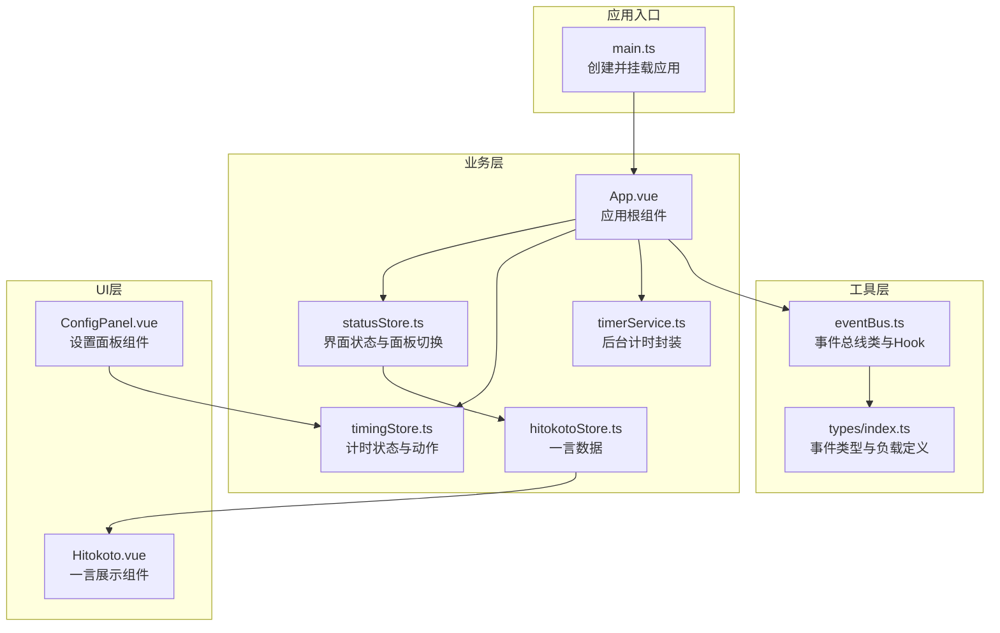
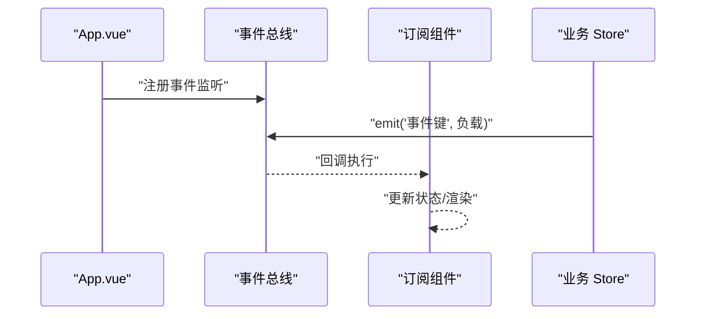
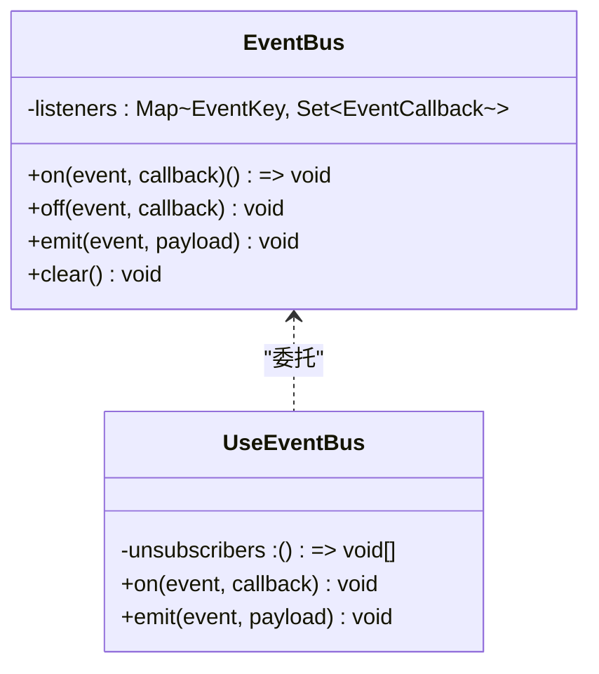
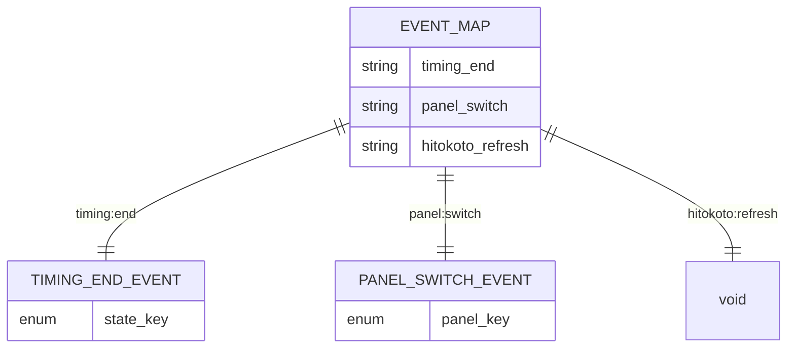
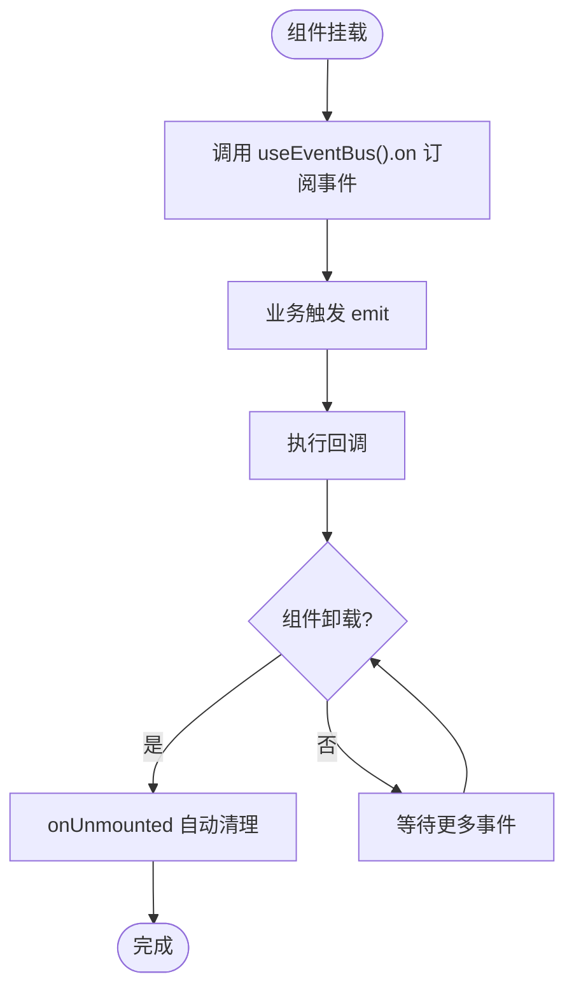
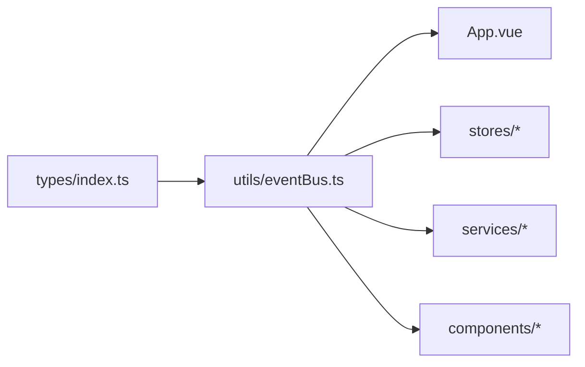
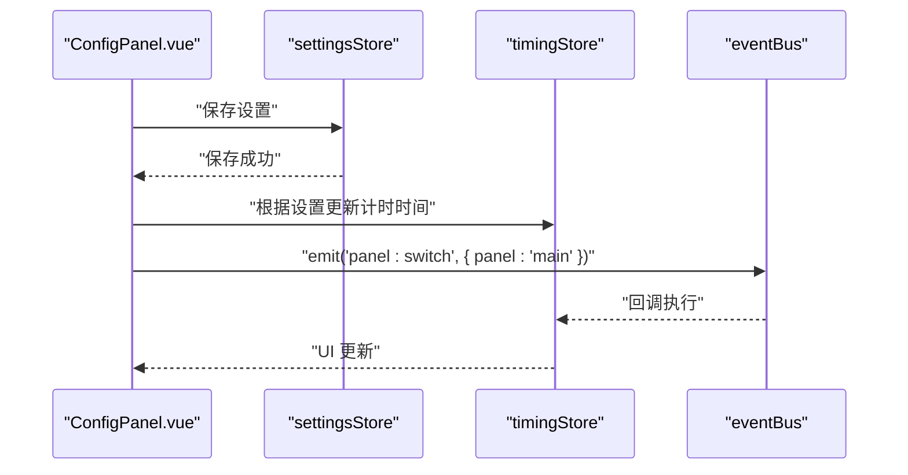

# 事件总线

<cite>
**本文引用的文件**
- [eventBus.ts](file://src/utils/eventBus.ts)
- [index.ts](file://src/types/index.ts)
- [main.ts](file://src/main.ts)
- [App.vue](file://src/App.vue)
- [timingStore.ts](file://src/stores/timingStore.ts)
- [statusStore.ts](file://src/stores/statusStore.ts)
- [timerService.ts](file://src/services/timerService.ts)
- [hitokotoStore.ts](file://src/stores/hitokotoStore.ts)
- [Hitokoto.vue](file://src/components/Hitokoto.vue)
- [ConfigPanel.vue](file://src/components/operationPanel/ConfigPanel.vue)
</cite>

## 目录
1. [简介](#简介)
2. [项目结构](#项目结构)
3. [核心组件](#核心组件)
4. [架构概览](#架构概览)
5. [详细组件分析](#详细组件分析)
6. [依赖分析](#依赖分析)
7. [性能考虑](#性能考虑)
8. [故障排查指南](#故障排查指南)
9. [结论](#结论)
10. [附录](#附录)

## 简介
本文件围绕事件总线（EventBus）进行系统化技术文档编写，目标包括：
- 解释事件驱动架构在项目中的实现与消息传递机制
- 描述事件的发布、订阅与取消订阅流程
- 说明事件类型定义与参数传递规范
- 解释事件生命周期管理与内存泄漏防护
- 分析事件总线在组件通信中的作用与优势
- 提供使用模式与最佳实践
- 给出调试与性能优化策略
- 提供扩展与自定义方法

## 项目结构
事件总线位于工具模块中，通过类型系统约束事件键与负载类型，并提供 Vue 组合式 API Hook 以自动管理生命周期。类型定义集中于类型模块，事件总线在应用启动时即可用。

图表来源
- [main.ts:1-19](file://src/main.ts#L1-L19)
- [eventBus.ts:1-104](file://src/utils/eventBus.ts#L1-L104)
- [index.ts:1-83](file://src/types/index.ts#L1-L83)
- [App.vue:1-145](file://src/App.vue#L1-L145)
- [timingStore.ts:1-141](file://src/stores/timingStore.ts#L1-L141)
- [statusStore.ts:1-46](file://src/stores/statusStore.ts#L1-L46)
- [timerService.ts:1-161](file://src/services/timerService.ts#L1-L161)
- [hitokotoStore.ts:1-72](file://src/stores/hitokotoStore.ts#L1-L72)
- [Hitokoto.vue:1-79](file://src/components/Hitokoto.vue#L1-L79)
- [ConfigPanel.vue:1-378](file://src/components/operationPanel/ConfigPanel.vue#L1-L378)

章节来源
- [main.ts:1-19](file://src/main.ts#L1-L19)
- [eventBus.ts:1-104](file://src/utils/eventBus.ts#L1-L104)
- [index.ts:1-83](file://src/types/index.ts#L1-L83)

## 核心组件
- 事件总线类：提供订阅、取消订阅、触发与清空能力；内部以 Map+Set 结构维护事件与回调集合。
- 事件总线 Hook：useEventBus 提供 on/emit 方法，并在组件卸载时自动清理所有订阅。
- 类型系统：通过 EventMap 约束事件键与对应负载类型，确保编译期安全。

关键实现要点
- 订阅返回取消函数，便于手动清理或在 Hook 中统一管理。
- 触发时仅遍历当前事件的回调集合，避免跨事件影响。
- 清空接口用于极端场景下的全局清理。

章节来源
- [eventBus.ts:12-61](file://src/utils/eventBus.ts#L12-L61)
- [eventBus.ts:70-97](file://src/utils/eventBus.ts#L70-L97)
- [index.ts:55-59](file://src/types/index.ts#L55-L59)

## 架构概览
事件总线在本项目中承担“组件间解耦”的角色，典型交互路径如下：
- 应用启动后，各组件通过 useEventBus 订阅所需事件
- 业务 Store 或服务在合适时机调用 emit 触发事件
- 订阅者收到事件后执行相应副作用（如更新 UI、切换面板、刷新数据）

图表来源
- [App.vue:82-106](file://src/App.vue#L82-L106)
- [eventBus.ts:18-53](file://src/utils/eventBus.ts#L18-L53)
- [timingStore.ts:123-131](file://src/stores/timingStore.ts#L123-L131)

## 详细组件分析

### 事件总线类与 Hook
- 类职责：维护事件到回调集合的映射，提供 on/off/emit/clear。
- Hook 能力：自动收集订阅并在组件卸载时统一取消，防止内存泄漏。
- 类型约束：EventKey 与 EventCallback 由 EventMap 推导，保证事件名与负载类型一致。

图表来源
- [eventBus.ts:12-61](file://src/utils/eventBus.ts#L12-L61)
- [eventBus.ts:70-97](file://src/utils/eventBus.ts#L70-L97)

章节来源
- [eventBus.ts:12-61](file://src/utils/eventBus.ts#L12-L61)
- [eventBus.ts:70-97](file://src/utils/eventBus.ts#L70-L97)

### 事件类型定义与参数传递规范
- 事件键：通过 EventMap 的键集合限定，避免魔法字符串。
- 负载类型：每个事件键绑定唯一负载类型，确保参数传递安全。
- 典型事件：
  - 计时结束事件：携带状态键
  - 面板切换事件：携带面板键
  - 一言刷新事件：无负载

图表来源
- [index.ts:55-59](file://src/types/index.ts#L55-L59)
- [index.ts:44-46](file://src/types/index.ts#L44-L46)
- [index.ts:48-50](file://src/types/index.ts#L48-L50)

章节来源
- [index.ts:55-59](file://src/types/index.ts#L55-L59)
- [index.ts:44-46](file://src/types/index.ts#L44-L46)
- [index.ts:48-50](file://src/types/index.ts#L48-L50)

### 生命周期管理与内存泄漏防护
- 自动清理：useEventBus 在 onUnmounted 钩子中逐一调用取消订阅函数。
- 手动清理：on 返回的取消函数可随时调用，适合条件订阅或动态场景。
- 全局清理：clear 用于极端场景（如热重载、测试），需谨慎使用。

图表来源
- [eventBus.ts:70-97](file://src/utils/eventBus.ts#L70-L97)

章节来源
- [eventBus.ts:70-97](file://src/utils/eventBus.ts#L70-L97)

### 组件通信中的作用与优势
- 解耦 Store 依赖：事件总线避免了直接 import 导致的循环依赖与紧耦合。
- 松耦合通信：发布者无需知道订阅者是谁，订阅者只关心事件与负载。
- 可扩展性：新增事件与订阅者无需修改既有代码，遵循开闭原则。

章节来源
- [eventBus.ts:8-11](file://src/utils/eventBus.ts#L8-L11)

### 使用模式与最佳实践
- 事件命名：采用领域内有意义的命名空间（如 panel:switch、timing:end）。
- 负载最小化：仅传递必要字段，避免大对象拷贝。
- 订阅粒度：按组件边界订阅，避免过度订阅导致回调链过长。
- 异步处理：在回调中进行异步操作时注意错误捕获与状态一致性。
- 清理策略：优先使用 useEventBus，其次使用返回的取消函数，最后才考虑全局清理。

章节来源
- [eventBus.ts:18-53](file://src/utils/eventBus.ts#L18-L53)
- [eventBus.ts:70-97](file://src/utils/eventBus.ts#L70-L97)

### 事件调试与性能优化策略
- 调试建议：
  - 在 on/emit 周围添加日志，记录事件名与负载摘要。
  - 使用浏览器开发工具断点定位回调执行路径。
  - 对高频事件（如定时 tick）进行节流/防抖。
- 性能优化：
  - 回调函数尽量轻量，避免在回调中执行重计算。
  - 合理拆分事件，避免单一事件承载过多职责。
  - 使用 Set 存储回调，确保去重与 O(1) 删除。

章节来源
- [eventBus.ts:18-53](file://src/utils/eventBus.ts#L18-L53)

### 扩展与自定义方法
- 新增事件：
  - 在 EventMap 中添加新键值对，定义对应的负载类型。
  - 在需要的组件中通过 useEventBus 订阅新事件。
- 自定义事件总线：
  - 可基于现有类扩展，增加统计、采样或中间件能力。
  - 可引入命名空间隔离，避免事件键冲突。
- 与 Pinia/组件集成：
  - Store 动作中触发事件，组件通过 Hook 订阅。
  - 注意在 Store 动作中避免循环触发，必要时引入去重逻辑。

章节来源
- [index.ts:55-59](file://src/types/index.ts#L55-L59)
- [eventBus.ts:12-61](file://src/utils/eventBus.ts#L12-L61)

## 依赖分析
事件总线与类型系统紧密耦合，类型定义决定事件键与负载的合法性；应用通过 Hook 与 Store/服务协作。

图表来源
- [index.ts:55-59](file://src/types/index.ts#L55-L59)
- [eventBus.ts:12-61](file://src/utils/eventBus.ts#L12-L61)
- [App.vue:121-144](file://src/App.vue#L121-L144)

章节来源
- [index.ts:55-59](file://src/types/index.ts#L55-L59)
- [eventBus.ts:12-61](file://src/utils/eventBus.ts#L12-L61)

## 性能考虑
- 订阅数量控制：避免在同一事件上注册过多回调，必要时合并逻辑。
- 负载大小：传递小而精的负载，减少序列化与传输成本。
- 触发频率：对高频事件采用节流/去抖策略，降低回调执行次数。
- 内存占用：及时清理不再使用的订阅，避免回调持有外部资源不释放。

## 故障排查指南
- 症状：组件未收到事件
  - 检查事件键是否拼写正确且与类型定义一致
  - 确认订阅发生在组件挂载之前或在正确的生命周期阶段
  - 查看是否被 onUnmounted 自动清理
- 症状：内存占用持续增长
  - 确认每次订阅都保留了取消函数并在适当时机调用
  - 避免在回调中持有外部引用导致 GC 无法回收
- 症状：事件重复触发
  - 检查是否存在重复订阅或多次初始化
  - 在回调中加入幂等判断或去重逻辑

章节来源
- [eventBus.ts:70-97](file://src/utils/eventBus.ts#L70-L97)

## 结论
事件总线在本项目中提供了清晰的组件间通信通道，结合类型系统与 Vue Hook，既保证了类型安全，又简化了生命周期管理。通过合理的命名、负载设计与清理策略，事件总线能够有效支撑复杂交互场景，并具备良好的可扩展性与可维护性。

## 附录

### 事件总线 API 速览
- on(event, callback) -> () => void：订阅事件，返回取消函数
- off(event, callback)：取消订阅
- emit(event, payload)：触发事件
- clear()：清空所有订阅
- useEventBus()：返回 { on, emit }，并在组件卸载时自动清理

章节来源
- [eventBus.ts:18-60](file://src/utils/eventBus.ts#L18-L60)
- [eventBus.ts:70-97](file://src/utils/eventBus.ts#L70-L97)

### 事件与组件交互示例（概念流程）

图表来源
- [ConfigPanel.vue:349-358](file://src/components/operationPanel/ConfigPanel.vue#L349-L358)
- [timingStore.ts:123-131](file://src/stores/timingStore.ts#L123-L131)
- [eventBus.ts:48-53](file://src/utils/eventBus.ts#L48-L53)