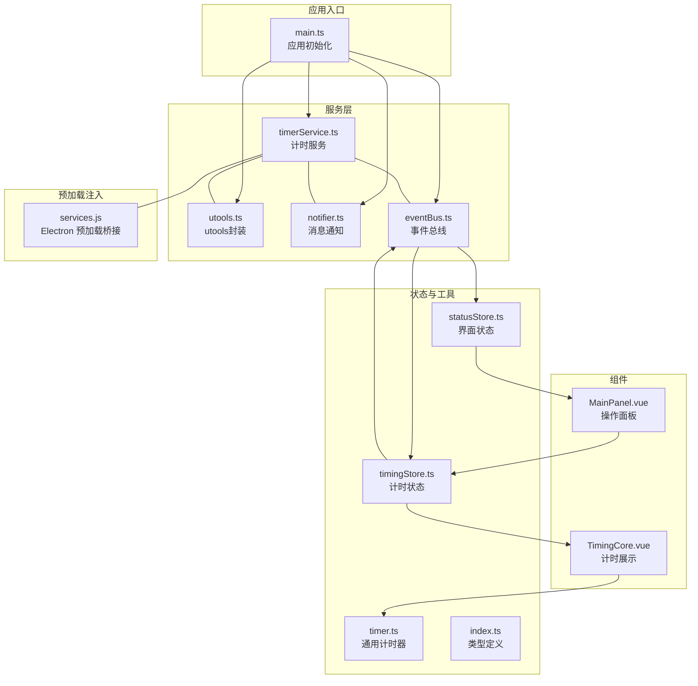
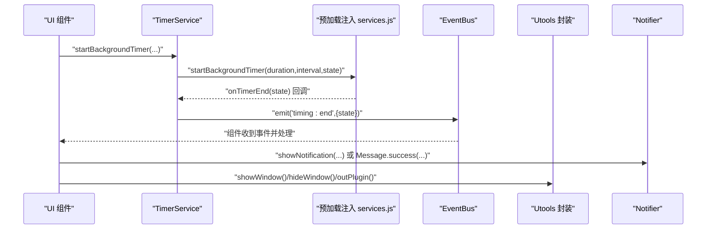
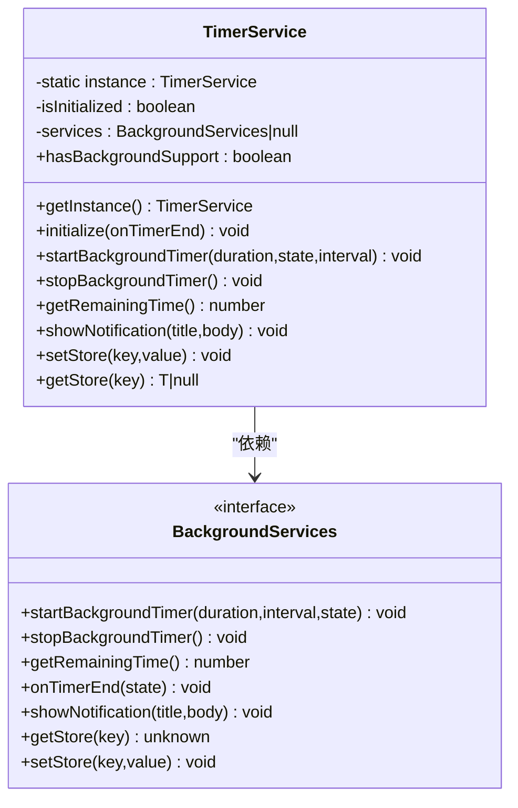
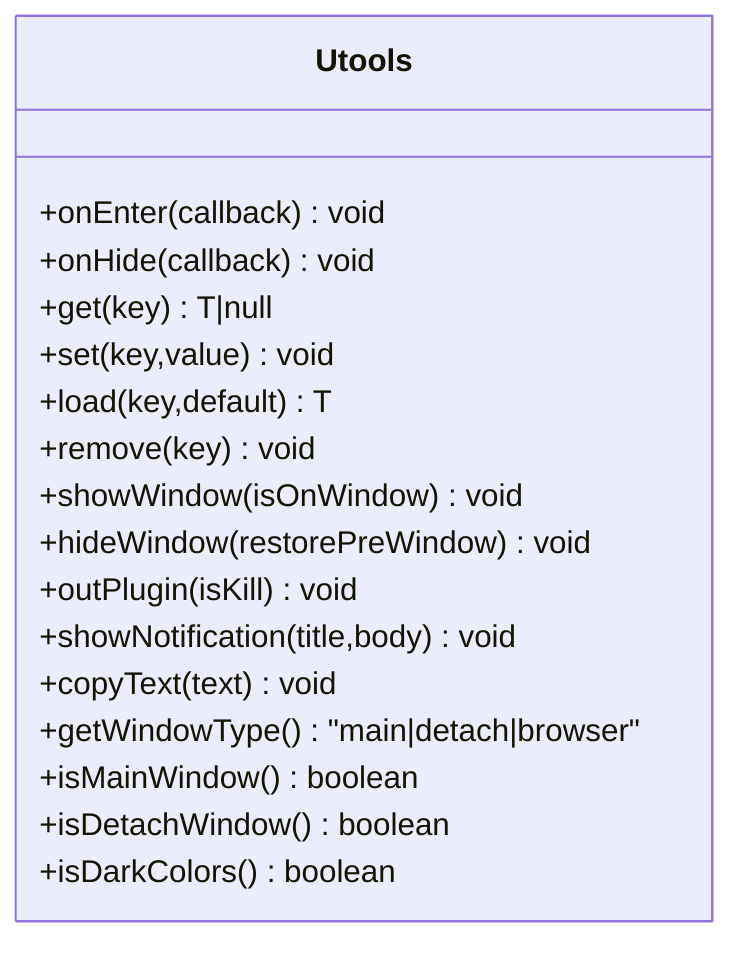
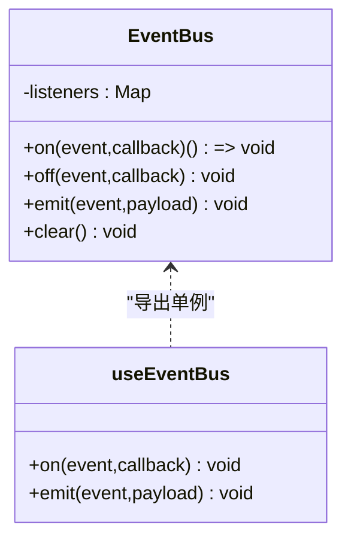
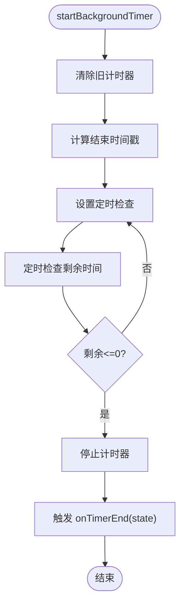
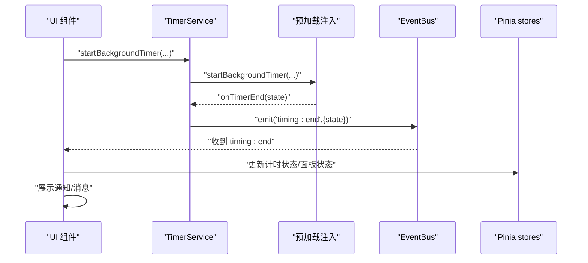
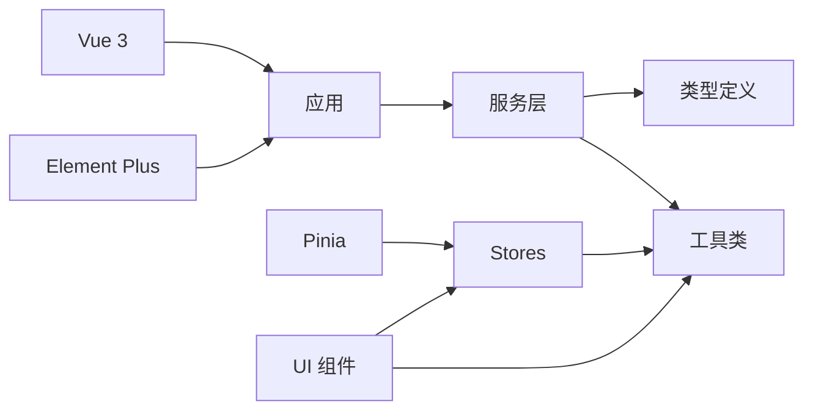

# 服务层设计

<cite>
**本文引用的文件列表**
- [timerService.ts](file://src/services/timerService.ts)
- [utools.ts](file://src/utils/utools.ts)
- [notifier.ts](file://src/utils/notifier.ts)
- [eventBus.ts](file://src/utils/eventBus.ts)
- [services.js](file://public/preload/services.js)
- [index.ts](file://src/types/index.ts)
- [timingStore.ts](file://src/stores/timingStore.ts)
- [statusStore.ts](file://src/stores/statusStore.ts)
- [timer.ts](file://src/utils/timer.ts)
- [TimingCore.vue](file://src/components/TimingCore.vue)
- [MainPanel.vue](file://src/components/operationPanel/MainPanel.vue)
- [main.ts](file://src/main.ts)
- [package.json](file://package.json)
</cite>

## 目录
1. [简介](#简介)
2. [项目结构](#项目结构)
3. [核心组件](#核心组件)
4. [架构总览](#架构总览)
5. [详细组件分析](#详细组件分析)
6. [依赖分析](#依赖分析)
7. [性能考虑](#性能考虑)
8. [故障排查指南](#故障排查指南)
9. [结论](#结论)
10. [附录：开发与测试指南](#附录开发与测试指南)

## 简介
本文件聚焦“休息提醒”项目的服务层设计，围绕以下目标展开：
- 深入解析计时服务（TimerService）的后台计时逻辑与状态同步机制
- 详解utools API封装服务（Utools）的插件生命周期与系统集成功能
- 说明通知服务（Notifier）的系统通知实现与用户反馈机制
- 解释事件总线（EventBus）的消息传递与组件通信模式
- 分析服务层的抽象设计与接口定义
- 提供服务注册与依赖注入的实现方式
- 给出服务扩展与新增服务的开发指南
- 讨论服务间的协作关系与数据流转
- 提供服务单元测试与调试方法

## 项目结构
服务层位于 src 目录下，主要由以下模块组成：
- 服务层：计时服务、utools封装、通知、事件总线
- 类型定义：计时状态、事件映射、计时器消息等
- 状态管理：Pinia stores（计时、状态）
- 工具类：通用计时器、预加载注入的服务桥接
- 组件：与服务交互的UI组件

图表来源
- [main.ts:1-19](file://src/main.ts#L1-L19)
- [timerService.ts:1-161](file://src/services/timerService.ts#L1-L161)
- [utools.ts:1-165](file://src/utils/utools.ts#L1-L165)
- [notifier.ts:1-62](file://src/utils/notifier.ts#L1-L62)
- [eventBus.ts:1-104](file://src/utils/eventBus.ts#L1-L104)
- [services.js:1-102](file://public/preload/services.js#L1-L102)
- [timingStore.ts:1-141](file://src/stores/timingStore.ts#L1-L141)
- [statusStore.ts:1-46](file://src/stores/statusStore.ts#L1-L46)
- [timer.ts:1-66](file://src/utils/timer.ts#L1-L66)
- [index.ts:1-83](file://src/types/index.ts#L1-L83)
- [TimingCore.vue:1-101](file://src/components/TimingCore.vue#L1-L101)
- [MainPanel.vue:1-82](file://src/components/operationPanel/MainPanel.vue#L1-L82)

章节来源
- [main.ts:1-19](file://src/main.ts#L1-L19)
- [package.json:1-23](file://package.json#L1-L23)

## 核心组件
本节对服务层关键组件进行概览性说明，并给出后续深入分析的基础。

- 计时服务（TimerService）
  - 单例封装，负责与预加载注入的后台服务交互，提供启动/停止后台计时、查询剩余时间、显示系统通知、读写持久化存储等能力
  - 支持多环境降级：优先使用预加载注入的服务；否则回退到 uTools API；最后在浏览器环境下使用 alert/localStorage

- utools 封装（Utools）
  - 提供插件生命周期回调、窗口控制、本地存储、通知、复制、窗口类型与主题检测等统一接口
  - 通过静态方法封装，便于在任意模块直接调用

- 通知服务（Notifier）
  - 基于 Element Plus 的消息提示组件，提供 info/success/warning/error 四种类型的消息展示
  - 通过统一的 Message 类对外暴露静态方法

- 事件总线（EventBus）
  - 基于 Map/Set 的轻量事件总线，支持订阅/取消订阅/触发/清理
  - 提供 useEventBus Hook，自动在组件卸载时清理订阅，避免内存泄漏

章节来源
- [timerService.ts:1-161](file://src/services/timerService.ts#L1-L161)
- [utools.ts:1-165](file://src/utils/utools.ts#L1-L165)
- [notifier.ts:1-62](file://src/utils/notifier.ts#L1-L62)
- [eventBus.ts:1-104](file://src/utils/eventBus.ts#L1-L104)

## 架构总览
服务层采用“预加载桥接 + 应用服务 + UI组件”的分层架构：
- 预加载注入（services.js）在 Electron 环境中向渲染进程暴露 Node/Electron 能力（后台计时、系统通知、持久化）
- 应用服务（timerService.ts、utools.ts、notifier.ts、eventBus.ts）对这些能力进行统一封装与抽象
- UI 组件通过 Pinia stores 与服务交互，完成业务逻辑与状态管理

图表来源
- [timerService.ts:75-118](file://src/services/timerService.ts#L75-L118)
- [services.js:22-67](file://public/preload/services.js#L22-L67)
- [eventBus.ts:48-53](file://src/utils/eventBus.ts#L48-L53)
- [utools.ts:75-94](file://src/utils/utools.ts#L75-L94)
- [notifier.ts:19-61](file://src/utils/notifier.ts#L19-L61)

## 详细组件分析

### 计时服务（TimerService）
- 设计要点
  - 单例模式，避免重复初始化
  - 通过 window.services 注入后台能力，支持 Electron 环境下的后台计时
  - 提供 onTimerEnd 回调，与事件总线联动，实现跨组件通知
  - 支持多环境降级：后台服务 -> uTools API -> 浏览器 alert
  - 持久化存储支持：后台服务 -> uTools dbStorage -> localStorage

- 关键流程
  - 初始化：设置 onTimerEnd 回调，标记已初始化
  - 启动后台计时：传入时长、检查间隔、状态
  - 查询剩余时间：从后台服务获取
  - 显示通知：优先后台服务，其次 uTools，最后浏览器
  - 读写存储：同上三段式降级策略

图表来源
- [timerService.ts:6-18](file://src/services/timerService.ts#L6-L18)
- [timerService.ts:24-161](file://src/services/timerService.ts#L24-L161)

章节来源
- [timerService.ts:1-161](file://src/services/timerService.ts#L1-L161)
- [services.js:13-101](file://public/preload/services.js#L13-L101)

### utools API 封装（Utools）
- 设计要点
  - 静态方法封装，统一插件生命周期、窗口控制、本地存储、通知、复制、窗口类型与主题检测
  - 在非 uTools 环境下提供降级行为（alert、navigator.clipboard、matchMedia）

- 典型用法
  - 生命周期：onEnter/onHide
  - 窗口控制：showWindow/hideWindow/outPlugin
  - 存储：get/set/load/remove
  - 通知：showNotification
  - 窗口类型与主题：getWindowType/isMainWindow/isDetachWindow/isDarkColors

图表来源
- [utools.ts:13-160](file://src/utils/utools.ts#L13-L160)

章节来源
- [utools.ts:1-165](file://src/utils/utools.ts#L1-L165)

### 通知服务（Notifier）
- 设计要点
  - 基于 Element Plus 的消息提示组件
  - 提供 info/success/warning/error 四种类型，支持自定义时长与分组显示

- 使用建议
  - 在需要即时反馈的场景使用 Message
  - 在系统通知场景使用 TimerService.showNotification 或 Utools.showNotification

章节来源
- [notifier.ts:1-62](file://src/utils/notifier.ts#L1-L62)

### 事件总线（EventBus）
- 设计要点
  - 基于 Map<EventKey, Set<Callback>> 的事件总线
  - 提供 on/off/emit/clear 方法
  - useEventBus Hook 自动管理订阅生命周期，组件卸载时自动清理

- 事件映射
  - timing:end：计时结束事件，携带状态
  - panel:switch：面板切换事件，携带面板键
  - hitokoto:refresh：一言刷新事件

图表来源
- [eventBus.ts:12-64](file://src/utils/eventBus.ts#L12-L64)
- [eventBus.ts:70-97](file://src/utils/eventBus.ts#L70-L97)
- [index.ts:55-59](file://src/types/index.ts#L55-L59)

章节来源
- [eventBus.ts:1-104](file://src/utils/eventBus.ts#L1-L104)
- [index.ts:55-59](file://src/types/index.ts#L55-L59)

### 预加载注入服务（services.js）
- 设计要点
  - 在 Electron 环境中通过 window.services 暴露后台计时、系统通知、持久化等能力
  - 后台计时基于 setInterval 定期检查剩余时间，到期后触发 onTimerEnd 回调
  - 通知通过 Electron Notification 实现

- 关键职责
  - 启动/停止后台计时器
  - 查询剩余时间
  - 触发计时结束回调
  - 显示系统通知
  - 读写持久化存储

图表来源
- [services.js:22-37](file://public/preload/services.js#L22-L37)

章节来源
- [services.js:1-102](file://public/preload/services.js#L1-L102)

### 服务层抽象与接口定义
- 类型定义
  - 计时状态键：focus/relax
  - 用户设置：专注/休息/稍后提醒时长、一言开关、自动开始
  - 事件映射：timing:end、panel:switch、hitokoto:refresh
  - 计时器状态：运行状态、当前状态、剩余/总时间
  - 后台计时消息：start/stop/tick/end 及负载字段

- 接口契约
  - TimerService 依赖 BackgroundServices 接口，确保在不同运行环境下可替换实现
  - EventBus 的事件键与负载类型在 index.ts 中集中定义，保证类型安全

章节来源
- [index.ts:1-83](file://src/types/index.ts#L1-L83)
- [timerService.ts:6-18](file://src/services/timerService.ts#L6-L18)

### 服务注册与依赖注入
- 应用初始化
  - main.ts 中注册 Element Plus、Pinia，应用挂载
- 服务使用
  - TimerService 通过 window.services 注入，无需显式构造
  - Utools、Notifier、EventBus 作为工具模块直接导入使用
- 依赖关系
  - TimerService 依赖预加载注入的服务与类型定义
  - UI 组件通过 Pinia stores 与服务交互，不直接依赖具体服务实现

章节来源
- [main.ts:1-19](file://src/main.ts#L1-L19)
- [timerService.ts:43-47](file://src/services/timerService.ts#L43-L47)

### 服务间协作与数据流
- 计时流程
  - UI 发起 startBackgroundTimer -> 预加载服务执行后台计时 -> 到期触发 onTimerEnd -> TimerService 通过 EventBus 发布 timing:end -> UI 订阅事件并更新状态
- 状态同步
  - 计时状态与 UI 通过 Pinia stores 同步，UI 组件响应状态变化
- 通知与反馈
  - 计时结束或用户操作触发通知，优先系统通知，其次消息提示

图表来源
- [timerService.ts:75-118](file://src/services/timerService.ts#L75-L118)
- [services.js:65-67](file://public/preload/services.js#L65-L67)
- [eventBus.ts:48-53](file://src/utils/eventBus.ts#L48-L53)
- [timingStore.ts:94-131](file://src/stores/timingStore.ts#L94-L131)

## 依赖分析
- 外部依赖
  - Vue 3、Element Plus、Pinia：用于组件化与状态管理
  - utools-api-types：uTools 插件开发类型声明
- 内部依赖
  - 服务层各模块相互独立，通过类型定义与事件总线耦合
  - UI 组件依赖 Pinia stores 与工具类，不直接依赖具体服务实现

图表来源
- [package.json:8-21](file://package.json#L8-L21)
- [main.ts:1-19](file://src/main.ts#L1-L19)

章节来源
- [package.json:1-23](file://package.json#L1-L23)

## 性能考虑
- 后台计时
  - 预加载注入的后台计时器基于 setInterval，建议合理设置检查间隔，避免频繁触发
  - 计时结束时及时停止定时器，释放资源
- 事件总线
  - 使用 useEventBus Hook 自动清理订阅，避免内存泄漏
- UI 更新
  - Pinia getter 与 computed 属性按需计算，减少不必要的重渲染
- 通知与消息
  - 控制消息提示的时长与数量，避免频繁弹窗影响用户体验

## 故障排查指南
- 后台计时不可用
  - 检查 window.services 是否存在，确认 Electron 环境
  - 查看控制台日志，确认 startBackgroundTimer 是否被调用
- 计时结束未触发
  - 确认 onTimerEnd 回调是否正确设置
  - 检查 EventBus 是否正确订阅 timing:end 事件
- 通知无法显示
  - 在非 uTools 环境下，确认是否使用了合适的降级方案（alert/浏览器通知）
- 存储读取异常
  - 检查键名与序列化/反序列化逻辑，确保类型一致

章节来源
- [timerService.ts:59-118](file://src/services/timerService.ts#L59-L118)
- [services.js:22-67](file://public/preload/services.js#L22-L67)
- [eventBus.ts:70-97](file://src/utils/eventBus.ts#L70-L97)

## 结论
服务层通过预加载注入与统一封装，实现了在不同运行环境下的能力复用与一致性体验。计时服务、utools 封装、通知与事件总线共同构成了清晰的抽象层，UI 组件通过 Pinia stores 与之交互，形成高内聚低耦合的架构。建议在扩展新服务时遵循现有接口契约与降级策略，确保跨环境兼容与可维护性。

## 附录：开发与测试指南

### 新增服务开发步骤
- 定义接口与类型
  - 在类型定义文件中新增服务接口与事件类型
- 实现服务
  - 提供单例封装与环境降级逻辑
  - 通过 window.services 注入或直接导出
- 集成与测试
  - 在组件中通过依赖注入或直接导入使用
  - 编写单元测试验证核心流程与边界条件

章节来源
- [index.ts:55-59](file://src/types/index.ts#L55-L59)
- [timerService.ts:24-161](file://src/services/timerService.ts#L24-L161)

### 服务单元测试与调试方法
- 计时服务
  - Mock window.services，模拟 startBackgroundTimer/stopBackgroundTimer/getRemainingTime/onTimerEnd
  - 验证初始化、回调触发、降级路径
- utools 封装
  - Mock window.utools，验证生命周期、窗口控制、存储与通知
- 通知服务
  - 验证消息类型与时长参数
- 事件总线
  - 验证订阅/取消/触发/清理流程，结合 useEventBus Hook 的生命周期清理

章节来源
- [timerService.ts:59-118](file://src/services/timerService.ts#L59-L118)
- [utools.ts:19-94](file://src/utils/utools.ts#L19-L94)
- [notifier.ts:23-61](file://src/utils/notifier.ts#L23-L61)
- [eventBus.ts:18-61](file://src/utils/eventBus.ts#L18-L61)