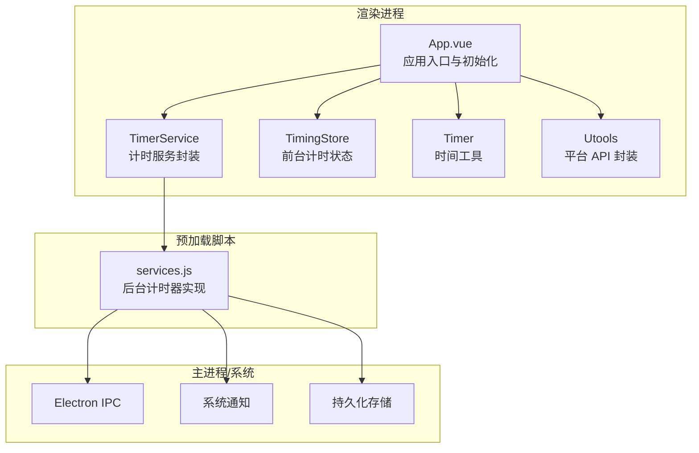
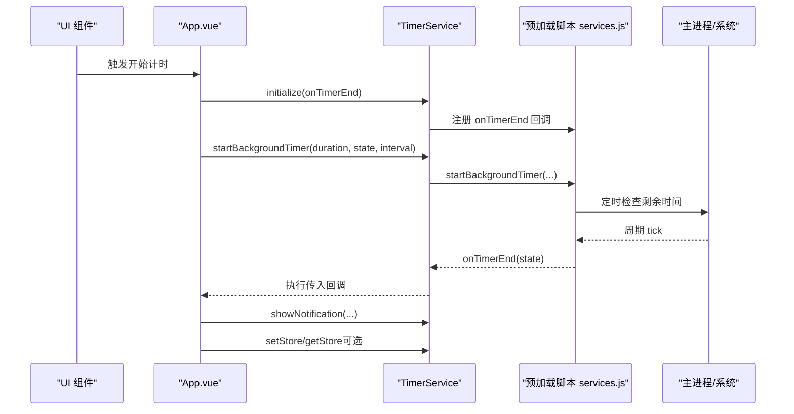
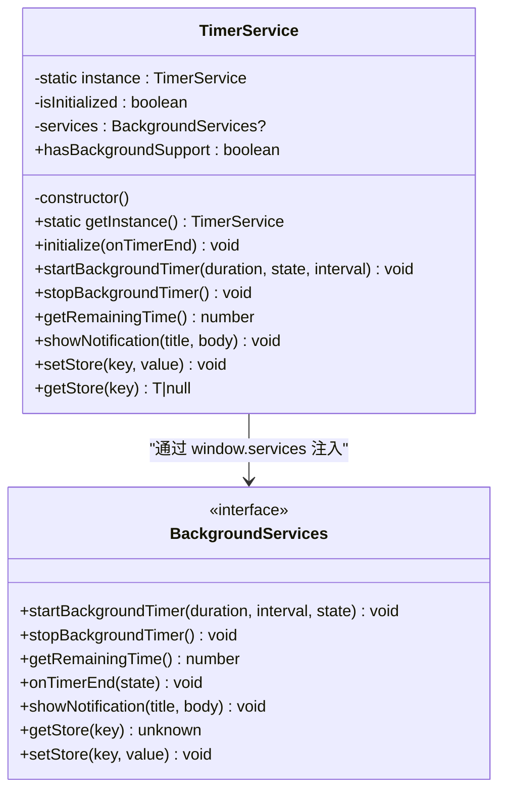
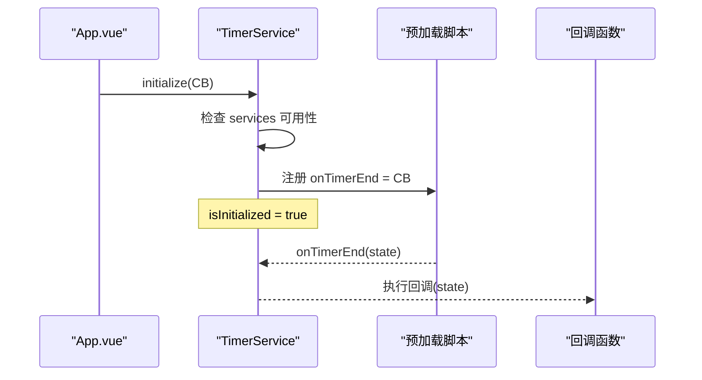
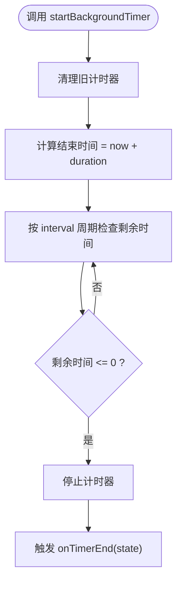
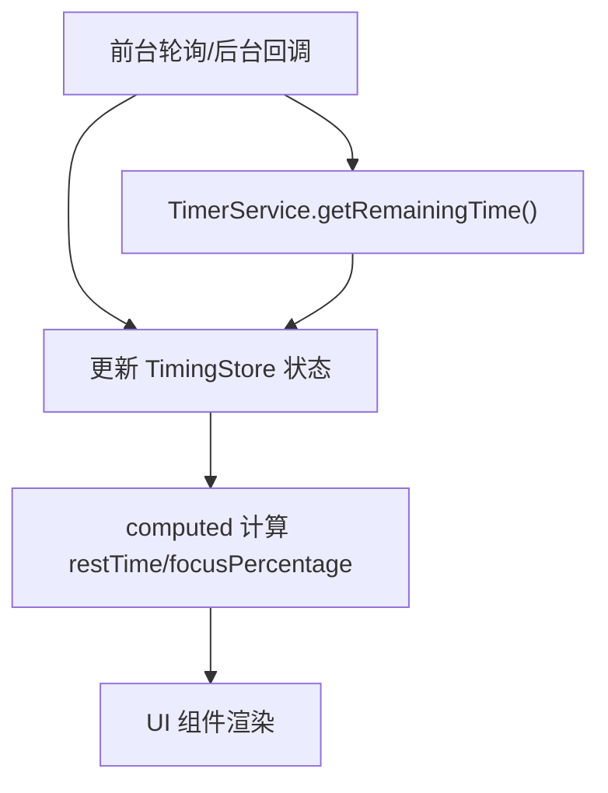
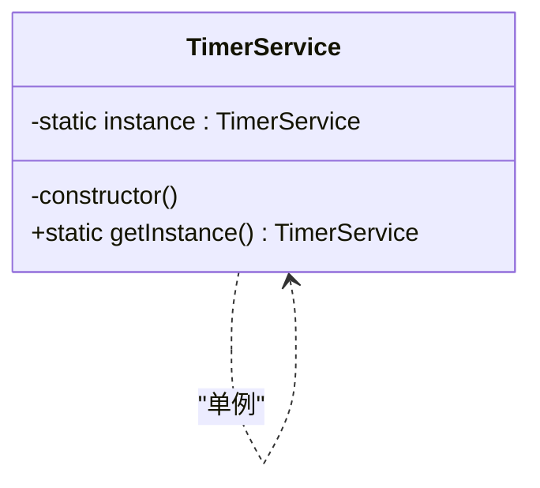
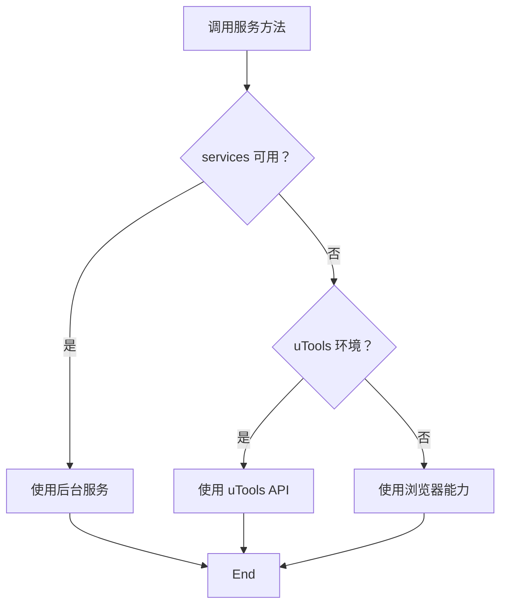
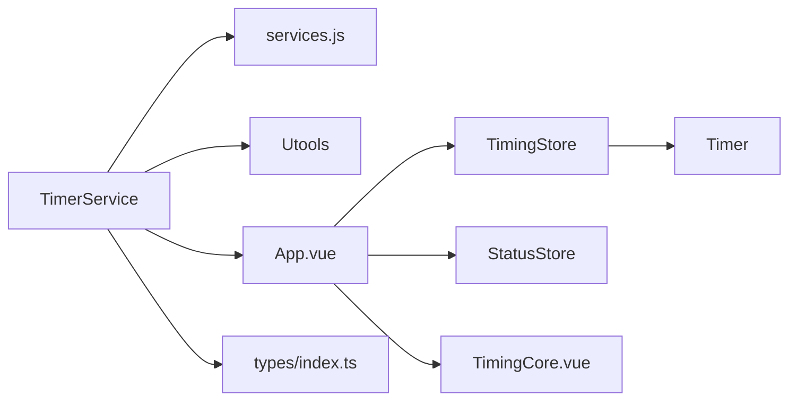

# 计时服务

<cite>
**本文引用的文件列表**
- [timerService.ts](file://src/services/timerService.ts)
- [services.js](file://public/preload/services.js)
- [timer.ts](file://src/utils/timer.ts)
- [timingStore.ts](file://src/stores/timingStore.ts)
- [statusStore.ts](file://src/stores/statusStore.ts)
- [App.vue](file://src/App.vue)
- [index.ts](file://src/types/index.ts)
- [utools.ts](file://src/utils/utools.ts)
- [settings.ts](file://src/settings.ts)
- [TimingCore.vue](file://src/components/TimingCore.vue)
</cite>

## 目录
1. [简介](#简介)
2. [项目结构](#项目结构)
3. [核心组件](#核心组件)
4. [架构总览](#架构总览)
5. [详细组件分析](#详细组件分析)
6. [依赖关系分析](#依赖关系分析)
7. [性能考量](#性能考量)
8. [故障排查指南](#故障排查指南)
9. [结论](#结论)
10. [附录：使用示例与集成方法](#附录使用示例与集成方法)

## 简介
本文件围绕计时服务（TimerService）进行系统化技术文档编写，重点阐述：
- 后台计时器的启动、停止与状态管理
- 计时器初始化流程与回调机制
- 剩余时间获取与状态同步的实现方式
- 单例模式设计与实例管理
- 后台服务支持检测与降级策略
- 计时器生命周期管理最佳实践
- 不同环境下的行为差异与兼容性处理
- 开发者使用示例与集成方法

## 项目结构
计时服务位于前端服务层，通过预加载脚本注入 Electron 的 Node 能力，形成“渲染进程 ↔ 预加载脚本 ↔ 主进程”的后台计时通道，并与 Pinia 状态管理、工具类、UI 组件协同工作。

图表来源
- [App.vue:56-114](file://src/App.vue#L56-L114)
- [timerService.ts:24-161](file://src/services/timerService.ts#L24-L161)
- [services.js:13-101](file://public/preload/services.js#L13-L101)
- [timingStore.ts:32-140](file://src/stores/timingStore.ts#L32-L140)
- [timer.ts:5-66](file://src/utils/timer.ts#L5-L66)
- [utools.ts:13-165](file://src/utils/utools.ts#L13-L165)

章节来源
- [App.vue:56-114](file://src/App.vue#L56-L114)
- [timerService.ts:24-161](file://src/services/timerService.ts#L24-L161)
- [services.js:13-101](file://public/preload/services.js#L13-L101)
- [timingStore.ts:32-140](file://src/stores/timingStore.ts#L32-L140)
- [timer.ts:5-66](file://src/utils/timer.ts#L5-L66)
- [utools.ts:13-165](file://src/utils/utools.ts#L13-L165)

## 核心组件
- 计时服务（TimerService）
  - 单例封装：提供全局唯一实例，避免重复初始化
  - 后台能力代理：通过 window.services 注入的后台计时器接口进行启动、停止、查询剩余时间、回调注册与系统通知
  - 降级策略：当无后台能力时，自动降级到 uTools API 或浏览器环境的本地存储与通知
- 后台计时器（services.js）
  - 基于主进程的定时器与 IPC，周期性检查剩余时间并在结束时触发回调
  - 支持启动、停止、查询剩余时间、系统通知与持久化存储
- 前台计时器（TimingStore）
  - 前台计时逻辑：基于 setInterval 的轮询，计算已过时间与剩余时间，驱动 UI 更新
  - 状态切换：专注/休息状态之间的切换与边界处理
- 时间工具（Timer）
  - 提供时间戳获取、耗时统计与时间格式化（hh:mm:ss、mm:ss）
- 平台 API 封装（Utools）
  - 对 uTools 环境的统一封装，包含窗口控制、通知、存储等能力
- 应用入口（App.vue）
  - 初始化用户设置与计时器参数
  - 注册后台计时结束回调，执行通知与窗口显示逻辑
  - 监听插件进入/隐藏事件，动态调整前台计时精度

章节来源
- [timerService.ts:24-161](file://src/services/timerService.ts#L24-L161)
- [services.js:13-101](file://public/preload/services.js#L13-L101)
- [timingStore.ts:32-140](file://src/stores/timingStore.ts#L32-L140)
- [timer.ts:5-66](file://src/utils/timer.ts#L5-L66)
- [utools.ts:13-165](file://src/utils/utools.ts#L13-L165)
- [App.vue:56-114](file://src/App.vue#L56-L114)

## 架构总览
计时服务采用“前台轮询 + 后台计时器”的双轨架构：
- 前台轮询：用于 UI 实时更新与状态切换，精度可按场景动态调整
- 后台计时器：由预加载脚本注入的后台计时器负责精确计时与结束回调，确保应用在后台或最小化状态下仍能准确计时

图表来源
- [App.vue:69-79](file://src/App.vue#L69-L79)
- [timerService.ts:59-101](file://src/services/timerService.ts#L59-L101)
- [services.js:22-67](file://public/preload/services.js#L22-L67)

章节来源
- [App.vue:69-79](file://src/App.vue#L69-L79)
- [timerService.ts:59-101](file://src/services/timerService.ts#L59-L101)
- [services.js:22-67](file://public/preload/services.js#L22-L67)

## 详细组件分析

### 计时服务（TimerService）类图

图表来源
- [timerService.ts:24-161](file://src/services/timerService.ts#L24-L161)

章节来源
- [timerService.ts:24-161](file://src/services/timerService.ts#L24-L161)

### 初始化与回调机制
- 初始化流程
  - 检查后台服务可用性（window.services 是否存在）
  - 若可用，注册 onTimerEnd 回调，将后台计时结束事件转发给上层
  - 标记 isInitialized，避免重复初始化
- 回调机制
  - 后台计时器结束时，通过 onTimerEnd(state) 触发
  - 上层（如 App.vue）接收回调后执行通知与窗口显示逻辑

图表来源
- [timerService.ts:59-70](file://src/services/timerService.ts#L59-L70)
- [services.js:65-67](file://public/preload/services.js#L65-L67)
- [App.vue:70-79](file://src/App.vue#L70-L79)

章节来源
- [timerService.ts:59-70](file://src/services/timerService.ts#L59-L70)
- [services.js:65-67](file://public/preload/services.js#L65-L67)
- [App.vue:70-79](file://src/App.vue#L70-L79)

### 后台计时器启动/停止/剩余时间
- 启动
  - startBackgroundTimer(duration, interval, state)
  - 预加载脚本内部计算结束时间点，按 interval 周期检查剩余时间
- 停止
  - stopBackgroundTimer() 清理定时器与状态
- 剩余时间
  - getRemainingTime() 返回当前剩余时间（毫秒）

图表来源
- [timerService.ts:75-85](file://src/services/timerService.ts#L75-L85)
- [services.js:22-40](file://public/preload/services.js#L22-L40)
- [services.js:58-60](file://public/preload/services.js#L58-L60)

章节来源
- [timerService.ts:75-101](file://src/services/timerService.ts#L75-L101)
- [services.js:22-60](file://public/preload/services.js#L22-L60)

### 剩余时间获取与状态同步
- 前台状态
  - TimingStore 维护 focusTime、relaxTime、passedTime、roundTime 等状态
  - restTime getter 基于 focusTime 与累计时间计算剩余时间
- 后台状态
  - TimerService.getRemainingTime() 返回后台剩余时间
  - 前台可通过定时轮询或后台回调同步状态
- UI 同步
  - TimingCore.vue 使用 computed 计算剩余时间与百分比，驱动进度条与文本显示

图表来源
- [timingStore.ts:60-66](file://src/stores/timingStore.ts#L60-L66)
- [timingStore.ts:76-92](file://src/stores/timingStore.ts#L76-L92)
- [TimingCore.vue:69-89](file://src/components/TimingCore.vue#L69-L89)
- [timerService.ts:98-101](file://src/services/timerService.ts#L98-L101)

章节来源
- [timingStore.ts:60-66](file://src/stores/timingStore.ts#L60-L66)
- [timingStore.ts:76-92](file://src/stores/timingStore.ts#L76-L92)
- [TimingCore.vue:69-89](file://src/components/TimingCore.vue#L69-L89)
- [timerService.ts:98-101](file://src/services/timerService.ts#L98-L101)

### 单例模式与实例管理
- 单例实现
  - 私有静态实例字段与私有构造函数
  - getInstance() 方法确保全局唯一实例
- 实例管理
  - 导出单例实例，便于各模块直接使用
  - 避免重复初始化与资源浪费

图表来源
- [timerService.ts:24-38](file://src/services/timerService.ts#L24-L38)
- [timerService.ts:159-161](file://src/services/timerService.ts#L159-L161)

章节来源
- [timerService.ts:24-38](file://src/services/timerService.ts#L24-L38)
- [timerService.ts:159-161](file://src/services/timerService.ts#L159-L161)

### 后台服务支持检测与降级策略
- 支持检测
  - hasBackgroundSupport 属性通过 services 是否存在判断
- 降级策略
  - 通知：优先使用后台服务；否则降级到 uTools API；最后降级到浏览器 alert
  - 存储：优先使用后台服务；否则降级到 uTools dbStorage；最后降级到浏览器 localStorage
  - 计时：若无后台服务，前台轮询作为主要计时手段

图表来源
- [timerService.ts:52-54](file://src/services/timerService.ts#L52-L54)
- [timerService.ts:106-118](file://src/services/timerService.ts#L106-L118)
- [timerService.ts:123-135](file://src/services/timerService.ts#L123-L135)
- [utools.ts:96-108](file://src/utils/utools.ts#L96-L108)

章节来源
- [timerService.ts:52-54](file://src/services/timerService.ts#L52-L54)
- [timerService.ts:106-135](file://src/services/timerService.ts#L106-L135)
- [utools.ts:96-108](file://src/utils/utools.ts#L96-L108)

### 生命周期管理最佳实践
- 初始化阶段
  - 在应用挂载后尽早调用 initialize，注册回调并标记初始化完成
- 启动阶段
  - 使用 startBackgroundTimer 启动后台计时，合理设置 interval
- 运行阶段
  - 前台轮询用于 UI 实时更新；后台计时器用于精确结束判定
  - 动态调整前台轮询间隔以平衡性能与体验
- 停止阶段
  - 使用 stopBackgroundTimer 清理后台计时器
  - 清理前台定时器，释放资源
- 插件生命周期
  - 监听进入/隐藏事件，根据场景调整轮询精度与窗口显示

章节来源
- [App.vue:69-106](file://src/App.vue#L69-L106)
- [timingStore.ts:76-120](file://src/stores/timingStore.ts#L76-L120)
- [timerService.ts:75-93](file://src/services/timerService.ts#L75-L93)

### 不同环境的行为差异与兼容性
- uTools 环境
  - 支持后台计时器、系统通知、dbStorage 持久化
- 浏览器环境
  - 降级到浏览器 alert 通知与 localStorage 持久化
- 开发环境
  - settings.isDev 控制开发特性开关
- 窗口类型
  - Utools 提供窗口类型判断与窗口控制 API，适配主窗口/分离窗口/浏览器窗口

章节来源
- [utools.ts:129-139](file://src/utils/utools.ts#L129-L139)
- [settings.ts:4-7](file://src/settings.ts#L4-L7)
- [timerService.ts:106-118](file://src/services/timerService.ts#L106-L118)
- [timerService.ts:123-135](file://src/services/timerService.ts#L123-L135)

## 依赖关系分析
- 计时服务依赖
  - 预加载脚本注入的后台计时器接口
  - 平台 API 封装（Utools）用于降级路径
- 前台依赖
  - Pinia 状态管理（TimingStore、StatusStore）
  - 时间工具（Timer）
  - UI 组件（TimingCore.vue）
- 类型定义
  - 计时状态、事件、计时器状态等类型定义

图表来源
- [timerService.ts:24-161](file://src/services/timerService.ts#L24-L161)
- [services.js:13-101](file://public/preload/services.js#L13-L101)
- [utools.ts:13-165](file://src/utils/utools.ts#L13-L165)
- [App.vue:125-143](file://src/App.vue#L125-L143)
- [timingStore.ts:32-140](file://src/stores/timingStore.ts#L32-L140)
- [statusStore.ts:22-45](file://src/stores/statusStore.ts#L22-L45)
- [timer.ts:5-66](file://src/utils/timer.ts#L5-L66)
- [TimingCore.vue:92-99](file://src/components/TimingCore.vue#L92-L99)
- [index.ts:4-83](file://src/types/index.ts#L4-L83)

章节来源
- [timerService.ts:24-161](file://src/services/timerService.ts#L24-L161)
- [services.js:13-101](file://public/preload/services.js#L13-L101)
- [utools.ts:13-165](file://src/utils/utools.ts#L13-L165)
- [App.vue:125-143](file://src/App.vue#L125-L143)
- [timingStore.ts:32-140](file://src/stores/timingStore.ts#L32-L140)
- [statusStore.ts:22-45](file://src/stores/statusStore.ts#L22-L45)
- [timer.ts:5-66](file://src/utils/timer.ts#L5-L66)
- [TimingCore.vue:92-99](file://src/components/TimingCore.vue#L92-L99)
- [index.ts:4-83](file://src/types/index.ts#L4-L83)

## 性能考量
- 前台轮询间隔
  - 在前台可见时使用较高精度（如 500ms），在后台或隐藏时降低精度（如 2000ms）以节省 CPU
- 后台计时器精度
  - interval 参数应与 UI 更新频率匹配，避免过度检查
- 状态同步
  - 前台与后台状态应尽量通过后台计时器回调同步，减少前台轮询压力
- 存储访问
  - 降级路径下使用 localStorage，注意序列化与异常处理

[本节为通用指导，不直接分析具体文件]

## 故障排查指南
- 后台计时器未启动
  - 检查 services 是否注入成功（hasBackgroundSupport）
  - 确认 initialize 已调用且回调已注册
- 计时结束未触发回调
  - 检查后台计时器是否正常结束（剩余时间为 0）
  - 确认 onTimerEnd 回调链路是否被正确设置
- 通知无法显示
  - 在无后台服务时，确认降级路径（uTools 或浏览器）可用
- 存储读写异常
  - 在浏览器环境下，注意 JSON 解析异常与 localStorage 限制

章节来源
- [timerService.ts:52-54](file://src/services/timerService.ts#L52-L54)
- [timerService.ts:59-70](file://src/services/timerService.ts#L59-L70)
- [services.js:32-37](file://public/preload/services.js#L32-L37)
- [timerService.ts:106-118](file://src/services/timerService.ts#L106-L118)
- [timerService.ts:140-156](file://src/services/timerService.ts#L140-L156)

## 结论
计时服务通过“前台轮询 + 后台计时器”的双轨架构，在保证 UI 实时性的同时，确保计时的准确性与鲁棒性。其单例设计、环境检测与降级策略提升了跨平台兼容性，配合 Pinia 状态管理与 UI 组件，形成了清晰、可维护的计时体系。

[本节为总结性内容，不直接分析具体文件]

## 附录：使用示例与集成方法
- 初始化计时服务
  - 在应用挂载后调用 initialize，传入计时结束回调
  - 在回调中执行通知与窗口显示逻辑
- 启动后台计时器
  - 调用 startBackgroundTimer(duration, state, interval)
  - 注意合理设置 interval，避免过高开销
- 停止计时器
  - 在需要时调用 stopBackgroundTimer，清理后台计时器
- 获取剩余时间
  - 使用 getRemainingTime 获取后台剩余时间，用于 UI 同步
- 通知与存储
  - 使用 showNotification 进行系统通知
  - 使用 setStore/getStore 进行持久化存储（自动降级）
- 插件生命周期
  - 监听进入/隐藏事件，动态调整前台轮询间隔与窗口显示

章节来源
- [App.vue:69-106](file://src/App.vue#L69-L106)
- [timerService.ts:59-101](file://src/services/timerService.ts#L59-L101)
- [timerService.ts:106-135](file://src/services/timerService.ts#L106-L135)