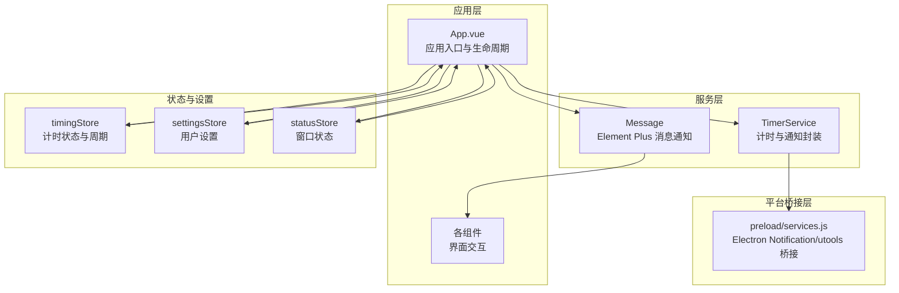
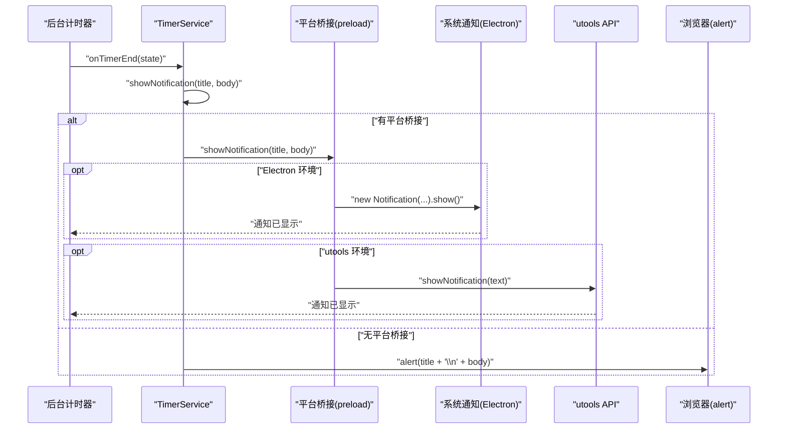
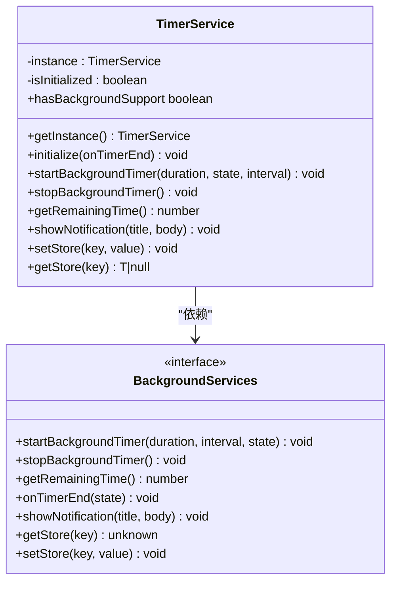
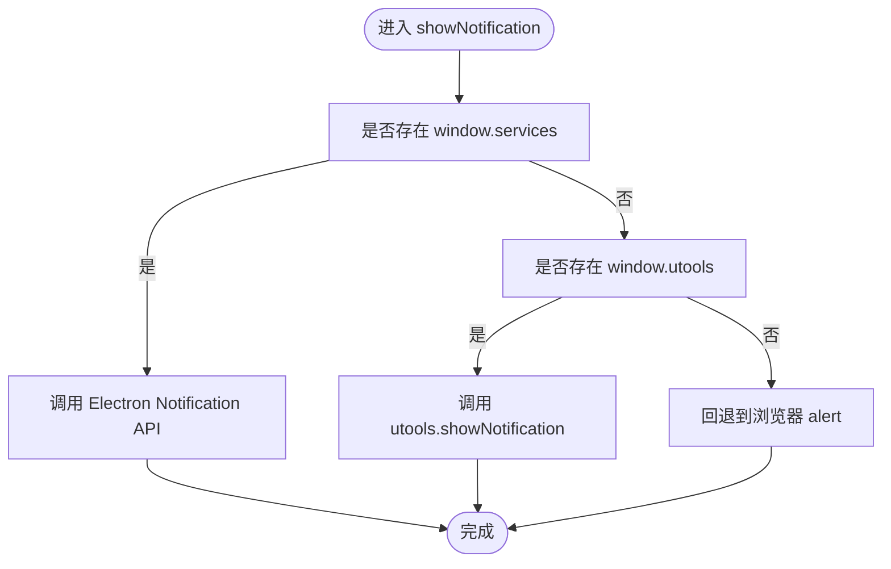
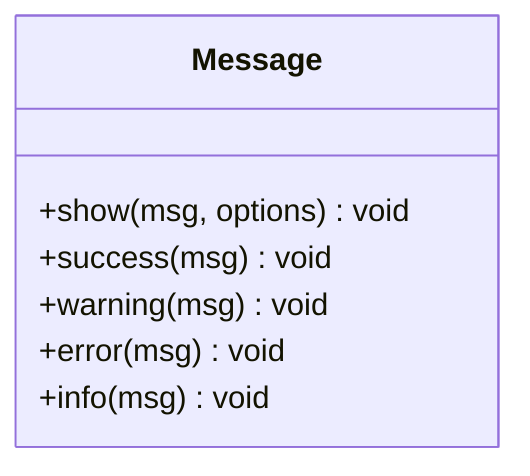
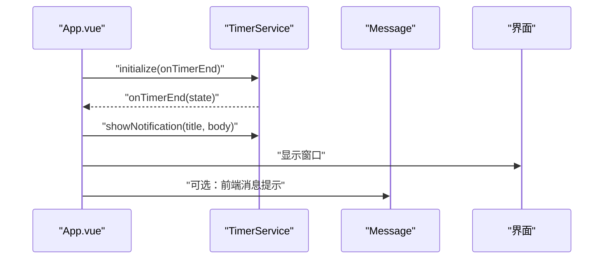
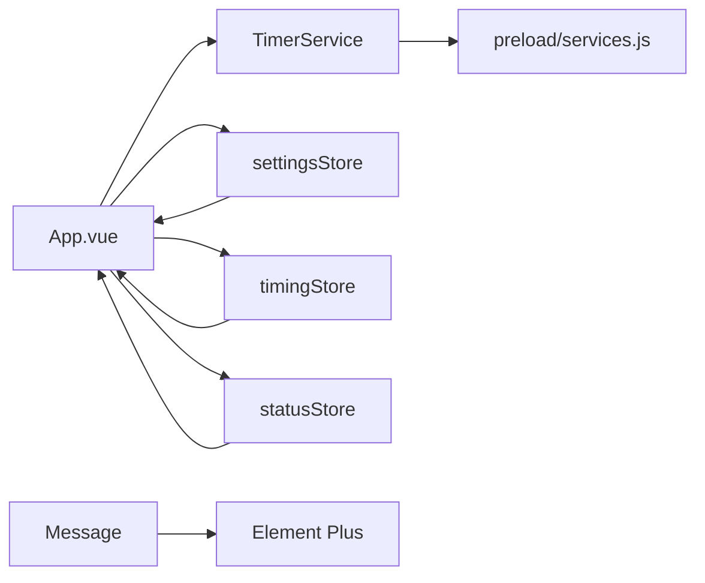

# 通知服务

<cite>
**本文引用的文件**
- [src/utils/notifier.ts](file://src/utils/notifier.ts)
- [src/services/timerService.ts](file://src/services/timerService.ts)
- [public/preload/services.js](file://public/preload/services.js)
- [src/App.vue](file://src/App.vue)
- [src/stores/timingStore.ts](file://src/stores/timingStore.ts)
- [src/stores/settingsStore.ts](file://src/stores/settingsStore.ts)
- [src/stores/statusStore.ts](file://src/stores/statusStore.ts)
- [src/types/index.ts](file://src/types/index.ts)
- [src/settings.ts](file://src/settings.ts)
- [src/components/operationPanel/ConfigPanel.vue](file://src/components/operationPanel/ConfigPanel.vue)
- [src/utils/eventBus.ts](file://src/utils/eventBus.ts)
- [src/utils/timer.ts](file://src/utils/timer.ts)
</cite>

## 目录
1. [简介](#简介)
2. [项目结构](#项目结构)
3. [核心组件](#核心组件)
4. [架构总览](#架构总览)
5. [详细组件分析](#详细组件分析)
6. [依赖关系分析](#依赖关系分析)
7. [性能与体验优化](#性能与体验优化)
8. [故障排查指南](#故障排查指南)
9. [结论](#结论)
10. [附录：配置与扩展指南](#附录配置与扩展指南)

## 简介
本文件围绕“通知服务”进行系统化说明，涵盖计时结束通知、系统提示通知等通知类型的实现机制与用户反馈策略；阐述通知权限管理与用户偏好设置；解释通知的显示时机与优先级控制；分析跨平台通知兼容性与降级处理；提供通知服务的配置选项与自定义方法，并给出效果优化与用户体验改进建议，以及面向开发者的扩展与定制指南。

## 项目结构
通知服务涉及的核心模块分布如下：
- 通知展示层：基于 Element Plus 的消息通知封装（前端消息提示）
- 通知下发层：计时服务封装跨平台通知调用（系统通知）
- 平台桥接层：Electron Notification 与 utools API 的降级适配
- 应用入口与状态：应用生命周期中触发通知与窗口显示
- 用户设置与偏好：专注/休息/稍后提醒时长与自动开始等影响通知行为的参数

图表来源
- [src/App.vue:69-79](file://src/App.vue#L69-L79)
- [src/services/timerService.ts:106-118](file://src/services/timerService.ts#L106-L118)
- [public/preload/services.js:76-84](file://public/preload/services.js#L76-L84)
- [src/utils/notifier.ts:19-61](file://src/utils/notifier.ts#L19-L61)

章节来源
- [src/App.vue:69-79](file://src/App.vue#L69-L79)
- [src/services/timerService.ts:106-118](file://src/services/timerService.ts#L106-L118)
- [public/preload/services.js:76-84](file://public/preload/services.js#L76-L84)
- [src/utils/notifier.ts:19-61](file://src/utils/notifier.ts#L19-L61)

## 核心组件
- 计时服务（TimerService）：负责后台计时器生命周期管理、计时结束回调、系统通知下发、跨平台存储读写与降级策略。
- 系统通知封装（Message）：基于 Element Plus 的消息通知工具类，统一消息类型与显示时长。
- 平台桥接（preload/services.js）：在 Electron 环境下通过 Notification API 发送系统通知；在 utools 环境下通过 utools API 降级；浏览器环境则回退到 alert。
- 应用入口（App.vue）：在计时结束时触发系统通知与窗口显示，依据用户偏好调整计时精度。
- 计时状态（timingStore）：驱动计时周期与状态切换，配合通知策略。
- 用户设置（settingsStore）：持久化用户偏好，如自动开始、专注/休息/稍后提醒时长、是否启用一言等。

章节来源
- [src/services/timerService.ts:24-161](file://src/services/timerService.ts#L24-L161)
- [src/utils/notifier.ts:19-61](file://src/utils/notifier.ts#L19-L61)
- [public/preload/services.js:13-101](file://public/preload/services.js#L13-L101)
- [src/App.vue:69-79](file://src/App.vue#L69-L79)
- [src/stores/timingStore.ts:32-141](file://src/stores/timingStore.ts#L32-L141)
- [src/stores/settingsStore.ts:11-87](file://src/stores/settingsStore.ts#L11-L87)

## 架构总览
通知服务的调用链路分为两条：
- 系统通知链路：后台计时结束回调 -> TimerService.showNotification -> 平台桥接 -> Electron Notification 或 utools API 或浏览器 alert
- 前端消息提示链路：业务侧调用 Message 类 -> Element Plus 消息组件

图表来源
- [src/services/timerService.ts:106-118](file://src/services/timerService.ts#L106-L118)
- [public/preload/services.js:76-84](file://public/preload/services.js#L76-L84)

章节来源
- [src/services/timerService.ts:106-118](file://src/services/timerService.ts#L106-L118)
- [public/preload/services.js:76-84](file://public/preload/services.js#L76-L84)

## 详细组件分析

### 系统通知实现（TimerService）
- 职责边界
  - 封装后台计时器生命周期与计时结束回调
  - 统一系统通知下发入口，具备跨平台降级能力
  - 提供跨平台存储读写，保障设置与状态持久化
- 关键点
  - 通过 window.services 注入平台桥接对象，若不可用则回退到 utools 或浏览器环境
  - 计时结束时根据状态选择标题与正文文案，触发系统通知并显示窗口
  - 支持启动/停止后台计时器、查询剩余时间、读写持久化存储

图表来源
- [src/services/timerService.ts:6-18](file://src/services/timerService.ts#L6-L18)
- [src/services/timerService.ts:24-161](file://src/services/timerService.ts#L24-L161)

章节来源
- [src/services/timerService.ts:24-161](file://src/services/timerService.ts#L24-L161)

### 平台桥接（preload/services.js）
- 职责边界
  - 在 Electron 环境下提供 Notification API 的封装
  - 在 utools 环境下提供通知与存储 API 的桥接
  - 作为 window.services 的实现，供渲染进程调用
- 关键点
  - 后台计时器采用轮询方式检测剩余时间并在结束时触发回调
  - 系统通知通过 Notification.show() 展示
  - 存储通过 utools.dbStorage 实现跨平台一致的键值存取

图表来源
- [public/preload/services.js:76-84](file://public/preload/services.js#L76-L84)
- [src/services/timerService.ts:109-117](file://src/services/timerService.ts#L109-L117)

章节来源
- [public/preload/services.js:13-101](file://public/preload/services.js#L13-L101)
- [src/services/timerService.ts:106-118](file://src/services/timerService.ts#L106-L118)

### 前端消息提示（Message）
- 职责边界
  - 统一封装 Element Plus 的消息通知，提供 info/success/warning/error 等类型
  - 支持自定义显示时长与分组显示
- 关键点
  - 通过静态方法集中调用，便于在业务逻辑中快速插入用户反馈
  - 适合轻量提示与设置变更确认等场景

图表来源
- [src/utils/notifier.ts:19-61](file://src/utils/notifier.ts#L19-L61)

章节来源
- [src/utils/notifier.ts:19-61](file://src/utils/notifier.ts#L19-L61)

### 应用入口与通知触发（App.vue）
- 职责边界
  - 初始化用户设置与计时器
  - 订阅后台计时结束事件，在回调中触发系统通知与窗口显示
  - 根据窗口可见性动态调整计时精度以平衡性能与体验
- 关键点
  - 计时结束时根据状态选择不同标题与正文
  - 自动开始计时由用户设置决定
  - 窗口进入/隐藏时调整计时精度，降低资源消耗

图表来源
- [src/App.vue:69-79](file://src/App.vue#L69-L79)
- [src/utils/notifier.ts:19-61](file://src/utils/notifier.ts#L19-L61)

章节来源
- [src/App.vue:69-79](file://src/App.vue#L69-L79)
- [src/utils/notifier.ts:19-61](file://src/utils/notifier.ts#L19-L61)

### 计时状态与通知时机（timingStore）
- 职责边界
  - 维护计时状态、周期与剩余时间
  - 在焦点态与休息态之间切换时触发结束逻辑
- 关键点
  - 焦点态结束自动切换至休息态，触发通知与窗口显示
  - 休息态周期性检查可触发窗口显示，提升用户参与度

章节来源
- [src/stores/timingStore.ts:32-141](file://src/stores/timingStore.ts#L32-L141)

### 用户设置与偏好（settingsStore）
- 职责边界
  - 持久化用户设置，包括专注/休息/稍后提醒时长、是否启用一言、是否自动开始
  - 提供加载、保存、重置与单项更新操作
- 关键点
  - 设置变更会同步到计时器，确保通知与窗口行为符合用户预期
  - 与前端消息提示结合，用于设置保存成功等反馈

章节来源
- [src/stores/settingsStore.ts:11-87](file://src/stores/settingsStore.ts#L11-L87)
- [src/components/operationPanel/ConfigPanel.vue:348-364](file://src/components/operationPanel/ConfigPanel.vue#L348-L364)

### 类型与常量（types/settings）
- 职责边界
  - 定义计时状态、事件映射、计时器状态等类型
  - 定义时间倍率常量与默认用户设置
- 关键点
  - 类型约束保证计时状态与事件参数的一致性
  - 常量统一时间单位换算，避免魔法数

章节来源
- [src/types/index.ts:1-83](file://src/types/index.ts#L1-L83)
- [src/settings.ts:12-47](file://src/settings.ts#L12-L47)

## 依赖关系分析
- TimerService 依赖 window.services（平台桥接），在无桥接时回退到 utools 或浏览器环境
- App.vue 依赖 TimerService 与 settingsStore，负责在计时结束时触发通知与窗口显示
- Message 作为 UI 层辅助，与业务解耦
- timingStore 与 statusStore 影响通知触发时机与窗口行为

图表来源
- [src/App.vue:69-79](file://src/App.vue#L69-L79)
- [src/services/timerService.ts:43-47](file://src/services/timerService.ts#L43-L47)
- [public/preload/services.js:13-101](file://public/preload/services.js#L13-L101)
- [src/utils/notifier.ts:19-61](file://src/utils/notifier.ts#L19-L61)

章节来源
- [src/App.vue:69-79](file://src/App.vue#L69-L79)
- [src/services/timerService.ts:43-47](file://src/services/timerService.ts#L43-L47)
- [public/preload/services.js:13-101](file://public/preload/services.js#L13-L101)
- [src/utils/notifier.ts:19-61](file://src/utils/notifier.ts#L19-L61)

## 性能与体验优化
- 降低后台开销
  - 窗口隐藏时提高计时轮询间隔，减少 CPU 占用
  - 窗口显示时缩短轮询间隔，提升响应性
- 减少重复通知
  - 在计时结束时仅触发一次系统通知，避免频繁弹窗
  - 结合窗口显示策略，确保用户感知到提醒
- 优化消息提示
  - 使用分组显示与合理时长，避免遮挡重要信息
- 降级策略
  - 在无平台桥接时使用 alert，保证基本可用性
  - 在 utools 环境下使用其通知 API，保持一致性

章节来源
- [src/App.vue:82-106](file://src/App.vue#L82-L106)
- [src/utils/notifier.ts:23-32](file://src/utils/notifier.ts#L23-L32)
- [src/services/timerService.ts:109-117](file://src/services/timerService.ts#L109-L117)

## 故障排查指南
- 问题：系统通知未显示
  - 检查是否注入了 window.services；若无，则回退到 utools 或浏览器环境
  - 确认 Electron Notification 权限与系统设置
- 问题：计时结束后未触发通知
  - 检查后台计时结束回调是否正确注册
  - 确认 App.vue 中的初始化逻辑是否执行
- 问题：设置保存后未生效
  - 检查 settingsStore 的保存与加载流程
  - 确认计时器时间是否按分钟倍率同步更新

章节来源
- [public/preload/services.js:13-101](file://public/preload/services.js#L13-L101)
- [src/App.vue:69-79](file://src/App.vue#L69-L79)
- [src/stores/settingsStore.ts:39-61](file://src/stores/settingsStore.ts#L39-L61)
- [src/components/operationPanel/ConfigPanel.vue:348-364](file://src/components/operationPanel/ConfigPanel.vue#L348-L364)

## 结论
通知服务通过 TimerService 统一系统通知下发，结合平台桥接实现跨平台兼容与降级；通过 App.vue 的生命周期与用户设置，实现通知时机与优先级的灵活控制；通过 Message 提供一致的前端消息提示。整体设计在保证可用性的前提下兼顾性能与体验，为后续扩展与定制提供了清晰的边界与接口。

## 附录：配置与扩展指南

### 通知类型与策略
- 计时结束通知
  - 状态为焦点态结束：标题与正文分别对应“休息时间到”与“请休息一下，保护眼睛”
  - 状态为休息态结束：标题与正文分别对应“继续工作”与“休息结束，继续加油”
- 系统提示通知
  - 使用 Message 类进行轻量提示，如设置保存成功等

章节来源
- [src/App.vue:73-76](file://src/App.vue#L73-L76)
- [src/utils/notifier.ts:19-61](file://src/utils/notifier.ts#L19-L61)

### 通知权限管理与用户偏好
- 用户偏好设置项
  - 专注时长、休息时长、稍后提醒时长（分钟）
  - 是否启用一言、是否自动开始
- 存储与读取
  - 通过 TimerService 的 setStore/getStore 实现跨平台存储
  - settingsStore 负责持久化与加载

章节来源
- [src/stores/settingsStore.ts:11-87](file://src/stores/settingsStore.ts#L11-L87)
- [src/services/timerService.ts:123-156](file://src/services/timerService.ts#L123-L156)

### 显示时机与优先级控制
- 显示时机
  - 后台计时结束时触发系统通知与窗口显示
- 优先级控制
  - 窗口进入时缩短计时轮询间隔，提升响应性
  - 窗口隐藏时延长轮询间隔，降低资源消耗

章节来源
- [src/App.vue:82-106](file://src/App.vue#L82-L106)

### 跨平台兼容与降级处理
- Electron 环境：使用 Notification API
- utools 环境：使用 utools 的通知与存储 API
- 浏览器环境：回退到 alert

章节来源
- [public/preload/services.js:76-84](file://public/preload/services.js#L76-L84)
- [src/services/timerService.ts:109-117](file://src/services/timerService.ts#L109-L117)

### 配置选项与自定义方法
- 自定义系统通知文案
  - 在 App.vue 的计时结束回调中修改标题与正文
- 自定义前端消息提示
  - 使用 Message 类的静态方法，传入类型与显示时长
- 扩展通知渠道
  - 在 TimerService 中增加新的通知通道（如推送服务），保持对外接口一致

章节来源
- [src/App.vue:73-76](file://src/App.vue#L73-L76)
- [src/utils/notifier.ts:23-32](file://src/utils/notifier.ts#L23-L32)
- [src/services/timerService.ts:106-118](file://src/services/timerService.ts#L106-L118)

### 用户体验改进建议
- 通知频率控制：避免在短时间内重复提醒
- 文案本地化：支持多语言文案配置
- 交互反馈：结合 Message 与窗口显示，形成闭环反馈

章节来源
- [src/utils/notifier.ts:23-32](file://src/utils/notifier.ts#L23-L32)
- [src/App.vue:82-106](file://src/App.vue#L82-L106)