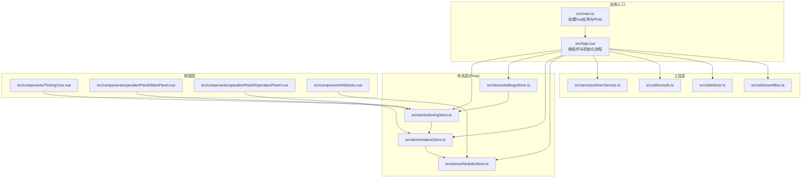
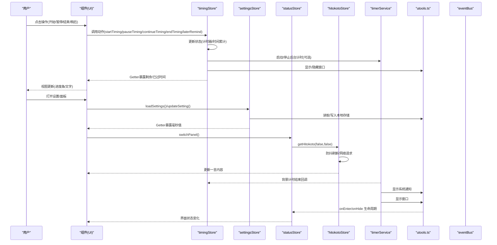
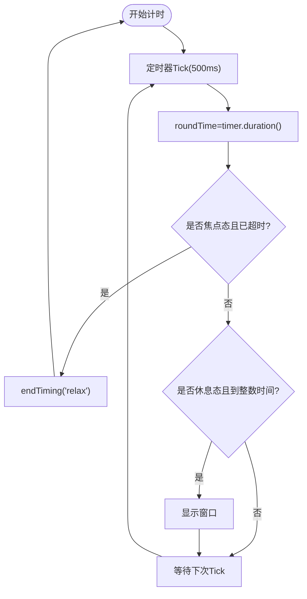
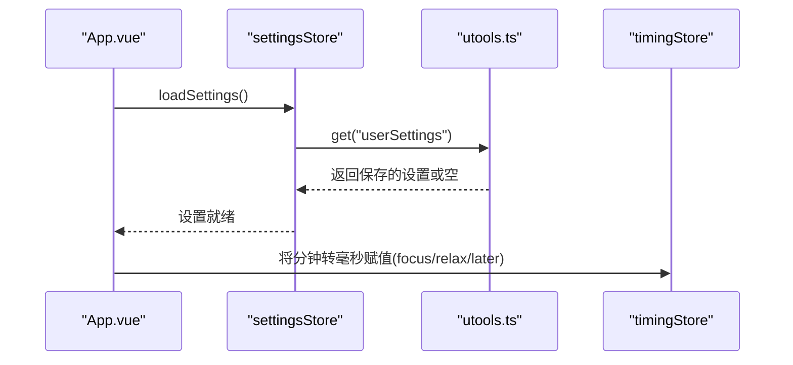
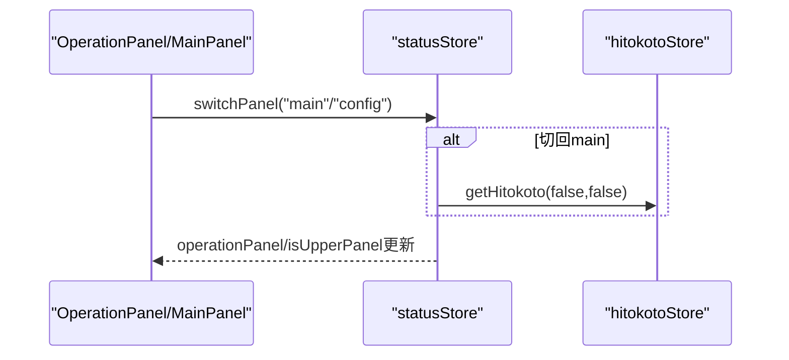
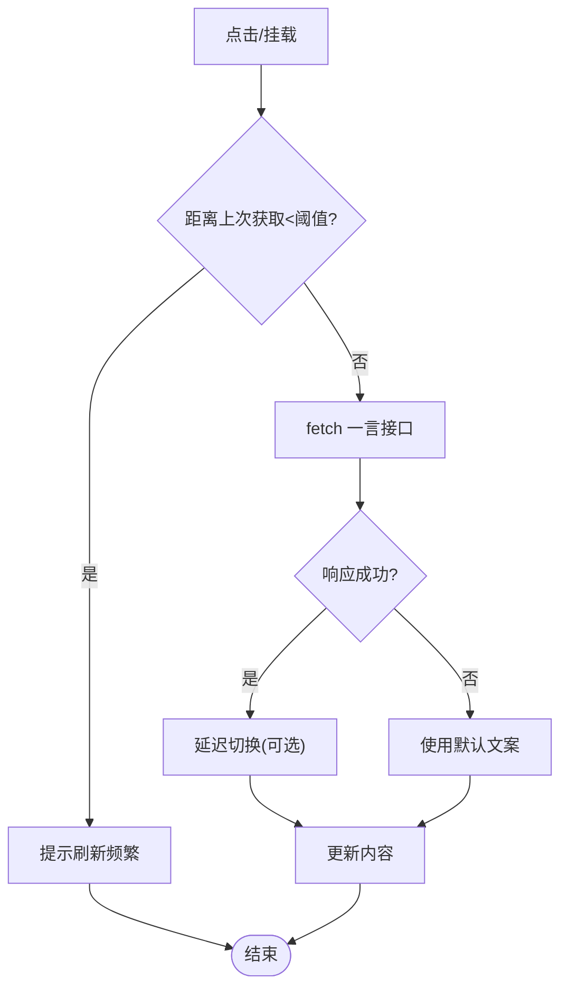
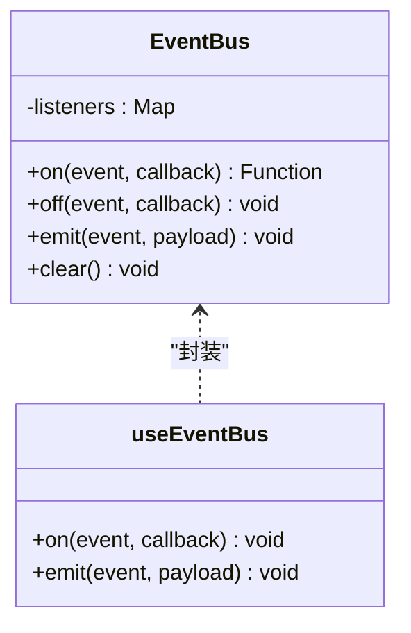
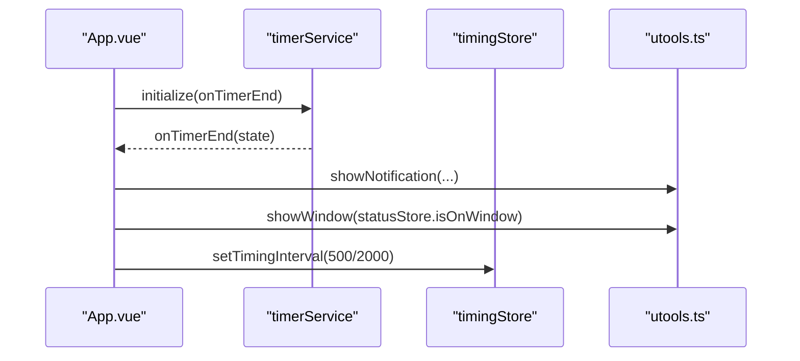
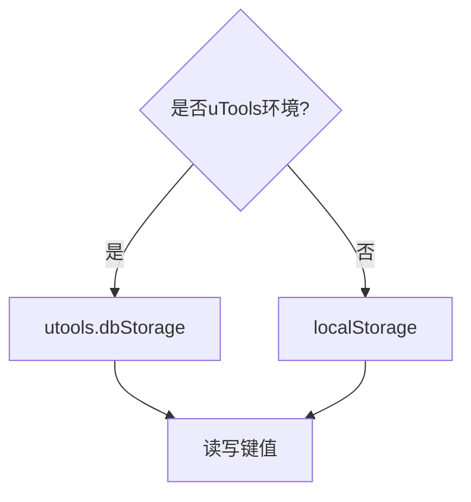
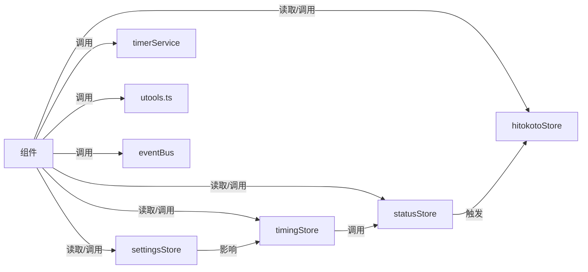

# 数据流设计

<cite>
**本文引用的文件**
- [src/main.ts](file://src/main.ts)
- [src/App.vue](file://src/App.vue)
- [src/stores/timingStore.ts](file://src/stores/timingStore.ts)
- [src/stores/settingsStore.ts](file://src/stores/settingsStore.ts)
- [src/stores/statusStore.ts](file://src/stores/statusStore.ts)
- [src/stores/hitokotoStore.ts](file://src/stores/hitokotoStore.ts)
- [src/services/timerService.ts](file://src/services/timerService.ts)
- [src/utils/eventBus.ts](file://src/utils/eventBus.ts)
- [src/utils/timer.ts](file://src/utils/timer.ts)
- [src/utils/utools.ts](file://src/utils/utools.ts)
- [src/components/TimingCore.vue](file://src/components/TimingCore.vue)
- [src/components/operationPanel/MainPanel.vue](file://src/components/operationPanel/MainPanel.vue)
- [src/components/operationPanel/OperationPanel.vue](file://src/components/operationPanel/OperationPanel.vue)
- [src/components/Hitokoto.vue](file://src/components/Hitokoto.vue)
- [src/types/index.ts](file://src/types/index.ts)
- [src/settings.ts](file://src/settings.ts)
- [package.json](file://package.json)
</cite>

## 目录
1. [引言](#引言)
2. [项目结构](#项目结构)
3. [核心组件](#核心组件)
4. [架构总览](#架构总览)
5. [详细组件分析](#详细组件分析)
6. [依赖关系分析](#依赖关系分析)
7. [性能考量](#性能考量)
8. [故障排查指南](#故障排查指南)
9. [结论](#结论)
10. [附录](#附录)

## 引言
本文件面向“休息提醒”项目，系统性梳理基于 Pinia 的状态管理与数据流设计。重点覆盖以下方面：
- 单向数据流在项目中的落地：从用户交互到状态更新再到 UI 渲染的完整链路
- 四个核心 store 的职责与数据流转：timingStore、settingsStore、statusStore、hitokotoStore
- 事件总线（eventBus）在组件间通信中的作用与边界
- 数据持久化与本地存储策略：uTools 插件存储、浏览器降级方案
- 异步数据处理与状态同步：网络请求、定时器、后台计时服务
- 数据流图与状态转换图，帮助快速理解系统行为

## 项目结构
项目采用“组件 + Pinia Store + 工具层”的分层组织，入口应用通过 Pinia 容器统一注入状态，各业务模块通过 store 实现状态隔离与共享。

图表来源
- [src/main.ts:1-19](file://src/main.ts#L1-L19)
- [src/App.vue:1-145](file://src/App.vue#L1-L145)
- [src/stores/timingStore.ts:1-141](file://src/stores/timingStore.ts#L1-L141)
- [src/stores/settingsStore.ts:1-87](file://src/stores/settingsStore.ts#L1-L87)
- [src/stores/statusStore.ts:1-46](file://src/stores/statusStore.ts#L1-L46)
- [src/stores/hitokotoStore.ts:1-72](file://src/stores/hitokotoStore.ts#L1-L72)
- [src/services/timerService.ts:1-161](file://src/services/timerService.ts#L1-L161)
- [src/utils/eventBus.ts:1-104](file://src/utils/eventBus.ts#L1-L104)
- [src/utils/timer.ts:1-66](file://src/utils/timer.ts#L1-L66)
- [src/utils/utools.ts:1-165](file://src/utils/utools.ts#L1-L165)
- [src/components/TimingCore.vue:1-101](file://src/components/TimingCore.vue#L1-L101)
- [src/components/operationPanel/MainPanel.vue:1-82](file://src/components/operationPanel/MainPanel.vue#L1-L82)
- [src/components/operationPanel/OperationPanel.vue:1-180](file://src/components/operationPanel/OperationPanel.vue#L1-L180)
- [src/components/Hitokoto.vue:1-79](file://src/components/Hitokoto.vue#L1-L79)

章节来源
- [src/main.ts:1-19](file://src/main.ts#L1-L19)
- [src/App.vue:1-145](file://src/App.vue#L1-L145)

## 核心组件
本项目围绕四个核心 store 构建数据域：
- timingStore：计时状态与时间推进，负责焦点/休息状态切换、计时器启动/暂停/继续/结束、稍后提醒等
- settingsStore：用户设置的加载/保存/重置/单项更新，提供毫秒换算 getter
- statusStore：界面面板状态与窗口升起状态，负责面板切换与一言刷新联动
- hitokotoStore：一言内容获取与防抖刷新，支持延迟切换动画

章节来源
- [src/stores/timingStore.ts:1-141](file://src/stores/timingStore.ts#L1-L141)
- [src/stores/settingsStore.ts:1-87](file://src/stores/settingsStore.ts#L1-L87)
- [src/stores/statusStore.ts:1-46](file://src/stores/statusStore.ts#L1-L46)
- [src/stores/hitokotoStore.ts:1-72](file://src/stores/hitokotoStore.ts#L1-L72)

## 架构总览
下图展示从用户交互到状态更新再到 UI 渲染的单向数据流路径，并标注关键同步点（定时器、后台计时、本地存储）：

图表来源
- [src/App.vue:56-114](file://src/App.vue#L56-L114)
- [src/stores/timingStore.ts:94-131](file://src/stores/timingStore.ts#L94-L131)
- [src/stores/settingsStore.ts:39-84](file://src/stores/settingsStore.ts#L39-L84)
- [src/stores/statusStore.ts:35-43](file://src/stores/statusStore.ts#L35-L43)
- [src/stores/hitokotoStore.ts:31-69](file://src/stores/hitokotoStore.ts#L31-L69)
- [src/services/timerService.ts:59-118](file://src/services/timerService.ts#L59-L118)
- [src/utils/utools.ts:13-165](file://src/utils/utools.ts#L13-L165)
- [src/utils/eventBus.ts:12-61](file://src/utils/eventBus.ts#L12-L61)

## 详细组件分析

### timingStore：计时与状态机
- 状态字段：当前状态、计时器句柄、专注/休息/稍后时间、累计时间、本轮耗时
- Getter：当前状态判定、是否计时、累计/剩余时间计算
- Actions：
  - 切换状态、设置计时器、启动/暂停/继续/结束、稍后提醒
  - 定时器回调内根据累计时间决定状态切换，并在合适时机触发窗口显示
- 与 statusStore、utools 的协作：结束计时后通过状态查询窗口状态并显示窗口；在休息阶段定时检查以防止错过提醒

图表来源
- [src/stores/timingStore.ts:75-92](file://src/stores/timingStore.ts#L75-L92)
- [src/stores/timingStore.ts:122-131](file://src/stores/timingStore.ts#L122-L131)

章节来源
- [src/stores/timingStore.ts:1-141](file://src/stores/timingStore.ts#L1-L141)
- [src/utils/timer.ts:1-66](file://src/utils/timer.ts#L1-L66)

### settingsStore：设置加载/保存/重置
- 负责从本地存储加载用户设置，提供毫秒换算 getter，支持单项更新并自动保存
- 初始化时由 App.vue 调用 loadSettings，并将设置映射到 timingStore 的时间参数

图表来源
- [src/App.vue:60-68](file://src/App.vue#L60-L68)
- [src/stores/settingsStore.ts:39-48](file://src/stores/settingsStore.ts#L39-L48)
- [src/utils/utools.ts:34-48](file://src/utils/utools.ts#L34-L48)

章节来源
- [src/stores/settingsStore.ts:1-87](file://src/stores/settingsStore.ts#L1-L87)
- [src/App.vue:60-68](file://src/App.vue#L60-L68)

### statusStore：面板与窗口状态
- 管理当前面板(main/config)与窗口升起状态
- 切换面板时，若回到 main 面板会触发一言刷新，确保 UI 内容新鲜

图表来源
- [src/stores/statusStore.ts:35-43](file://src/stores/statusStore.ts#L35-L43)
- [src/stores/hitokotoStore.ts:31-69](file://src/stores/hitokotoStore.ts#L31-L69)

章节来源
- [src/stores/statusStore.ts:1-46](file://src/stores/statusStore.ts#L1-L46)

### hitokotoStore：一言获取与防抖
- 支持主动刷新与延迟切换动画，防抖阈值来自 settings
- 失败时提供默认文案，保证 UI 稳定

图表来源
- [src/stores/hitokotoStore.ts:31-69](file://src/stores/hitokotoStore.ts#L31-L69)
- [src/settings.ts:32-35](file://src/settings.ts#L32-L35)

章节来源
- [src/stores/hitokotoStore.ts:1-72](file://src/stores/hitokotoStore.ts#L1-L72)
- [src/components/Hitokoto.vue:64-67](file://src/components/Hitokoto.vue#L64-L67)

### 事件总线（eventBus）：组件间解耦
- 提供 on/off/emit/clear 能力，useEventBus Hook 在组件卸载时自动清理
- 类型安全的 EventMap 定义了计时结束、面板切换、一言刷新等事件
- 本项目中主要通过 Pinia 与 utools 生命周期进行跨模块通信，eventBus 作为通用解耦手段存在

图表来源
- [src/utils/eventBus.ts:12-61](file://src/utils/eventBus.ts#L12-L61)
- [src/utils/eventBus.ts:70-97](file://src/utils/eventBus.ts#L70-L97)
- [src/types/index.ts:55-59](file://src/types/index.ts#L55-L59)

章节来源
- [src/utils/eventBus.ts:1-104](file://src/utils/eventBus.ts#L1-L104)
- [src/types/index.ts:1-83](file://src/types/index.ts#L1-L83)

### 异步数据处理与状态同步
- 网络请求：hitokotoStore 通过 fetch 获取一言，失败时回退默认文案
- 定时器：timingStore 使用 setInterval 推进 roundTime 并驱动状态切换
- 后台计时：timerService 封装后台计时接口，提供启动/停止/剩余时间查询与通知显示
- 生命周期同步：App.vue 监听 uTools 进入/隐藏回调，动态调整计时精度与窗口显示

图表来源
- [src/App.vue:69-106](file://src/App.vue#L69-L106)
- [src/services/timerService.ts:59-118](file://src/services/timerService.ts#L59-L118)
- [src/stores/timingStore.ts:75-92](file://src/stores/timingStore.ts#L75-L92)
- [src/utils/utools.ts:74-86](file://src/utils/utools.ts#L74-L86)

章节来源
- [src/services/timerService.ts:1-161](file://src/services/timerService.ts#L1-L161)
- [src/App.vue:69-106](file://src/App.vue#L69-L106)

### 数据持久化与本地存储策略
- uTools 环境：使用 dbStorage 读写用户设置与通用键值
- 浏览器降级：当不在 uTools 环境时，使用 localStorage 作为后备
- settingsStore 与 timerService 均遵循该策略，确保跨环境一致性

图表来源
- [src/utils/utools.ts:34-68](file://src/utils/utools.ts#L34-L68)
- [src/services/timerService.ts:123-156](file://src/services/timerService.ts#L123-L156)

章节来源
- [src/utils/utools.ts:1-165](file://src/utils/utools.ts#L1-L165)
- [src/services/timerService.ts:1-161](file://src/services/timerService.ts#L1-L161)

## 依赖关系分析
- 组件依赖 Pinia：各组件通过组合式 API 获取 store 实例，形成单向数据流
- store 间耦合最小化：timingStore 与 statusStore 有直接调用，其他 store 通过 settingsStore 间接影响 timingStore
- 工具层解耦：utools、timer、eventBus 作为横切能力，避免业务 store 直接耦合平台细节

图表来源
- [src/components/TimingCore.vue:95-96](file://src/components/TimingCore.vue#L95-L96)
- [src/components/operationPanel/MainPanel.vue:79-80](file://src/components/operationPanel/MainPanel.vue#L79-L80)
- [src/components/operationPanel/OperationPanel.vue:134](file://src/components/operationPanel/OperationPanel.vue#L134)
- [src/components/Hitokoto.vue:74](file://src/components/Hitokoto.vue#L74)
- [src/stores/timingStore.ts:88-89](file://src/stores/timingStore.ts#L88-L89)
- [src/stores/statusStore.ts:39-40](file://src/stores/statusStore.ts#L39-L40)
- [src/services/timerService.ts:43-47](file://src/services/timerService.ts#L43-L47)
- [src/utils/utools.ts:9-11](file://src/utils/utools.ts#L9-L11)
- [src/utils/eventBus.ts:12-61](file://src/utils/eventBus.ts#L12-L61)

章节来源
- [src/components/TimingCore.vue:1-101](file://src/components/TimingCore.vue#L1-L101)
- [src/components/operationPanel/MainPanel.vue:1-82](file://src/components/operationPanel/MainPanel.vue#L1-L82)
- [src/components/operationPanel/OperationPanel.vue:1-180](file://src/components/operationPanel/OperationPanel.vue#L1-L180)
- [src/components/Hitokoto.vue:1-79](file://src/components/Hitokoto.vue#L1-L79)

## 性能考量
- 定时器粒度：前台在窗口激活时使用更短间隔以提升响应，窗口隐藏时降级以节省资源
- 视图更新：TimingCore 使用 computed 与进度条组件，避免不必要的重排
- 面板动画：OperationPanel 使用 transform 与 backdrop-filter 优化，减少布局抖动
- 一言刷新：防抖与延迟切换动画，降低频繁请求与 DOM 抖动

章节来源
- [src/App.vue:117-119](file://src/App.vue#L117-L119)
- [src/components/TimingCore.vue:68-89](file://src/components/TimingCore.vue#L68-L89)
- [src/components/operationPanel/OperationPanel.vue:23-30](file://src/components/operationPanel/OperationPanel.vue#L23-L30)
- [src/stores/hitokotoStore.ts:31-39](file://src/stores/hitokotoStore.ts#L31-L39)

## 故障排查指南
- 计时不生效
  - 检查是否在 uTools 环境中，确认 timerService.hasBackgroundSupport
  - 确认 App.vue 初始化流程是否执行（loadSettings、startTiming）
- 一言不刷新
  - 检查刷新频率是否超过阈值（防抖）
  - 确认网络请求是否成功，失败时会回退默认文案
- 设置未持久化
  - 检查是否在 uTools 环境，否则使用 localStorage
  - 确认 settingsStore.updateSetting 是否触发 saveSettings
- 窗口显示异常
  - 检查 statusStore.isOnWindow 与 utools.showWindow 的调用时机

章节来源
- [src/services/timerService.ts:52-54](file://src/services/timerService.ts#L52-L54)
- [src/App.vue:56-114](file://src/App.vue#L56-L114)
- [src/stores/hitokotoStore.ts:31-69](file://src/stores/hitokotoStore.ts#L31-L69)
- [src/stores/settingsStore.ts:53-61](file://src/stores/settingsStore.ts#L53-L61)
- [src/utils/utools.ts:74-86](file://src/utils/utools.ts#L74-L86)

## 结论
本项目通过 Pinia 将业务状态清晰拆分，配合工具层与生命周期钩子，实现了稳定的单向数据流。timingStore 作为核心调度者，settingsStore 提供配置输入，statusStore 管理界面状态，hitokotoStore 负责异步内容刷新。事件总线提供解耦扩展点，timerService 与 utools 抽象屏蔽平台差异，最终在组件层完成高效渲染与交互反馈。

## 附录
- 依赖版本（节选）
  - Vue 3、Element Plus、Pinia
- 关键类型定义参考
  - 计时状态、用户设置、面板、事件映射、计时器状态、后台计时消息

章节来源
- [package.json:8-21](file://package.json#L8-L21)
- [src/types/index.ts:1-83](file://src/types/index.ts#L1-L83)