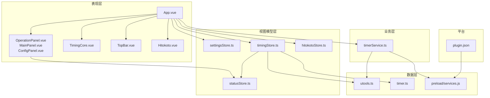
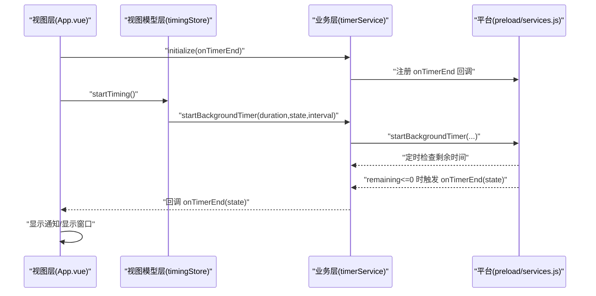
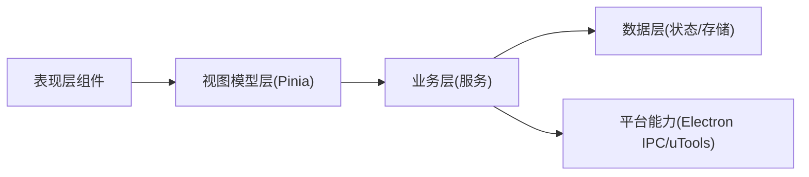
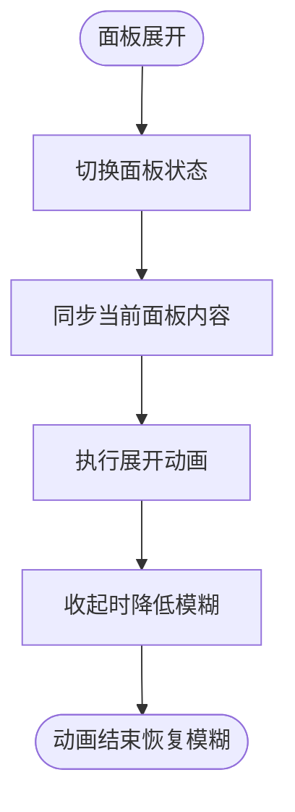
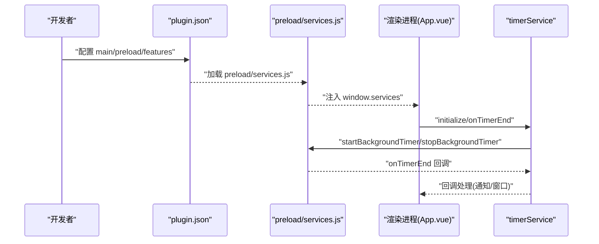
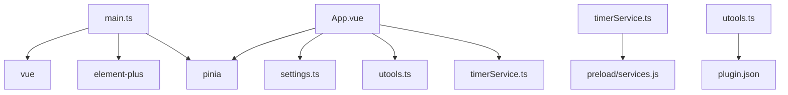

# 整体架构

<cite>
**本文引用的文件**
- [package.json](file://package.json)
- [main.ts](file://src/main.ts)
- [App.vue](file://src/App.vue)
- [plugin.json](file://public/plugin.json)
- [settings.ts](file://src/settings.ts)
- [timingStore.ts](file://src/stores/timingStore.ts)
- [settingsStore.ts](file://src/stores/settingsStore.ts)
- [statusStore.ts](file://src/stores/statusStore.ts)
- [hitokotoStore.ts](file://src/stores/hitokotoStore.ts)
- [OperationPanel.vue](file://src/components/operationPanel/OperationPanel.vue)
- [utools.ts](file://src/utils/utools.ts)
- [timer.ts](file://src/utils/timer.ts)
- [timerService.ts](file://src/services/timerService.ts)
- [index.ts](file://src/types/index.ts)
- [services.js](file://public/preload/services.js)
</cite>

## 目录
1. [简介](#简介)
2. [项目结构](#项目结构)
3. [核心组件](#核心组件)
4. [架构总览](#架构总览)
5. [详细组件分析](#详细组件分析)
6. [依赖分析](#依赖分析)
7. [性能考虑](#性能考虑)
8. [故障排查指南](#故障排查指南)
9. [结论](#结论)
10. [附录](#附录)

## 简介
本项目“休息提醒”是一个基于 Vue 3 + TypeScript + Pinia 的现代化前端应用，面向 uTools 插件平台，提供定时提醒休息的功能。系统采用 MVVM 架构模式，围绕视图层（Vue 组件）、视图模型层（Pinia Store）、模型层（工具与服务）进行职责划分；通过单向数据流实现清晰的数据流转；在表现层之上构建了业务层（服务封装）与数据层（状态管理），并通过 Electron IPC 与 preload 注入能力实现后台计时与系统通知等原生能力。

## 项目结构
项目采用按层与按功能混合的组织方式：
- 表现层：src/components 下的可复用组件与页面容器（如 OperationPanel）
- 视图模型层：src/stores 下的 Pinia Store（状态与行为）
- 业务层：src/services 下的服务封装（如计时服务）
- 数据层：src/utils 下的工具与平台适配（如 uTools API 封装、计时器工具）
- 类型定义：src/types 下的全局类型
- 平台集成：public/preload/services.js 注入后台计时与系统通知能力；public/plugin.json 定义插件元信息



图表来源
- [App.vue:1-145](file://src/App.vue#L1-L145)
- [OperationPanel.vue:1-180](file://src/components/operationPanel/OperationPanel.vue#L1-L180)
- [timingStore.ts:1-141](file://src/stores/timingStore.ts#L1-L141)
- [settingsStore.ts:1-87](file://src/stores/settingsStore.ts#L1-L87)
- [statusStore.ts:1-46](file://src/stores/statusStore.ts#L1-L46)
- [hitokotoStore.ts:1-72](file://src/stores/hitokotoStore.ts#L1-L72)
- [timerService.ts:1-161](file://src/services/timerService.ts#L1-L161)
- [utools.ts:1-165](file://src/utils/utools.ts#L1-L165)
- [timer.ts:1-66](file://src/utils/timer.ts#L1-L66)
- [services.js:1-102](file://public/preload/services.js#L1-L102)
- [plugin.json:1-25](file://public/plugin.json#L1-L25)

章节来源
- [package.json:1-23](file://package.json#L1-L23)
- [main.ts:1-19](file://src/main.ts#L1-L19)
- [plugin.json:1-25](file://public/plugin.json#L1-L25)

## 核心组件
- 应用入口与依赖装配：在入口文件中完成 Element Plus、Pinia、应用挂载等初始化。
- 应用根组件：负责布局、状态联动、事件监听与计时器初始化。
- 状态管理：四个核心 Store 分别承载用户设置、计时状态、窗口与面板状态、一言内容。
- 业务服务：计时服务封装前后台计时、通知与存储，统一对外暴露。
- 平台适配：uTools API 封装，提供事件、存储、窗口、通知等跨环境能力。
- 前后台桥接：preload 注入后台计时器与系统通知，通过 window.services 暴露给渲染进程。

章节来源
- [main.ts:1-19](file://src/main.ts#L1-L19)
- [App.vue:1-145](file://src/App.vue#L1-L145)
- [timingStore.ts:1-141](file://src/stores/timingStore.ts#L1-L141)
- [settingsStore.ts:1-87](file://src/stores/settingsStore.ts#L1-L87)
- [statusStore.ts:1-46](file://src/stores/statusStore.ts#L1-L46)
- [hitokotoStore.ts:1-72](file://src/stores/hitokotoStore.ts#L1-L72)
- [timerService.ts:1-161](file://src/services/timerService.ts#L1-L161)
- [utools.ts:1-165](file://src/utils/utools.ts#L1-L165)
- [services.js:1-102](file://public/preload/services.js#L1-L102)

## 架构总览
系统采用 MVVM 架构：
- 视图层（View）：Vue 组件树，负责渲染与交互。
- 视图模型层（ViewModel）：Pinia Store，集中管理状态与派生数据。
- 模型层（Model）：工具类与服务类，封装业务逻辑与平台能力。

单向数据流：
- 用户操作或外部事件触发（如点击、计时结束、插件进入/隐藏）。
- 视图层通过事件回调调用 Store 的 actions 或服务层方法。
- Store 的 actions 修改状态，触发响应式更新，驱动视图层重新渲染。
- 服务层通过平台 API（IPC、dbStorage、通知）与系统交互。

系统边界与集成点：
- uTools 插件边界：通过 plugin.json 声明入口、预加载脚本与功能码。
- Electron IPC 边界：preload 注入 window.services，渲染进程通过该对象调用后台能力。
- utools API 边界：在浏览器或非 uTools 环境下提供降级实现。

```mermaid
graph TB
subgraph "uTools 插件"
P["plugin.json"]
Pre["preload/services.js"]
end
subgraph "渲染进程"
RApp["App.vue"]
Stores["Pinia Stores"]
Utils["utools.ts"]
Svc["timerService.ts"]
end
subgraph "Electron 主进程"
IPC["ipcRenderer"]
end
P --> Pre
Pre <- --> IPC
RApp --> Stores
RApp --> Svc
Svc --> Pre
Utils --> RApp
```

图表来源
- [plugin.json:1-25](file://public/plugin.json#L1-L25)
- [services.js:1-102](file://public/preload/services.js#L1-L102)
- [App.vue:1-145](file://src/App.vue#L1-L145)
- [timerService.ts:1-161](file://src/services/timerService.ts#L1-L161)
- [utools.ts:1-165](file://src/utils/utools.ts#L1-L165)

## 详细组件分析

### MVVM 实现与单向数据流
- 视图层：App.vue 作为根组件，组合多个子组件，并根据状态动态渲染背景、顶部栏、进度条与操作面板。
- 视图模型层：各 Store 通过 state/getters/actions 组织状态与行为，例如 timingStore 提供计时状态、时间计算与控制方法。
- 模型层：timerService 封装后台计时、通知与存储；utools.ts 提供跨环境 API；timer.ts 提供时间工具。
- 单向数据流：用户操作（如点击稍后提醒）触发 Store actions，actions 修改状态，视图层响应式更新；计时结束事件通过服务层回调回到视图层处理。



图表来源
- [App.vue:60-114](file://src/App.vue#L60-L114)
- [timingStore.ts:94-131](file://src/stores/timingStore.ts#L94-L131)
- [timerService.ts:59-118](file://src/services/timerService.ts#L59-L118)
- [services.js:22-67](file://public/preload/services.js#L22-L67)

章节来源
- [App.vue:1-145](file://src/App.vue#L1-L145)
- [timingStore.ts:1-141](file://src/stores/timingStore.ts#L1-L141)
- [timerService.ts:1-161](file://src/services/timerService.ts#L1-L161)
- [services.js:1-102](file://public/preload/services.js#L1-L102)

### 分层架构
- 表现层（Vue 组件）：负责 UI 呈现与用户交互，如 OperationPanel 的抽屉式面板、TopBar 的顶部控制、TimingCore 的进度展示。
- 业务层（服务层）：封装复杂流程与平台能力，如计时服务对后台计时、通知与存储的统一封装。
- 数据层（状态管理）：Pinia Store 负责状态持久化、派生计算与跨组件共享，如 settingsStore 的用户设置、timingStore 的计时状态。



图表来源
- [OperationPanel.vue:1-180](file://src/components/operationPanel/OperationPanel.vue#L1-L180)
- [settingsStore.ts:1-87](file://src/stores/settingsStore.ts#L1-L87)
- [timingStore.ts:1-141](file://src/stores/timingStore.ts#L1-L141)
- [timerService.ts:1-161](file://src/services/timerService.ts#L1-L161)
- [utools.ts:1-165](file://src/utils/utools.ts#L1-L165)

章节来源
- [OperationPanel.vue:1-180](file://src/components/operationPanel/OperationPanel.vue#L1-L180)
- [settingsStore.ts:1-87](file://src/stores/settingsStore.ts#L1-L87)
- [timingStore.ts:1-141](file://src/stores/timingStore.ts#L1-L141)
- [timerService.ts:1-161](file://src/services/timerService.ts#L1-L161)

### 组件化设计与通信机制
- 组件拆分：OperationPanel 抽屉式面板，内部包含主面板与设置面板，通过状态控制展开/收起与内容切换。
- 通信机制：
  - 父子组件：通过 props 与 emits 传递数据与事件。
  - 兄弟组件：通过共享状态（Pinia Store）进行解耦通信。
  - 跨层级：通过 Store 的 action 与 getter 实现跨组件状态同步。
- 动画与性能：使用 transform 替代 height 改变，减少重排；在面板收起过程中降低 backdrop-filter 以提升性能。



图表来源
- [OperationPanel.vue:142-174](file://src/components/operationPanel/OperationPanel.vue#L142-L174)

章节来源
- [OperationPanel.vue:1-180](file://src/components/operationPanel/OperationPanel.vue#L1-L180)

### uTools 插件平台集成与 Electron IPC
- 插件声明：plugin.json 指定入口页面、预加载脚本与功能码，支持开发模式热更新。
- 预加载注入：preload/services.js 通过 window.services 暴露后台计时、通知与存储能力。
- 渲染进程调用：timerService 通过 window.services 访问后台能力，若不可用则回退到 uTools API 或浏览器环境实现。
- 事件与存储：App.vue 监听插件进入/隐藏事件，动态调整计时精度与窗口显示；设置通过 uTools dbStorage 持久化。



图表来源
- [plugin.json:1-25](file://public/plugin.json#L1-L25)
- [services.js:13-101](file://public/preload/services.js#L13-L101)
- [App.vue:60-114](file://src/App.vue#L60-L114)
- [timerService.ts:59-118](file://src/services/timerService.ts#L59-L118)

章节来源
- [plugin.json:1-25](file://public/plugin.json#L1-L25)
- [services.js:1-102](file://public/preload/services.js#L1-L102)
- [App.vue:1-145](file://src/App.vue#L1-L145)
- [timerService.ts:1-161](file://src/services/timerService.ts#L1-L161)

## 依赖分析
- 运行时依赖：Vue 3、Element Plus、Pinia。
- 开发依赖：Vite、TypeScript、Vue 组件自动引入、utools API 类型。
- 项目入口：main.ts 完成应用初始化、UI 组件库注册与状态管理装配。
- 类型系统：types/index.ts 定义计时状态、用户设置、面板与事件等核心类型。



图表来源
- [main.ts:1-19](file://src/main.ts#L1-L19)
- [App.vue:121-144](file://src/App.vue#L121-L144)
- [timerService.ts:1-161](file://src/services/timerService.ts#L1-L161)
- [utools.ts:1-165](file://src/utils/utools.ts#L1-L165)
- [plugin.json:1-25](file://public/plugin.json#L1-L25)
- [settings.ts:1-50](file://src/settings.ts#L1-L50)

章节来源
- [package.json:1-23](file://package.json#L1-L23)
- [main.ts:1-19](file://src/main.ts#L1-L19)
- [App.vue:1-145](file://src/App.vue#L1-L145)
- [timerService.ts:1-161](file://src/services/timerService.ts#L1-L161)
- [utools.ts:1-165](file://src/utils/utools.ts#L1-L165)
- [plugin.json:1-25](file://public/plugin.json#L1-L25)
- [settings.ts:1-50](file://src/settings.ts#L1-L50)

## 性能考虑
- 动画优化：OperationPanel 使用 transform 替代高度变化，减少布局抖动；在收起动画期间降低模糊值，平衡视觉与性能。
- 计时精度：根据窗口可见性动态调整计时轮询间隔，降低后台资源消耗。
- 请求节流：一言获取增加时间间隔限制，避免频繁网络请求。
- 响应式更新：Store 的 getters 将计算逻辑集中在一处，避免重复计算与不必要渲染。

章节来源
- [OperationPanel.vue:142-174](file://src/components/operationPanel/OperationPanel.vue#L142-L174)
- [timingStore.ts:75-92](file://src/stores/timingStore.ts#L75-L92)
- [hitokotoStore.ts:31-39](file://src/stores/hitokotoStore.ts#L31-L39)

## 故障排查指南
- 计时器未启动：检查 App.vue 中初始化逻辑与 settingsStore 的加载；确认 autoStartTiming 设置。
- 通知未显示：确认 timerService.hasBackgroundSupport 与 preload 注入；在浏览器环境下检查降级逻辑。
- 插件进入/隐藏异常：检查 App.vue 中 onEnter/onHide 回调与状态切换；确认窗口优先级与计时精度调整。
- 一言刷新失败：查看 hitokotoStore 的错误分支与默认文案回退；检查网络请求与频率限制。
- 存储读写问题：确认 uTools dbStorage 或浏览器环境下的降级实现；检查 key 命名一致性。

章节来源
- [App.vue:56-114](file://src/App.vue#L56-L114)
- [timerService.ts:52-118](file://src/services/timerService.ts#L52-L118)
- [utools.ts:37-68](file://src/utils/utools.ts#L37-L68)
- [hitokotoStore.ts:62-68](file://src/stores/hitokotoStore.ts#L62-L68)

## 结论
本项目通过 MVVM 与分层架构实现了清晰的职责划分与稳定的单向数据流。Pinia Store 将状态与行为集中管理，Vue 组件专注于视图呈现；timerService 与 uTools 平台能力的结合提供了可靠的后台计时与系统通知；preload 注入机制使渲染进程具备原生能力。整体设计兼顾了可维护性、可扩展性与性能优化，适合在 uTools 生态中长期演进。

## 附录
- 类型定义概览：计时状态、用户设置、面板与事件等类型在 types/index.ts 中统一定义，确保跨模块一致的契约。
- 配置常量：settings.ts 提供时间倍率与默认设置，便于统一换算与调试。

章节来源
- [index.ts:1-83](file://src/types/index.ts#L1-L83)
- [settings.ts:1-50](file://src/settings.ts#L1-L50)