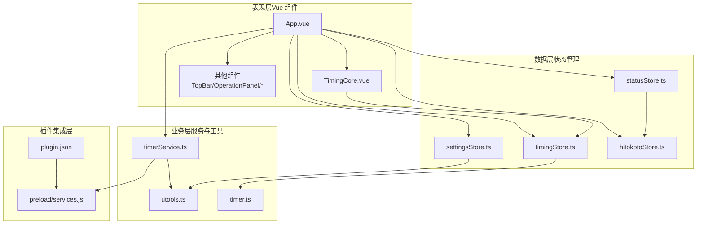
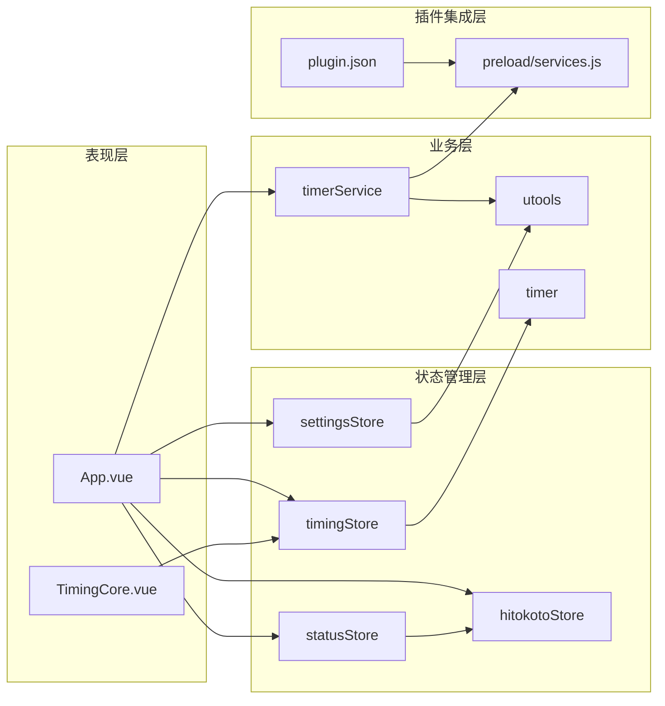
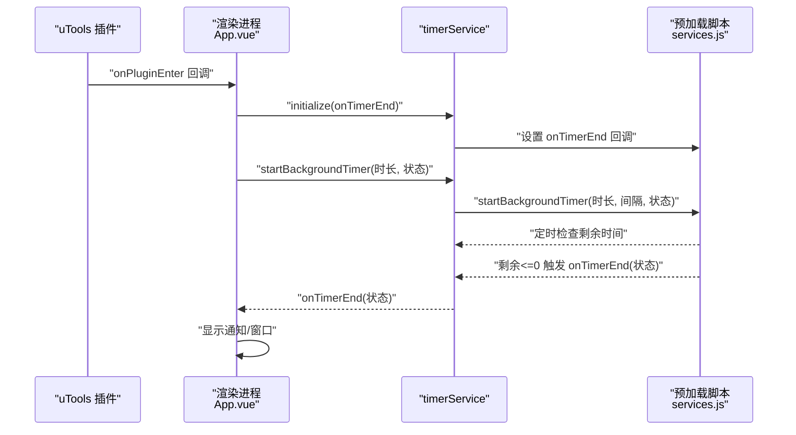
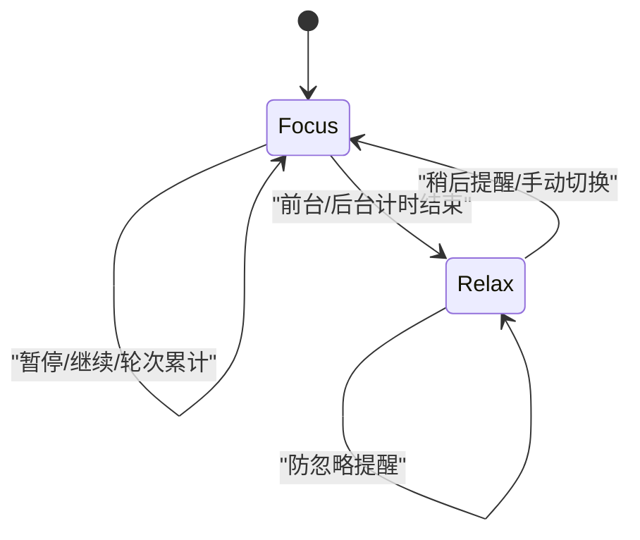
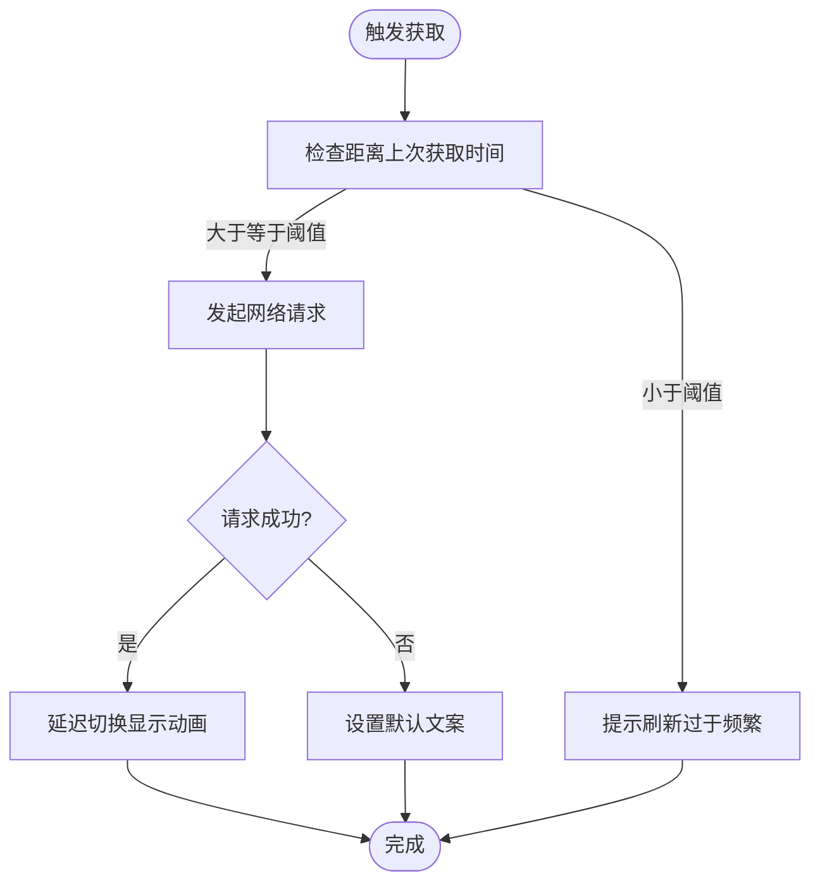
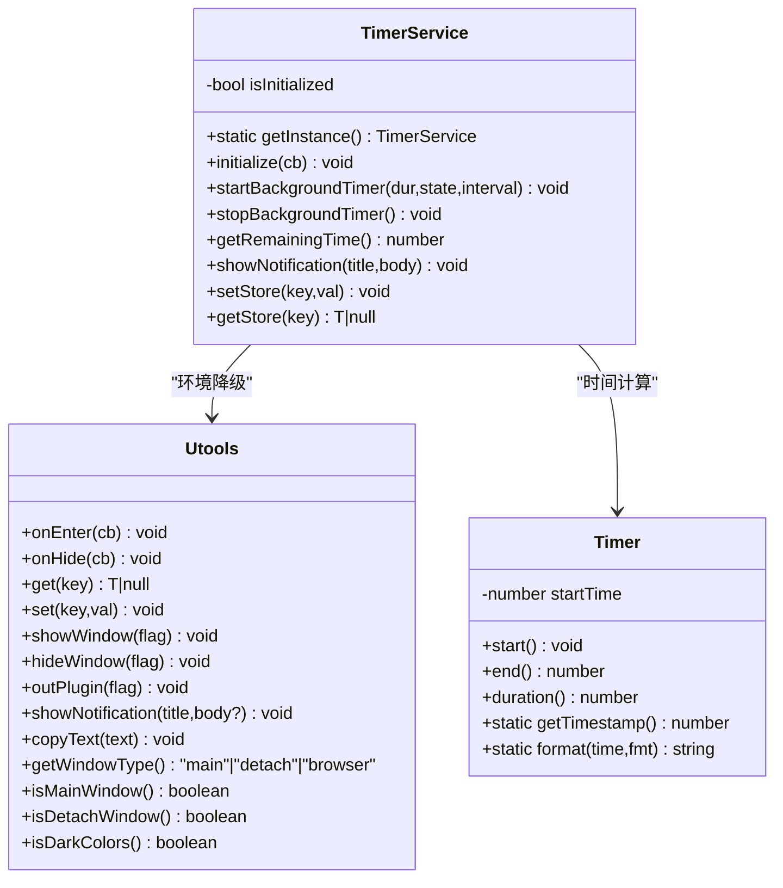
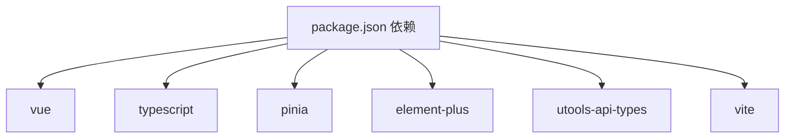

# 架构设计

<cite>
**本文引用的文件**
- [package.json](file://package.json)
- [main.ts](file://src/main.ts)
- [App.vue](file://src/App.vue)
- [plugin.json](file://public/plugin.json)
- [settings.ts](file://src/settings.ts)
- [timingStore.ts](file://src/stores/timingStore.ts)
- [settingsStore.ts](file://src/stores/settingsStore.ts)
- [statusStore.ts](file://src/stores/statusStore.ts)
- [hitokotoStore.ts](file://src/stores/hitokotoStore.ts)
- [timerService.ts](file://src/services/timerService.ts)
- [TimingCore.vue](file://src/components/TimingCore.vue)
- [timer.ts](file://src/utils/timer.ts)
- [utools.ts](file://src/utils/utools.ts)
- [index.ts](file://src/types/index.ts)
- [services.js](file://public/preload/services.js)
</cite>

## 目录
1. [引言](#引言)
2. [项目结构](#项目结构)
3. [核心组件](#核心组件)
4. [架构总览](#架构总览)
5. [详细组件分析](#详细组件分析)
6. [依赖分析](#依赖分析)
7. [性能考虑](#性能考虑)
8. [故障排查指南](#故障排查指南)
9. [结论](#结论)
10. [附录](#附录)

## 引言
本项目“休息提醒”是一个基于 Vue 3 + TypeScript + Pinia 的 uTools 插件应用，采用 MVVM 模式与单向数据流，结合组件化设计实现“专注-休息”周期的可视化计时与提醒。系统通过 Pinia 管理全局状态，通过自研 TimerService 封装后台计时与通知能力，并通过 Electron IPC 在预加载脚本中注入后台计时器与系统通知，实现跨窗口、跨会话的稳定提醒。

## 项目结构
项目采用典型的前端单页应用结构，按职责划分为表现层（Vue 组件）、业务层（服务与工具）、数据层（Pinia Store）以及插件集成层（uTools 配置与预加载脚本）。

图表来源
- [App.vue:1-145](file://src/App.vue#L1-L145)
- [TimingCore.vue:1-101](file://src/components/TimingCore.vue#L1-L101)
- [timingStore.ts:1-141](file://src/stores/timingStore.ts#L1-L141)
- [settingsStore.ts:1-87](file://src/stores/settingsStore.ts#L1-L87)
- [statusStore.ts:1-46](file://src/stores/statusStore.ts#L1-L46)
- [hitokotoStore.ts:1-72](file://src/stores/hitokotoStore.ts#L1-L72)
- [timerService.ts:1-161](file://src/services/timerService.ts#L1-L161)
- [utools.ts:1-165](file://src/utils/utools.ts#L1-L165)
- [timer.ts:1-66](file://src/utils/timer.ts#L1-L66)
- [plugin.json:1-25](file://public/plugin.json#L1-L25)
- [services.js:1-102](file://public/preload/services.js#L1-L102)

章节来源
- [package.json:1-23](file://package.json#L1-L23)
- [main.ts:1-19](file://src/main.ts#L1-L19)
- [plugin.json:1-25](file://public/plugin.json#L1-L25)

## 核心组件
- 表现层（Vue 组件）
  - App.vue：应用根组件，负责初始化设置、启动后台计时、监听 uTools 生命周期事件、调度状态与通知。
  - TimingCore.vue：计时核心 UI，展示仪表盘进度与剩余时间，绑定到 timingStore。
- 业务层（服务与工具）
  - timerService.ts：封装后台计时、通知、存储访问，提供统一接口并兼容不同运行环境。
  - utools.ts：对 uTools API 的统一封装，提供事件、存储、窗口控制、通知等能力。
  - timer.ts：通用时间工具，提供格式化与计时辅助。
- 数据层（状态管理）
  - timingStore.ts：专注/休息状态、计时器生命周期、轮次累计时间等。
  - settingsStore.ts：用户设置持久化与默认值管理。
  - statusStore.ts：操作面板状态与窗口可见性。
  - hitokotoStore.ts：一言内容获取与节流控制。
- 插件集成层
  - plugin.json：uTools 插件元数据与入口配置。
  - preload/services.js：Electron 预加载脚本，注入后台计时器与系统通知能力。

章节来源
- [App.vue:1-145](file://src/App.vue#L1-L145)
- [TimingCore.vue:1-101](file://src/components/TimingCore.vue#L1-L101)
- [timerService.ts:1-161](file://src/services/timerService.ts#L1-L161)
- [utools.ts:1-165](file://src/utils/utools.ts#L1-L165)
- [timer.ts:1-66](file://src/utils/timer.ts#L1-L66)
- [timingStore.ts:1-141](file://src/stores/timingStore.ts#L1-L141)
- [settingsStore.ts:1-87](file://src/stores/settingsStore.ts#L1-L87)
- [statusStore.ts:1-46](file://src/stores/statusStore.ts#L1-L46)
- [hitokotoStore.ts:1-72](file://src/stores/hitokotoStore.ts#L1-L72)
- [plugin.json:1-25](file://public/plugin.json#L1-L25)
- [services.js:1-102](file://public/preload/services.js#L1-L102)

## 架构总览
系统采用 MVVM 模式与单向数据流：
- Model：Pinia Store（timingStore、settingsStore、statusStore、hitokotoStore）承载应用状态与业务规则。
- View：Vue 组件树，响应式绑定 Store 状态，渲染 UI。
- ViewModel：通过 Vue 3 Composition API 与 Pinia getters/actions 实现视图行为与状态同步。
- 单向数据流：UI 变化通过 actions 修改 Store；Store 通过响应式更新驱动 UI；外部事件（uTools 生命周期、后台计时结束）通过 service 回调更新 Store。

图表来源
- [App.vue:1-145](file://src/App.vue#L1-L145)
- [TimingCore.vue:1-101](file://src/components/TimingCore.vue#L1-L101)
- [timingStore.ts:1-141](file://src/stores/timingStore.ts#L1-L141)
- [settingsStore.ts:1-87](file://src/stores/settingsStore.ts#L1-L87)
- [statusStore.ts:1-46](file://src/stores/statusStore.ts#L1-L46)
- [hitokotoStore.ts:1-72](file://src/stores/hitokotoStore.ts#L1-L72)
- [timerService.ts:1-161](file://src/services/timerService.ts#L1-L161)
- [utools.ts:1-165](file://src/utils/utools.ts#L1-L165)
- [timer.ts:1-66](file://src/utils/timer.ts#L1-L66)
- [plugin.json:1-25](file://public/plugin.json#L1-L25)
- [services.js:1-102](file://public/preload/services.js#L1-L102)

## 详细组件分析

### 系统边界与组件关系
系统边界由 uTools 插件定义，入口为 plugin.json 中的 main 与 preload 字段；预加载脚本注入 window.services，提供后台计时与系统通知；渲染进程通过 timerService 统一调用。

图表来源
- [plugin.json:1-25](file://public/plugin.json#L1-L25)
- [App.vue:70-79](file://src/App.vue#L70-L79)
- [timerService.ts:59-70](file://src/services/timerService.ts#L59-L70)
- [services.js:22-37](file://public/preload/services.js#L22-L37)

章节来源
- [plugin.json:1-25](file://public/plugin.json#L1-L25)
- [services.js:1-102](file://public/preload/services.js#L1-L102)
- [timerService.ts:1-161](file://src/services/timerService.ts#L1-L161)
- [App.vue:1-145](file://src/App.vue#L1-L145)

### 计时状态机与数据流
计时状态在 focus 与 relax 之间切换，状态变化由前台或后台计时器驱动，UI 通过计算属性实时反映剩余时间与百分比。

图表来源
- [timingStore.ts:70-139](file://src/stores/timingStore.ts#L70-L139)
- [TimingCore.vue:68-89](file://src/components/TimingCore.vue#L68-L89)

章节来源
- [timingStore.ts:1-141](file://src/stores/timingStore.ts#L1-L141)
- [TimingCore.vue:1-101](file://src/components/TimingCore.vue#L1-L101)

### 一言模块与防抖策略
一言模块通过 hitokotoStore 控制获取频率与过渡动画，避免频繁请求与 UI 抖动。

图表来源
- [hitokotoStore.ts:31-69](file://src/stores/hitokotoStore.ts#L31-L69)
- [settings.ts:32-35](file://src/settings.ts#L32-L35)

章节来源
- [hitokotoStore.ts:1-72](file://src/stores/hitokotoStore.ts#L1-L72)
- [settings.ts:1-50](file://src/settings.ts#L1-L50)

### 服务与工具类
- TimerService：单例封装后台计时、通知与存储访问，具备环境降级能力。
- Utools：对 uTools API 的统一封装，提供事件、存储、窗口控制、通知等。
- Timer：通用时间工具，提供格式化与计时辅助。

图表来源
- [timerService.ts:24-160](file://src/services/timerService.ts#L24-L160)
- [utools.ts:13-164](file://src/utils/utools.ts#L13-L164)
- [timer.ts:5-65](file://src/utils/timer.ts#L5-L65)

章节来源
- [timerService.ts:1-161](file://src/services/timerService.ts#L1-L161)
- [utools.ts:1-165](file://src/utils/utools.ts#L1-L165)
- [timer.ts:1-66](file://src/utils/timer.ts#L1-L66)

## 依赖分析
- 技术栈与版本
  - Vue 3：组件化与响应式系统
  - TypeScript：类型安全与开发体验
  - Pinia：轻量级状态管理
  - Element Plus：UI 组件库
  - uTools API Types：插件开发类型声明
  - Vite：构建与开发服务器
- 关键依赖关系
  - main.ts 创建应用并挂载 Pinia，引入 Element Plus。
  - App.vue 作为根组件，协调 Store、Service 与组件树。
  - timerService 依赖预加载注入的服务接口，实现后台计时与通知。
  - settingsStore 依赖 utools.dbStorage 进行持久化。

图表来源
- [package.json:8-21](file://package.json#L8-L21)

章节来源
- [package.json:1-23](file://package.json#L1-L23)
- [main.ts:1-19](file://src/main.ts#L1-L19)

## 性能考虑
- 计时精度与功耗
  - 前台计时使用高优先级（短间隔）与低优先级（长间隔）动态切换，减少 CPU 占用。
  - 后台计时通过预加载脚本的定时器实现，避免渲染进程阻塞。
- 网络与 UI
  - 一言获取增加节流限制，避免频繁请求与 UI 抖动。
  - 使用过渡动画与延迟切换，提升视觉体验。
- 存储与初始化
  - 设置加载与默认值合并，减少首次渲染等待。
  - 自动开始计时选项按用户偏好启用，避免不必要的计时器启动。

## 故障排查指南
- 后台计时未生效
  - 检查预加载脚本是否正确注入 window.services。
  - 确认 timerService.initialize 是否被调用且 hasBackgroundSupport 为真。
- 通知不显示
  - 确认 services.js 中 Notification 是否可用。
  - 若无后台支持，检查 utools.showNotification 降级路径。
- 设置无法持久化
  - 检查 utools.dbStorage 是否可用，确认 key 一致。
- UI 不更新
  - 确认 Store actions 正确修改状态并触发响应式更新。
  - 检查组件是否正确引用 Store 的 getter/computed。

章节来源
- [timerService.ts:52-70](file://src/services/timerService.ts#L52-L70)
- [services.js:13-101](file://public/preload/services.js#L13-L101)
- [utools.ts:96-108](file://src/utils/utools.ts#L96-L108)
- [settingsStore.ts:39-61](file://src/stores/settingsStore.ts#L39-L61)

## 结论
本项目通过 Vue 3 + TypeScript + Pinia 的组合实现了清晰的 MVVM 架构与单向数据流，配合 uTools 插件与 Electron IPC 的后台计时能力，提供了稳定可靠的“休息提醒”体验。系统在组件化设计、状态管理、服务抽象与插件集成方面均体现出良好的可扩展性与可维护性，便于后续功能拓展与团队协作。

## 附录
- 设计模式应用
  - 观察者模式：通过 Pinia Store 的响应式与 Vue 组件的订阅实现状态变更通知。
  - 单例模式：TimerService 保证全局唯一的服务实例与统一的后台计时接口。
  - 工厂模式：utools.ts 对不同运行环境的 API 进行封装，提供统一调用入口。
- 类型体系
  - types/index.ts 定义了计时状态、用户设置、面板类型、事件映射与计时器状态等核心类型，确保跨模块一致性。

章节来源
- [index.ts:1-83](file://src/types/index.ts#L1-L83)