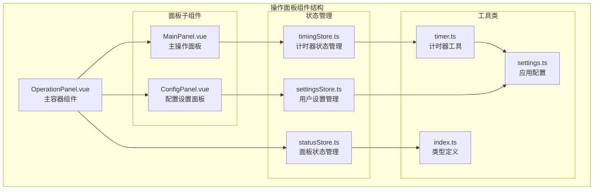
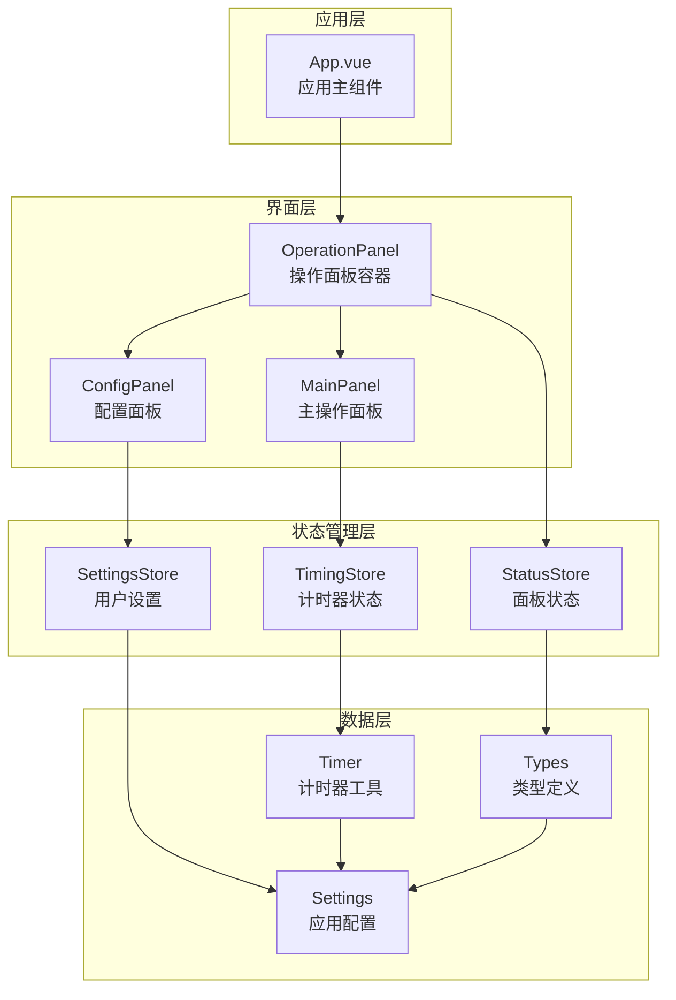
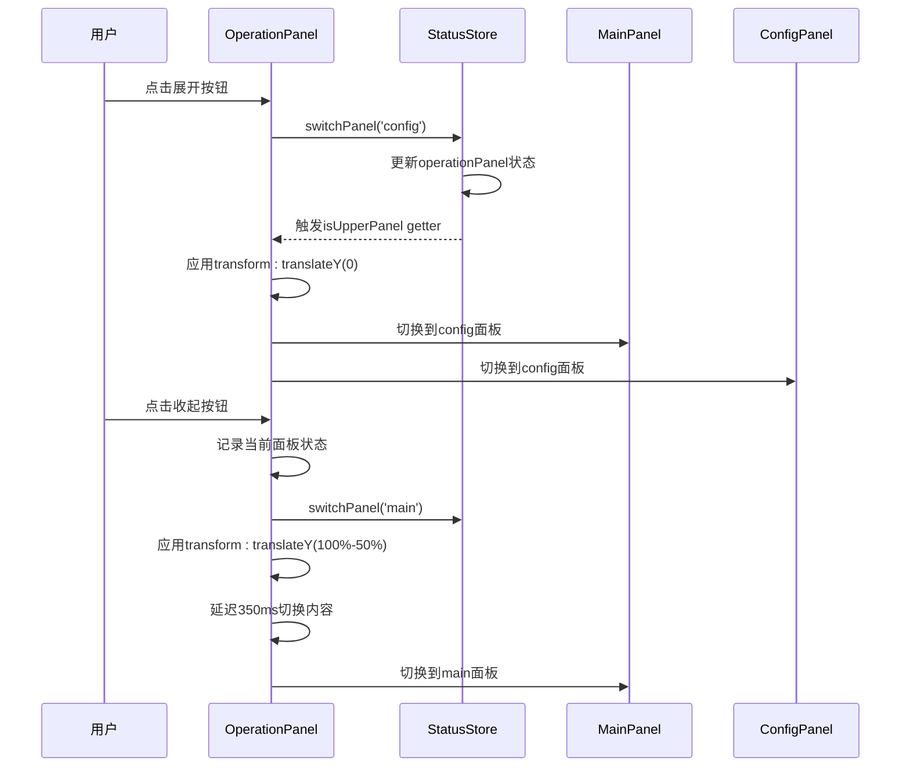
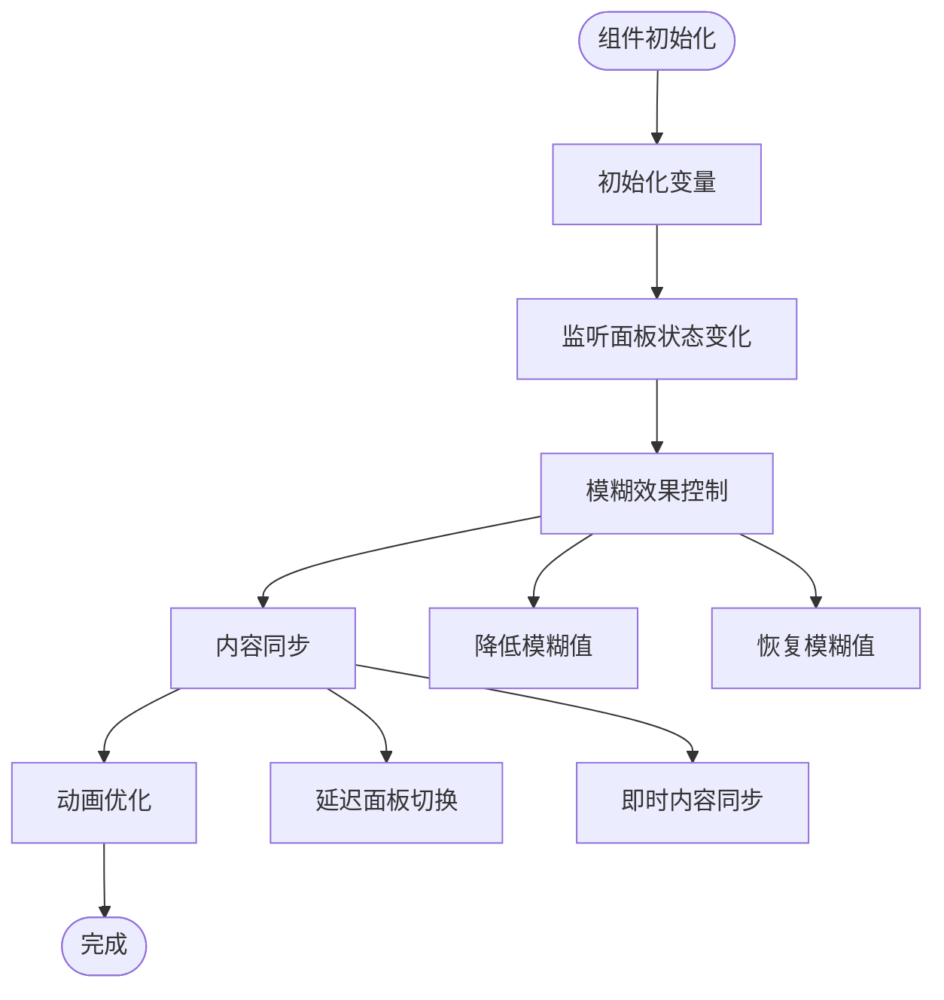
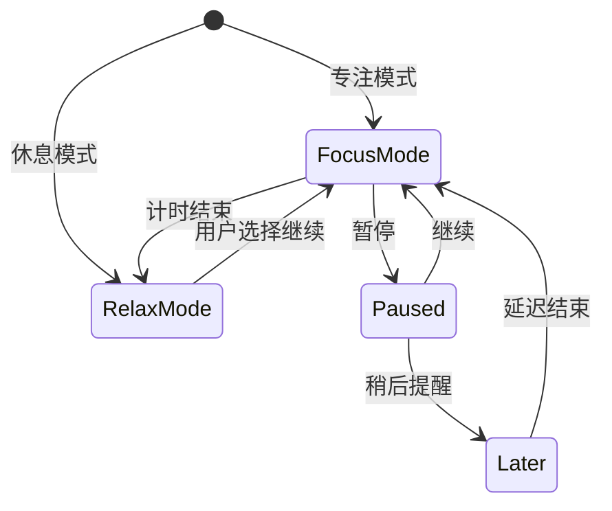
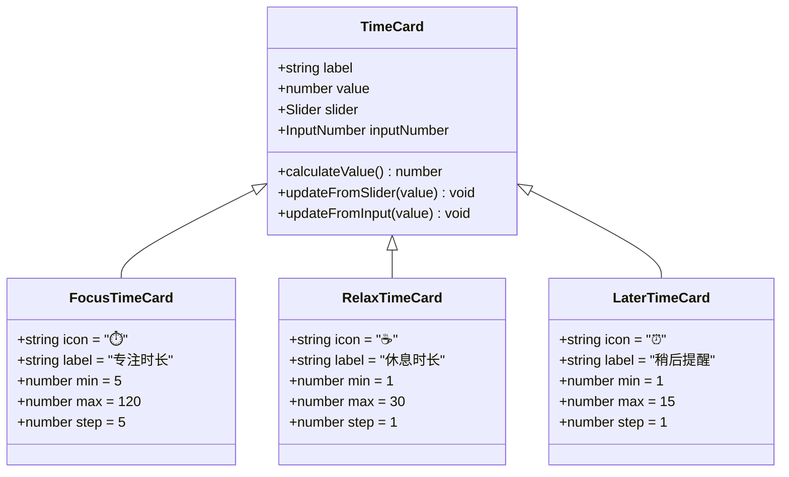
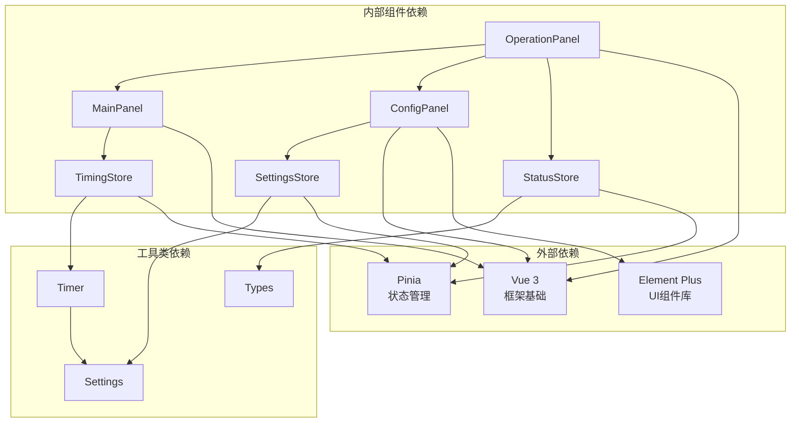
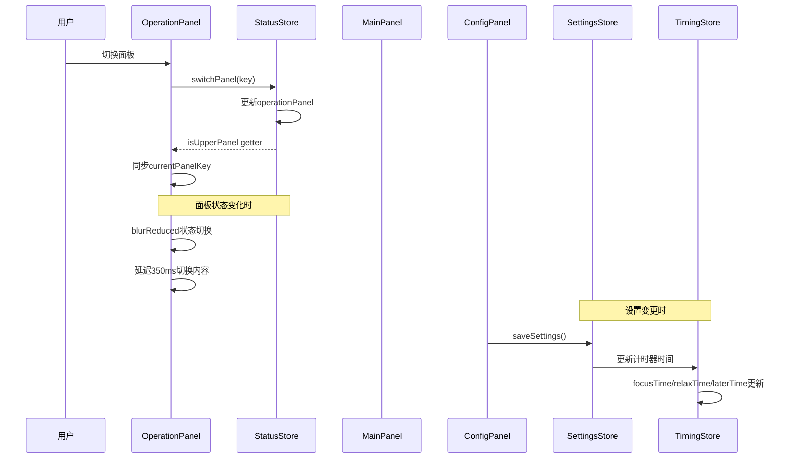

# 操作面板组件

<cite>
**本文档引用的文件**
- [OperationPanel.vue](file://src/components/operationPanel/OperationPanel.vue)
- [MainPanel.vue](file://src/components/operationPanel/MainPanel.vue)
- [ConfigPanel.vue](file://src/components/operationPanel/ConfigPanel.vue)
- [statusStore.ts](file://src/stores/statusStore.ts)
- [settingsStore.ts](file://src/stores/settingsStore.ts)
- [timingStore.ts](file://src/stores/timingStore.ts)
- [index.ts](file://src/types/index.ts)
- [settings.ts](file://src/settings.ts)
- [timer.ts](file://src/utils/timer.ts)
- [App.vue](file://src/App.vue)
</cite>

## 目录
1. [简介](#简介)
2. [项目结构](#项目结构)
3. [核心组件](#核心组件)
4. [架构概览](#架构概览)
5. [详细组件分析](#详细组件分析)
6. [依赖关系分析](#依赖关系分析)
7. [性能考虑](#性能考虑)
8. [故障排除指南](#故障排除指南)
9. [结论](#结论)

## 简介

操作面板组件是"休息提醒"项目中的核心交互界面，采用可展开/收起的设计模式，提供主面板和配置面板两个主要功能区域。该组件实现了流畅的动画效果、响应式布局和完整的用户交互体验，支持专注工作与休息提醒的智能切换。

## 项目结构

操作面板组件位于 `src/components/operationPanel/` 目录下，采用模块化的组件设计：

**图表来源**
- [OperationPanel.vue:1-180](file://src/components/operationPanel/OperationPanel.vue#L1-L180)
- [MainPanel.vue:1-82](file://src/components/operationPanel/MainPanel.vue#L1-L82)
- [ConfigPanel.vue:1-378](file://src/components/operationPanel/ConfigPanel.vue#L1-L378)

**章节来源**
- [OperationPanel.vue:1-180](file://src/components/operationPanel/OperationPanel.vue#L1-L180)
- [App.vue:40-41](file://src/App.vue#L40-L41)

## 核心组件

操作面板系统由三个核心组件构成，每个组件都有明确的职责分工：

### OperationPanel 主容器组件
- **职责**: 作为整个操作面板的容器，负责面板的展开/收起控制、动画管理和状态同步
- **特性**: 实现了基于 transform 的高性能动画、模糊背景效果和面板内容的淡入淡出切换
- **关键功能**: 面板状态管理、动画控制、内容面板切换

### MainPanel 主操作面板
- **职责**: 提供主要的操作入口，包括计时控制、状态切换等功能
- **功能**: 结束计时、暂停/继续计时、稍后提醒等核心操作
- **交互**: 基于图标按钮的直观操作界面

### ConfigPanel 配置面板
- **职责**: 提供用户配置界面，允许自定义计时参数和功能开关
- **功能**: 时间设置、功能开关、设置保存和重置
- **界面**: 采用卡片式设计，支持响应式网格布局

**章节来源**
- [OperationPanel.vue:128-180](file://src/components/operationPanel/OperationPanel.vue#L128-L180)
- [MainPanel.vue:71-82](file://src/components/operationPanel/MainPanel.vue#L71-L82)
- [ConfigPanel.vue:342-378](file://src/components/operationPanel/ConfigPanel.vue#L342-L378)

## 架构概览

操作面板采用了清晰的分层架构设计，实现了组件间的有效解耦：

**图表来源**
- [App.vue:141-144](file://src/App.vue#L141-L144)
- [OperationPanel.vue:177-178](file://src/components/operationPanel/OperationPanel.vue#L177-L178)
- [statusStore.ts:22-45](file://src/stores/statusStore.ts#L22-L45)

## 详细组件分析

### OperationPanel 组件深度解析

#### 展开/收起机制实现

操作面板的核心创新在于其独特的展开/收起机制，通过 transform 属性实现高性能动画：

**图表来源**
- [OperationPanel.vue:143-154](file://src/components/operationPanel/OperationPanel.vue#L143-L154)
- [statusStore.ts:35-43](file://src/stores/statusStore.ts#L35-L43)

#### 动画效果设计

组件实现了多层次的动画效果，确保流畅的用户体验：

| 动画类型 | 实现方式 | 持续时间 | 缓动函数 |
|---------|----------|----------|----------|
| 面板展开/收起 | transform: translateY | 350ms | cubic-bezier(0.16, 1, 0.3, 1) |
| 模糊效果变化 | backdrop-filter | 350ms | cubic-bezier(0.16, 1, 0.3, 1) |
| 内容面板切换 | opacity + transform | 250ms | cubic-bezier(0.16, 1, 0.3, 1) |
| 悬停效果 | 所有元素 | 250ms | cubic-bezier(0.16, 1, 0.3, 1) |

#### 性能优化策略

**图表来源**
- [OperationPanel.vue:156-174](file://src/components/operationPanel/OperationPanel.vue#L156-L174)

**章节来源**
- [OperationPanel.vue:128-180](file://src/components/operationPanel/OperationPanel.vue#L128-L180)

### MainPanel 主面板功能分析

#### 操作按钮设计

主面板提供了四个核心操作按钮，每个按钮都有明确的功能定位：

| 按钮 | 图标 | 功能 | 条件显示 | 颜色主题 |
|------|------|------|----------|----------|
| 结束计时 | ⏱️ | 结束当前计时周期 | 始终显示 | 绿色 (#37a70f) |
| 暂停/继续 | ⏸️/▶️ | 控制计时器运行状态 | 根据计时状态切换 | 红色 (#c24645) |
| 稍后提醒 | ⏰ | 延迟提醒功能 | 始终显示 | 蓝色 (#114fff) |

#### 交互逻辑实现

**图表来源**
- [MainPanel.vue:43-65](file://src/components/operationPanel/MainPanel.vue#L43-L65)
- [timingStore.ts:122-138](file://src/stores/timingStore.ts#L122-L138)

**章节来源**
- [MainPanel.vue:39-82](file://src/components/operationPanel/MainPanel.vue#L39-L82)

### ConfigPanel 配置面板详解

#### 时间设置区域

配置面板的核心功能是时间设置，采用卡片式设计提供直观的配置界面：

**图表来源**
- [ConfigPanel.vue:249-301](file://src/components/operationPanel/ConfigPanel.vue#L249-L301)

#### 功能开关区域

配置面板还提供了两个重要的功能开关：

| 功能开关 | 键名 | 默认值 | 描述 |
|----------|------|--------|------|
| 显示一言 | hitokotoEnabled | true | 在界面上展示随机语录 |
| 自动开始 | autoStartTiming | true | 打开插件后自动开始计时 |

**章节来源**
- [ConfigPanel.vue:242-378](file://src/components/operationPanel/ConfigPanel.vue#L242-L378)

## 依赖关系分析

操作面板组件之间的依赖关系体现了清晰的分层架构：

**图表来源**
- [OperationPanel.vue:177-178](file://src/components/operationPanel/OperationPanel.vue#L177-L178)
- [MainPanel.vue:79-80](file://src/components/operationPanel/MainPanel.vue#L79-L80)
- [ConfigPanel.vue:372-373](file://src/components/operationPanel/ConfigPanel.vue#L372-L373)

### 状态同步机制

操作面板实现了多层级的状态同步机制：

**图表来源**
- [OperationPanel.vue:156-174](file://src/components/operationPanel/OperationPanel.vue#L156-L174)
- [statusStore.ts:35-43](file://src/stores/statusStore.ts#L35-L43)
- [ConfigPanel.vue:349-358](file://src/components/operationPanel/ConfigPanel.vue#L349-L358)

**章节来源**
- [statusStore.ts:22-45](file://src/stores/statusStore.ts#L22-L45)
- [settingsStore.ts:35-85](file://src/stores/settingsStore.ts#L35-L85)

## 性能考虑

操作面板在设计时充分考虑了性能优化，采用了多项技术手段：

### GPU加速优化
- 使用 `transform` 替代 `height` 动画，避免重排和重绘
- 启用 `will-change: transform` 提示浏览器进行优化
- 使用 `backface-visibility: hidden` 强制 GPU 加速

### 动画性能优化
- 所有动画使用 `cubic-bezier` 缓动函数，确保流畅性
- 模糊效果在动画过程中动态调整，平衡视觉效果和性能
- 内容面板切换使用 `opacity` 和 `transform` 组合，避免布局计算

### 内存管理
- 面板内容始终渲染但通过 `pointer-events` 控制交互
- 使用 `setTimeout` 延迟切换内容，避免不必要的状态更新
- 合理的组件销毁和清理机制

## 故障排除指南

### 常见问题及解决方案

#### 面板无法展开/收起
**问题描述**: 点击展开按钮无响应
**可能原因**:
- 状态管理异常
- CSS 样式冲突
- 事件绑定失效

**解决步骤**:
1. 检查 `statusStore.isUpperPanel` 状态
2. 验证 CSS 类名 `expanded` 是否正确应用
3. 确认点击事件绑定正常

#### 动画效果异常
**问题描述**: 动画卡顿或不流畅
**可能原因**:
- GPU 加速未生效
- 过多的 DOM 操作
- 样式计算复杂

**解决步骤**:
1. 检查 `transform` 属性是否正确
2. 验证 `will-change` 属性设置
3. 减少不必要的样式计算

#### 设置保存失败
**问题描述**: 配置更改后重启无效
**可能原因**:
- 存储机制异常
- 数据类型不匹配
- 异步操作未完成

**解决步骤**:
1. 检查本地存储状态
2. 验证数据序列化/反序列化
3. 确认异步操作完成

**章节来源**
- [OperationPanel.vue:143-154](file://src/components/operationPanel/OperationPanel.vue#L143-L154)
- [settingsStore.ts:39-48](file://src/stores/settingsStore.ts#L39-L48)

## 结论

操作面板组件展现了优秀的前端架构设计，通过以下关键特性实现了卓越的用户体验：

### 设计优势
- **高性能动画**: 基于 transform 的动画系统，确保流畅的用户体验
- **清晰的职责分离**: 主面板专注于操作，配置面板专注于设置，职责明确
- **智能状态管理**: 通过 Pinia 实现状态的集中管理和自动同步
- **响应式设计**: 支持不同屏幕尺寸的自适应布局

### 技术亮点
- 创新的展开/收起机制，避免了复杂的 DOM 操作
- 多层次的动画效果，营造丰富的视觉体验
- 完善的性能优化策略，确保在各种设备上的流畅运行
- 灵活的配置系统，支持用户个性化定制

### 扩展性考虑
该组件架构为未来的功能扩展提供了良好的基础，可以轻松添加新的面板类型、配置选项和交互功能。通过模块化的组件设计和清晰的接口定义，开发者可以方便地进行功能增强和定制化开发。