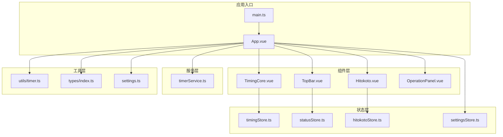
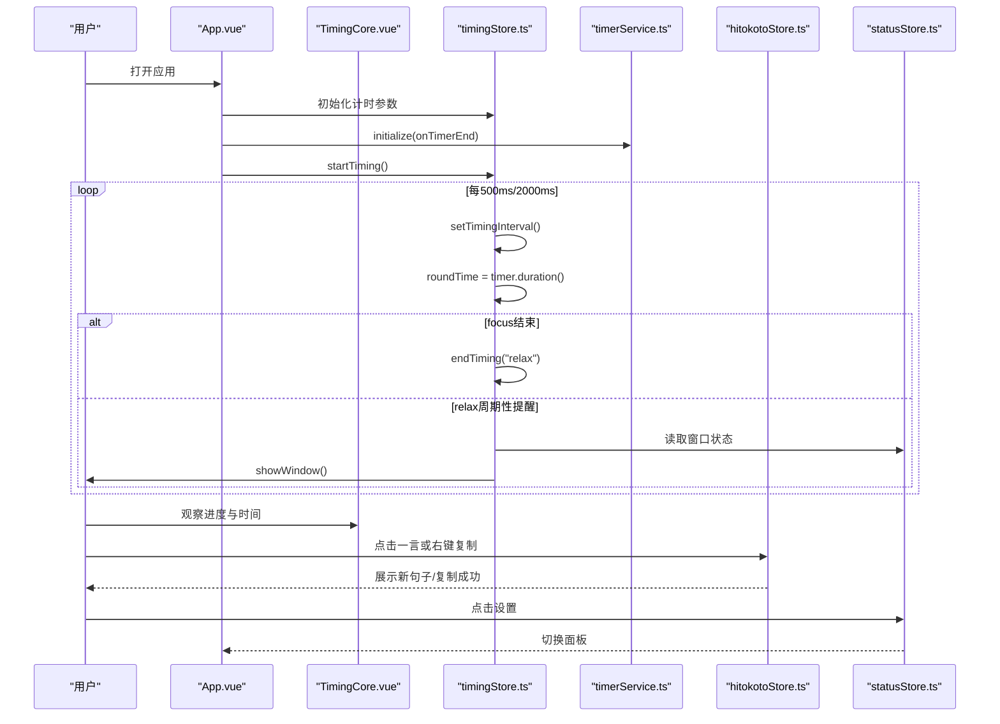
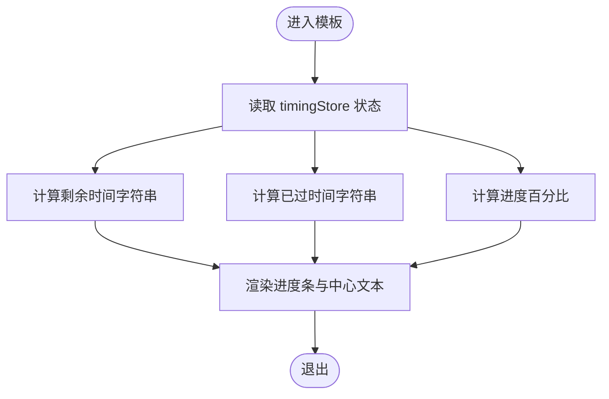
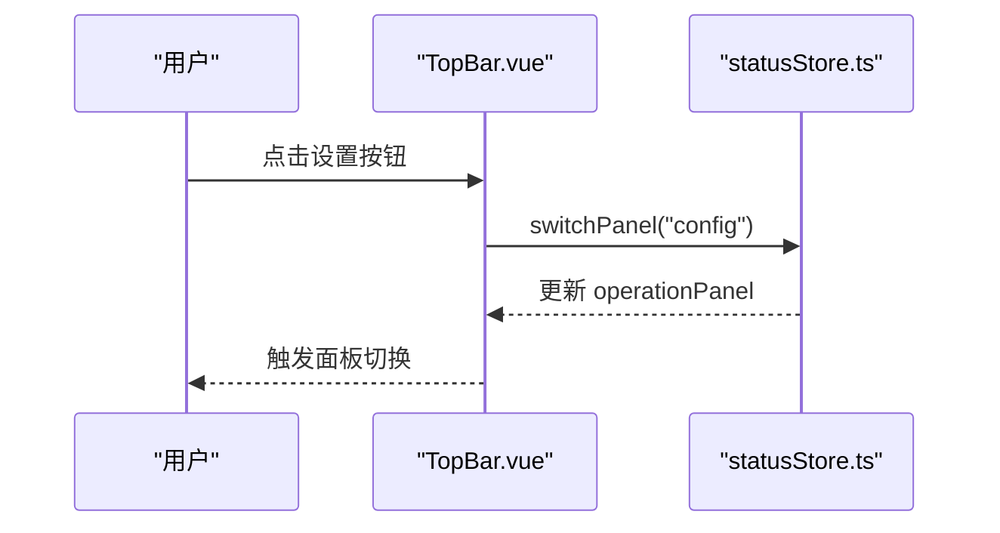
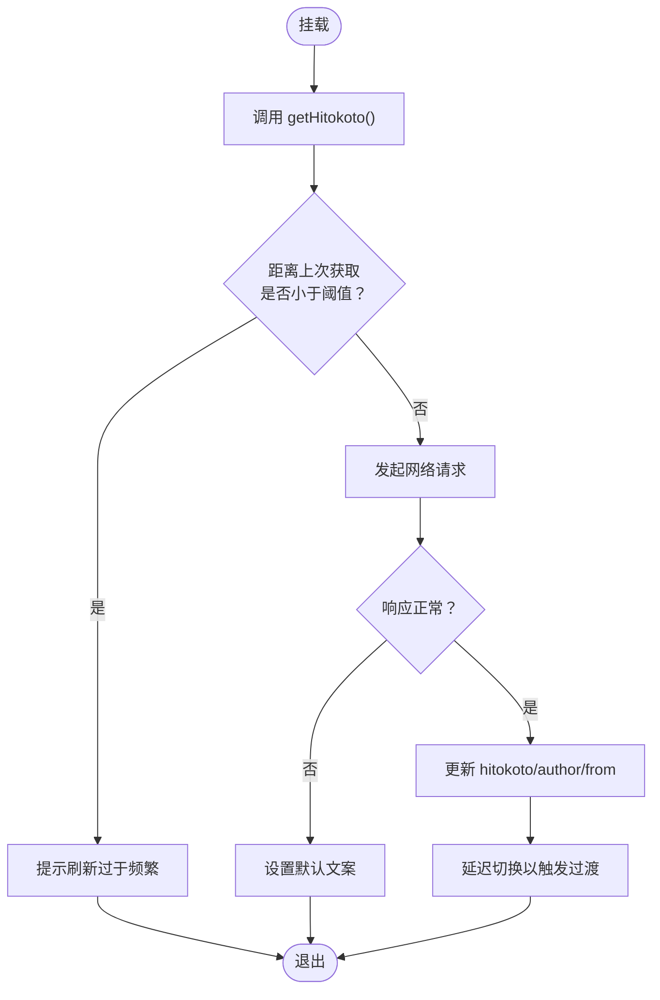
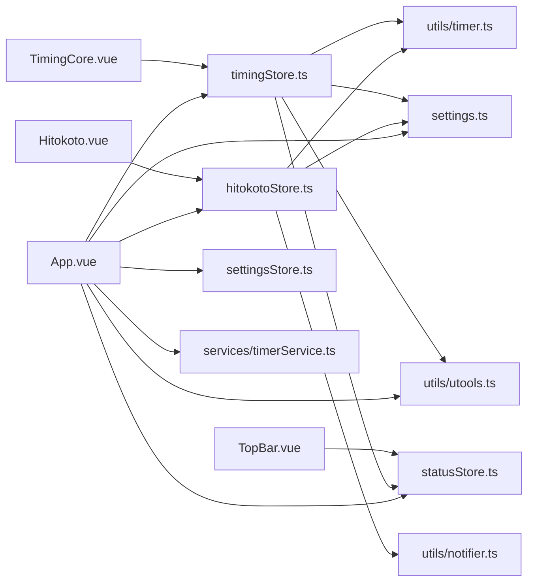

# 核心功能组件

<cite>
**本文引用的文件**
- [src/components/TimingCore.vue](file://src/components/TimingCore.vue)
- [src/components/TopBar.vue](file://src/components/TopBar.vue)
- [src/components/Hitokoto.vue](file://src/components/Hitokoto.vue)
- [src/stores/timingStore.ts](file://src/stores/timingStore.ts)
- [src/stores/statusStore.ts](file://src/stores/statusStore.ts)
- [src/stores/hitokotoStore.ts](file://src/stores/hitokotoStore.ts)
- [src/stores/settingsStore.ts](file://src/stores/settingsStore.ts)
- [src/services/timerService.ts](file://src/services/timerService.ts)
- [src/utils/timer.ts](file://src/utils/timer.ts)
- [src/types/index.ts](file://src/types/index.ts)
- [src/settings.ts](file://src/settings.ts)
- [src/App.vue](file://src/App.vue)
- [src/main.ts](file://src/main.ts)
</cite>

## 目录
1. [简介](#简介)
2. [项目结构](#项目结构)
3. [核心组件](#核心组件)
4. [架构总览](#架构总览)
5. [详细组件分析](#详细组件分析)
6. [依赖关系分析](#依赖关系分析)
7. [性能考量](#性能考量)
8. [故障排查指南](#故障排查指南)
9. [结论](#结论)
10. [附录](#附录)

## 简介
本文件聚焦“休息提醒”项目的三个核心功能组件：TimingCore（计时核心组件，负责圆形进度条显示与计时逻辑）、TopBar（顶部栏组件，提供应用控制与状态显示）、Hitokoto（一言展示组件，显示每日一句）。文档从职责边界、API 接口、内部实现细节、状态管理、事件处理与用户交互等方面进行深入解析，并给出可复用性与扩展性建议、使用示例与最佳实践。

## 项目结构
项目采用 Vue 3 + Pinia 的前端架构，结合 Element Plus UI 组件库与自研工具模块，围绕“计时”“状态”“设置”“服务”四个维度组织代码：
- 组件层：TimingCore、TopBar、Hitokoto 及操作面板等
- 状态层：timingStore、statusStore、hitokotoStore、settingsStore
- 服务层：timerService（封装后台计时与通知）
- 工具层：timer（时间格式化与计时）、utools（平台能力封装）、notifier（消息提示）
- 类型定义：types/index.ts
- 全局配置：settings.ts

图表来源
- [src/main.ts:1-19](file://src/main.ts#L1-L19)
- [src/App.vue:1-145](file://src/App.vue#L1-L145)
- [src/components/TimingCore.vue:1-101](file://src/components/TimingCore.vue#L1-L101)
- [src/components/TopBar.vue:1-49](file://src/components/TopBar.vue#L1-L49)
- [src/components/Hitokoto.vue:1-79](file://src/components/Hitokoto.vue#L1-L79)
- [src/stores/timingStore.ts:1-141](file://src/stores/timingStore.ts#L1-L141)
- [src/stores/statusStore.ts:1-46](file://src/stores/statusStore.ts#L1-L46)
- [src/stores/hitokotoStore.ts:1-72](file://src/stores/hitokotoStore.ts#L1-L72)
- [src/stores/settingsStore.ts:1-87](file://src/stores/settingsStore.ts#L1-L87)
- [src/services/timerService.ts:1-161](file://src/services/timerService.ts#L1-L161)
- [src/utils/timer.ts:1-66](file://src/utils/timer.ts#L1-L66)
- [src/types/index.ts:1-83](file://src/types/index.ts#L1-L83)
- [src/settings.ts:1-50](file://src/settings.ts#L1-L50)

章节来源
- [src/main.ts:1-19](file://src/main.ts#L1-L19)
- [src/App.vue:1-145](file://src/App.vue#L1-L145)

## 核心组件
本节概述三个核心组件的职责与协作方式：
- TimingCore：渲染圆形进度条与中心文本，根据当前计时状态动态更新颜色、百分比与剩余/已过时间。
- TopBar：提供设置入口按钮，通过状态管理切换上层面板。
- Hitokoto：展示每日一句及其作者，支持点击切换与右键复制，具备防抖与错误兜底。

章节来源
- [src/components/TimingCore.vue:1-101](file://src/components/TimingCore.vue#L1-L101)
- [src/components/TopBar.vue:1-49](file://src/components/TopBar.vue#L1-L49)
- [src/components/Hitokoto.vue:1-79](file://src/components/Hitokoto.vue#L1-L79)

## 架构总览
下图展示了组件与状态之间的交互关系，以及计时流程的关键节点。

图表来源
- [src/App.vue:56-114](file://src/App.vue#L56-L114)
- [src/stores/timingStore.ts:75-131](file://src/stores/timingStore.ts#L75-L131)
- [src/services/timerService.ts:59-70](file://src/services/timerService.ts#L59-L70)
- [src/stores/hitokotoStore.ts:31-69](file://src/stores/hitokotoStore.ts#L31-L69)
- [src/stores/statusStore.ts:35-43](file://src/stores/statusStore.ts#L35-L43)

## 详细组件分析

### TimingCore 组件
- 职责边界
  - 负责圆形进度条与中心文本的渲染，不直接管理计时逻辑，仅消费状态。
  - 通过计算属性将状态转换为 UI 展示所需的数据（百分比、剩余/已过时间）。
- 关键接口与实现
  - 计算属性：restTimeStr、relaxTimeStr、focusPercentage、relaxPercentage。
  - 依赖：timingStore（状态）、settings（时间单位）、Timer（格式化）。
  - 样式：基于 isFocus/isRelax 动态切换背景色与进度条颜色。
- 状态管理
  - 读取 timingStore 的 isFocus、passTime、restTime、focusTime、relaxTime。
  - 通过 computed 实现响应式更新，避免在模板中重复计算。
- 事件与交互
  - 作为纯展示组件，无直接交互；交互由上层控制（如设置面板）。
- 可复用性与扩展性
  - 通过注入 store 与工具类解耦，便于替换主题或样式。
  - 可扩展为多状态（如 break、longBreak）时，只需扩展状态枚举与计算属性。
- 使用示例与最佳实践
  - 在 App.vue 中直接引入并放置于页面中央。
  - 注意在窗口进入/隐藏时调整计时精度（见 App.vue 的 onEnter/onHide）。

图表来源
- [src/components/TimingCore.vue:68-89](file://src/components/TimingCore.vue#L68-L89)
- [src/stores/timingStore.ts:43-67](file://src/stores/timingStore.ts#L43-L67)

章节来源
- [src/components/TimingCore.vue:1-101](file://src/components/TimingCore.vue#L1-L101)
- [src/stores/timingStore.ts:1-141](file://src/stores/timingStore.ts#L1-L141)
- [src/utils/timer.ts:1-66](file://src/utils/timer.ts#L1-L66)
- [src/settings.ts:1-50](file://src/settings.ts#L1-L50)

### TopBar 组件
- 职责边界
  - 提供顶部控制入口（当前为“设置”按钮），不承担业务逻辑。
- 关键接口与实现
  - 点击事件：调用 statusStore.switchPanel("config") 切换面板。
  - 样式：悬停缩放、绝对定位与层级管理。
- 状态管理
  - 依赖 statusStore 控制面板状态，影响 App.vue 的渲染分支。
- 事件与交互
  - 左键点击打开设置面板；右键无交互。
- 可复用性与扩展性
  - 可扩展更多控制项（暂停/继续、稍后提醒等），通过事件或状态驱动。
- 使用示例与最佳实践
  - 保持固定位置与层级，确保不被上层面板遮挡。
  - 与 App.vue 的 isUpperPanel 条件渲染配合使用。

图表来源
- [src/components/TopBar.vue:27-33](file://src/components/TopBar.vue#L27-L33)
- [src/stores/statusStore.ts:35-43](file://src/stores/statusStore.ts#L35-L43)

章节来源
- [src/components/TopBar.vue:1-49](file://src/components/TopBar.vue#L1-L49)
- [src/stores/statusStore.ts:1-46](file://src/stores/statusStore.ts#L1-L46)

### Hitokoto 组件
- 职责边界
  - 展示每日一句及其作者，支持点击切换与右键复制。
- 关键接口与实现
  - 生命周期：onMounted 自动拉取一次数据。
  - 交互：左键点击刷新，右键复制到剪贴板；过渡动画提升体验。
  - 防抖：限制刷新频率，避免频繁请求。
  - 错误兜底：网络异常时显示默认文案。
- 状态管理
  - 依赖 hitokotoStore 管理 hitokoto、author、from、lastGetTime。
- 事件与交互
  - @click.left：触发 getHitokoto(true, true)，带提示与延迟切换。
  - @click.right：复制当前句子。
- 可复用性与扩展性
  - 可扩展为多来源（不同 API）、多分类（动漫/文学/影视等）。
  - 支持更多交互（收藏、分享、夜间模式等）。
- 使用示例与最佳实践
  - 与 App.vue 的条件渲染配合，避免在设置面板时显示。
  - 通过 settingsStore 控制开关，减少不必要的网络请求。

图表来源
- [src/components/Hitokoto.vue:65-67](file://src/components/Hitokoto.vue#L65-L67)
- [src/stores/hitokotoStore.ts:31-69](file://src/stores/hitokotoStore.ts#L31-L69)

章节来源
- [src/components/Hitokoto.vue:1-79](file://src/components/Hitokoto.vue#L1-L79)
- [src/stores/hitokotoStore.ts:1-72](file://src/stores/hitokotoStore.ts#L1-L72)

## 依赖关系分析
- 组件到状态层
  - TimingCore 依赖 timingStore 的状态与计算属性。
  - TopBar 依赖 statusStore 的面板状态。
  - Hitokoto 依赖 hitokotoStore 的数据与动作。
- 状态层到工具层
  - timingStore 使用 Timer、settings、utools、statusStore。
  - hitokotoStore 使用 Timer、settings、Message。
  - settingsStore 使用 settings、utools。
  - App.vue 使用 settings、timerService、utools、各 store。
- 服务层
  - timerService 封装后台计时与通知，提供跨环境兼容方案。

图表来源
- [src/components/TimingCore.vue:92-99](file://src/components/TimingCore.vue#L92-L99)
- [src/components/TopBar.vue:43-47](file://src/components/TopBar.vue#L43-L47)
- [src/components/Hitokoto.vue:69-78](file://src/components/Hitokoto.vue#L69-L78)
- [src/stores/timingStore.ts:1-7](file://src/stores/timingStore.ts#L1-L7)
- [src/stores/hitokotoStore.ts:1-6](file://src/stores/hitokotoStore.ts#L1-L6)
- [src/stores/settingsStore.ts:1-5](file://src/stores/settingsStore.ts#L1-L5)
- [src/App.vue:121-137](file://src/App.vue#L121-L137)
- [src/services/timerService.ts:1-18](file://src/services/timerService.ts#L1-L18)

章节来源
- [src/stores/timingStore.ts:1-141](file://src/stores/timingStore.ts#L1-L141)
- [src/stores/statusStore.ts:1-46](file://src/stores/statusStore.ts#L1-L46)
- [src/stores/hitokotoStore.ts:1-72](file://src/stores/hitokotoStore.ts#L1-L72)
- [src/stores/settingsStore.ts:1-87](file://src/stores/settingsStore.ts#L1-L87)
- [src/services/timerService.ts:1-161](file://src/services/timerService.ts#L1-L161)
- [src/utils/timer.ts:1-66](file://src/utils/timer.ts#L1-L66)
- [src/types/index.ts:1-83](file://src/types/index.ts#L1-L83)
- [src/settings.ts:1-50](file://src/settings.ts#L1-L50)
- [src/App.vue:1-145](file://src/App.vue#L1-L145)

## 性能考量
- 计时精度与资源占用
  - App.vue 在窗口隐藏时降低计时轮询频率（从 500ms 升级至 2000ms），减少 CPU 占用。
  - timingStore 的 setTimingInterval 会清理旧定时器，避免内存泄漏。
- 网络请求与防抖
  - hitokotoStore 对请求频率进行限制，避免频繁网络请求导致性能下降。
- 渲染优化
  - 使用 computed 缓存计算结果，减少重复渲染。
  - Transition 组件用于平滑切换，避免闪烁。
- 存储与持久化
  - settingsStore 使用本地存储持久化用户设置，避免每次启动重新加载。

章节来源
- [src/App.vue:94-106](file://src/App.vue#L94-L106)
- [src/stores/timingStore.ts:75-92](file://src/stores/timingStore.ts#L75-L92)
- [src/stores/hitokotoStore.ts:31-39](file://src/stores/hitokotoStore.ts#L31-L39)

## 故障排查指南
- 计时不生效或异常
  - 检查 App.vue 是否正确初始化 timerService 并启动 startTiming。
  - 确认 timingStore 的 focusTime/relaxTime 是否被 settingsStore 正确覆盖。
  - 若窗口隐藏，确认 setTimingInterval 是否被降级为 2000ms。
- 一言不显示或刷新失败
  - 检查 hitokotoStore 的 getHitokoto 是否被调用（onMounted）。
  - 查看网络请求是否被拦截或跨域限制，确认 API 域名可用。
  - 若频繁刷新报错，检查 getInterval 阈值是否合理。
- 设置面板无法切换
  - 确认 TopBar 的点击事件是否调用 statusStore.switchPanel。
  - 检查 App.vue 的 isUpperPanel 条件渲染逻辑。

章节来源
- [src/App.vue:56-114](file://src/App.vue#L56-L114)
- [src/stores/timingStore.ts:94-131](file://src/stores/timingStore.ts#L94-L131)
- [src/stores/hitokotoStore.ts:31-69](file://src/stores/hitokotoStore.ts#L31-L69)
- [src/stores/statusStore.ts:35-43](file://src/stores/statusStore.ts#L35-L43)

## 结论
TimingCore、TopBar、Hitokoto 三者分工明确：计时核心负责可视化与状态消费，顶部栏提供控制入口，一言组件负责信息展示与交互。通过 Pinia 状态管理与工具层抽象，组件具备良好的可复用性与扩展性。建议后续增强：
- 计时核心：支持多状态与自定义主题。
- 顶部栏：增加暂停/继续、稍后提醒等控制项。
- 一言组件：支持多来源与分类选择、收藏与分享。

## 附录
- 使用示例
  - 在 App.vue 中引入并按需渲染各组件，结合 settingsStore 控制显示与行为。
  - 通过 statusStore 切换面板，实现设置与主界面的分离。
- 最佳实践
  - 将 UI 与状态解耦，组件只负责展示与简单交互。
  - 使用 computed 缓存复杂计算，避免在模板中执行重型逻辑。
  - 对网络请求与定时器进行防抖与清理，保证性能与稳定性。