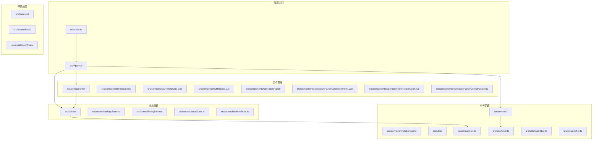
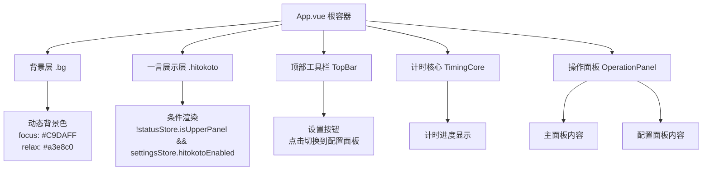
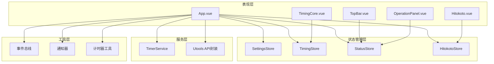
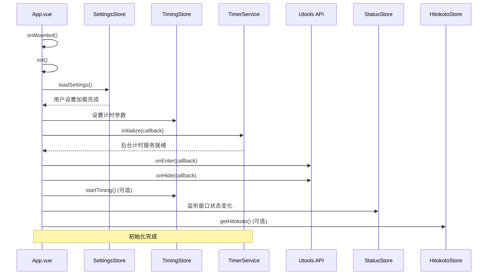
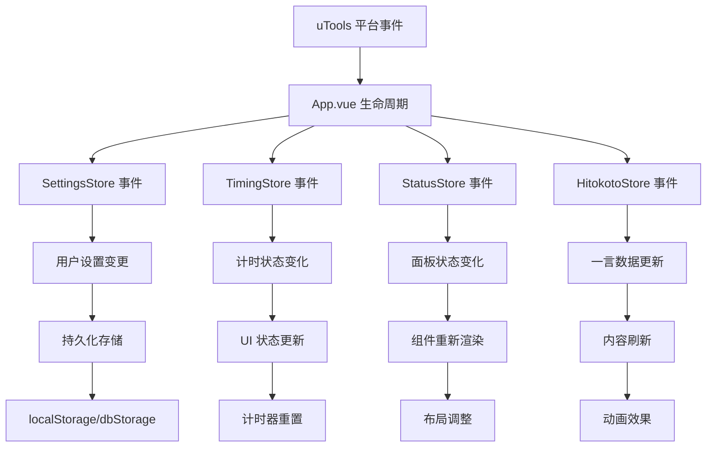
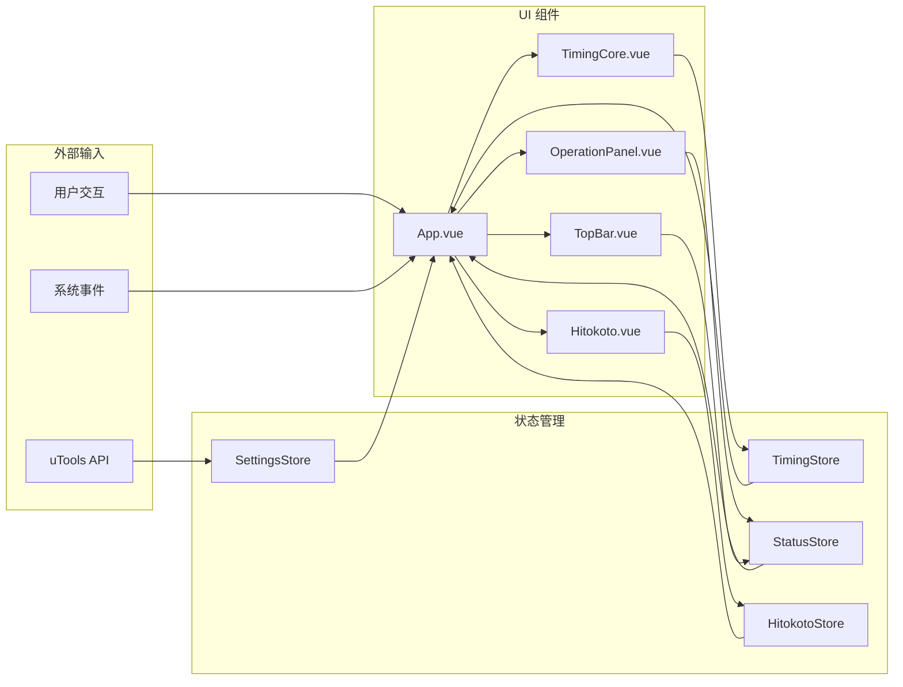
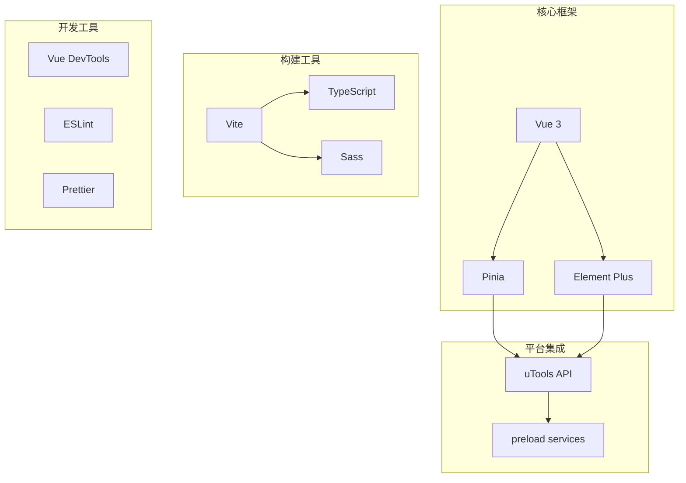
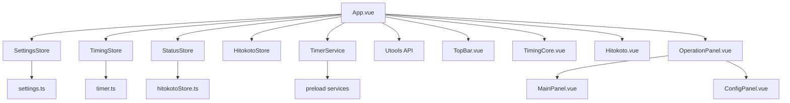

# 根组件设计

<cite>
**本文档引用的文件**
- [src/App.vue](file://src/App.vue)
- [src/main.ts](file://src/main.ts)
- [src/main.css](file://src/main.css)
- [src/settings.ts](file://src/settings.ts)
- [src/stores/settingsStore.ts](file://src/stores/settingsStore.ts)
- [src/stores/timingStore.ts](file://src/stores/timingStore.ts)
- [src/stores/statusStore.ts](file://src/stores/statusStore.ts)
- [src/stores/hitokotoStore.ts](file://src/stores/hitokotoStore.ts)
- [src/utils/utools.ts](file://src/utils/utools.ts)
- [src/services/timerService.ts](file://src/services/timerService.ts)
- [src/components/operationPanel/OperationPanel.vue](file://src/components/operationPanel/OperationPanel.vue)
- [src/components/TopBar.vue](file://src/components/TopBar.vue)
- [src/components/TimingCore.vue](file://src/components/TimingCore.vue)
- [src/components/Hitokoto.vue](file://src/components/Hitokoto.vue)
- [src/types/index.ts](file://src/types/index.ts)
</cite>

## 目录
1. [引言](#引言)
2. [项目结构](#项目结构)
3. [核心组件](#核心组件)
4. [架构概览](#架构概览)
5. [详细组件分析](#详细组件分析)
6. [依赖关系分析](#依赖关系分析)
7. [性能考虑](#性能考虑)
8. [故障排除指南](#故障排除指南)
9. [结论](#结论)

## 引言

"休息提醒"是一个基于 Vue 3 和 uTools 平台开发的时间管理应用。该项目旨在帮助用户建立规律的工作-休息习惯，通过定时提醒和渐进式界面设计来改善用户体验。根组件 App.vue 作为整个应用的入口点，承担着协调各个子组件、管理全局状态和处理生命周期管理的重要职责。

该应用采用现代化的前端技术栈，包括 Vue 3 的 Composition API、Pinia 状态管理、Element Plus UI 组件库以及 TypeScript 类型安全。项目特别针对 uTools 插件平台进行了优化，实现了后台计时服务和窗口管理功能。

## 项目结构

项目采用模块化的文件组织方式，按照功能域进行分层：

**图表来源**
- [src/main.ts:1-19](file://src/main.ts#L1-L19)
- [src/App.vue:121-144](file://src/App.vue#L121-L144)

**章节来源**
- [src/main.ts:1-19](file://src/main.ts#L1-L19)
- [src/App.vue:1-145](file://src/App.vue#L1-L145)

## 核心组件

### 根组件 App.vue 设计理念

App.vue 作为应用的根组件，采用了"容器-展示"的设计模式，主要负责：

1. **全局状态协调**：统一管理应用的核心状态，包括计时状态、用户设置、窗口状态等
2. **生命周期管理**：处理应用的初始化流程和生命周期事件
3. **组件编排**：协调各个子组件的渲染和交互
4. **事件处理**：监听和处理来自 uTools 平台的各种事件

### 模板结构分析

根组件的模板结构体现了清晰的层次关系：

**图表来源**
- [src/App.vue:25-42](file://src/App.vue#L25-L42)
- [src/App.vue:28](file://src/App.vue#L28)
- [src/App.vue:30-36](file://src/App.vue#L30-L36)

### 样式组织策略

应用采用了模块化的样式组织方式：

1. **全局样式**：在 main.css 中定义基础样式和字体
2. **组件作用域样式**：每个组件使用 scoped 样式避免样式冲突
3. **响应式设计**：通过绝对定位和视口单位实现自适应布局
4. **动画效果**：使用 CSS 过渡和变换实现流畅的用户体验

**章节来源**
- [src/App.vue:1-23](file://src/App.vue#L1-L23)
- [src/main.css:1-54](file://src/main.css#L1-L54)

## 架构概览

应用采用分层架构设计，各层职责明确：

**图表来源**
- [src/App.vue:121-144](file://src/App.vue#L121-L144)
- [src/main.ts:13-16](file://src/main.ts#L13-L16)

## 详细组件分析

### 根组件初始化流程

App.vue 的初始化流程是应用启动的关键环节：

**图表来源**
- [src/App.vue:56-114](file://src/App.vue#L56-L114)
- [src/stores/settingsStore.ts:39-48](file://src/stores/settingsStore.ts#L39-L48)
- [src/services/timerService.ts:59-70](file://src/services/timerService.ts#L59-L70)

### 全局状态管理

应用采用 Pinia 进行状态管理，四个核心 Store 协同工作：

#### SettingsStore（用户设置）
- 管理用户偏好设置，包括专注时间、休息时间、稍后提醒时间等
- 提供设置的加载、保存、重置功能
- 支持默认设置和用户自定义设置

#### TimingStore（计时状态）
- 维护当前计时状态和时间参数
- 提供计时器的启动、暂停、继续、结束等功能
- 管理计时器间隔和状态转换逻辑

#### StatusStore（应用状态）
- 跟踪窗口显示状态和面板切换状态
- 控制操作面板的展开/收起
- 管理主面板和配置面板的显示逻辑

#### HitokotoStore（一言数据）
- 获取和缓存一言数据
- 实现防抖机制防止频繁请求
- 提供数据更新和动画效果

**章节来源**
- [src/stores/settingsStore.ts:11-87](file://src/stores/settingsStore.ts#L11-L87)
- [src/stores/timingStore.ts:32-141](file://src/stores/timingStore.ts#L32-L141)
- [src/stores/statusStore.ts:22-46](file://src/stores/statusStore.ts#L22-L46)
- [src/stores/hitokotoStore.ts:15-72](file://src/stores/hitokotoStore.ts#L15-L72)

### 事件传播机制

应用实现了多层次的事件传播机制：

**图表来源**
- [src/App.vue:82-106](file://src/App.vue#L82-L106)
- [src/utils/utools.ts:19-30](file://src/utils/utools.ts#L19-L30)

### 数据流向分析

应用的数据流遵循单向数据流原则：

**图表来源**
- [src/App.vue:121-144](file://src/App.vue#L121-L144)
- [src/stores/settingsStore.ts:39-84](file://src/stores/settingsStore.ts#L39-L84)

**章节来源**
- [src/App.vue:44-119](file://src/App.vue#L44-L119)
- [src/types/index.ts:1-83](file://src/types/index.ts#L1-L83)

## 依赖关系分析

### 外部依赖

应用的主要外部依赖包括：

**图表来源**
- [package.json:8-21](file://package.json#L8-L21)

### 内部依赖关系

应用内部组件之间的依赖关系：

**图表来源**
- [src/App.vue:121-144](file://src/App.vue#L121-L144)
- [src/main.ts:8-16](file://src/main.ts#L8-L16)

**章节来源**
- [package.json:1-23](file://package.json#L1-L23)
- [src/main.ts:1-19](file://src/main.ts#L1-L19)

## 性能考虑

### 渲染性能优化

应用采用了多项性能优化策略：

1. **条件渲染**：使用 v-if 控制组件的挂载和卸载
2. **过渡动画**：利用 CSS 过渡实现流畅的组件切换
3. **懒加载**：按需加载一言数据，避免不必要的网络请求
4. **状态缓存**：缓存用户设置和计时状态，减少重复计算

### 内存管理

- 合理的生命周期管理，及时清理计时器和事件监听器
- 使用 Pinia 的自动清理机制
- 避免内存泄漏的事件绑定

### 响应式设计

应用采用绝对定位和视口单位实现响应式布局：
- 使用 vh/vw 单位确保全屏覆盖
- 通过 CSS 变量实现主题切换
- 移动端友好的触摸交互

## 故障排除指南

### 常见问题及解决方案

#### 计时器不工作
- 检查后台服务是否可用
- 验证计时参数设置
- 确认权限设置

#### 窗口显示异常
- 检查 uTools 环境配置
- 验证窗口状态管理
- 确认事件监听器注册

#### 数据同步问题
- 检查 Pinia 状态管理
- 验证本地存储机制
- 确认数据持久化

**章节来源**
- [src/App.vue:69-106](file://src/App.vue#L69-L106)
- [src/services/timerService.ts:59-70](file://src/services/timerService.ts#L59-L70)

## 结论

App.vue 作为"休息提醒"项目的核心组件，成功地实现了以下目标：

1. **清晰的架构设计**：采用分层架构和模块化组织，职责明确
2. **高效的组件协调**：通过 Pinia 状态管理和事件机制实现组件间通信
3. **优秀的用户体验**：流畅的动画效果和响应式设计
4. **可靠的平台集成**：充分利用 uTools 平台特性实现后台计时和窗口管理

该根组件设计充分体现了现代前端开发的最佳实践，为后续的功能扩展和维护奠定了坚实的基础。通过合理的状态管理和事件处理机制，应用能够在复杂的交互场景中保持稳定和高效的表现。