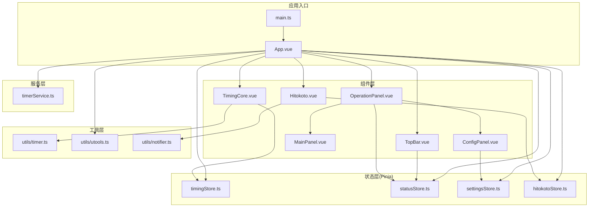
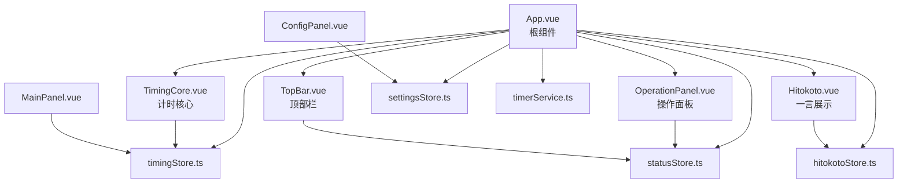
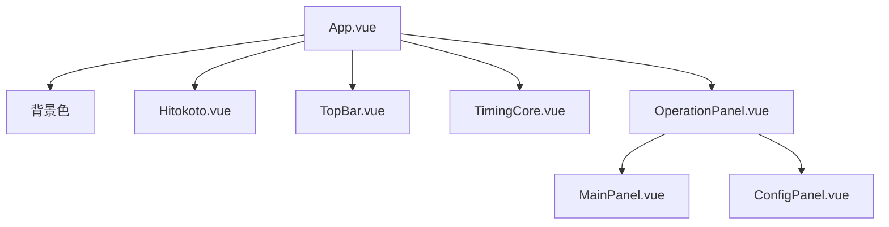
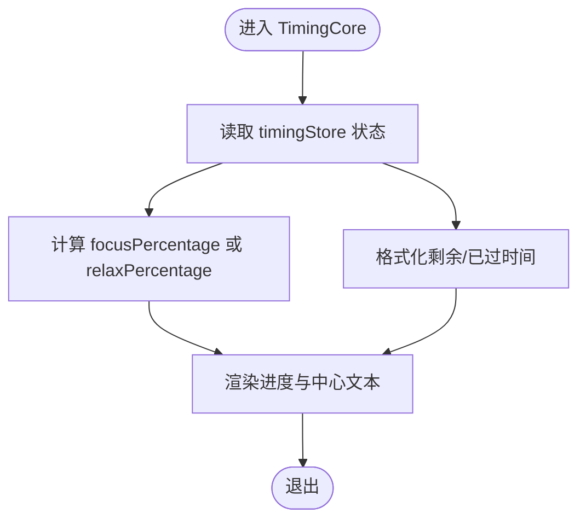
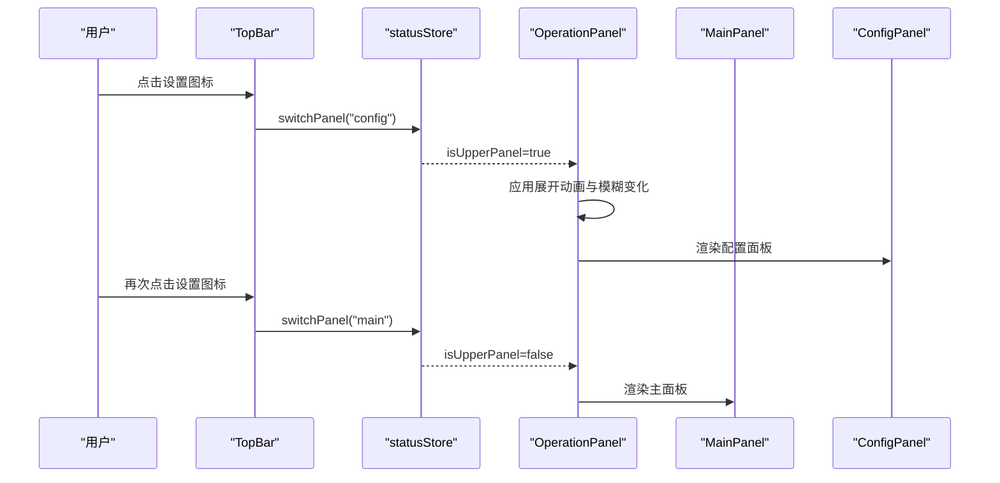
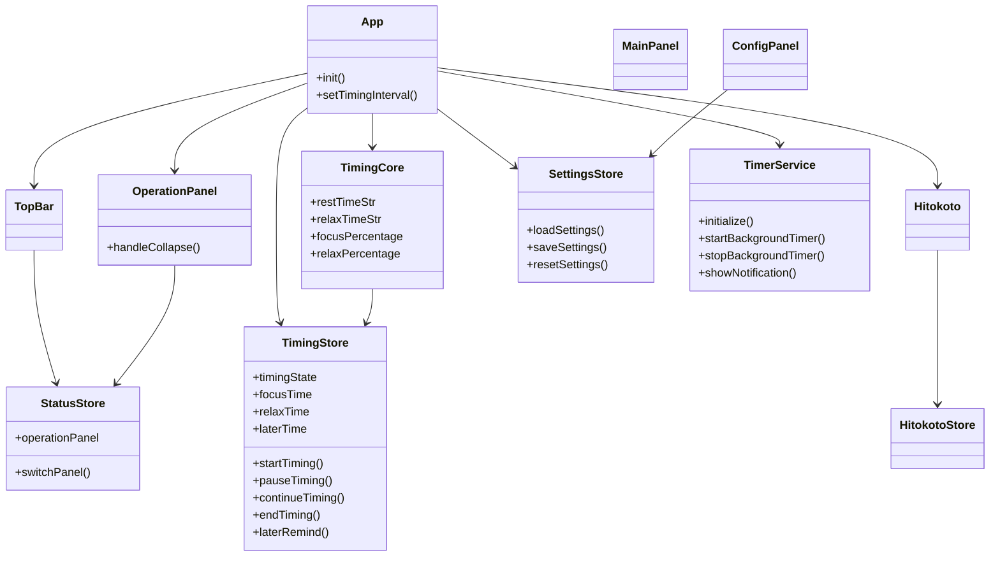

# 组件架构

<cite>
**本文引用的文件**
- [src/App.vue](file://src/App.vue)
- [src/main.ts](file://src/main.ts)
- [src/components/TimingCore.vue](file://src/components/TimingCore.vue)
- [src/components/operationPanel/OperationPanel.vue](file://src/components/operationPanel/OperationPanel.vue)
- [src/components/operationPanel/MainPanel.vue](file://src/components/operationPanel/MainPanel.vue)
- [src/components/operationPanel/ConfigPanel.vue](file://src/components/operationPanel/ConfigPanel.vue)
- [src/components/TopBar.vue](file://src/components/TopBar.vue)
- [src/components/Hitokoto.vue](file://src/components/Hitokoto.vue)
- [src/stores/timingStore.ts](file://src/stores/timingStore.ts)
- [src/stores/statusStore.ts](file://src/stores/statusStore.ts)
- [src/stores/settingsStore.ts](file://src/stores/settingsStore.ts)
- [src/stores/hitokotoStore.ts](file://src/stores/hitokotoStore.ts)
- [src/services/timerService.ts](file://src/services/timerService.ts)
- [src/utils/timer.ts](file://src/utils/timer.ts)
- [src/utils/utools.ts](file://src/utils/utools.ts)
- [src/utils/notifier.ts](file://src/utils/notifier.ts)
- [src/types/index.ts](file://src/types/index.ts)
- [package.json](file://package.json)
</cite>

## 目录
1. [简介](#简介)
2. [项目结构](#项目结构)
3. [核心组件](#核心组件)
4. [架构总览](#架构总览)
5. [详细组件分析](#详细组件分析)
6. [依赖关系分析](#依赖关系分析)
7. [性能考量](#性能考量)
8. [故障排查指南](#故障排查指南)
9. [结论](#结论)

## 简介
本项目是一个基于 Vue 3 的桌面插件“休息提醒”，采用 Composition API 和 Pinia 状态管理，结合 uTools 平台能力实现专注与休息时间的可视化提醒。组件化设计以 App.vue 为根组件，围绕计时核心、操作面板、顶部栏、一言展示等模块构建清晰的层次结构与职责边界，通过状态存储与服务层解耦业务逻辑，确保组件的可复用性与可扩展性。

## 项目结构
项目采用按功能域组织的目录结构：
- 根组件与入口：App.vue、main.ts
- 组件层：components 下按功能拆分（TimingCore、operationPanel、TopBar、Hitokoto）
- 状态层：stores（timingStore、statusStore、settingsStore、hitokotoStore）
- 服务层：services（timerService）
- 工具层：utils（timer、utools、notifier）
- 类型定义：types/index.ts
- 依赖配置：package.json

图表来源
- [src/main.ts:1-19](file://src/main.ts#L1-L19)
- [src/App.vue:121-144](file://src/App.vue#L121-L144)
- [src/components/TimingCore.vue:91-100](file://src/components/TimingCore.vue#L91-L100)
- [src/components/operationPanel/OperationPanel.vue:128-180](file://src/components/operationPanel/OperationPanel.vue#L128-L180)
- [src/components/TopBar.vue:38-49](file://src/components/TopBar.vue#L38-L49)
- [src/components/Hitokoto.vue:50-79](file://src/components/Hitokoto.vue#L50-L79)
- [src/stores/timingStore.ts:32-141](file://src/stores/timingStore.ts#L32-L141)
- [src/stores/statusStore.ts:22-46](file://src/stores/statusStore.ts#L22-L46)
- [src/stores/settingsStore.ts:11-87](file://src/stores/settingsStore.ts#L11-L87)
- [src/stores/hitokotoStore.ts](file://src/stores/hitokotoStore.ts)
- [src/services/timerService.ts:24-161](file://src/services/timerService.ts#L24-L161)
- [src/utils/timer.ts](file://src/utils/timer.ts)
- [src/utils/utools.ts](file://src/utils/utools.ts)
- [src/utils/notifier.ts](file://src/utils/notifier.ts)

章节来源
- [src/main.ts:1-19](file://src/main.ts#L1-L19)
- [src/App.vue:121-144](file://src/App.vue#L121-L144)

## 核心组件
- 根组件 App.vue：负责全局初始化、背景色与一言/顶部栏的条件渲染、窗口进入/隐藏事件处理、计时服务初始化与通知展示、自动开始计时控制。
- TimingCore：展示圆形进度与中心倒计时文本，根据当前状态计算百分比与格式化时间字符串。
- OperationPanel：可展开的操作面板，包含主面板与配置面板，支持面板切换与模糊效果优化。
- TopBar：顶部右侧设置入口，触发面板切换。
- Hitokoto：一言展示与复制交互，支持点击刷新与右键复制。
- MainPanel：提供结束计时、暂停/继续、稍后提醒等操作按钮。
- ConfigPanel：时间设置与功能开关面板，支持滑块与输入框联动、保存与重置。

章节来源
- [src/App.vue:25-42](file://src/App.vue#L25-L42)
- [src/components/TimingCore.vue:42-60](file://src/components/TimingCore.vue#L42-L60)
- [src/components/operationPanel/OperationPanel.vue:107-126](file://src/components/operationPanel/OperationPanel.vue#L107-L126)
- [src/components/TopBar.vue:24-36](file://src/components/TopBar.vue#L24-L36)
- [src/components/Hitokoto.vue:34-48](file://src/components/Hitokoto.vue#L34-L48)
- [src/components/operationPanel/MainPanel.vue:39-69](file://src/components/operationPanel/MainPanel.vue#L39-L69)
- [src/components/operationPanel/ConfigPanel.vue:242-340](file://src/components/operationPanel/ConfigPanel.vue#L242-L340)

## 架构总览
应用采用“根组件 + 多功能子组件 + 状态存储 + 服务层”的分层架构。根组件负责生命周期与平台事件绑定，子组件通过 Pinia 状态进行数据驱动，计时逻辑封装在 store 中并通过服务层与平台能力对接。

图表来源
- [src/App.vue:121-144](file://src/App.vue#L121-L144)
- [src/components/operationPanel/OperationPanel.vue:128-180](file://src/components/operationPanel/OperationPanel.vue#L128-L180)
- [src/components/TopBar.vue:38-49](file://src/components/TopBar.vue#L38-L49)
- [src/components/Hitokoto.vue:50-79](file://src/components/Hitokoto.vue#L50-L79)
- [src/stores/timingStore.ts:32-141](file://src/stores/timingStore.ts#L32-L141)
- [src/stores/statusStore.ts:22-46](file://src/stores/statusStore.ts#L22-L46)
- [src/stores/settingsStore.ts:11-87](file://src/stores/settingsStore.ts#L11-L87)
- [src/stores/hitokotoStore.ts](file://src/stores/hitokotoStore.ts)
- [src/services/timerService.ts:24-161](file://src/services/timerService.ts#L24-L161)

## 详细组件分析

### 根组件 App.vue 设计思路与组件树
- 设计要点
  - 条件渲染：根据状态决定是否显示一言与顶部栏；背景色随专注/休息状态切换。
  - 生命周期：挂载时加载用户设置、初始化计时器、绑定窗口进入/隐藏事件。
  - 事件绑定：窗口进入时提高计时精度、更新一言；窗口隐藏时降低计时精度。
  - 自动启动：根据设置决定是否自动开始计时。
- 组件树
  - App.vue 作为根容器，直接包含 TimingCore、OperationPanel、TopBar、Hitokoto。
  - OperationPanel 内部包含 MainPanel 与 ConfigPanel，通过状态控制显示与切换。

图表来源
- [src/App.vue:25-42](file://src/App.vue#L25-L42)
- [src/components/operationPanel/OperationPanel.vue:107-126](file://src/components/operationPanel/OperationPanel.vue#L107-L126)

章节来源
- [src/App.vue:25-42](file://src/App.vue#L25-L42)
- [src/App.vue:56-114](file://src/App.vue#L56-L114)

### TimingCore（计时核心）
- 职责
  - 基于当前计时状态计算剩余/已过时间百分比，渲染仪表盘进度与中心倒计时文本。
  - 根据时间阈值动态选择时间格式（小时/分钟）。
- 数据流
  - 读取 timingStore 的 focusTime、relaxTime、restTime、passTime、isFocus 等状态。
  - 通过工具类格式化时间字符串。
- 性能
  - 使用计算属性缓存百分比与格式化结果，减少重复计算。

图表来源
- [src/components/TimingCore.vue:62-101](file://src/components/TimingCore.vue#L62-L101)
- [src/stores/timingStore.ts:43-67](file://src/stores/timingStore.ts#L43-L67)

章节来源
- [src/components/TimingCore.vue:62-101](file://src/components/TimingCore.vue#L62-L101)
- [src/stores/timingStore.ts:43-67](file://src/stores/timingStore.ts#L43-L67)

### OperationPanel（操作面板）
- 职责
  - 提供可展开/收起的面板容器，内部包含主面板与配置面板。
  - 通过状态控制面板内容与动画，优化模糊与背景透明度以提升性能。
- 通信
  - 与状态存储交互：读取 isUpperPanel 控制展开状态；通过 switchPanel 切换面板。
  - 与子组件 MainPanel、ConfigPanel 协作，实现具体功能。
- 动画与性能
  - 使用 transform 替代高度变化，配合 will-change 与 GPU 加速。
  - 在收起动画过程中临时降低模糊，动画结束后恢复。

图表来源
- [src/components/TopBar.vue:24-36](file://src/components/TopBar.vue#L24-L36)
- [src/stores/statusStore.ts:35-44](file://src/stores/statusStore.ts#L35-L44)
- [src/components/operationPanel/OperationPanel.vue:107-126](file://src/components/operationPanel/OperationPanel.vue#L107-L126)
- [src/components/operationPanel/MainPanel.vue:39-69](file://src/components/operationPanel/MainPanel.vue#L39-L69)
- [src/components/operationPanel/ConfigPanel.vue:242-340](file://src/components/operationPanel/ConfigPanel.vue#L242-L340)

章节来源
- [src/components/operationPanel/OperationPanel.vue:107-126](file://src/components/operationPanel/OperationPanel.vue#L107-L126)
- [src/components/TopBar.vue:24-36](file://src/components/TopBar.vue#L24-L36)
- [src/stores/statusStore.ts:35-44](file://src/stores/statusStore.ts#L35-L44)

### TopBar（顶部栏）
- 职责
  - 提供设置入口，点击后切换到配置面板。
- 通信
  - 通过状态存储的 switchPanel 实现面板切换。

章节来源
- [src/components/TopBar.vue:24-36](file://src/components/TopBar.vue#L24-L36)
- [src/stores/statusStore.ts:35-44](file://src/stores/statusStore.ts#L35-L44)

### Hitokoto（一言展示）
- 职责
  - 展示随机语录与作者，支持点击刷新与右键复制。
- 通信
  - 通过 hitokotoStore 获取/刷新语录；通过 notifier 提示复制成功。
- 交互
  - 挂载时自动获取一次语录；点击左键刷新；右键复制到剪贴板。

章节来源
- [src/components/Hitokoto.vue:34-48](file://src/components/Hitokoto.vue#L34-L48)
- [src/components/Hitokoto.vue:56-67](file://src/components/Hitokoto.vue#L56-L67)
- [src/stores/hitokotoStore.ts](file://src/stores/hitokotoStore.ts)
- [src/utils/notifier.ts](file://src/utils/notifier.ts)

### MainPanel（主面板）
- 职责
  - 提供结束计时、暂停/继续、稍后提醒等操作按钮。
- 通信
  - 直接调用 timingStore 的动作方法执行计时控制。

章节来源
- [src/components/operationPanel/MainPanel.vue:39-69](file://src/components/operationPanel/MainPanel.vue#L39-L69)
- [src/stores/timingStore.ts:69-140](file://src/stores/timingStore.ts#L69-L140)

### ConfigPanel（配置面板）
- 职责
  - 提供专注/休息/稍后提醒时间设置与功能开关（一言显示、自动开始）。
  - 支持保存设置并同步更新计时器时间。
- 通信
  - 读写 settingsStore；保存时同步更新 timingStore 的时间参数。

章节来源
- [src/components/operationPanel/ConfigPanel.vue:242-340](file://src/components/operationPanel/ConfigPanel.vue#L242-L340)
- [src/stores/settingsStore.ts:35-87](file://src/stores/settingsStore.ts#L35-L87)
- [src/stores/timingStore.ts:69-140](file://src/stores/timingStore.ts#L69-L140)

## 依赖关系分析
- 组件间依赖
  - App.vue 依赖所有子组件与多个 store。
  - TimingCore 依赖 timingStore。
  - OperationPanel 依赖 statusStore，并包含 MainPanel 与 ConfigPanel。
  - TopBar 依赖 statusStore。
  - Hitokoto 依赖 hitokotoStore。
  - ConfigPanel 依赖 settingsStore，并在保存时更新 timingStore。
- 状态与服务
  - timingStore 管理计时状态与动作，内部使用 Timer 工具与状态存储。
  - statusStore 管理面板状态与面板切换。
  - settingsStore 管理用户设置的持久化与读取。
  - timerService 封装后台计时与通知能力，向 App.vue 回调计时结束事件。

图表来源
- [src/App.vue:121-144](file://src/App.vue#L121-L144)
- [src/components/TimingCore.vue:91-100](file://src/components/TimingCore.vue#L91-L100)
- [src/components/operationPanel/OperationPanel.vue:128-180](file://src/components/operationPanel/OperationPanel.vue#L128-L180)
- [src/components/TopBar.vue:38-49](file://src/components/TopBar.vue#L38-L49)
- [src/components/Hitokoto.vue:50-79](file://src/components/Hitokoto.vue#L50-L79)
- [src/stores/timingStore.ts:32-141](file://src/stores/timingStore.ts#L32-L141)
- [src/stores/statusStore.ts:22-46](file://src/stores/statusStore.ts#L22-L46)
- [src/stores/settingsStore.ts:11-87](file://src/stores/settingsStore.ts#L11-L87)
- [src/stores/hitokotoStore.ts](file://src/stores/hitokotoStore.ts)
- [src/services/timerService.ts:24-161](file://src/services/timerService.ts#L24-L161)

章节来源
- [src/App.vue:121-144](file://src/App.vue#L121-L144)
- [src/stores/timingStore.ts:32-141](file://src/stores/timingStore.ts#L32-L141)
- [src/stores/statusStore.ts:22-46](file://src/stores/statusStore.ts#L22-L46)
- [src/stores/settingsStore.ts:11-87](file://src/stores/settingsStore.ts#L11-L87)
- [src/stores/hitokotoStore.ts](file://src/stores/hitokotoStore.ts)
- [src/services/timerService.ts:24-161](file://src/services/timerService.ts#L24-L161)

## 性能考量
- 动画与渲染
  - 使用 transform 替代高度变化，配合 will-change 与 GPU 加速，减少重排。
  - 面板收起时降低模糊值，动画结束后恢复，平衡视觉与性能。
- 计时精度
  - 窗口进入时提高计时精度（短间隔），窗口隐藏时降低精度（长间隔），节省资源。
- 计算缓存
  - TimingCore 使用计算属性缓存百分比与格式化结果，避免重复计算。
- 状态访问
  - 通过 Pinia getter 计算派生状态，减少模板中复杂表达式。

章节来源
- [src/components/operationPanel/OperationPanel.vue:156-174](file://src/components/operationPanel/OperationPanel.vue#L156-L174)
- [src/App.vue:117-119](file://src/App.vue#L117-L119)
- [src/components/TimingCore.vue:68-89](file://src/components/TimingCore.vue#L68-L89)

## 故障排查指南
- 计时不生效或异常
  - 检查 App.vue 初始化流程是否正确加载设置并启动计时。
  - 确认 timerService 是否可用且已初始化。
- 窗口事件未响应
  - 检查 uTools 事件绑定是否在挂载后注册。
  - 确认窗口进入/隐藏回调中对计时精度的调整逻辑。
- 配置未保存或未生效
  - 检查 ConfigPanel 的保存逻辑是否调用 settingsStore.saveSettings。
  - 确认保存后是否同步更新 timingStore 的时间参数。
- 一言不显示或无法复制
  - 检查 hitokotoEnabled 开关与 hitokotoStore 的数据状态。
  - 确认右键复制逻辑与提示消息是否正常触发。

章节来源
- [src/App.vue:56-114](file://src/App.vue#L56-L114)
- [src/services/timerService.ts:59-70](file://src/services/timerService.ts#L59-L70)
- [src/components/operationPanel/ConfigPanel.vue:348-358](file://src/components/operationPanel/ConfigPanel.vue#L348-L358)
- [src/components/Hitokoto.vue:56-61](file://src/components/Hitokoto.vue#L56-L61)

## 结论
本项目通过清晰的组件分层与 Pinia 状态管理，实现了专注与休息提醒的完整功能闭环。根组件 App.vue 统筹全局初始化与平台事件，子组件各司其职并通过状态存储解耦数据与视图。计时核心、操作面板、顶部栏与一言展示共同构成简洁而高效的用户界面。通过动画优化与计时精度自适应策略，兼顾了用户体验与性能表现。未来可在以下方面进一步增强：
- 增加更细粒度的日志与错误上报机制。
- 对计时服务进行单元测试覆盖，确保后台计时稳定性。
- 扩展更多主题与个性化选项，提升可扩展性。