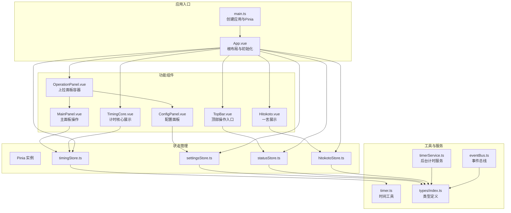
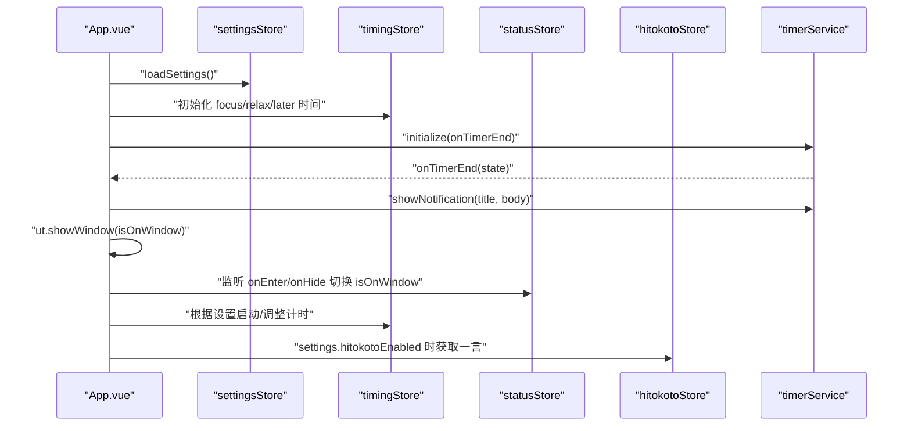
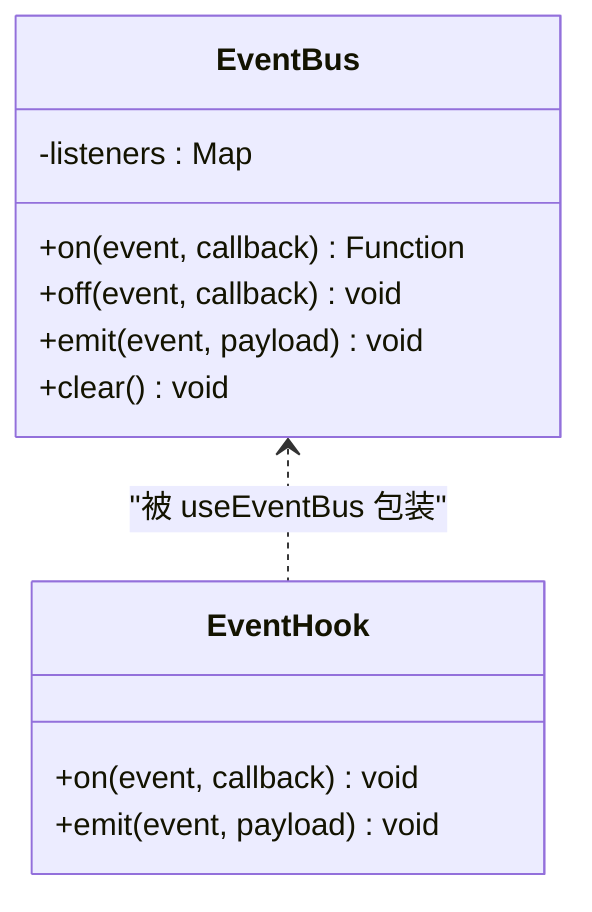
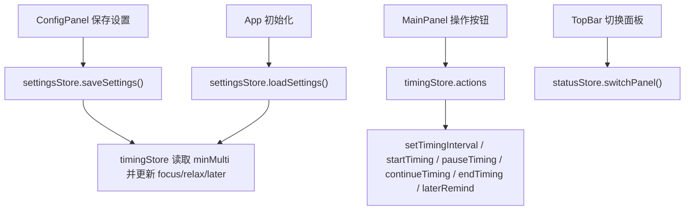
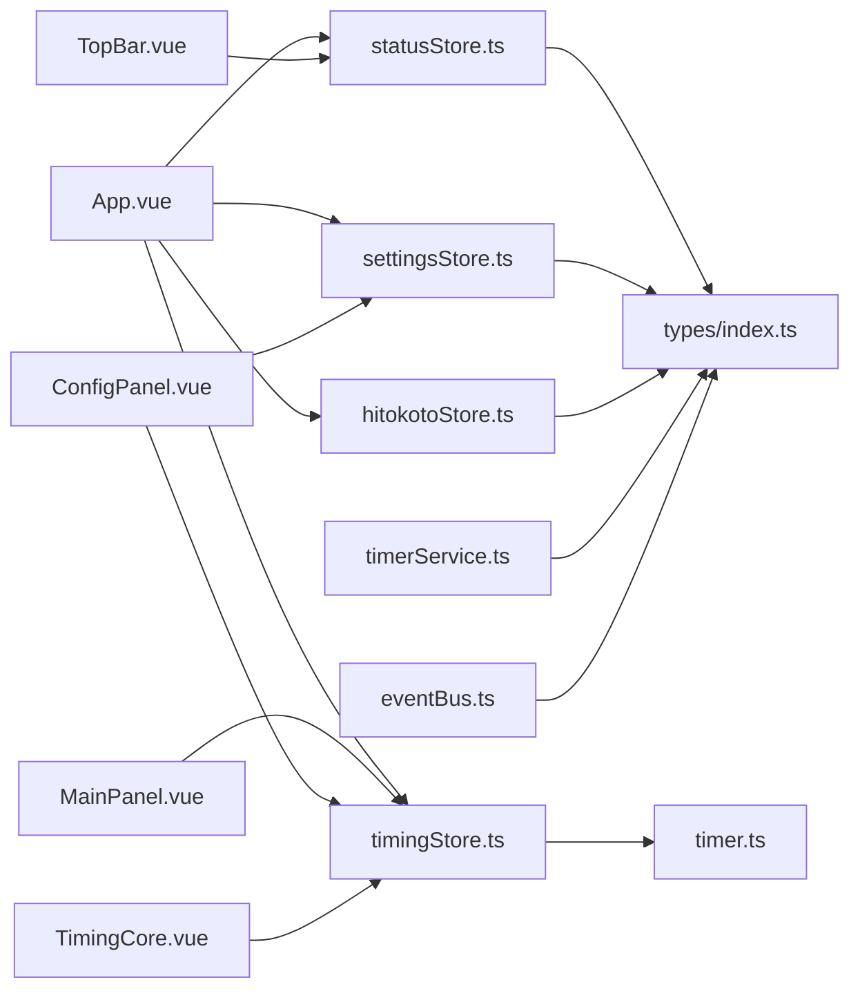

# 组件通信机制

<cite>
**本文引用的文件**
- [src/main.ts](file://src/main.ts)
- [src/App.vue](file://src/App.vue)
- [src/components/operationPanel/OperationPanel.vue](file://src/components/operationPanel/OperationPanel.vue)
- [src/components/operationPanel/MainPanel.vue](file://src/components/operationPanel/MainPanel.vue)
- [src/components/operationPanel/ConfigPanel.vue](file://src/components/operationPanel/ConfigPanel.vue)
- [src/components/TimingCore.vue](file://src/components/TimingCore.vue)
- [src/components/Hitokoto.vue](file://src/components/Hitokoto.vue)
- [src/components/TopBar.vue](file://src/components/TopBar.vue)
- [src/stores/timingStore.ts](file://src/stores/timingStore.ts)
- [src/stores/settingsStore.ts](file://src/stores/settingsStore.ts)
- [src/stores/statusStore.ts](file://src/stores/statusStore.ts)
- [src/stores/hitokotoStore.ts](file://src/stores/hitokotoStore.ts)
- [src/utils/eventBus.ts](file://src/utils/eventBus.ts)
- [src/utils/timer.ts](file://src/utils/timer.ts)
- [src/services/timerService.ts](file://src/services/timerService.ts)
- [src/types/index.ts](file://src/types/index.ts)
</cite>

## 目录
1. [简介](#简介)
2. [项目结构](#项目结构)
3. [核心组件](#核心组件)
4. [架构总览](#架构总览)
5. [详细组件分析](#详细组件分析)
6. [依赖关系分析](#依赖关系分析)
7. [性能考量](#性能考量)
8. [故障排查指南](#故障排查指南)
9. [结论](#结论)
10. [附录](#附录)

## 简介
本文件围绕“休息提醒”项目，系统梳理 Vue 3 组件间的通信机制与实现路径。重点覆盖：
- Props 向下传递、Events 向上冒泡、Slots 插槽分发等传统通信方式
- EventBus 事件总线的设计与使用场景
- Pinia 状态管理在组件通信中的角色与数据流向
- 组件间数据同步与状态一致性保障机制
- 生命周期中的通信时机与最佳实践
- 设计原则与性能优化建议

## 项目结构
项目采用“根组件 + 功能模块组件 + 状态仓库 + 工具服务”的分层组织方式。根组件负责全局布局与初始化；功能模块组件按职责拆分；Pinia Store 提供跨组件共享状态；工具与服务封装通用能力。

图表来源
- [src/main.ts:1-19](file://src/main.ts#L1-L19)
- [src/App.vue:25-42](file://src/App.vue#L25-L42)
- [src/components/TopBar.vue:24-36](file://src/components/TopBar.vue#L24-L36)
- [src/components/TimingCore.vue:42-60](file://src/components/TimingCore.vue#L42-L60)
- [src/components/Hitokoto.vue:34-48](file://src/components/Hitokoto.vue#L34-L48)
- [src/components/operationPanel/OperationPanel.vue:107-126](file://src/components/operationPanel/OperationPanel.vue#L107-L126)
- [src/components/operationPanel/MainPanel.vue:39-69](file://src/components/operationPanel/MainPanel.vue#L39-L69)
- [src/components/operationPanel/ConfigPanel.vue:242-340](file://src/components/operationPanel/ConfigPanel.vue#L242-L340)
- [src/stores/timingStore.ts:32-141](file://src/stores/timingStore.ts#L32-L141)
- [src/stores/settingsStore.ts:11-87](file://src/stores/settingsStore.ts#L11-L87)
- [src/stores/statusStore.ts:22-46](file://src/stores/statusStore.ts#L22-L46)
- [src/stores/hitokotoStore.ts:15-72](file://src/stores/hitokotoStore.ts#L15-L72)
- [src/utils/timer.ts:5-66](file://src/utils/timer.ts#L5-L66)
- [src/services/timerService.ts:24-161](file://src/services/timerService.ts#L24-L161)
- [src/utils/eventBus.ts:12-104](file://src/utils/eventBus.ts#L12-L104)
- [src/types/index.ts:1-83](file://src/types/index.ts#L1-L83)

章节来源
- [src/main.ts:1-19](file://src/main.ts#L1-L19)
- [src/App.vue:25-42](file://src/App.vue#L25-L42)

## 核心组件
- 根组件 App.vue：负责应用初始化、加载用户设置、启动后台计时服务、监听窗口进入/隐藏事件，并根据状态渲染子组件。
- 上拉面板 OperationPanel：承载主面板与配置面板，通过状态控制展开/收起与内容切换。
- 主面板 MainPanel：提供计时控制（结束、暂停/继续、稍后提醒）等操作。
- 配置面板 ConfigPanel：提供时间设置与功能开关，保存设置并同步到计时状态。
- 计时核心 TimingCore：基于 Pinia 状态计算百分比与剩余时间，展示进度与倒计时。
- 一言组件 Hitokoto：展示随机语录，支持点击刷新与右键复制。
- 顶部栏 TopBar：提供设置入口，切换面板。

章节来源
- [src/App.vue:25-42](file://src/App.vue#L25-L42)
- [src/components/operationPanel/OperationPanel.vue:107-126](file://src/components/operationPanel/OperationPanel.vue#L107-L126)
- [src/components/operationPanel/MainPanel.vue:39-69](file://src/components/operationPanel/MainPanel.vue#L39-L69)
- [src/components/operationPanel/ConfigPanel.vue:242-340](file://src/components/operationPanel/ConfigPanel.vue#L242-L340)
- [src/components/TimingCore.vue:42-60](file://src/components/TimingCore.vue#L42-L60)
- [src/components/Hitokoto.vue:34-48](file://src/components/Hitokoto.vue#L34-L48)
- [src/components/TopBar.vue:24-36](file://src/components/TopBar.vue#L24-L36)

## 架构总览
本项目采用“根组件统一初始化 + Pinia 共享状态 + 子组件读写状态 + 工具/服务解耦”的架构模式。根组件负责与外部环境（utools 窗口事件、后台计时服务）交互；各功能组件通过 Pinia 读取/更新状态，形成清晰的数据流。

图表来源
- [src/App.vue:56-114](file://src/App.vue#L56-L114)
- [src/services/timerService.ts:59-70](file://src/services/timerService.ts#L59-L70)
- [src/stores/settingsStore.ts:39-48](file://src/stores/settingsStore.ts#L39-L48)
- [src/stores/timingStore.ts:94-100](file://src/stores/timingStore.ts#L94-L100)
- [src/stores/statusStore.ts:35-44](file://src/stores/statusStore.ts#L35-L44)
- [src/stores/hitokotoStore.ts:31-69](file://src/stores/hitokotoStore.ts#L31-L69)

## 详细组件分析

### 1) Props 向下传递
- TimingCore 通过读取 timingStore 的状态计算百分比与剩余时间，实现“只读 Props”式的向下数据流。
- TopBar 通过 statusStore 的 getter 判断是否处于上拉面板状态，决定渲染与否。
- OperationPanel 通过 statusStore 控制面板展开/收起与模糊效果，体现状态驱动的 props 化行为。

章节来源
- [src/components/TimingCore.vue:68-89](file://src/components/TimingCore.vue#L68-L89)
- [src/components/TopBar.vue:24-36](file://src/components/TopBar.vue#L24-L36)
- [src/components/operationPanel/OperationPanel.vue:109-114](file://src/components/operationPanel/OperationPanel.vue#L109-L114)

### 2) Events 向上冒泡
- TopBar 中的设置按钮点击事件触发 statusStore.switchPanel('config')，属于典型的“子传父”事件冒泡。
- MainPanel 的操作按钮点击直接调用 timingStore 的动作方法，属于“子改父状态”的事件冒泡模式。

章节来源
- [src/components/TopBar.vue:27-33](file://src/components/TopBar.vue#L27-L33)
- [src/components/operationPanel/MainPanel.vue:43-64](file://src/components/operationPanel/MainPanel.vue#L43-L64)

### 3) Slots 插槽分发
- OperationPanel 容器内以内容区与面板内容块的形式组织子面板，通过状态切换 active 类名实现内容分发与切换，可视为“具名插槽”的语义化实现。

章节来源
- [src/components/operationPanel/OperationPanel.vue:116-124](file://src/components/operationPanel/OperationPanel.vue#L116-L124)

### 4) EventBus 事件总线
- 事件总线提供 on/off/emit/clear 接口，useEventBus Hook 在组件卸载时自动清理订阅，避免内存泄漏。
- 事件映射定义了计时结束、面板切换、一言刷新等事件类型，便于跨 Store 解耦通信。

图表来源
- [src/utils/eventBus.ts:12-104](file://src/utils/eventBus.ts#L12-L104)
- [src/types/index.ts:55-59](file://src/types/index.ts#L55-L59)

章节来源
- [src/utils/eventBus.ts:12-104](file://src/utils/eventBus.ts#L12-L104)
- [src/types/index.ts:55-59](file://src/types/index.ts#L55-L59)

### 5) Pinia 状态管理与数据流向
- timingStore：维护计时状态、时间参数与计时器生命周期，提供 getters 计算剩余/过去时间，actions 控制开始/暂停/继续/结束/稍后提醒。
- settingsStore：维护用户设置并持久化，提供毫秒换算 getter，支持加载/保存/重置/单项更新。
- statusStore：维护面板状态与窗口可见性，提供 isUpperPanel getter 与 switchPanel action。
- hitokotoStore：维护一言文本与作者信息，提供防抖刷新与错误回退。

图表来源
- [src/components/operationPanel/ConfigPanel.vue:349-358](file://src/components/operationPanel/ConfigPanel.vue#L349-L358)
- [src/stores/settingsStore.ts:53-61](file://src/stores/settingsStore.ts#L53-L61)
- [src/stores/timingStore.ts:75-139](file://src/stores/timingStore.ts#L75-L139)
- [src/components/operationPanel/MainPanel.vue:43-64](file://src/components/operationPanel/MainPanel.vue#L43-L64)
- [src/App.vue:60-79](file://src/App.vue#L60-L79)
- [src/stores/statusStore.ts:35-44](file://src/stores/statusStore.ts#L35-L44)

章节来源
- [src/stores/timingStore.ts:32-141](file://src/stores/timingStore.ts#L32-L141)
- [src/stores/settingsStore.ts:11-87](file://src/stores/settingsStore.ts#L11-L87)
- [src/stores/statusStore.ts:22-46](file://src/stores/statusStore.ts#L22-L46)
- [src/stores/hitokotoStore.ts:15-72](file://src/stores/hitokotoStore.ts#L15-L72)

### 6) 数据同步与状态一致性
- 计时器时间同步：ConfigPanel 保存设置后，直接更新 timingStore 的时间参数，确保后续计时逻辑一致。
- 窗口可见性：App 监听窗口进入/隐藏事件，动态调整计时器优先级与显示策略，保证 UI 与后台计时一致。
- 面板状态：statusStore 的 isUpperPanel 作为唯一真相源，影响 OperationPanel 的展开/收起与模糊效果，避免多处状态分散。

章节来源
- [src/components/operationPanel/ConfigPanel.vue:353-358](file://src/components/operationPanel/ConfigPanel.vue#L353-L358)
- [src/App.vue:117-119](file://src/App.vue#L117-L119)
- [src/stores/statusStore.ts:28-33](file://src/stores/statusStore.ts#L28-L33)

### 7) 生命周期中的通信时机
- App.onMounted：完成设置加载、计时器初始化、窗口事件监听与自动开始逻辑。
- Hitokoto.onMounted：首次挂载即获取一言，保证首屏体验。
- OperationPanel.watch：监听 isUpperPanel 状态变化，配合动画控制模糊与内容切换。

章节来源
- [src/App.vue:52-114](file://src/App.vue#L52-L114)
- [src/components/Hitokoto.vue:64-67](file://src/components/Hitokoto.vue#L64-L67)
- [src/components/operationPanel/OperationPanel.vue:156-174](file://src/components/operationPanel/OperationPanel.vue#L156-L174)

### 8) 组件间通信设计原则
- 单向数据流：状态集中在 Pinia，组件仅读取或派发动作，避免跨组件直接修改。
- 最小暴露面：通过 Store 的 getters/actions 暴露必要接口，隐藏内部实现细节。
- 解耦与复用：EventBus 用于跨 Store/组件的弱耦合通信，如面板切换、一言刷新等。
- 生命周期对齐：在合适的生命周期节点进行初始化与资源清理，避免重复订阅与泄漏。

## 依赖关系分析
- 组件依赖：App 依赖所有功能组件；功能组件依赖对应 Store；部分 Store 之间存在相互调用（如 timingStore 调用 statusStore，statusStore 调用 hitokotoStore），体现跨模块协作。
- 工具与服务：Timer 工具提供时间格式化与计时；TimerService 封装后台计时与通知；eventBus 提供跨域通信；types 定义事件与状态类型。

图表来源
- [src/App.vue:121-144](file://src/App.vue#L121-L144)
- [src/components/TopBar.vue:43-47](file://src/components/TopBar.vue#L43-L47)
- [src/components/operationPanel/MainPanel.vue:78-80](file://src/components/operationPanel/MainPanel.vue#L78-L80)
- [src/components/operationPanel/ConfigPanel.vue:366-377](file://src/components/operationPanel/ConfigPanel.vue#L366-L377)
- [src/components/TimingCore.vue:92-99](file://src/components/TimingCore.vue#L92-L99)
- [src/stores/timingStore.ts:8,6:8-6](file://src/stores/timingStore.ts#L8-L6)
- [src/stores/statusStore.ts:3,4:3-4](file://src/stores/statusStore.ts#L3-L4)
- [src/stores/settingsStore.ts:4,5:4-5](file://src/stores/settingsStore.ts#L4-L5)
- [src/stores/hitokotoStore.ts:5,6:5-6](file://src/stores/hitokotoStore.ts#L5-L6)
- [src/services/timerService.ts:6,18:6-18](file://src/services/timerService.ts#L6-L18)
- [src/utils/eventBus.ts:2,104:2-104](file://src/utils/eventBus.ts#L2-L104)
- [src/types/index.ts:1-83](file://src/types/index.ts#L1-L83)

章节来源
- [src/stores/timingStore.ts:8,6:8-6](file://src/stores/timingStore.ts#L8-L6)
- [src/stores/statusStore.ts:3,4:3-4](file://src/stores/statusStore.ts#L3-L4)
- [src/stores/settingsStore.ts:4,5:4-5](file://src/stores/settingsStore.ts#L4-L5)
- [src/stores/hitokotoStore.ts:5,6:5-6](file://src/stores/hitokotoStore.ts#L5-L6)
- [src/services/timerService.ts:6,18:6-18](file://src/services/timerService.ts#L6-L18)
- [src/utils/eventBus.ts:2,104:2-104](file://src/utils/eventBus.ts#L2-L104)
- [src/types/index.ts:1-83](file://src/types/index.ts#L1-L83)

## 性能考量
- 使用 transform 替代改变高度/宽度，减少重排（OperationPanel 的展开/收起动画）。
- 使用 will-change 与 GPU 加速属性提升动画性能（OperationPanel 的面板容器）。
- 通过定时器优先级动态调整（进入窗口时提高频率，离开时降低频率），平衡性能与实时性。
- 防抖刷新一言，避免频繁网络请求（hitokotoStore 的时间戳防抖）。
- 使用 computed 与 getters 缓存计算结果，减少重复计算（TimingCore 的百分比与时间字符串）。

章节来源
- [src/components/operationPanel/OperationPanel.vue:23-30](file://src/components/operationPanel/OperationPanel.vue#L23-L30)
- [src/components/operationPanel/OperationPanel.vue:94-101](file://src/components/operationPanel/OperationPanel.vue#L94-L101)
- [src/App.vue:117-119](file://src/App.vue#L117-L119)
- [src/stores/hitokotoStore.ts:32-39](file://src/stores/hitokotoStore.ts#L32-L39)
- [src/components/TimingCore.vue:68-89](file://src/components/TimingCore.vue#L68-L89)

## 故障排查指南
- 计时不生效：检查 App 初始化中是否正确加载设置并启动计时；确认 settingsStore 的时间参数是否被正确写入 timingStore。
- 窗口事件无响应：确认 App 对 ut.onEnter/ut.onHide 的监听是否注册；检查 isOnWindow 的切换逻辑。
- 一言不刷新：检查 hitokotoStore 的防抖阈值与网络请求；确认点击事件是否触发 getHitokoto。
- 面板切换异常：检查 statusStore.switchPanel 的调用与 isUpperPanel 的计算；确认 OperationPanel 的 watch 逻辑。

章节来源
- [src/App.vue:60-114](file://src/App.vue#L60-L114)
- [src/stores/hitokotoStore.ts:31-69](file://src/stores/hitokotoStore.ts#L31-L69)
- [src/stores/statusStore.ts:35-44](file://src/stores/statusStore.ts#L35-L44)
- [src/components/operationPanel/OperationPanel.vue:156-174](file://src/components/operationPanel/OperationPanel.vue#L156-L174)

## 结论
本项目通过 Pinia 实现跨组件状态共享，结合根组件初始化与工具/服务封装，形成了清晰、稳定且高性能的组件通信体系。传统通信方式（Props/Events/Slots）与现代状态管理（Pinia）互补，事件总线用于必要的跨域解耦。遵循单向数据流、最小暴露面与生命周期对齐的原则，有助于长期演进与维护。

## 附录
- 事件总线类型映射：计时结束、面板切换、一言刷新等事件类型定义于 types/index.ts。
- 计时器状态：包含运行状态、当前状态、剩余时间与总时间等字段，便于调试与监控。

章节来源
- [src/types/index.ts:55-59](file://src/types/index.ts#L55-L59)
- [src/types/index.ts:64-69](file://src/types/index.ts#L64-L69)