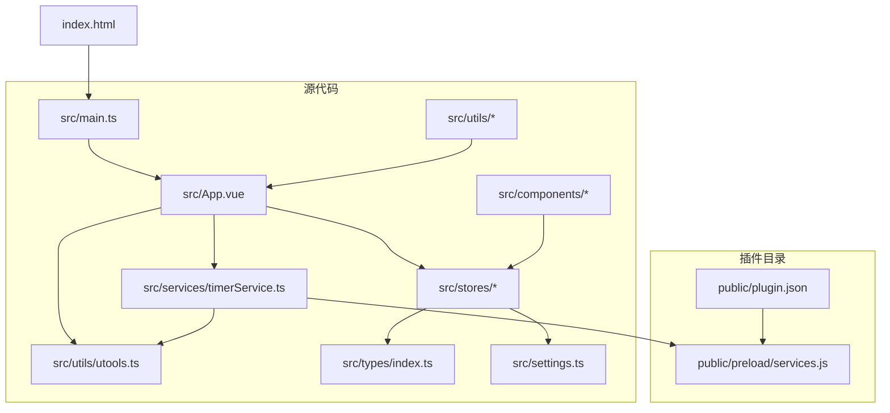
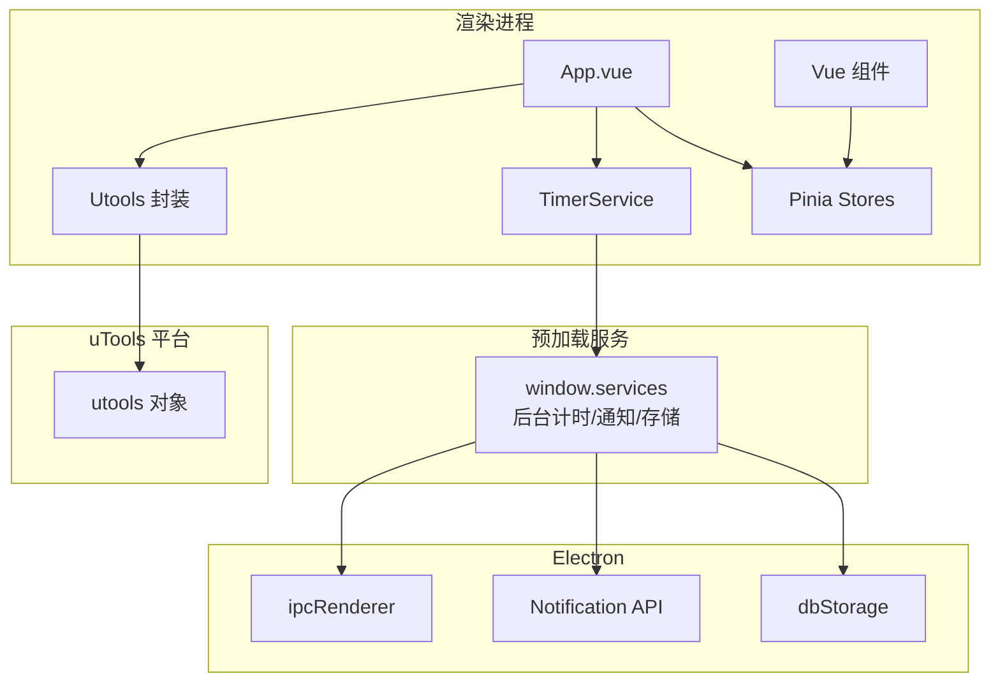
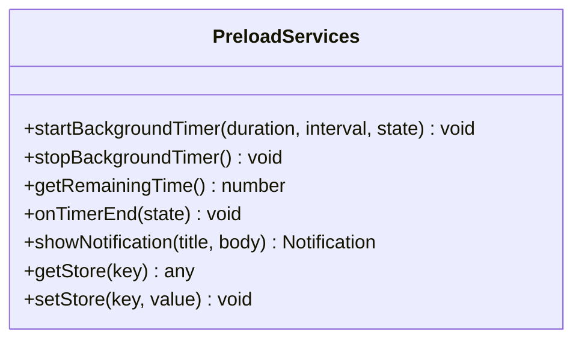
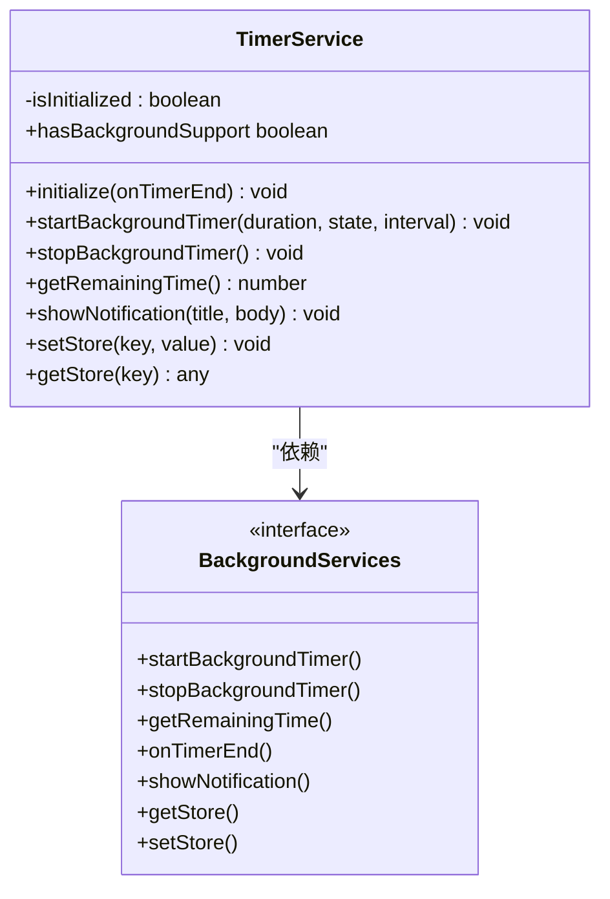
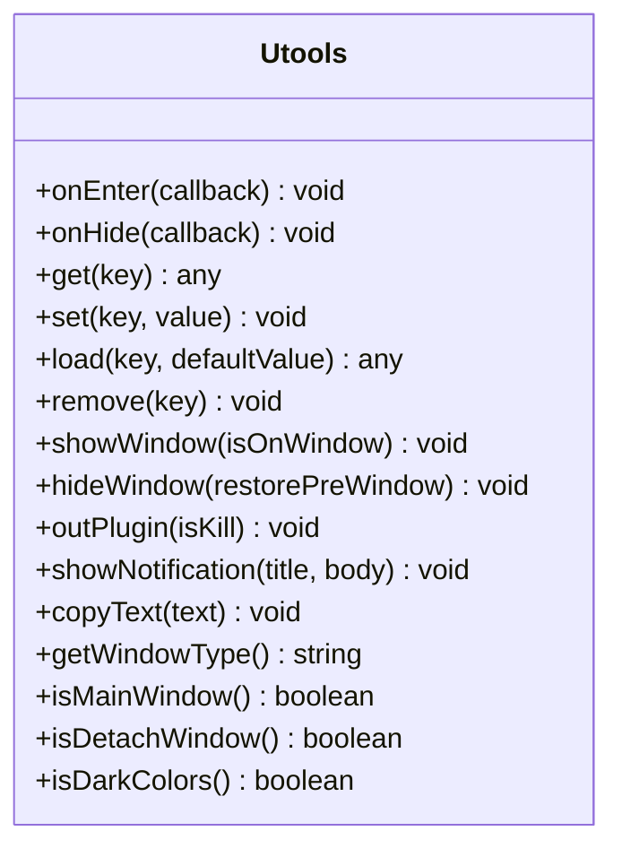
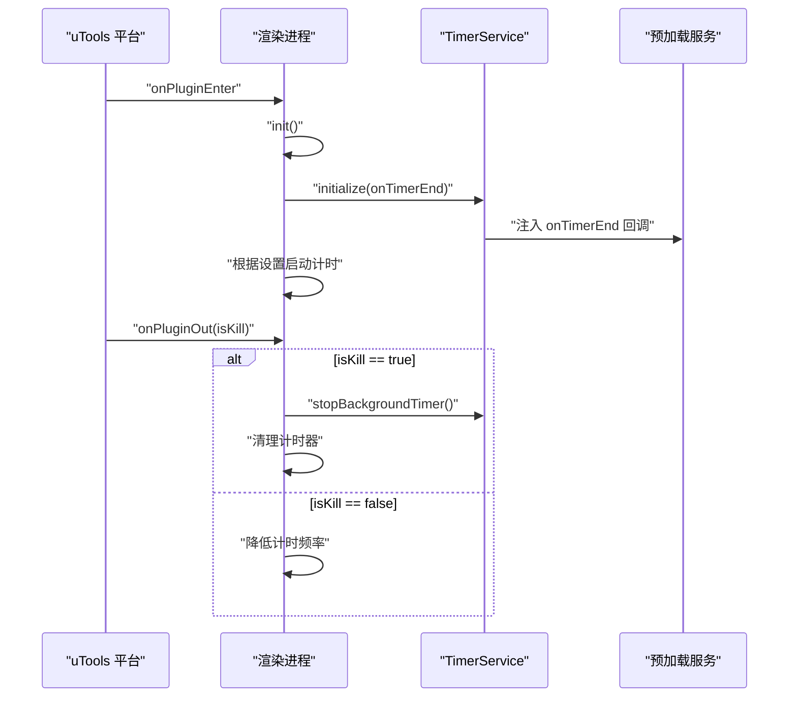
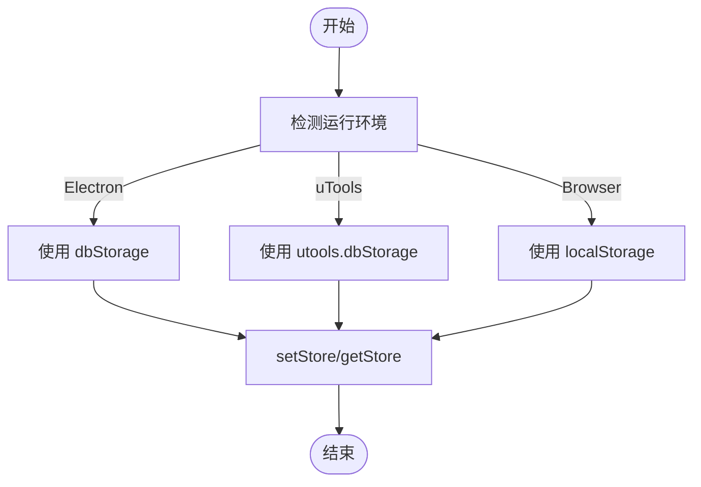
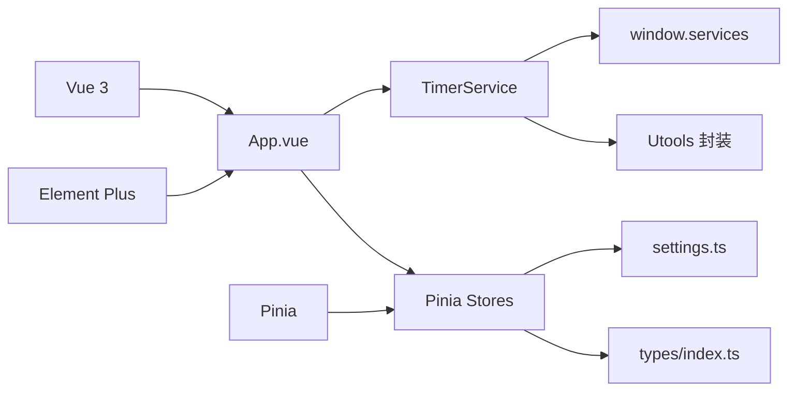

# 集成架构

<cite>
**本文引用的文件**
- [package.json](file://package.json)
- [plugin.json](file://public/plugin.json)
- [index.html](file://index.html)
- [main.ts](file://src/main.ts)
- [App.vue](file://src/App.vue)
- [utools.ts](file://src/utils/utools.ts)
- [timerService.ts](file://src/services/timerService.ts)
- [services.js](file://public/preload/services.js)
- [settings.ts](file://src/settings.ts)
- [settingsStore.ts](file://src/stores/settingsStore.ts)
- [notifier.ts](file://src/utils/notifier.ts)
- [TimingCore.vue](file://src/components/TimingCore.vue)
- [types/index.ts](file://src/types/index.ts)
- [vite.config.ts](file://vite.config.ts)
</cite>

## 目录
1. [简介](#简介)
2. [项目结构](#项目结构)
3. [核心组件](#核心组件)
4. [架构总览](#架构总览)
5. [详细组件分析](#详细组件分析)
6. [依赖关系分析](#依赖关系分析)
7. [性能考量](#性能考量)
8. [故障排查指南](#故障排查指南)
9. [结论](#结论)
10. [附录](#附录)

## 简介
本项目是基于 uTools 插件平台的“休息提醒”应用，采用 Electron + Vue 3 + Pinia + Vite 技术栈构建。其核心目标是在用户专注工作时进行倒计时，并在到达休息时间时通过系统通知与窗口提示进行提醒，同时提供可配置的计时参数与本地持久化存储。项目通过 preload 服务桥接 Electron 的 Node/Electron 能力与渲染进程，实现后台计时、系统通知与本地存储等能力的统一封装与跨环境兼容。

## 项目结构
项目采用典型的前端工程化组织方式：
- public：插件元数据与预加载脚本
  - plugin.json：插件清单，定义入口页面、预加载脚本、功能码与开发模式主入口
  - preload/services.js：预加载服务，注入 window.services 提供后台计时、通知与本地存储能力
- src：源代码
  - main.ts：应用入口，挂载 Vue 应用，引入 UI 框架与状态管理
  - App.vue：根组件，负责初始化、生命周期事件绑定与计时器启动
  - utils/utools.ts：对 uTools API 的统一封装，提供插件生命周期、窗口控制、通知、复制、主题检测等能力
  - services/timerService.ts：计时服务，封装后台计时与存储访问，支持多环境降级
  - stores/*：Pinia 状态管理，包括设置、计时、状态与一言数据
  - components/*：UI 组件，如计时核心面板、操作面板、顶部栏等
  - utils/*：工具模块，如消息通知、计时格式化、事件总线等
  - types/index.ts：类型定义，涵盖计时状态、用户设置、事件映射等
  - settings.ts：全局配置与默认设置
  - index.html：HTML 入口，加载图标字体与应用入口脚本
  - vite.config.ts：Vite 构建配置

图表来源
- [plugin.json:1-25](file://public/plugin.json#L1-L25)
- [services.js:1-102](file://public/preload/services.js#L1-L102)
- [index.html:1-14](file://index.html#L1-L14)
- [main.ts:1-19](file://src/main.ts#L1-L19)
- [App.vue:1-145](file://src/App.vue#L1-L145)
- [utools.ts:1-165](file://src/utils/utools.ts#L1-L165)
- [timerService.ts:1-161](file://src/services/timerService.ts#L1-L161)
- [settings.ts:1-50](file://src/settings.ts#L1-L50)
- [types/index.ts:1-83](file://src/types/index.ts#L1-L83)

章节来源
- [package.json:1-23](file://package.json#L1-L23)
- [plugin.json:1-25](file://public/plugin.json#L1-L25)
- [index.html:1-14](file://index.html#L1-L14)
- [main.ts:1-19](file://src/main.ts#L1-L19)
- [vite.config.ts:1-15](file://vite.config.ts#L1-L15)

## 核心组件
- 预加载服务（window.services）
  - 提供后台计时器管理、剩余时间查询、系统通知显示以及本地存储读写
  - 通过 Electron 的 ipcRenderer 与 Notification 能力实现底层功能
- 计时服务（TimerService）
  - 封装后台计时与存储访问，支持多环境降级（浏览器、uTools、Electron）
  - 通过 window.services 注入的后台能力实现跨窗口生命周期的计时
- uTools API 封装（Utools）
  - 统一封装插件生命周期、窗口控制、通知、复制、主题检测等
  - 在非 uTools 环境下提供降级方案（alert、navigator.clipboard、matchMedia）
- 状态管理（Pinia）
  - settingsStore：用户设置的加载、保存与更新
  - timingStore/statusStore/hitokotoStore：计时状态、界面状态与一言数据
- UI 组件
  - TimingCore：计时进度与剩余时间展示
  - OperationPanel/TopBar/Hitokoto：操作面板、顶部栏与一言展示

章节来源
- [services.js:1-102](file://public/preload/services.js#L1-L102)
- [timerService.ts:1-161](file://src/services/timerService.ts#L1-L161)
- [utools.ts:1-165](file://src/utils/utools.ts#L1-L165)
- [settingsStore.ts:1-87](file://src/stores/settingsStore.ts#L1-L87)
- [TimingCore.vue:1-101](file://src/components/TimingCore.vue#L1-L101)

## 架构总览
整体架构围绕“预加载服务桥接 Electron 能力 + 渲染进程统一 API 封装”的设计展开。预加载脚本在渲染进程启动前注入 window.services，使应用在 Electron 环境中具备后台计时、系统通知与本地存储能力；同时，Utools 封装层确保在浏览器或 uTools 环境下的行为一致性。

图表来源
- [services.js:1-102](file://public/preload/services.js#L1-L102)
- [timerService.ts:1-161](file://src/services/timerService.ts#L1-L161)
- [utools.ts:1-165](file://src/utils/utools.ts#L1-L165)
- [App.vue:1-145](file://src/App.vue#L1-L145)

## 详细组件分析

### 预加载服务（preload services）
- 作用
  - 在渲染进程启动前注入 window.services，提供后台计时器、系统通知与本地存储能力
  - 通过 Electron 的 ipcRenderer 与 Notification 实现底层功能
- 关键能力
  - 后台计时器：启动/停止/查询剩余时间，周期性检查并触发 onTimerEnd 回调
  - 系统通知：封装 Notification API，支持标题与内容
  - 本地存储：封装 dbStorage 的 getItem/setItem/removeItem
- 设计要点
  - 通过 window 对象注入，避免直接暴露 Node/Electron API
  - 提供可覆盖的 onTimerEnd 回调，便于上层业务接管计时结束后的处理

图表来源
- [services.js:13-101](file://public/preload/services.js#L13-L101)

章节来源
- [services.js:1-102](file://public/preload/services.js#L1-L102)

### 计时服务（TimerService）
- 作用
  - 封装后台计时与存储访问，统一渲染进程与预加载服务的交互
  - 支持多环境降级：Electron（预加载）、uTools（平台 API）、浏览器（localStorage）
- 关键流程
  - 初始化：将 onTimerEnd 回调注入 window.services
  - 启动/停止：委托给 window.services
  - 通知与存储：优先使用预加载服务，否则回退到 uTools 或浏览器 API
- 数据结构
  - BackgroundServices 接口定义了后台服务所需的方法签名
  - TimerStatus 与 TimingStateKey 定义计时状态与事件载荷

图表来源
- [timerService.ts:24-161](file://src/services/timerService.ts#L24-L161)
- [types/index.ts:6-18](file://src/types/index.ts#L6-L18)

章节来源
- [timerService.ts:1-161](file://src/services/timerService.ts#L1-L161)
- [types/index.ts:1-83](file://src/types/index.ts#L1-L83)

### uTools API 封装（Utools）
- 作用
  - 统一封装插件生命周期、窗口控制、通知、复制、主题检测等能力
  - 在非 uTools 环境下提供降级方案，保证开发与测试可用性
- 关键能力
  - 生命周期：onEnter/onHide
  - 窗口控制：showMainWindow/hideMainWindow/outPlugin
  - 通知：showNotification（浏览器环境使用 alert 降级）
  - 存储：dbStorage 的 get/set/load/remove
  - 工具：copyText、getWindowType/isMainWindow/isDetachWindow、isDarkColors

图表来源
- [utools.ts:13-165](file://src/utils/utools.ts#L13-L165)

章节来源
- [utools.ts:1-165](file://src/utils/utools.ts#L1-L165)

### 插件生命周期与窗口控制
- 生命周期
  - onEnter：插件进入前台时，切换计时优先级、刷新一言、标记窗口状态
  - onHide：插件隐藏或被结束时，根据 isKill 清理计时器或降低计时频率
- 窗口控制
  - showWindow/hideWindow/outPlugin：与 uTools 平台交互，控制主窗口显示与插件退出

图表来源
- [App.vue:82-106](file://src/App.vue#L82-L106)
- [timerService.ts:59-70](file://src/services/timerService.ts#L59-L70)
- [utools.ts:19-30](file://src/utils/utools.ts#L19-L30)

章节来源
- [App.vue:1-145](file://src/App.vue#L1-L145)
- [utools.ts:1-165](file://src/utils/utools.ts#L1-L165)

### 本地存储与数据持久化
- 存储位置
  - Electron 环境：dbStorage（预加载服务注入）
  - uTools 环境：utools.dbStorage
  - 浏览器环境：localStorage（降级）
- 使用策略
  - settingsStore：集中管理用户设置的加载、保存与更新
  - TimerService：提供 setStore/getStore 方法，按需选择后端存储
- 默认值与加载
  - 若存储中无值，使用默认值并写回存储，确保首次使用体验一致

图表来源
- [timerService.ts:123-156](file://src/services/timerService.ts#L123-L156)
- [settingsStore.ts:39-61](file://src/stores/settingsStore.ts#L39-L61)

章节来源
- [timerService.ts:1-161](file://src/services/timerService.ts#L1-L161)
- [settingsStore.ts:1-87](file://src/stores/settingsStore.ts#L1-L87)

### 系统通知与权限管理
- 通知来源
  - 预加载服务：使用 Electron Notification API
  - Utools 封装：使用 uTools.showNotification
  - 浏览器降级：使用 alert
- 权限管理
  - Electron 环境下，Notification API 通常无需额外权限声明
  - uTools 环境下遵循平台通知策略
  - 浏览器环境下，alert 为浏览器内置行为，不涉及额外权限

章节来源
- [services.js:76-84](file://public/preload/services.js#L76-L84)
- [utools.ts:101-108](file://src/utils/utools.ts#L101-L108)

### 通信协议与数据交换
- 预加载服务注入
  - window.services 作为统一接口，渲染进程通过该对象访问后台能力
- 计时结束回调
  - TimerService.initialize 时注入 onTimerEnd，预加载服务在计时结束时触发
- 事件与状态
  - TimingStateKey 与 TimerStatus 定义计时状态与事件载荷
  - Pinia Store 管理计时状态与 UI 状态，组件通过计算属性响应式更新

章节来源
- [timerService.ts:59-70](file://src/services/timerService.ts#L59-L70)
- [types/index.ts:4-83](file://src/types/index.ts#L4-L83)
- [TimingCore.vue:62-101](file://src/components/TimingCore.vue#L62-L101)

## 依赖关系分析
- 外部依赖
  - Vue 3、Element Plus、Pinia：用于应用框架与状态管理
  - uTools API 类型：提供平台 API 的类型定义
- 内部依赖
  - App.vue 依赖 TimerService、Utools、Pinia Store
  - TimerService 依赖 window.services 与 Utools
  - settingsStore 依赖 Utools 与 settings.ts

图表来源
- [package.json:8-21](file://package.json#L8-L21)
- [main.ts:4-16](file://src/main.ts#L4-L16)
- [App.vue:137-143](file://src/App.vue#L137-L143)
- [timerService.ts:43-47](file://src/services/timerService.ts#L43-L47)
- [utools.ts:9-11](file://src/utils/utools.ts#L9-L11)
- [settings.ts:1-50](file://src/settings.ts#L1-L50)
- [types/index.ts:1-83](file://src/types/index.ts#L1-L83)

章节来源
- [package.json:1-23](file://package.json#L1-L23)
- [main.ts:1-19](file://src/main.ts#L1-L19)

## 性能考量
- 计时优先级
  - 前台：提高计时频率（短间隔），提升响应性
  - 后台：降低计时频率（长间隔），减少资源消耗
- 存储访问
  - 避免频繁读写，批量更新或节流处理
- UI 更新
  - 使用计算属性与响应式数据，减少不必要的重渲染
- 构建优化
  - Vite 提供快速开发与生产构建，路径别名与基础路径配置有助于打包优化

章节来源
- [App.vue:117-119](file://src/App.vue#L117-L119)
- [vite.config.ts:1-15](file://vite.config.ts#L1-L15)

## 故障排查指南
- 预加载服务不可用
  - 现象：计时器无法启动或通知无法显示
  - 排查：确认 plugin.json 中 preload 字段正确指向 services.js；检查 window.services 是否存在
- 计时结束未触发
  - 现象：计时结束后无回调
  - 排查：确认 TimerService.initialize 已调用且 onTimerEnd 已注入；检查预加载服务的计时器逻辑
- 通知未显示
  - 现象：调用通知接口无效果
  - 排查：Electron 环境检查 Notification 权限；uTools 环境检查平台通知策略；浏览器环境确认 alert 可用
- 存储读取异常
  - 现象：设置无法保存或加载
  - 排查：检查对应环境的存储 API（dbStorage/localStorage）是否可用；确认键名一致

章节来源
- [plugin.json:7](file://public/plugin.json#L7)
- [services.js:13-101](file://public/preload/services.js#L13-L101)
- [timerService.ts:59-70](file://src/services/timerService.ts#L59-L70)
- [utools.ts:101-108](file://src/utils/utools.ts#L101-L108)
- [settingsStore.ts:39-61](file://src/stores/settingsStore.ts#L39-L61)

## 结论
本项目通过预加载服务与 uTools API 封装，实现了在 Electron 与 uTools 平台上的统一能力抽象。计时服务与状态管理解耦清晰，支持多环境降级与灵活的生命周期控制。通过合理的存储策略与通知机制，确保了良好的用户体验与可维护性。建议后续可进一步增强错误监控与日志记录，以提升问题定位效率。

## 附录
- 插件清单字段说明
  - name/version/description/author/logo：插件基本信息
  - main：主入口页面
  - preload：预加载脚本路径
  - development.main：开发模式主入口地址
  - features：功能码与命令注册
- 开发与构建
  - dev/build：Vite 脚本
  - utools-api-types：平台 API 类型定义

章节来源
- [plugin.json:1-25](file://public/plugin.json#L1-L25)
- [package.json:3-7](file://package.json#L3-L7)