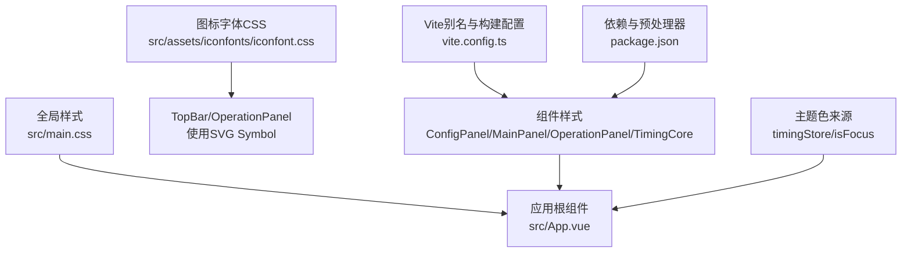
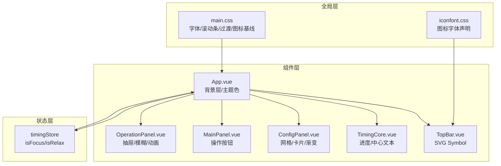
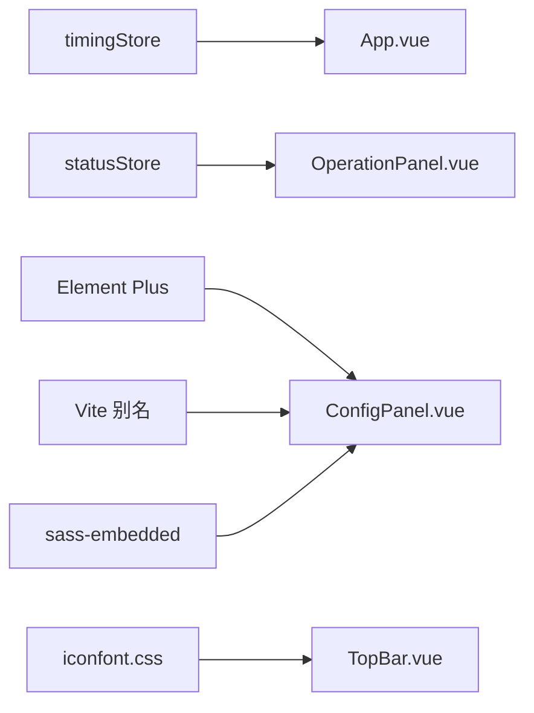

# 样式与主题

<cite>
**本文档引用的文件**
- [src/main.css](file://src/main.css)
- [src/assets/iconfonts/iconfont.css](file://src/assets/iconfonts/iconfont.css)
- [src/assets/iconfonts/demo_index.html](file://src/assets/iconfonts/demo_index.html)
- [src/App.vue](file://src/App.vue)
- [src/components/operationPanel/ConfigPanel.vue](file://src/components/operationPanel/ConfigPanel.vue)
- [src/components/operationPanel/MainPanel.vue](file://src/components/operationPanel/MainPanel.vue)
- [src/components/operationPanel/OperationPanel.vue](file://src/components/operationPanel/OperationPanel.vue)
- [src/components/TimingCore.vue](file://src/components/TimingCore.vue)
- [src/components/TopBar.vue](file://src/components/TopBar.vue)
- [src/stores/settingsStore.ts](file://src/stores/settingsStore.ts)
- [src/stores/timingStore.ts](file://src/stores/timingStore.ts)
- [src/utils/timer.ts](file://src/utils/timer.ts)
- [vite.config.ts](file://vite.config.ts)
- [package.json](file://package.json)
</cite>

## 目录
1. [简介](#简介)
2. [项目结构](#项目结构)
3. [核心组件](#核心组件)
4. [架构总览](#架构总览)
5. [详细组件分析](#详细组件分析)
6. [依赖关系分析](#依赖关系分析)
7. [性能考量](#性能考量)
8. [故障排查指南](#故障排查指南)
9. [结论](#结论)
10. [附录](#附录)

## 简介
本文件面向“休息提醒”项目的样式系统，系统性阐述CSS架构与样式组织原则、主题系统（颜色、字体、响应式）、SVG图标字体集成与使用、SCSS预处理器与模块化管理、组件样式封装与作用域隔离、主题切换与样式定制、动画与过渡效果、移动端适配与跨浏览器兼容策略，并提供扩展与最佳实践建议。

## 项目结构
样式系统由全局基础样式、图标字体资源、组件级样式与状态驱动的背景主题构成。全局样式负责基础排版、滚动条隐藏、过渡动画与图标字体基线；各组件通过scoped SCSS进行局部样式封装；主题色由计时状态动态控制，配合渐变与滤镜营造视觉层次。

图表来源
- [src/main.css:1-54](file://src/main.css#L1-L54)
- [src/App.vue:1-145](file://src/App.vue#L1-L145)
- [src/assets/iconfonts/iconfont.css:1-40](file://src/assets/iconfonts/iconfont.css#L1-L40)
- [src/components/operationPanel/OperationPanel.vue:1-180](file://src/components/operationPanel/OperationPanel.vue#L1-L180)
- [src/components/operationPanel/MainPanel.vue:1-82](file://src/components/operationPanel/MainPanel.vue#L1-L82)
- [src/components/TopBar.vue:1-49](file://src/components/TopBar.vue#L1-L49)
- [src/stores/timingStore.ts:1-141](file://src/stores/timingStore.ts#L1-L141)
- [vite.config.ts:1-15](file://vite.config.ts#L1-L15)
- [package.json:1-23](file://package.json#L1-L23)

章节来源
- [src/main.css:1-54](file://src/main.css#L1-L54)
- [src/App.vue:1-145](file://src/App.vue#L1-L145)
- [vite.config.ts:1-15](file://vite.config.ts#L1-L15)
- [package.json:1-23](file://package.json#L1-L23)

## 核心组件
- 全局样式与基础排版
  - 字体声明与加载：Poppins、DejaVu Sans Mono、Swei Toothpaste CJK sc
  - 全局选择器与尺寸：统一字体族、字号、无选中、溢出隐藏
  - 滚动条隐藏：针对 WebKit 内核的滚动条
  - 图标基线：SVG icon 类的尺寸、垂直对齐、颜色继承与溢出控制
  - Vue Transition：全局进入/离开过渡（opacity）
- 主题色与背景
  - App 背景层：根据计时状态（专注/休息）动态切换背景色
  - TimingCore 中心圆：根据状态切换背景色与字体族
- 图标字体与SVG
  - iconfont 字体：声明字体族、平滑渲染、多格式源
  - SVG Symbol：TopBar 使用 symbol 方式，Icon 基类样式复用
- 组件样式
  - OperationPanel：抽屉式上拉面板，backdrop-filter 模糊、transform 动画、will-change 优化
  - MainPanel：操作按钮容器与悬停缩放、阴影与过渡
  - ConfigPanel：网格布局、卡片阴影、渐变背景、Element Plus 组件深度选择器覆盖
  - TimingCore：仪表盘进度与中心文本、百分比计算、字体族切换
  - TopBar：右上角设置按钮、SVG symbol 使用

章节来源
- [src/main.css:1-54](file://src/main.css#L1-L54)
- [src/App.vue:1-145](file://src/App.vue#L1-L145)
- [src/components/operationPanel/OperationPanel.vue:1-180](file://src/components/operationPanel/OperationPanel.vue#L1-L180)
- [src/components/operationPanel/MainPanel.vue:1-82](file://src/components/operationPanel/MainPanel.vue#L1-L82)
- [src/components/operationPanel/ConfigPanel.vue:1-378](file://src/components/operationPanel/ConfigPanel.vue#L1-L378)
- [src/components/TimingCore.vue:1-101](file://src/components/TimingCore.vue#L1-L101)
- [src/components/TopBar.vue:1-49](file://src/components/TopBar.vue#L1-L49)
- [src/assets/iconfonts/iconfont.css:1-40](file://src/assets/iconfonts/iconfont.css#L1-L40)

## 架构总览
样式系统采用“全局基线 + 组件作用域 + 状态驱动主题”的三层架构：
- 全局基线：字体、滚动条、过渡、图标基线
- 组件作用域：每个组件独立的 scoped SCSS，避免样式泄漏
- 状态驱动主题：计时状态决定背景色与部分视觉元素，形成轻量主题

图表来源
- [src/main.css:1-54](file://src/main.css#L1-L54)
- [src/assets/iconfonts/iconfont.css:1-40](file://src/assets/iconfonts/iconfont.css#L1-L40)
- [src/App.vue:1-145](file://src/App.vue#L1-L145)
- [src/components/operationPanel/OperationPanel.vue:1-180](file://src/components/operationPanel/OperationPanel.vue#L1-L180)
- [src/components/operationPanel/MainPanel.vue:1-82](file://src/components/operationPanel/MainPanel.vue#L1-L82)
- [src/components/operationPanel/ConfigPanel.vue:1-378](file://src/components/operationPanel/ConfigPanel.vue#L1-L378)
- [src/components/TimingCore.vue:1-101](file://src/components/TimingCore.vue#L1-L101)
- [src/components/TopBar.vue:1-49](file://src/components/TopBar.vue#L1-L49)
- [src/stores/timingStore.ts:1-141](file://src/stores/timingStore.ts#L1-L141)

## 详细组件分析

### 主题系统与颜色变量
- 颜色来源
  - App 背景色：根据计时状态（专注/休息）选择不同色系
  - TimingCore 中心圆：根据状态切换背景色
  - ConfigPanel 卡片与按钮：使用渐变与边框色，hover 与交互态有过渡
- 字体系统
  - Poppins 作为默认字体族
  - DejaVu Sans Mono 用于计时数字，保证等宽显示
  - Swei Toothpaste CJK sc 作为中文字体备选
- 响应式设计
  - OperationPanel 使用 transform 替代高度变化，减少重排
  - Grid 布局在时间设置区自适应列数
  - 元素 hover 与交互态采用过渡动画，保证在低端设备上的流畅体验

章节来源
- [src/App.vue:1-145](file://src/App.vue#L1-L145)
- [src/components/TimingCore.vue:1-101](file://src/components/TimingCore.vue#L1-L101)
- [src/components/operationPanel/ConfigPanel.vue:1-378](file://src/components/operationPanel/ConfigPanel.vue#L1-L378)
- [src/main.css:1-54](file://src/main.css#L1-L54)

### SVG图标字体集成与使用
- 图标字体声明
  - iconfont 字体族声明，支持 woff2/woff/ttf 多格式
  - iconfont 类设置字体族、字号、平滑渲染
- SVG Symbol 使用
  - TopBar 使用 <svg><use> 方式引用 symbol，复用 .icon 基类样式
  - MainPanel 使用 iconfont 字体类，内联颜色与字号
- 使用建议
  - 优先使用 SVG Symbol 以获得多色与可缩放优势
  - 对于简单单色图标，iconfont 字体类更轻量
  - 所有图标尺寸与颜色通过 CSS 控制，避免内联样式污染

章节来源
- [src/assets/iconfonts/iconfont.css:1-40](file://src/assets/iconfonts/iconfont.css#L1-L40)
- [src/assets/iconfonts/demo_index.html:1-327](file://src/assets/iconfonts/demo_index.html#L1-L327)
- [src/components/TopBar.vue:1-49](file://src/components/TopBar.vue#L1-L49)
- [src/components/operationPanel/MainPanel.vue:1-82](file://src/components/operationPanel/MainPanel.vue#L1-L82)

### SCSS预处理器与模块化样式管理
- 预处理器与构建
  - 项目使用 sass-embedded 作为 SCSS 编译器
  - Vite 配置提供路径别名 @ 指向 src，便于模块化组织
- 模块化与作用域
  - 每个组件使用 <style lang="scss" scoped>，确保样式仅作用于当前组件
  - 使用层级选择器与组件内部类名，避免全局污染
- 深度选择器与第三方组件
  - ConfigPanel 使用 :deep(...) 覆盖 Element Plus 组件的内部样式
  - 注意版本升级时深度选择器可能失效，需定期校验

章节来源
- [package.json:1-23](file://package.json#L1-L23)
- [vite.config.ts:1-15](file://vite.config.ts#L1-L15)
- [src/components/operationPanel/ConfigPanel.vue:1-378](file://src/components/operationPanel/ConfigPanel.vue#L1-L378)

### 组件样式封装与作用域隔离
- 作用域隔离
  - scoped SCSS 自动为选择器添加唯一后缀，避免样式泄漏
  - 子组件样式不会影响父组件，除非通过 ::v-deep 或 :deep(...) 显式穿透
- 性能与可维护性
  - 将样式拆分为多个组件，便于定位与修改
  - 使用语义化类名与层级结构，降低选择器复杂度

章节来源
- [src/App.vue:1-145](file://src/App.vue#L1-L145)
- [src/components/operationPanel/OperationPanel.vue:1-180](file://src/components/operationPanel/OperationPanel.vue#L1-L180)
- [src/components/operationPanel/ConfigPanel.vue:1-378](file://src/components/operationPanel/ConfigPanel.vue#L1-L378)

### 动画与过渡效果
- 全局过渡
  - Vue Transition 定义进入/离开的 opacity 过渡，时长 0.5s
- 组件内动画
  - OperationPanel：backdrop-filter、transform、will-change，使用缓动曲线优化体验
  - MainPanel：按钮 hover 缩放与阴影变化
  - TimingCore：背景色与文本的平滑过渡
- 性能优化
  - 使用 transform 替代改变布局属性
  - will-change 标记关键属性，减少重排
  - 在动画过程中适度降低模糊强度以提升性能

章节来源
- [src/main.css:46-53](file://src/main.css#L46-L53)
- [src/components/operationPanel/OperationPanel.vue:1-180](file://src/components/operationPanel/OperationPanel.vue#L1-L180)
- [src/components/operationPanel/MainPanel.vue:1-82](file://src/components/operationPanel/MainPanel.vue#L1-L82)
- [src/components/TimingCore.vue:1-101](file://src/components/TimingCore.vue#L1-L101)

### 移动端适配与跨浏览器兼容
- 移动端适配
  - 使用相对单位与 transform，避免固定像素导致的布局问题
  - Grid 与 Flex 布局在小屏设备上自适应
- 跨浏览器兼容
  - iconfont 字体声明包含多种格式，提升兼容性
  - SVG Symbol 方案在现代浏览器表现良好，IE9+ 支持
  - WebKit 特有属性（如 -webkit-backdrop-filter）与标准属性并存，确保降级可用

章节来源
- [src/assets/iconfonts/iconfont.css:1-40](file://src/assets/iconfonts/iconfont.css#L1-L40)
- [src/components/operationPanel/OperationPanel.vue:1-180](file://src/components/operationPanel/OperationPanel.vue#L1-L180)

### 主题切换与样式定制
- 现状
  - 主题色由计时状态（专注/休息）驱动，通过背景色与进度条颜色体现
- 实现建议
  - 新增主题存储：在 Pinia 中新增 themeStore，保存主题名称与颜色映射
  - 动态注入 CSS 变量：在根节点注入 CSS 变量，组件通过 var() 读取
  - 主题切换流程：用户选择主题 → 更新 themeStore → 触发根节点 CSS 变量更新 → 组件响应式刷新
  - 保持向后兼容：默认主题沿用现有颜色，避免破坏既有体验

章节来源
- [src/stores/timingStore.ts:1-141](file://src/stores/timingStore.ts#L1-L141)
- [src/App.vue:1-145](file://src/App.vue#L1-L145)

## 依赖关系分析
- 样式依赖
  - App.vue 依赖 timingStore 的状态以决定背景色
  - OperationPanel 依赖状态 store 控制展开/收起与模糊强度
  - TopBar 依赖 SVG Symbol 与 icon 基类样式
- 构建与工具链
  - Vite 提供路径别名与模块解析
  - sass-embedded 提供 SCSS 编译能力
  - Element Plus 组件库提供 UI 基础，ConfigPanel 使用 :deep(...) 覆盖其样式

图表来源
- [src/stores/timingStore.ts:1-141](file://src/stores/timingStore.ts#L1-L141)
- [src/stores/settingsStore.ts:1-87](file://src/stores/settingsStore.ts#L1-L87)
- [src/components/operationPanel/OperationPanel.vue:1-180](file://src/components/operationPanel/OperationPanel.vue#L1-L180)
- [src/components/operationPanel/ConfigPanel.vue:1-378](file://src/components/operationPanel/ConfigPanel.vue#L1-L378)
- [vite.config.ts:1-15](file://vite.config.ts#L1-L15)
- [package.json:1-23](file://package.json#L1-L23)
- [src/assets/iconfonts/iconfont.css:1-40](file://src/assets/iconfonts/iconfont.css#L1-L40)
- [src/components/TopBar.vue:1-49](file://src/components/TopBar.vue#L1-L49)

章节来源
- [src/stores/timingStore.ts:1-141](file://src/stores/timingStore.ts#L1-L141)
- [src/stores/settingsStore.ts:1-87](file://src/stores/settingsStore.ts#L1-L87)
- [src/components/operationPanel/OperationPanel.vue:1-180](file://src/components/operationPanel/OperationPanel.vue#L1-L180)
- [src/components/operationPanel/ConfigPanel.vue:1-378](file://src/components/operationPanel/ConfigPanel.vue#L1-L378)
- [vite.config.ts:1-15](file://vite.config.ts#L1-L15)
- [package.json:1-23](file://package.json#L1-L23)
- [src/assets/iconfonts/iconfont.css:1-40](file://src/assets/iconfonts/iconfont.css#L1-L40)
- [src/components/TopBar.vue:1-49](file://src/components/TopBar.vue#L1-L49)

## 性能考量
- 减少重排与重绘
  - 使用 transform 与 opacity 动画替代布局变更
  - will-change 标记关键属性，提升合成层优化概率
- 滤镜与合成
  - backdrop-filter 在低端设备上可能造成性能压力，可在动画过程中临时降低模糊强度
- 字体与图标
  - iconfont 多格式声明提升加载稳定性
  - SVG Symbol 更适合多色图标，但渲染性能略低于位图
- 组件渲染
  - 抽屉面板始终渲染内容，通过淡入淡出与指针事件控制减少频繁挂载

章节来源
- [src/components/operationPanel/OperationPanel.vue:1-180](file://src/components/operationPanel/OperationPanel.vue#L1-L180)
- [src/assets/iconfonts/iconfont.css:1-40](file://src/assets/iconfonts/iconfont.css#L1-L40)

## 故障排查指南
- 图标不显示或样式异常
  - 检查 iconfont.css 是否正确引入
  - 确认字体文件路径与格式可用
  - SVG Symbol 需要正确的 <use xlink:href="#"> 引用
- 过渡动画卡顿
  - 检查是否使用 transform 与 opacity
  - 适当降低 backdrop-filter 强度或移除以对比性能
- 第三方组件样式被覆盖
  - 确认 :deep(...) 语法正确且未被升级破坏
  - 逐步缩小选择器范围，避免过度全局污染
- 主题色未生效
  - 检查 timingStore 的状态切换逻辑
  - 确认 App 背景色绑定表达式与状态一致

章节来源
- [src/assets/iconfonts/iconfont.css:1-40](file://src/assets/iconfonts/iconfont.css#L1-L40)
- [src/components/TopBar.vue:1-49](file://src/components/TopBar.vue#L1-L49)
- [src/components/operationPanel/OperationPanel.vue:1-180](file://src/components/operationPanel/OperationPanel.vue#L1-L180)
- [src/components/operationPanel/ConfigPanel.vue:1-378](file://src/components/operationPanel/ConfigPanel.vue#L1-L378)
- [src/stores/timingStore.ts:1-141](file://src/stores/timingStore.ts#L1-L141)
- [src/App.vue:1-145](file://src/App.vue#L1-L145)

## 结论
本项目采用“全局基线 + 组件作用域 + 状态驱动主题”的样式架构，结合 SCSS 模块化与图标字体/符号方案，实现了清晰、可维护且具备一定性能优化的界面体系。未来可在保持现状稳定性的前提下，引入 CSS 变量与主题存储，实现更灵活的主题切换与定制能力。

## 附录

### 最佳实践清单
- 样式组织
  - 优先使用 scoped SCSS，避免全局污染
  - 将组件样式拆分为多个文件，便于维护
- 主题与颜色
  - 使用状态驱动的颜色切换，保持一致性
  - 为未来主题系统预留 CSS 变量与主题存储
- 图标与字体
  - 优先使用 SVG Symbol，兼顾多色与缩放
  - iconfont 适用于简单单色图标，注意多格式声明
- 动画与性能
  - 使用 transform 与 opacity 动画
  - 合理使用 will-change 与 backdrop-filter
- 兼容性
  - 保留 WebKit 前缀与降级方案
  - 在低端设备上适度降低滤镜强度