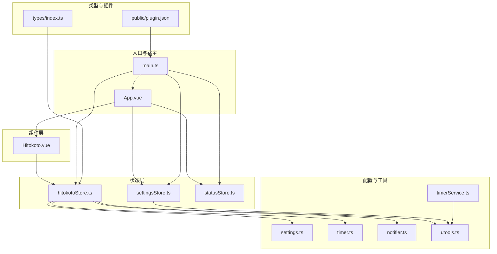
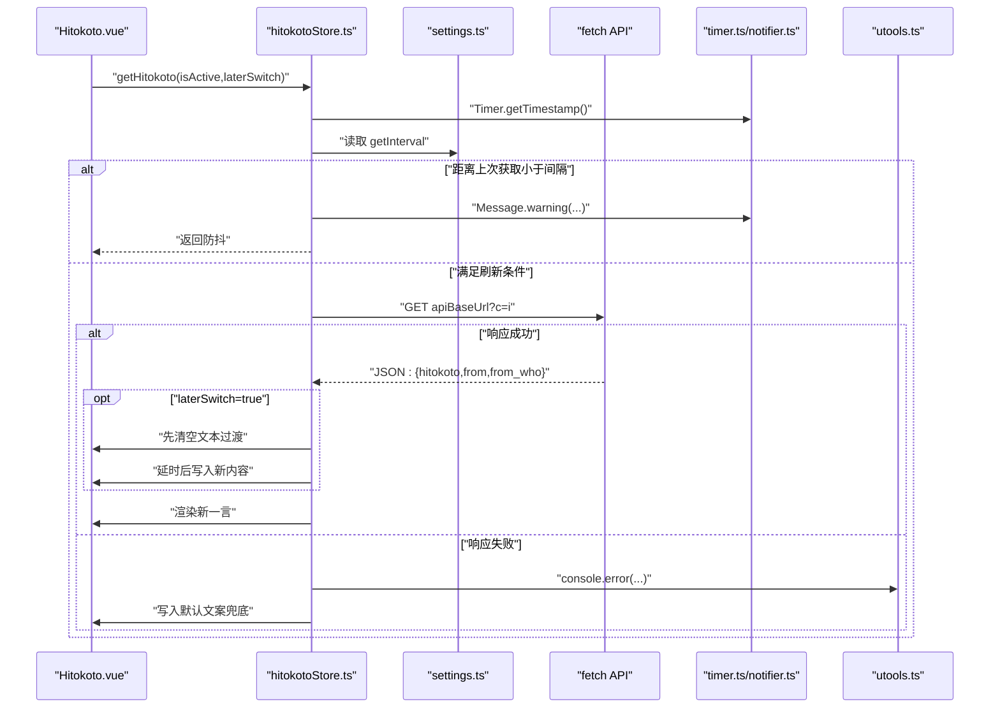
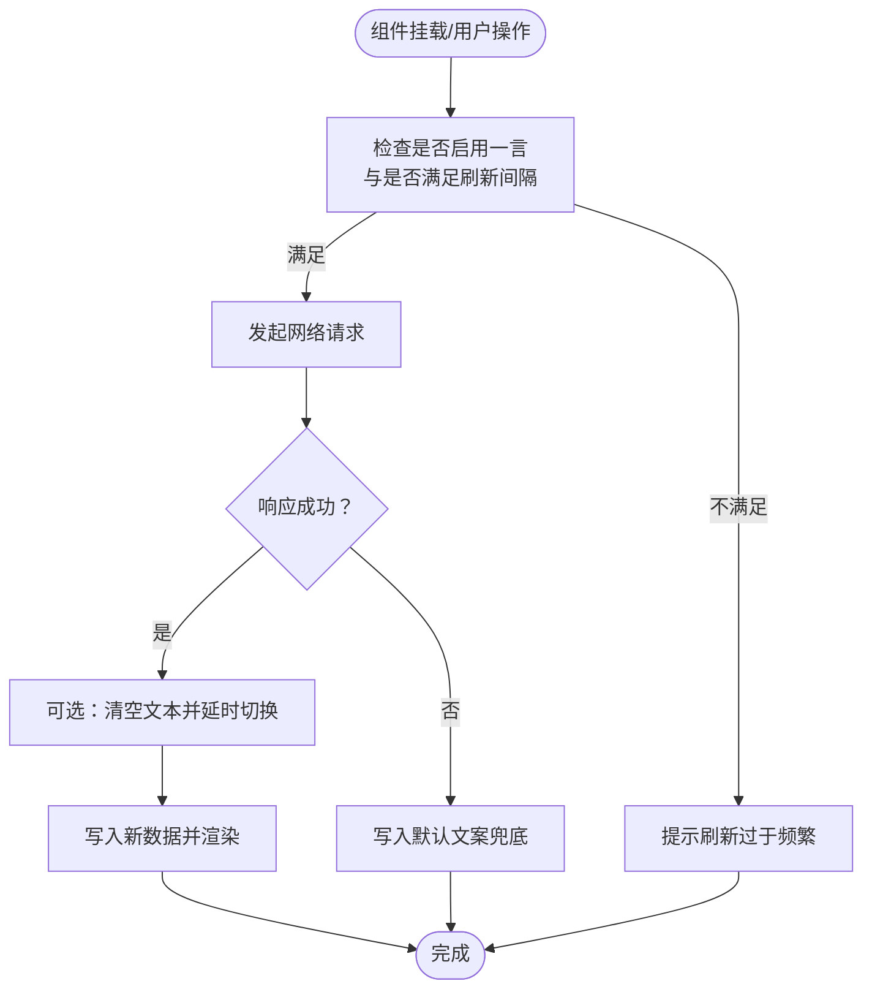
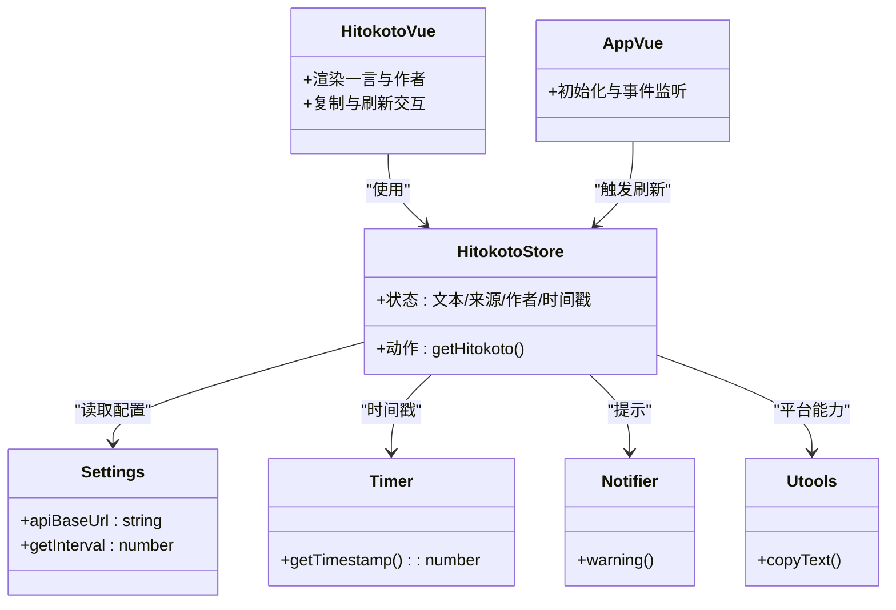

# 一言展示组件

<cite>
**本文引用的文件列表**
- [Hitokoto.vue](file://src/components/Hitokoto.vue)
- [hitokotoStore.ts](file://src/stores/hitokotoStore.ts)
- [settings.ts](file://src/settings.ts)
- [timer.ts](file://src/utils/timer.ts)
- [notifier.ts](file://src/utils/notifier.ts)
- [utools.ts](file://src/utils/utools.ts)
- [timerService.ts](file://src/services/timerService.ts)
- [index.ts](file://src/types/index.ts)
- [main.ts](file://src/main.ts)
- [App.vue](file://src/App.vue)
- [settingsStore.ts](file://src/stores/settingsStore.ts)
- [statusStore.ts](file://src/stores/statusStore.ts)
- [MainPanel.vue](file://src/components/operationPanel/MainPanel.vue)
- [plugin.json](file://public/plugin.json)
</cite>

## 目录
1. [简介](#简介)
2. [项目结构](#项目结构)
3. [核心组件](#核心组件)
4. [架构总览](#架构总览)
5. [详细组件分析](#详细组件分析)
6. [依赖关系分析](#依赖关系分析)
7. [性能与可用性考虑](#性能与可用性考虑)
8. [故障排查指南](#故障排查指南)
9. [结论](#结论)
10. [附录：配置与扩展](#附录配置与扩展)

## 简介
本文件面向“一言展示组件”（Hitokoto），系统性阐述其数据获取机制、缓存与错误处理策略、数据流从 store 到 UI 的渲染路径、展示样式与交互行为、刷新机制（定时/手动/异常处理）、配置项与可扩展点，并给出数据持久化与离线模式建议。目标是帮助开发者快速理解并安全地定制该组件。

## 项目结构
围绕一言组件的关键文件组织如下：
- 组件层：Hitokoto.vue（展示与交互）
- 状态层：hitokotoStore.ts（Pinia store，封装一言数据与刷新逻辑）
- 配置层：settings.ts（应用配置，含一言 API 地址与刷新间隔）
- 工具层：timer.ts（时间戳与格式化）、notifier.ts（消息通知）、utools.ts（平台 API 封装）
- 服务层：timerService.ts（后台计时与跨环境存储）
- 类型层：index.ts（类型定义）
- 入口与宿主：main.ts、App.vue
- 设置与状态：settingsStore.ts、statusStore.ts
- 面板交互：MainPanel.vue
- 插件元信息：plugin.json

图表来源
- [Hitokoto.vue:34-48](file://src/components/Hitokoto.vue#L34-L48)
- [hitokotoStore.ts:15-71](file://src/stores/hitokotoStore.ts#L15-L71)
- [settings.ts:32-35](file://src/settings.ts#L32-L35)
- [timer.ts:36-38](file://src/utils/timer.ts#L36-L38)
- [notifier.ts:19-61](file://src/utils/notifier.ts#L19-L61)
- [utools.ts:13-164](file://src/utils/utools.ts#L13-L164)
- [timerService.ts:24-157](file://src/services/timerService.ts#L24-L157)
- [main.ts:1-19](file://src/main.ts#L1-L19)
- [App.vue:25-42](file://src/App.vue#L25-L42)
- [settingsStore.ts:39-84](file://src/stores/settingsStore.ts#L39-L84)
- [statusStore.ts:37-43](file://src/stores/statusStore.ts#L37-L43)
- [plugin.json:1-25](file://public/plugin.json#L1-L25)

章节来源
- [main.ts:1-19](file://src/main.ts#L1-L19)
- [App.vue:25-42](file://src/App.vue#L25-L42)
- [plugin.json:1-25](file://public/plugin.json#L1-L25)

## 核心组件
- 一言组件（Hitokoto.vue）：负责渲染一言文本与作者信息，绑定点击事件以触发刷新或复制。
- 一言 Store（hitokotoStore.ts）：封装一言数据获取、防抖、延迟切换动画、错误兜底与状态管理。
- 配置（settings.ts）：定义一言 API 基础地址与刷新间隔等全局配置。
- 工具与服务：timer.ts 提供时间戳；notifier.ts 提示消息；utools.ts 提供平台能力；timerService.ts 提供后台计时与跨环境存储。

章节来源
- [Hitokoto.vue:34-79](file://src/components/Hitokoto.vue#L34-L79)
- [hitokotoStore.ts:15-71](file://src/stores/hitokotoStore.ts#L15-L71)
- [settings.ts:32-35](file://src/settings.ts#L32-L35)
- [timer.ts:36-38](file://src/utils/timer.ts#L36-L38)
- [notifier.ts:19-61](file://src/utils/notifier.ts#L19-L61)
- [utools.ts:13-164](file://src/utils/utools.ts#L13-L164)
- [timerService.ts:24-157](file://src/services/timerService.ts#L24-L157)

## 架构总览
一言组件采用“组件-Store-配置-工具-服务”的分层设计，数据从 API 获取后写入 Pinia store，再由组件响应式渲染。刷新策略包含防抖、延迟切换动画与错误兜底，确保用户体验稳定。

图表来源
- [hitokotoStore.ts:31-69](file://src/stores/hitokotoStore.ts#L31-L69)
- [settings.ts:32-35](file://src/settings.ts#L32-L35)
- [timer.ts:36-38](file://src/utils/timer.ts#L36-L38)
- [notifier.ts:44-46](file://src/utils/notifier.ts#L44-L46)
- [utools.ts:115-122](file://src/utils/utools.ts#L115-L122)

## 详细组件分析

### 一言组件（Hitokoto.vue）
- 渲染逻辑：当存在一言数据时显示文本与作者信息，支持左右键交互：右键复制，左键刷新。
- 动画与样式：居中布局、圆角背景、模糊滤镜、悬停态高亮与阴影增强；字体族与字号通过 scoped SCSS 定义。
- 生命周期：挂载时自动拉取一次一言。
- 事件绑定：点击右键触发复制，点击左键触发刷新；配合 store 的防抖与延迟切换。

章节来源
- [Hitokoto.vue:34-79](file://src/components/Hitokoto.vue#L34-L79)

### 一言 Store（hitokotoStore.ts）
- 状态字段：包含一言文本、来源、作者与上次获取时间戳。
- 刷新流程：
  - 防抖：基于当前时间戳与上次获取时间差与配置间隔比较，避免频繁请求。
  - 请求：使用 fetch 访问一言 API，解析 JSON 并写入 store。
  - 动画切换：当启用延迟切换时，先清空文本，等待短暂延时后写入新内容，形成平滑过渡。
  - 错误兜底：请求失败时写入默认文案，保证 UI 不空白。
- 交互提示：当主动触发且触发过快时，通过消息通知提示用户。

章节来源
- [hitokotoStore.ts:15-71](file://src/stores/hitokotoStore.ts#L15-L71)
- [settings.ts:32-35](file://src/settings.ts#L32-L35)
- [timer.ts:36-38](file://src/utils/timer.ts#L36-L38)
- [notifier.ts:44-46](file://src/utils/notifier.ts#L44-L46)

### 数据流与渲染路径
- 组件渲染：组件通过 Pinia 访问 store 中的一言数据，响应式更新 DOM。
- 刷新触发：组件挂载、点击、面板切换、插件进入等场景会触发刷新。
- 宿主控制：App.vue 根据设置决定是否渲染一言组件，并在插件进入时主动刷新。

图表来源
- [Hitokoto.vue:34-79](file://src/components/Hitokoto.vue#L34-L79)
- [hitokotoStore.ts:31-69](file://src/stores/hitokotoStore.ts#L31-L69)
- [App.vue:82-92](file://src/App.vue#L82-L92)

章节来源
- [App.vue:82-92](file://src/App.vue#L82-L92)
- [Hitokoto.vue:34-79](file://src/components/Hitokoto.vue#L34-L79)

### 展示样式与交互
- 字体与排版：组件内指定字体族与字号，保证在不同环境下一致呈现。
- 背景与过渡：圆角、模糊背景与 hover 效果提升可读性与交互反馈。
- 动画策略：延迟切换减少视觉闪烁，提升体验。
- 交互行为：复制与刷新分别绑定左右键，符合直觉。

章节来源
- [Hitokoto.vue:1-31](file://src/components/Hitokoto.vue#L1-L31)
- [Hitokoto.vue:57-61](file://src/components/Hitokoto.vue#L57-L61)

### 刷新机制与异常处理
- 定时刷新：由外部逻辑（如 App.vue 插件进入）触发，结合设置决定是否启用。
- 手动刷新：组件左键点击触发，支持主动提示与防抖。
- 异常处理：网络错误时写入默认文案，避免 UI 空白；同时记录错误日志便于调试。
- 动画过渡：在延迟切换模式下，先清空旧内容，再写入新内容，形成自然过渡。

章节来源
- [App.vue:82-92](file://src/App.vue#L82-L92)
- [hitokotoStore.ts:31-69](file://src/stores/hitokotoStore.ts#L31-L69)
- [notifier.ts:44-46](file://src/utils/notifier.ts#L44-L46)

### 配置选项与可扩展点
- 一言 API 基础地址与刷新间隔：可在配置中调整，影响请求频率与来源。
- 主题与样式：可通过覆盖组件样式或引入主题变量实现风格定制。
- 面板联动：面板切换时可触发一言刷新，保证界面信息新鲜度。
- 平台能力：utools 封装提供复制、通知、存储等能力，便于在不同运行环境统一行为。

章节来源
- [settings.ts:32-35](file://src/settings.ts#L32-L35)
- [statusStore.ts:37-43](file://src/stores/statusStore.ts#L37-L43)
- [utools.ts:115-122](file://src/utils/utools.ts#L115-L122)

## 依赖关系分析
- 组件依赖：Hitokoto.vue 依赖 Pinia store、消息通知与平台工具。
- Store 依赖：hitokotoStore.ts 依赖配置、时间工具、消息通知与平台工具。
- 宿主依赖：App.vue 依赖设置与状态 store，并在生命周期中协调一言刷新。
- 类型与入口：types/index.ts 提供类型定义，main.ts 初始化 Vue、Element Plus 与 Pinia。

图表来源
- [Hitokoto.vue:34-79](file://src/components/Hitokoto.vue#L34-L79)
- [hitokotoStore.ts:15-71](file://src/stores/hitokotoStore.ts#L15-L71)
- [settings.ts:32-35](file://src/settings.ts#L32-L35)
- [timer.ts:36-38](file://src/utils/timer.ts#L36-L38)
- [notifier.ts:44-46](file://src/utils/notifier.ts#L44-L46)
- [utools.ts:115-122](file://src/utils/utools.ts#L115-L122)
- [App.vue:56-114](file://src/App.vue#L56-L114)

章节来源
- [index.ts:24-29](file://src/types/index.ts#L24-L29)
- [main.ts:1-19](file://src/main.ts#L1-L19)

## 性能与可用性考虑
- 防抖策略：通过时间戳与配置间隔限制请求频率，避免过度网络请求。
- 延迟切换：在需要时使用清空-延时-写入的三步流程，降低视觉闪烁。
- 错误兜底：网络异常时写入默认文案，保证 UI 可用性。
- 跨环境适配：utools 封装与 timerService 提供多运行环境一致性（桌面、浏览器、uTools 插件）。

章节来源
- [hitokotoStore.ts:31-69](file://src/stores/hitokotoStore.ts#L31-L69)
- [timerService.ts:123-156](file://src/services/timerService.ts#L123-L156)
- [utools.ts:115-122](file://src/utils/utools.ts#L115-L122)

## 故障排查指南
- 无法刷新或频繁提示“刷新过于频繁”：检查配置中的刷新间隔是否过短，或确认组件是否正确传入主动刷新参数。
- 一言为空白：确认网络连通性；查看控制台是否有错误日志；组件会在失败时写入默认文案。
- 复制失败：检查平台环境与权限；utools 封装提供浏览器降级方案。
- 插件进入未刷新：确认 App.vue 的初始化逻辑与设置开关是否启用一言。

章节来源
- [hitokotoStore.ts:31-69](file://src/stores/hitokotoStore.ts#L31-L69)
- [notifier.ts:44-46](file://src/utils/notifier.ts#L44-L46)
- [App.vue:82-92](file://src/App.vue#L82-L92)
- [utools.ts:115-122](file://src/utils/utools.ts#L115-L122)

## 结论
一言展示组件通过清晰的分层设计与稳健的刷新策略，在保证用户体验的同时兼顾了跨环境适配与错误兜底。其可配置性与可扩展性为后续定制提供了良好基础。

## 附录：配置与扩展

### 配置项
- 一言 API 基础地址与刷新间隔：位于配置文件中，可按需调整。
- 用户设置：包含是否启用一言、自动开始计时等，持久化于平台存储。

章节来源
- [settings.ts:32-35](file://src/settings.ts#L32-L35)
- [settingsStore.ts:39-84](file://src/stores/settingsStore.ts#L39-L84)

### 数据持久化与离线模式建议
- 当前实现：使用平台存储（utools dbStorage 或浏览器 localStorage）进行设置持久化。
- 离线模式：组件本身无本地缓存，建议在业务层增加本地缓存策略（如内存缓存+过期时间），并在网络异常时优先回退到缓存数据。

章节来源
- [settingsStore.ts:39-84](file://src/stores/settingsStore.ts#L39-L84)
- [timerService.ts:123-156](file://src/services/timerService.ts#L123-L156)

### 自定义一言 API 与扩展样式
- 自定义 API：修改配置中的 API 基础地址，确保返回字段与类型定义一致（文本、来源、作者）。
- 扩展样式：通过覆盖组件 scoped 样式或引入主题变量实现风格定制；注意与现有过渡与动画保持兼容。

章节来源
- [settings.ts:32-35](file://src/settings.ts#L32-L35)
- [index.ts:24-29](file://src/types/index.ts#L24-L29)
- [Hitokoto.vue:1-31](file://src/components/Hitokoto.vue#L1-L31)