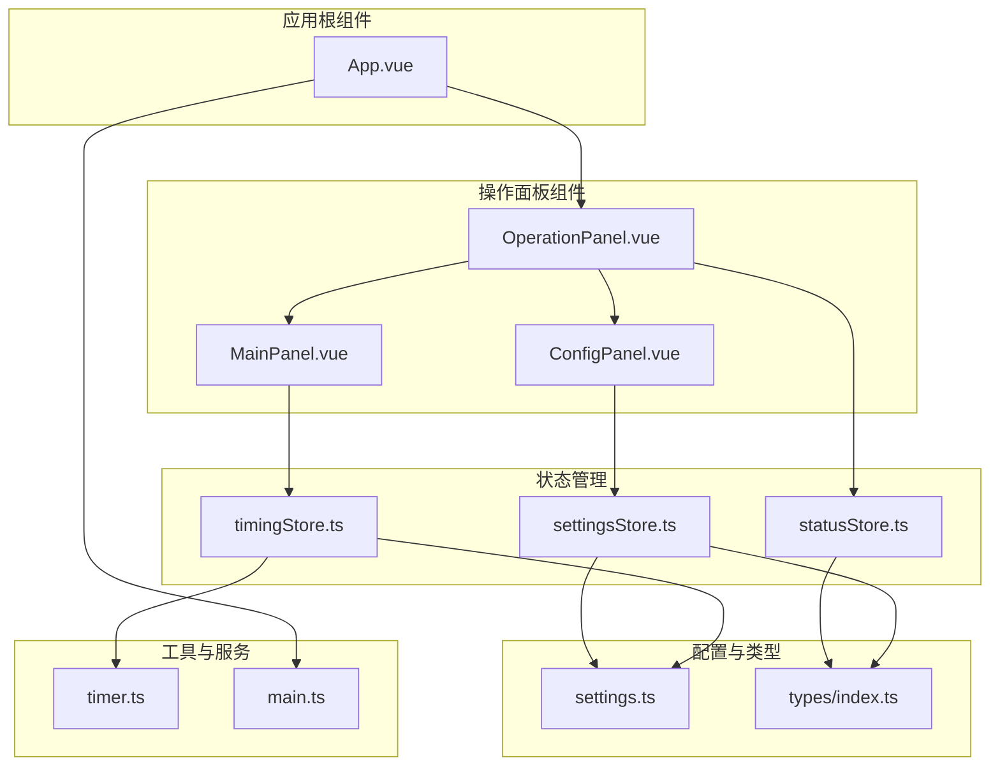
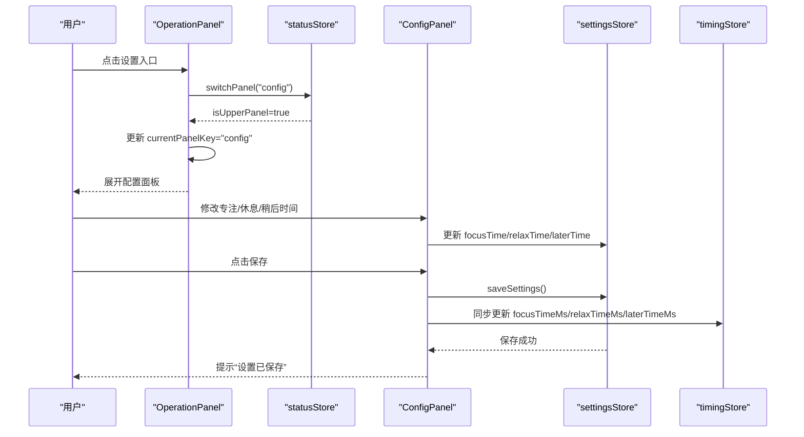
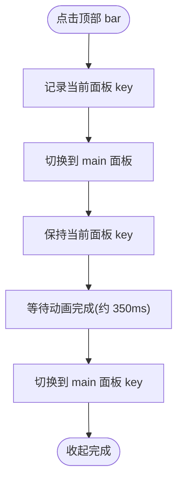
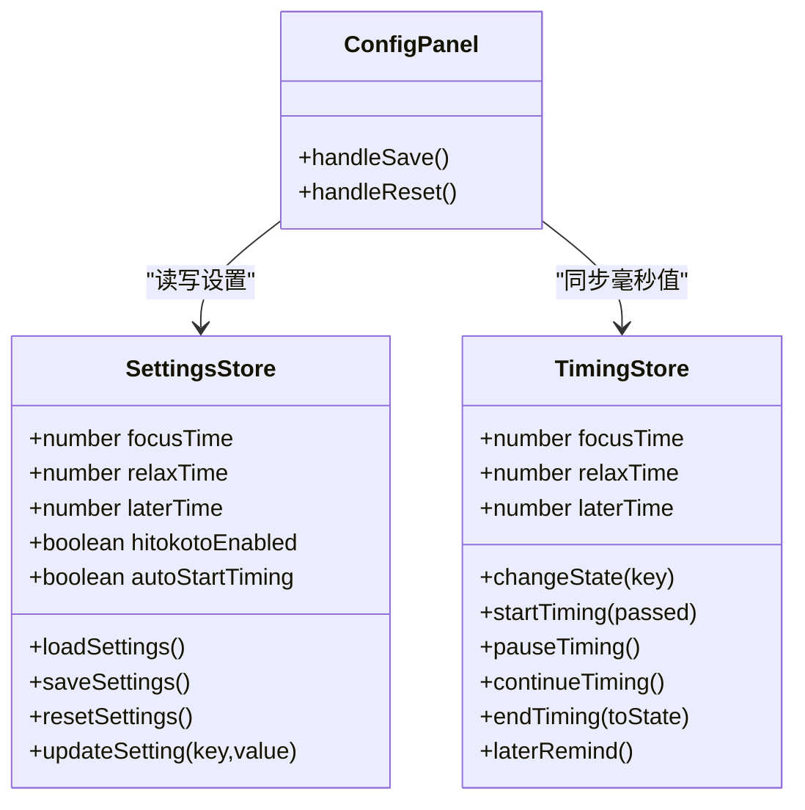
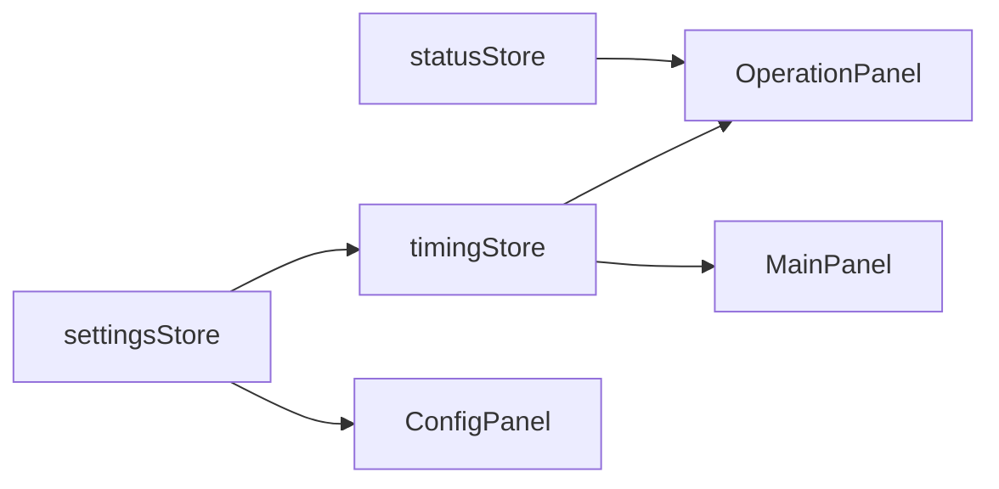
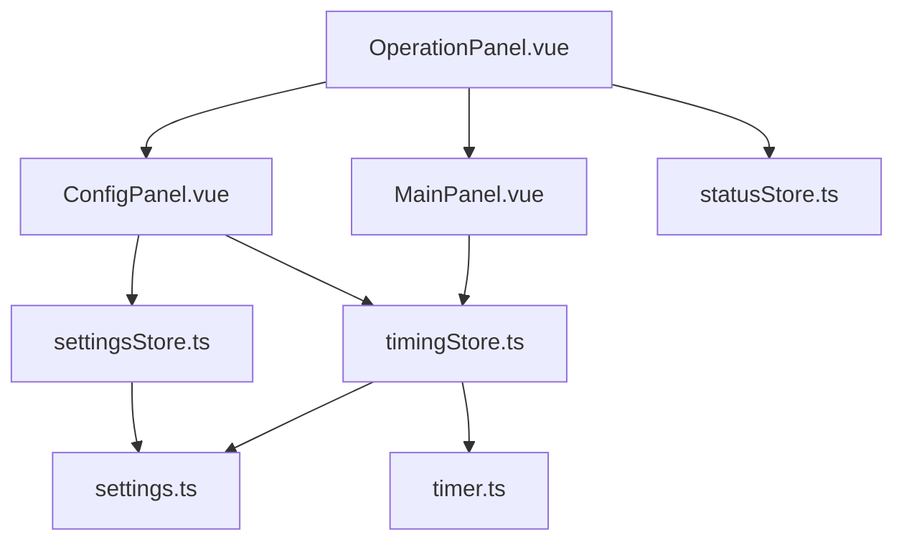

# 操作面板组件

<cite>
**本文引用的文件列表**
- [OperationPanel.vue](file://src/components/operationPanel/OperationPanel.vue)
- [MainPanel.vue](file://src/components/operationPanel/MainPanel.vue)
- [ConfigPanel.vue](file://src/components/operationPanel/ConfigPanel.vue)
- [settingsStore.ts](file://src/stores/settingsStore.ts)
- [timingStore.ts](file://src/stores/timingStore.ts)
- [statusStore.ts](file://src/stores/statusStore.ts)
- [settings.ts](file://src/settings.ts)
- [types/index.ts](file://src/types/index.ts)
- [timer.ts](file://src/utils/timer.ts)
- [main.ts](file://src/main.ts)
- [App.vue](file://src/App.vue)
</cite>

## 目录
1. [简介](#简介)
2. [项目结构](#项目结构)
3. [核心组件](#核心组件)
4. [架构总览](#架构总览)
5. [详细组件分析](#详细组件分析)
6. [依赖关系分析](#依赖关系分析)
7. [性能考量](#性能考量)
8. [故障排查指南](#故障排查指南)
9. [结论](#结论)
10. [附录](#附录)

## 简介
本文件围绕操作面板组件（OperationPanel）进行系统化技术文档编写，重点阐述：
- 可展开设置界面的设计架构与主面板（MainPanel）和配置面板（ConfigPanel）的功能分工
- 面板展开/收起的动画效果与交互逻辑
- 设置项的组织结构（专注时间、休息时间、稍后提醒等）
- 组件间的数据传递机制（父子组件通信与状态同步）
- 配置面板的表单验证、默认值处理与用户输入处理
- 面板样式定制、响应式布局与无障碍访问支持
- 组件扩展与新增配置项的开发指导

## 项目结构
操作面板位于组件目录中，采用“主面板 + 配置面板”的双面板设计，配合 Pinia 状态管理与工具层，形成清晰的职责分离与数据流。

图表来源
- [OperationPanel.vue:107-126](file://src/components/operationPanel/OperationPanel.vue#L107-L126)
- [MainPanel.vue:39-69](file://src/components/operationPanel/MainPanel.vue#L39-L69)
- [ConfigPanel.vue:242-339](file://src/components/operationPanel/ConfigPanel.vue#L242-L339)
- [statusStore.ts:22-45](file://src/stores/statusStore.ts#L22-L45)
- [timingStore.ts:32-140](file://src/stores/timingStore.ts#L32-L140)
- [settingsStore.ts:11-86](file://src/stores/settingsStore.ts#L11-L86)
- [settings.ts:22-47](file://src/settings.ts#L22-L47)
- [types/index.ts:1-83](file://src/types/index.ts#L1-L83)
- [timer.ts:5-65](file://src/utils/timer.ts#L5-L65)
- [main.ts:1-19](file://src/main.ts#L1-L19)
- [App.vue:25-42](file://src/App.vue#L25-L42)

章节来源
- [OperationPanel.vue:107-126](file://src/components/operationPanel/OperationPanel.vue#L107-L126)
- [MainPanel.vue:39-69](file://src/components/operationPanel/MainPanel.vue#L39-L69)
- [ConfigPanel.vue:242-339](file://src/components/operationPanel/ConfigPanel.vue#L242-L339)

## 核心组件
- OperationPanel：负责面板容器、展开/收起动画、内容面板切换与状态同步
- MainPanel：提供计时控制操作（结束、暂停/继续、稍后提醒），展示问候语占位
- ConfigPanel：提供专注/休息/稍后提醒时间设置、功能开关、保存与重置

章节来源
- [OperationPanel.vue:128-179](file://src/components/operationPanel/OperationPanel.vue#L128-L179)
- [MainPanel.vue:71-82](file://src/components/operationPanel/MainPanel.vue#L71-L82)
- [ConfigPanel.vue:342-377](file://src/components/operationPanel/ConfigPanel.vue#L342-L377)

## 架构总览
OperationPanel 作为容器组件，内部包含两个内容面板（MainPanel 与 ConfigPanel）。通过状态管理（statusStore）控制面板是否展开；通过 Pinia 的 settingsStore 与 timingStore 实现设置与计时逻辑的双向同步。

图表来源
- [OperationPanel.vue:143-174](file://src/components/operationPanel/OperationPanel.vue#L143-L174)
- [statusStore.ts:35-44](file://src/stores/statusStore.ts#L35-L44)
- [ConfigPanel.vue:349-358](file://src/components/operationPanel/ConfigPanel.vue#L349-L358)
- [settingsStore.ts:53-61](file://src/stores/settingsStore.ts#L53-L61)
- [timingStore.ts:21-30](file://src/stores/timingStore.ts#L21-L30)

## 详细组件分析

### OperationPanel 容器与动画
- 容器样式与布局
  - 使用固定高度与圆角，背景半透明与模糊滤镜，提升视觉层次
  - 通过 transform 控制面板位置，避免高度变化引发的重排
- 展开/收起动画
  - 主面板展开时，容器 transform 从“translateY(100%-50%)”过渡到“translateY(0)”，并伴随 backdrop-filter 与背景色过渡
  - 收起时，容器进入“blur-reduced”类以降低模糊，提升性能
- 内容面板切换
  - 两个面板始终渲染，通过“active”类控制淡入淡出与指针事件
  - 收起时记录当前面板 key，动画结束后再切换到 main 面板，保证收起过程中的内容连续性
- 交互逻辑
  - 点击顶部 bar 触发收起，调用状态管理切换到 main 面板
  - 监听 isUpperPanel 状态变化，动态调整模糊与内容面板 key

图表来源
- [OperationPanel.vue:143-154](file://src/components/operationPanel/OperationPanel.vue#L143-L154)
- [OperationPanel.vue:157-174](file://src/components/operationPanel/OperationPanel.vue#L157-L174)

章节来源
- [OperationPanel.vue:1-105](file://src/components/operationPanel/OperationPanel.vue#L1-L105)
- [OperationPanel.vue:107-126](file://src/components/operationPanel/OperationPanel.vue#L107-L126)
- [OperationPanel.vue:128-179](file://src/components/operationPanel/OperationPanel.vue#L128-L179)

### MainPanel 主面板
- 功能按钮
  - 结束计时：根据当前状态（focus/relax）决定结束后的下一阶段
  - 暂停/继续：根据计时器状态切换
  - 稍后提醒：将计时进度回退到“稍后提醒”时间点，重新开始专注
- 数据来源
  - 通过 timingStore 获取计时状态与时间参数，驱动 UI 行为
- 无障碍与交互
  - 使用 Element Plus Tooltip 提供提示，鼠标悬停放大图标，增强可用性

章节来源
- [MainPanel.vue:39-69](file://src/components/operationPanel/MainPanel.vue#L39-L69)
- [MainPanel.vue:71-82](file://src/components/operationPanel/MainPanel.vue#L71-L82)

### ConfigPanel 配置面板
- 设置项组织
  - 时间设置区：专注时长、休息时长、稍后提醒，均以分钟为单位，支持滑块与数值输入联动
  - 功能开关区：显示一言、自动开始
- 表单与交互
  - 保存：调用 settingsStore.saveSettings，并将设置值转换为毫秒同步到 timingStore
  - 重置：调用 settingsStore.resetSettings，恢复默认值
- 样式与布局
  - 使用网格布局自适应时间卡片，卡片 hover 效果与阴影提升触控反馈
  - 顶部内容滚动容器与底部操作区固定定位，确保内容不被操作区遮挡

图表来源
- [settingsStore.ts:11-86](file://src/stores/settingsStore.ts#L11-L86)
- [timingStore.ts:32-140](file://src/stores/timingStore.ts#L32-L140)
- [ConfigPanel.vue:342-377](file://src/components/operationPanel/ConfigPanel.vue#L342-L377)

章节来源
- [ConfigPanel.vue:242-339](file://src/components/operationPanel/ConfigPanel.vue#L242-L339)
- [ConfigPanel.vue:342-377](file://src/components/operationPanel/ConfigPanel.vue#L342-L377)

### 状态管理与数据流
- statusStore
  - 控制面板切换（main/config），并提供 isUpperPanel 计算属性用于判断是否展开
- settingsStore
  - 管理用户设置的持久化与默认值，提供毫秒转换 getter
- timingStore
  - 管理计时状态、时间推进与事件回调，支持暂停/继续/结束/稍后提醒

图表来源
- [statusStore.ts:22-45](file://src/stores/statusStore.ts#L22-L45)
- [settingsStore.ts:11-86](file://src/stores/settingsStore.ts#L11-L86)
- [timingStore.ts:32-140](file://src/stores/timingStore.ts#L32-L140)
- [OperationPanel.vue:128-134](file://src/components/operationPanel/OperationPanel.vue#L128-L134)
- [MainPanel.vue:75-80](file://src/components/operationPanel/MainPanel.vue#L75-L80)
- [ConfigPanel.vue:366-376](file://src/components/operationPanel/ConfigPanel.vue#L366-L376)

章节来源
- [statusStore.ts:22-45](file://src/stores/statusStore.ts#L22-L45)
- [settingsStore.ts:11-86](file://src/stores/settingsStore.ts#L11-L86)
- [timingStore.ts:32-140](file://src/stores/timingStore.ts#L32-L140)

## 依赖关系分析
- 组件耦合
  - OperationPanel 与 MainPanel/ConfigPanel 为父子关系，通过状态管理解耦
  - ConfigPanel 与 settingsStore、timingStore 存在直接依赖，用于读取与写入设置
- 外部依赖
  - Element Plus 提供 UI 组件（Slider、InputNumber、Switch、Button、Tooltip）
  - Pinia 提供状态管理
  - 自定义工具类 Timer 提供时间计算

图表来源
- [OperationPanel.vue:128-179](file://src/components/operationPanel/OperationPanel.vue#L128-L179)
- [MainPanel.vue:75-80](file://src/components/operationPanel/MainPanel.vue#L75-L80)
- [ConfigPanel.vue:366-376](file://src/components/operationPanel/ConfigPanel.vue#L366-L376)
- [settingsStore.ts:11-86](file://src/stores/settingsStore.ts#L11-L86)
- [timingStore.ts:32-140](file://src/stores/timingStore.ts#L32-L140)
- [settings.ts:22-47](file://src/settings.ts#L22-L47)
- [timer.ts:5-65](file://src/utils/timer.ts#L5-L65)

章节来源
- [main.ts:1-19](file://src/main.ts#L1-L19)
- [App.vue:116-139](file://src/App.vue#L116-L139)

## 性能考量
- 动画性能
  - 使用 transform 替代改变高度，减少重排；transition 使用缓动曲线提升顺滑度
  - 收起动画期间降低模糊值，减少 GPU 压力
- 渲染策略
  - 两个面板始终渲染，仅通过“active”类切换显隐，避免频繁挂载卸载带来的抖动
- 状态同步
  - 通过 Pinia getter 将分钟转换为毫秒，避免重复计算
  - 保存设置后同步到 timingStore，确保计时器参数即时生效

章节来源
- [OperationPanel.vue:23-30](file://src/components/operationPanel/OperationPanel.vue#L23-L30)
- [OperationPanel.vue:37-42](file://src/components/operationPanel/OperationPanel.vue#L37-L42)
- [OperationPanel.vue:115-124](file://src/components/operationPanel/OperationPanel.vue#L115-L124)
- [settingsStore.ts:20-33](file://src/stores/settingsStore.ts#L20-L33)
- [ConfigPanel.vue:353-358](file://src/components/operationPanel/ConfigPanel.vue#L353-L358)

## 故障排查指南
- 面板无法展开/收起
  - 检查 statusStore 的 isUpperPanel 计算属性与 switchPanel 方法是否正确调用
  - 确认 OperationPanel 中监听 isUpperPanel 的 watcher 是否触发
- 设置未生效
  - 确认 settingsStore.saveSettings 是否被调用且存储成功
  - 检查 ConfigPanel 中 handleSave 是否将设置转换为毫秒并同步到 timingStore
- 计时异常
  - 检查 timingStore 的 startTiming/pauseTiming/continueTiming/endTiming/laterRemind 流程
  - 确认 Timer 工具类的 start/end/duration 是否正常工作

章节来源
- [statusStore.ts:28-33](file://src/stores/statusStore.ts#L28-L33)
- [statusStore.ts:35-44](file://src/stores/statusStore.ts#L35-L44)
- [OperationPanel.vue:157-174](file://src/components/operationPanel/OperationPanel.vue#L157-L174)
- [settingsStore.ts:53-61](file://src/stores/settingsStore.ts#L53-L61)
- [ConfigPanel.vue:349-358](file://src/components/operationPanel/ConfigPanel.vue#L349-L358)
- [timingStore.ts:94-138](file://src/stores/timingStore.ts#L94-L138)
- [timer.ts:8-31](file://src/utils/timer.ts#L8-L31)

## 结论
OperationPanel 通过明确的容器设计与状态管理，实现了主面板与配置面板的无缝切换与高性能动画。配置面板提供了直观的时间设置与功能开关，并通过 Pinia 实现了设置与计时器的实时同步。整体架构清晰、扩展性强，便于后续新增配置项与功能模块。

## 附录

### 设置项组织与默认值
- 专注时间：默认值由 settings.defaultUserSettings.focusTime 提供，单位为分钟
- 休息时间：默认值由 settings.defaultUserSettings.relaxTime 提供，单位为分钟
- 稍后提醒：默认值由 settings.defaultUserSettings.laterTime 提供，单位为分钟
- 功能开关：显示一言与自动开始，分别对应 settings.defaultUserSettings.hitokotoEnabled 与 autoStartTiming

章节来源
- [settings.ts:40-46](file://src/settings.ts#L40-L46)
- [settingsStore.ts:12-18](file://src/stores/settingsStore.ts#L12-L18)

### 表单验证与默认值处理
- 表单验证
  - ConfigPanel 使用 Element Plus 的 Slider 与 InputNumber，其内置最小/最大/步长限制
  - 建议在新增配置项时复用相同组件与参数范围，确保一致性
- 默认值处理
  - settingsStore.resetSettings 将所有设置重置为 settings.defaultUserSettings
  - App 初始化时加载用户设置并同步到 timingStore

章节来源
- [ConfigPanel.vue:259-301](file://src/components/operationPanel/ConfigPanel.vue#L259-L301)
- [settingsStore.ts:66-73](file://src/stores/settingsStore.ts#L66-L73)
- [App.vue:60-67](file://src/App.vue#L60-L67)

### 样式定制与响应式布局
- 样式定制
  - OperationPanel 使用 backdrop-filter 与圆角，支持在“blur-reduced”类下降低模糊
  - ConfigPanel 使用网格布局与卡片 hover 效果，适配不同屏幕尺寸
- 响应式布局
  - 时间设置区采用 CSS Grid 的 auto-fit 与 minmax，实现自适应列数
  - 内容滚动容器与操作区固定定位，避免内容被遮挡

章节来源
- [OperationPanel.vue:1-105](file://src/components/operationPanel/OperationPanel.vue#L1-L105)
- [ConfigPanel.vue:41-45](file://src/components/operationPanel/ConfigPanel.vue#L41-L45)
- [ConfigPanel.vue:196-209](file://src/components/operationPanel/ConfigPanel.vue#L196-L209)

### 无障碍访问支持
- 提示与交互
  - MainPanel 使用 Element Plus Tooltip 为操作按钮提供轻提示
  - 建议为 ConfigPanel 的开关与按钮添加 aria-label 与键盘可访问性

章节来源
- [MainPanel.vue:43-64](file://src/components/operationPanel/MainPanel.vue#L43-L64)

### 组件扩展与新增配置项开发指导
- 新增配置项步骤
  - 在 UserSettings 接口中声明新字段
  - 在 settings.defaultUserSettings 中提供默认值
  - 在 settingsStore.ts 中添加状态与 getter（如需毫秒转换）
  - 在 ConfigPanel.vue 中添加对应的 Slider/InputNumber 与标签
  - 在 handleSave 中同步新值到 timingStore（如需）
  - 如需持久化，确保 saveSettings 包含新字段
- 注意事项
  - 保持字段命名与单位一致（分钟/布尔）
  - 为新控件提供合理的最小/最大/步长范围
  - 在 App 初始化流程中处理新字段的加载与同步

章节来源
- [types/index.ts:14-20](file://src/types/index.ts#L14-L20)
- [settings.ts:40-46](file://src/settings.ts#L40-L46)
- [settingsStore.ts:11-86](file://src/stores/settingsStore.ts#L11-L86)
- [ConfigPanel.vue:242-339](file://src/components/operationPanel/ConfigPanel.vue#L242-L339)
- [App.vue:60-67](file://src/App.vue#L60-L67)