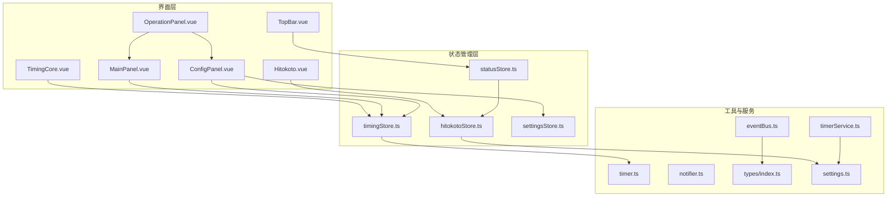
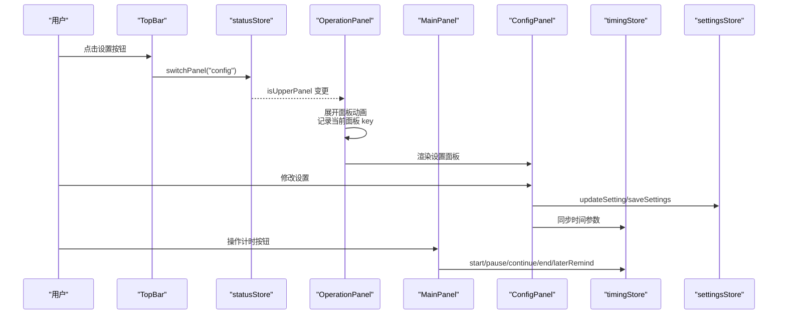
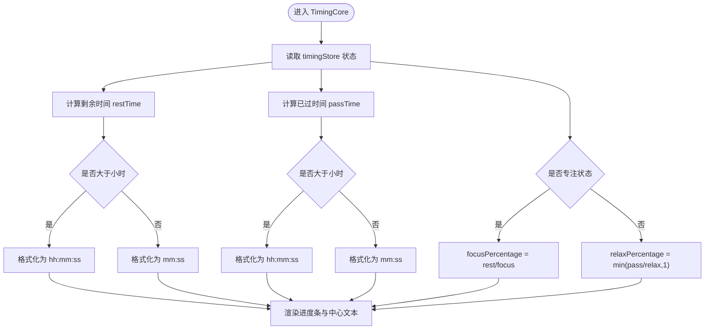
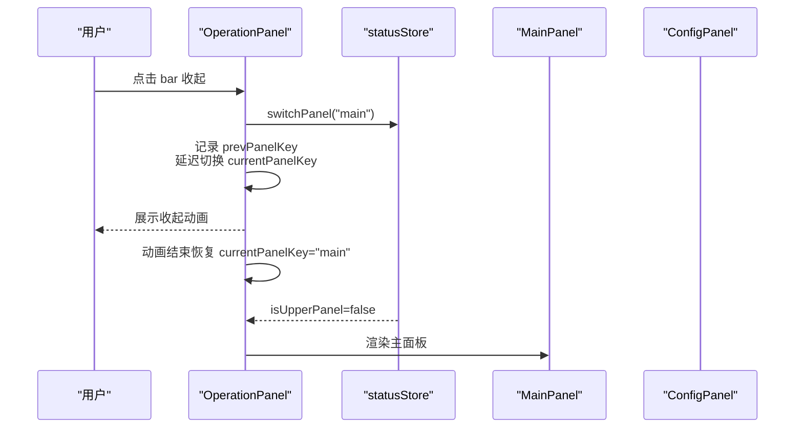
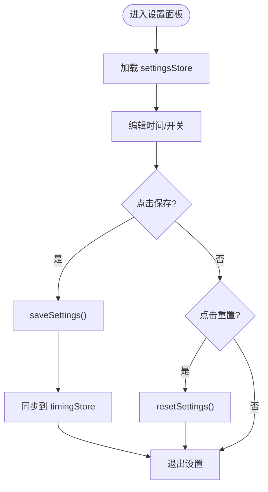
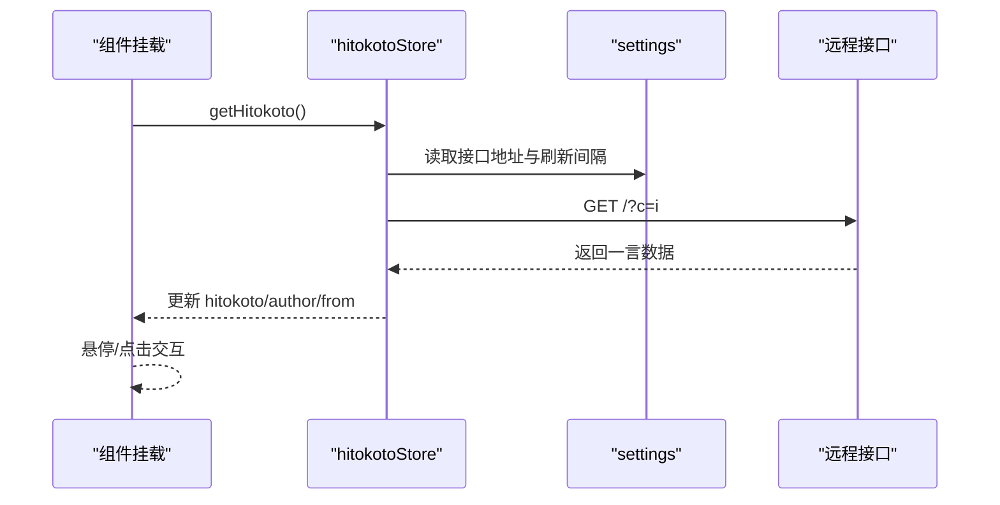
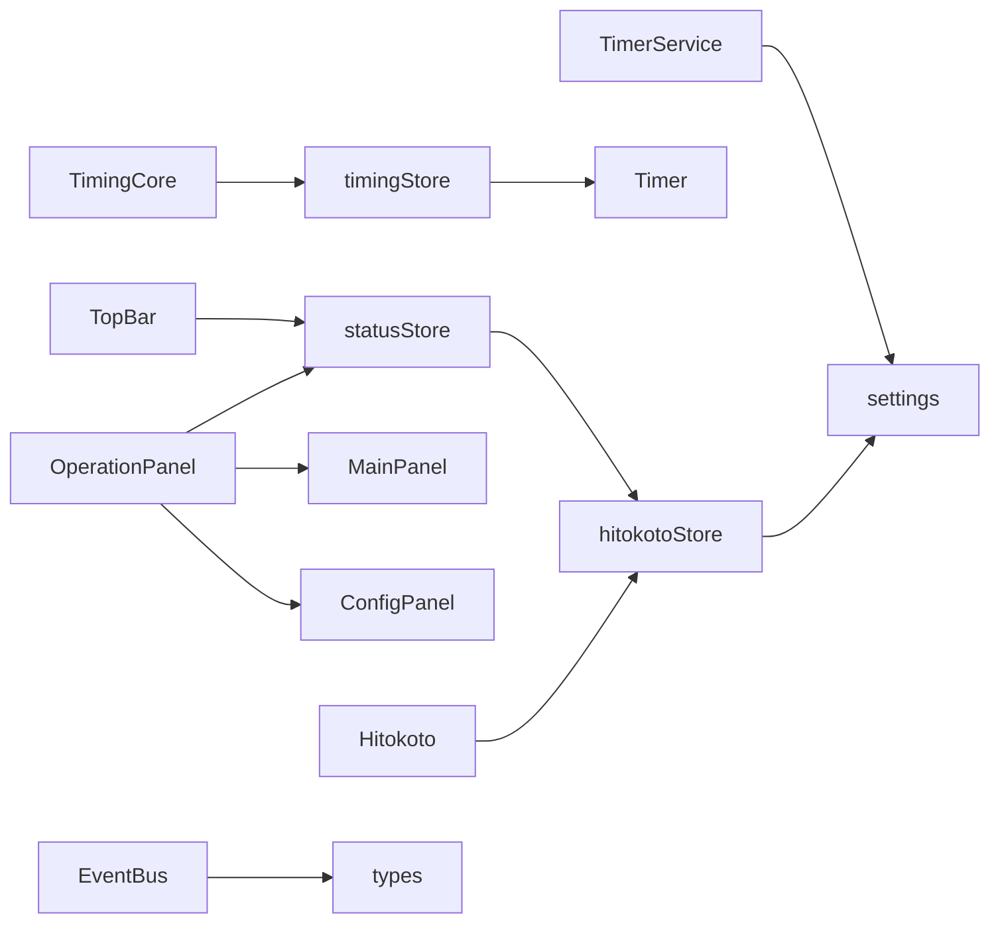

# 核心组件

<cite>
**本文引用的文件**
- [src/components/TimingCore.vue](file://src/components/TimingCore.vue)
- [src/components/operationPanel/OperationPanel.vue](file://src/components/operationPanel/OperationPanel.vue)
- [src/components/operationPanel/MainPanel.vue](file://src/components/operationPanel/MainPanel.vue)
- [src/components/operationPanel/ConfigPanel.vue](file://src/components/operationPanel/ConfigPanel.vue)
- [src/components/TopBar.vue](file://src/components/TopBar.vue)
- [src/components/Hitokoto.vue](file://src/components/Hitokoto.vue)
- [src/stores/timingStore.ts](file://src/stores/timingStore.ts)
- [src/stores/settingsStore.ts](file://src/stores/settingsStore.ts)
- [src/stores/statusStore.ts](file://src/stores/statusStore.ts)
- [src/stores/hitokotoStore.ts](file://src/stores/hitokotoStore.ts)
- [src/services/timerService.ts](file://src/services/timerService.ts)
- [src/utils/timer.ts](file://src/utils/timer.ts)
- [src/utils/eventBus.ts](file://src/utils/eventBus.ts)
- [src/utils/notifier.ts](file://src/utils/notifier.ts)
- [src/types/index.ts](file://src/types/index.ts)
- [src/settings.ts](file://src/settings.ts)
</cite>

## 目录
1. [简介](#简介)
2. [项目结构](#项目结构)
3. [核心组件](#核心组件)
4. [架构总览](#架构总览)
5. [详细组件分析](#详细组件分析)
6. [依赖关系分析](#依赖关系分析)
7. [性能考量](#性能考量)
8. [故障排查指南](#故障排查指南)
9. [结论](#结论)
10. [附录](#附录)

## 简介
本文件聚焦“休息提醒”项目的核心组件，围绕以下目标展开：
- 深入解析计时核心组件（TimingCore）的圆形进度条实现原理与动画效果
- 详述操作面板组件（OperationPanel）的可展开设置界面设计与交互逻辑
- 说明顶部栏组件（TopBar）的控制按钮与状态指示功能
- 解释一言展示组件（Hitokoto）的数据获取与展示机制
- 提供各组件的 props 接口说明、事件处理机制与样式定制选项
- 给出组件使用示例与集成模式
- 分析组件间通信方式与数据传递路径
- 提供扩展与自定义的实践建议

## 项目结构
项目采用基于功能域的组织方式，核心组件位于 src/components 下，状态管理位于 src/stores，通用工具与服务位于 src/utils 与 src/services，类型定义位于 src/types。

图表来源
- [src/components/TimingCore.vue:1-101](file://src/components/TimingCore.vue#L1-L101)
- [src/components/operationPanel/OperationPanel.vue:1-180](file://src/components/operationPanel/OperationPanel.vue#L1-L180)
- [src/components/operationPanel/MainPanel.vue:1-82](file://src/components/operationPanel/MainPanel.vue#L1-L82)
- [src/components/operationPanel/ConfigPanel.vue:1-378](file://src/components/operationPanel/ConfigPanel.vue#L1-L378)
- [src/components/TopBar.vue:1-49](file://src/components/TopBar.vue#L1-L49)
- [src/components/Hitokoto.vue:1-79](file://src/components/Hitokoto.vue#L1-L79)
- [src/stores/timingStore.ts:1-141](file://src/stores/timingStore.ts#L1-L141)
- [src/stores/statusStore.ts:1-46](file://src/stores/statusStore.ts#L1-L46)
- [src/stores/hitokotoStore.ts:1-72](file://src/stores/hitokotoStore.ts#L1-L72)
- [src/stores/settingsStore.ts:1-87](file://src/stores/settingsStore.ts#L1-L87)
- [src/utils/timer.ts:1-66](file://src/utils/timer.ts#L1-L66)
- [src/utils/eventBus.ts:1-104](file://src/utils/eventBus.ts#L1-L104)
- [src/utils/notifier.ts:1-62](file://src/utils/notifier.ts#L1-L62)
- [src/services/timerService.ts:1-161](file://src/services/timerService.ts#L1-L161)
- [src/types/index.ts:1-83](file://src/types/index.ts#L1-L83)
- [src/settings.ts:1-50](file://src/settings.ts#L1-L50)

章节来源
- [src/components/TimingCore.vue:1-101](file://src/components/TimingCore.vue#L1-L101)
- [src/components/operationPanel/OperationPanel.vue:1-180](file://src/components/operationPanel/OperationPanel.vue#L1-L180)
- [src/components/operationPanel/MainPanel.vue:1-82](file://src/components/operationPanel/MainPanel.vue#L1-L82)
- [src/components/operationPanel/ConfigPanel.vue:1-378](file://src/components/operationPanel/ConfigPanel.vue#L1-L378)
- [src/components/TopBar.vue:1-49](file://src/components/TopBar.vue#L1-L49)
- [src/components/Hitokoto.vue:1-79](file://src/components/Hitokoto.vue#L1-L79)

## 核心组件
本节概述四个核心组件的功能定位与职责边界：
- TimingCore：负责圆形进度条与剩余/已过时间的可视化展示，联动计时状态与设置。
- OperationPanel：可展开的操作面板，承载主面板与设置面板，控制面板升降与模糊过渡。
- TopBar：顶部控制区，提供设置入口按钮，触发面板切换。
- Hitokoto：一言展示组件，负责从远程接口获取语录并在界面上优雅呈现。

章节来源
- [src/components/TimingCore.vue:42-60](file://src/components/TimingCore.vue#L42-L60)
- [src/components/operationPanel/OperationPanel.vue:107-126](file://src/components/operationPanel/OperationPanel.vue#L107-L126)
- [src/components/TopBar.vue:24-36](file://src/components/TopBar.vue#L24-L36)
- [src/components/Hitokoto.vue:34-48](file://src/components/Hitokoto.vue#L34-L48)

## 架构总览
组件间通过 Pinia 状态管理与工具服务进行协作，形成清晰的单向数据流与事件驱动机制。

图表来源
- [src/components/TopBar.vue:27-33](file://src/components/TopBar.vue#L27-L33)
- [src/stores/statusStore.ts:35-43](file://src/stores/statusStore.ts#L35-L43)
- [src/components/operationPanel/OperationPanel.vue:142-174](file://src/components/operationPanel/OperationPanel.vue#L142-L174)
- [src/components/operationPanel/ConfigPanel.vue:348-364](file://src/components/operationPanel/ConfigPanel.vue#L348-L364)
- [src/components/operationPanel/MainPanel.vue:43-64](file://src/components/operationPanel/MainPanel.vue#L43-L64)
- [src/stores/timingStore.ts:94-138](file://src/stores/timingStore.ts#L94-L138)
- [src/stores/settingsStore.ts:78-84](file://src/stores/settingsStore.ts#L78-L84)

## 详细组件分析

### 计时核心组件（TimingCore）
- 功能要点
  - 使用仪表盘型进度条展示当前状态的剩余或已过时间占比
  - 中心区域展示提示文案与剩余/已过时间文本
  - 基于计时状态动态切换颜色与百分比计算
- 数据与状态
  - 依赖 timingStore 的状态与时间计算
  - 通过 settings 的时间倍率常量控制时间格式与换算
- 动画与视觉
  - 进度条颜色随状态切换
  - 文本与背景色过渡，增强可读性
- Props 与事件
  - 无外部 props 输入
  - 无对外暴露事件
- 样式定制
  - 支持通过覆盖 CSS 变量与类名调整尺寸、颜色与字体
- 使用示例
  - 在应用根组件中直接引入即可生效
- 扩展建议
  - 可增加自定义颜色主题、动画曲线与时间格式化策略

图表来源
- [src/components/TimingCore.vue:68-89](file://src/components/TimingCore.vue#L68-L89)
- [src/stores/timingStore.ts:55-66](file://src/stores/timingStore.ts#L55-L66)
- [src/utils/timer.ts:46-64](file://src/utils/timer.ts#L46-L64)
- [src/settings.ts:12-17](file://src/settings.ts#L12-L17)

章节来源
- [src/components/TimingCore.vue:42-101](file://src/components/TimingCore.vue#L42-L101)
- [src/stores/timingStore.ts:22-67](file://src/stores/timingStore.ts#L22-L67)
- [src/utils/timer.ts:5-66](file://src/utils/timer.ts#L5-L66)
- [src/settings.ts:22-47](file://src/settings.ts#L22-L47)

### 操作面板组件（OperationPanel）
- 功能要点
  - 可展开/收起的半屏面板，支持主面板与设置面板切换
  - 通过 transform 控制面板位移，配合 backdrop-filter 实现毛玻璃效果
  - 在收起过程中降低模糊强度以提升性能
- 交互逻辑
  - 点击顶部条形控件触发收起，同时保留上一个面板的内容，动画结束后再切换内容
  - 监听状态变化，展开时即时同步内容
- Props 与事件
  - 无外部 props 输入
  - 无对外暴露事件
- 样式定制
  - 可通过修改 SCSS 变量与类名调整圆角、阴影、模糊强度与过渡曲线
- 使用示例
  - 在应用根组件中引入，确保状态管理已初始化
- 扩展建议
  - 可增加手势滑动关闭、多面板扩展与自定义动画曲线

图表来源
- [src/components/operationPanel/OperationPanel.vue:142-174](file://src/components/operationPanel/OperationPanel.vue#L142-L174)
- [src/stores/statusStore.ts:35-43](file://src/stores/statusStore.ts#L35-L43)
- [src/components/operationPanel/MainPanel.vue:117-123](file://src/components/operationPanel/MainPanel.vue#L117-L123)
- [src/components/operationPanel/ConfigPanel.vue:119-123](file://src/components/operationPanel/ConfigPanel.vue#L119-L123)

章节来源
- [src/components/operationPanel/OperationPanel.vue:1-180](file://src/components/operationPanel/OperationPanel.vue#L1-L180)
- [src/stores/statusStore.ts:17-33](file://src/stores/statusStore.ts#L17-L33)

### 主面板（MainPanel）
- 功能要点
  - 提供结束计时、暂停/继续、稍后提醒等快捷操作
  - 按钮根据当前计时状态动态显示
- 交互与状态
  - 通过 timingStore 控制计时行为
- Props 与事件
  - 无外部 props 输入
  - 无对外暴露事件
- 样式定制
  - 可通过 SCSS 调整图标大小、间距与悬停效果
- 使用示例
  - 作为 OperationPanel 的子组件使用
- 扩展建议
  - 可增加更多计时控制动作与快捷键支持

章节来源
- [src/components/operationPanel/MainPanel.vue:1-82](file://src/components/operationPanel/MainPanel.vue#L1-L82)
- [src/stores/timingStore.ts:69-139](file://src/stores/timingStore.ts#L69-L139)

### 设置面板（ConfigPanel）
- 功能要点
  - 时间设置区域：专注时长、休息时长、稍后提醒时间
  - 功能开关区域：显示一言、自动开始
  - 保存与重置操作
- 交互与状态
  - 通过 settingsStore 读写用户设置，并在保存时同步至 timingStore
- Props 与事件
  - 无外部 props 输入
  - 无对外暴露事件
- 样式定制
  - 可通过 SCSS 调整卡片、网格布局与按钮样式
- 使用示例
  - 作为 OperationPanel 的子组件使用
- 扩展建议
  - 可增加更多个性化设置项与主题切换

图表来源
- [src/components/operationPanel/ConfigPanel.vue:348-364](file://src/components/operationPanel/ConfigPanel.vue#L348-L364)
- [src/stores/settingsStore.ts:35-84](file://src/stores/settingsStore.ts#L35-L84)
- [src/stores/timingStore.ts:32-41](file://src/stores/timingStore.ts#L32-L41)

章节来源
- [src/components/operationPanel/ConfigPanel.vue:1-378](file://src/components/operationPanel/ConfigPanel.vue#L1-L378)
- [src/stores/settingsStore.ts:11-87](file://src/stores/settingsStore.ts#L11-L87)
- [src/stores/timingStore.ts:32-41](file://src/stores/timingStore.ts#L32-L41)

### 顶部栏组件（TopBar）
- 功能要点
  - 提供设置入口按钮，点击后切换到设置面板
- 交互与状态
  - 通过 statusStore 切换面板
- Props 与事件
  - 无外部 props 输入
  - 无对外暴露事件
- 样式定制
  - 可通过 SCSS 调整按钮位置、尺寸与悬停效果
- 使用示例
  - 在应用根组件中引入，确保状态管理已初始化
- 扩展建议
  - 可增加更多控制按钮与状态指示器

章节来源
- [src/components/TopBar.vue:1-49](file://src/components/TopBar.vue#L1-L49)
- [src/stores/statusStore.ts:35-43](file://src/stores/statusStore.ts#L35-L43)

### 一言展示组件（Hitokoto）
- 功能要点
  - 上线即获取一条一言，支持点击刷新与右键复制
  - 防抖刷新，避免频繁请求
- 数据与状态
  - 通过 hitokotoStore 管理一言数据与刷新时间
  - 使用 settings 的接口地址与刷新间隔
- 交互与事件
  - 左键点击刷新，右键复制到剪贴板
  - 刷新时支持延迟切换以实现淡入效果
- Props 与事件
  - 无外部 props 输入
  - 无对外暴露事件
- 样式定制
  - 可通过 SCSS 调整背景模糊、悬停效果与字体样式
- 使用示例
  - 在应用根组件中引入，确保状态管理已初始化
- 扩展建议
  - 可增加更多来源与分类筛选、历史记录查看

图表来源
- [src/components/Hitokoto.vue:64-67](file://src/components/Hitokoto.vue#L64-L67)
- [src/stores/hitokotoStore.ts:31-69](file://src/stores/hitokotoStore.ts#L31-L69)
- [src/settings.ts:32-35](file://src/settings.ts#L32-L35)

章节来源
- [src/components/Hitokoto.vue:1-79](file://src/components/Hitokoto.vue#L1-L79)
- [src/stores/hitokotoStore.ts:15-72](file://src/stores/hitokotoStore.ts#L15-L72)
- [src/settings.ts:32-35](file://src/settings.ts#L32-L35)

## 依赖关系分析
- 组件依赖
  - TimingCore 依赖 timingStore 与 settings
  - OperationPanel 依赖 statusStore，并组合 MainPanel 与 ConfigPanel
  - TopBar 依赖 statusStore
  - Hitokoto 依赖 hitokotoStore
- 状态管理
  - timingStore：计时状态、时间计算、计时器生命周期
  - statusStore：面板状态、窗口状态
  - settingsStore：用户设置持久化与读取
  - hitokotoStore：一言数据与刷新控制
- 工具与服务
  - Timer：时间格式化与计时
  - Message：统一消息提示
  - EventBus：跨 Store 解耦事件
  - TimerService：后台计时服务封装

图表来源
- [src/components/TimingCore.vue:92-99](file://src/components/TimingCore.vue#L92-L99)
- [src/components/operationPanel/OperationPanel.vue:176-178](file://src/components/operationPanel/OperationPanel.vue#L176-L178)
- [src/components/TopBar.vue:43-47](file://src/components/TopBar.vue#L43-L47)
- [src/components/Hitokoto.vue:70-77](file://src/components/Hitokoto.vue#L70-L77)
- [src/stores/timingStore.ts:1-10](file://src/stores/timingStore.ts#L1-L10)
- [src/stores/statusStore.ts:1-5](file://src/stores/statusStore.ts#L1-L5)
- [src/stores/hitokotoStore.ts:1-7](file://src/stores/hitokotoStore.ts#L1-L7)
- [src/services/timerService.ts:6-18](file://src/services/timerService.ts#L6-L18)
- [src/utils/eventBus.ts:1-10](file://src/utils/eventBus.ts#L1-L10)
- [src/types/index.ts:1-10](file://src/types/index.ts#L1-L10)

章节来源
- [src/stores/timingStore.ts:1-10](file://src/stores/timingStore.ts#L1-L10)
- [src/stores/statusStore.ts:1-5](file://src/stores/statusStore.ts#L1-L5)
- [src/stores/hitokotoStore.ts:1-7](file://src/stores/hitokotoStore.ts#L1-L7)
- [src/services/timerService.ts:6-18](file://src/services/timerService.ts#L6-L18)
- [src/utils/eventBus.ts:1-10](file://src/utils/eventBus.ts#L1-L10)
- [src/types/index.ts:1-10](file://src/types/index.ts#L1-L10)

## 性能考量
- 动画与渲染
  - OperationPanel 使用 transform 替代高度变化，避免重排；在收起过程中降低 backdrop-filter 以提升性能
  - TimingCore 使用 CSS 过渡与 Element Plus 进度条，减少 JS 动画开销
- 计时精度与资源占用
  - timingStore 的计时器间隔可调，默认 500ms；在专注态结束与休息态定时提醒时进行窗口显示，避免无效唤醒
- 网络请求节流
  - Hitokoto 请求加入时间戳防抖，避免频繁刷新
- 存储与降级
  - TimerService 对后台服务不可用时提供 utools 或浏览器本地存储降级方案

章节来源
- [src/components/operationPanel/OperationPanel.vue:23-30](file://src/components/operationPanel/OperationPanel.vue#L23-L30)
- [src/stores/timingStore.ts:76-92](file://src/stores/timingStore.ts#L76-L92)
- [src/stores/hitokotoStore.ts:31-39](file://src/stores/hitokotoStore.ts#L31-L39)
- [src/services/timerService.ts:109-135](file://src/services/timerService.ts#L109-L135)

## 故障排查指南
- 无法刷新一言
  - 检查网络连通性与接口可用性
  - 查看刷新间隔限制与错误日志
- 计时不准确或卡顿
  - 调整计时器间隔，确认系统时间同步
  - 检查是否存在长时间阻塞任务
- 面板展开/收起异常
  - 确认状态管理 isUpperPanel 与 currentPanelKey 的同步逻辑
  - 检查 CSS 过渡与 backdrop-filter 的兼容性
- 设置未生效
  - 确认 settingsStore 的保存与读取流程
  - 检查是否正确同步到 timingStore

章节来源
- [src/stores/hitokotoStore.ts:62-68](file://src/stores/hitokotoStore.ts#L62-L68)
- [src/stores/timingStore.ts:76-92](file://src/stores/timingStore.ts#L76-L92)
- [src/stores/settingsStore.ts:39-48](file://src/stores/settingsStore.ts#L39-L48)

## 结论
本项目通过清晰的组件划分与状态管理，实现了高内聚、低耦合的计时与交互体系。TimingCore 的圆形进度条与动画、OperationPanel 的可展开界面、TopBar 的简洁控制以及 Hitokoto 的优雅展示共同构成了良好的用户体验。建议在后续迭代中进一步完善事件总线的使用、扩展更多个性化设置与主题，并持续优化性能与稳定性。

## 附录
- 组件 Props 与事件汇总
  - TimingCore：无 props；无事件
  - OperationPanel：无 props；无事件
  - MainPanel：无 props；无事件
  - ConfigPanel：无 props；无事件
  - TopBar：无 props；无事件
  - Hitokoto：无 props；无事件
- 样式定制清单
  - TimingCore：进度条宽度、颜色、中心文本字号与过渡
  - OperationPanel：圆角、阴影、backdrop-filter 强度、过渡曲线
  - MainPanel：图标尺寸、间距、悬停缩放
  - ConfigPanel：卡片背景、网格间距、按钮样式
  - TopBar：按钮位置、尺寸、悬停效果
  - Hitokoto：背景模糊、悬停阴影、字体样式
- 集成模式建议
  - 在应用入口初始化 Pinia 与工具服务
  - 将各组件按需引入到根组件中
  - 通过 settingsStore.loadSettings() 在启动时恢复用户设置
  - 使用 TimerService 管理后台计时与通知