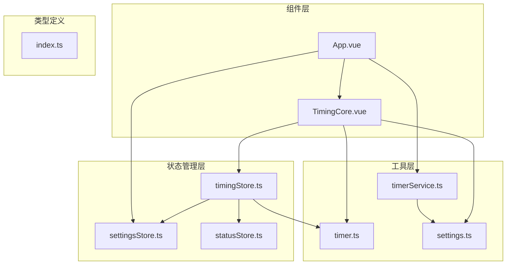
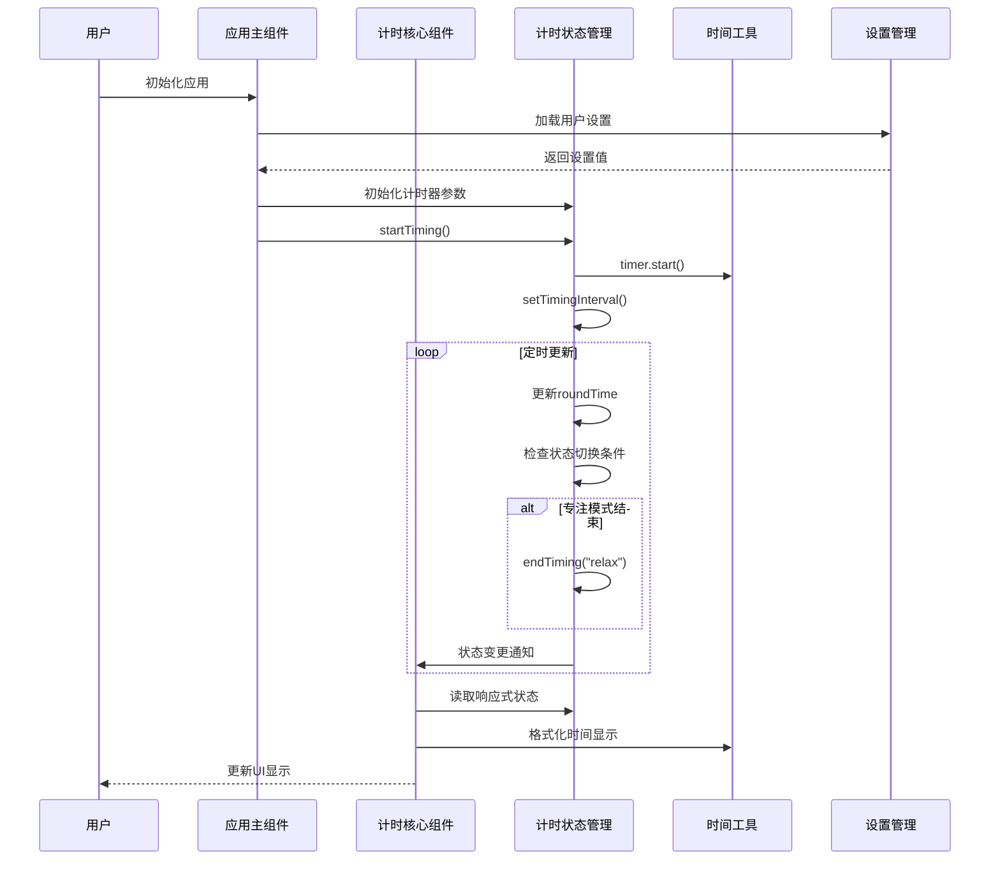
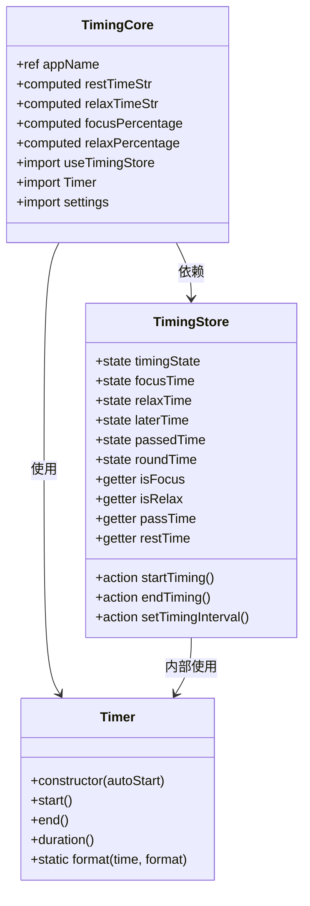
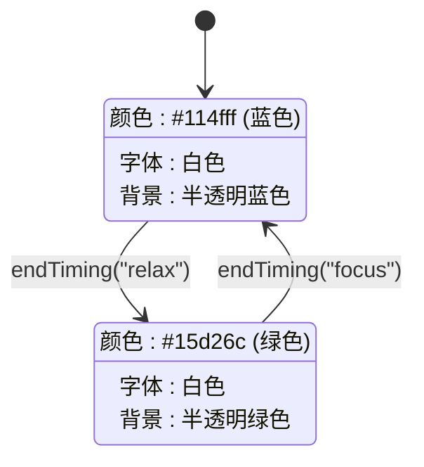
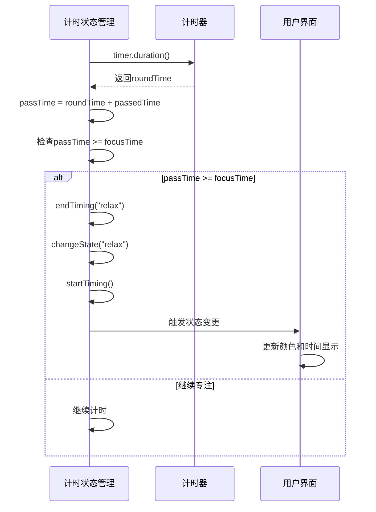
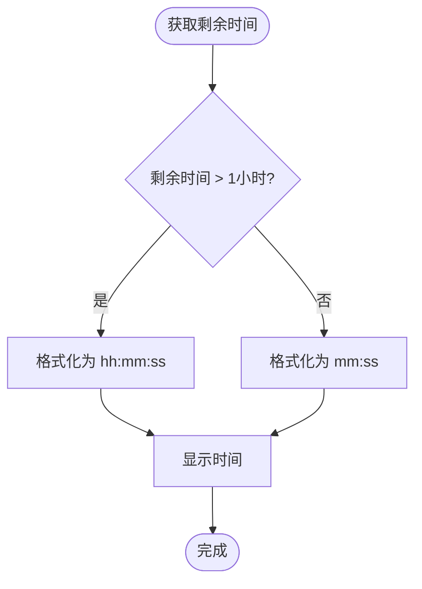
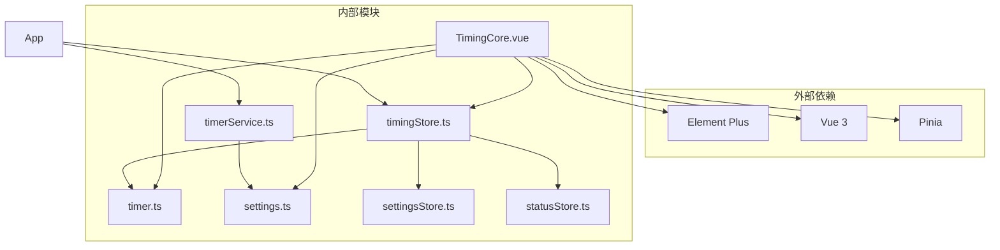
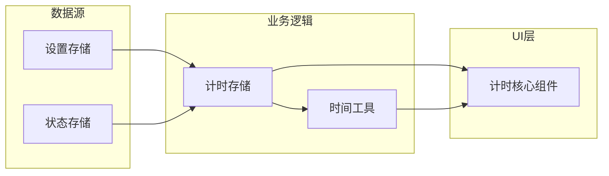

# 计时核心组件

<cite>
**本文档引用的文件**
- [TimingCore.vue](file://src/components/TimingCore.vue)
- [timingStore.ts](file://src/stores/timingStore.ts)
- [timer.ts](file://src/utils/timer.ts)
- [settings.ts](file://src/settings.ts)
- [App.vue](file://src/App.vue)
- [timerService.ts](file://src/services/timerService.ts)
- [settingsStore.ts](file://src/stores/settingsStore.ts)
- [statusStore.ts](file://src/stores/statusStore.ts)
- [index.ts](file://src/types/index.ts)
</cite>

## 目录
1. [简介](#简介)
2. [项目结构](#项目结构)
3. [核心组件](#核心组件)
4. [架构概览](#架构概览)
5. [详细组件分析](#详细组件分析)
6. [依赖关系分析](#依赖关系分析)
7. [性能考虑](#性能考虑)
8. [故障排除指南](#故障排除指南)
9. [结论](#结论)
10. [附录](#附录)

## 简介
计时核心组件（TimingCore）是休息提醒应用的核心UI组件，负责显示圆形进度条和时间信息。该组件实现了专注模式和休息模式的无缝切换，提供了直观的时间可视化效果，并与Pinia状态管理系统深度集成。

## 项目结构
计时核心组件位于src/components目录下，采用Vue 3 Composition API和TypeScript实现。项目采用模块化架构，将状态管理、工具函数和服务分离到不同的模块中。



**图表来源**
- [TimingCore.vue:1-101](file://src/components/TimingCore.vue#L1-L101)
- [timingStore.ts:1-141](file://src/stores/timingStore.ts#L1-L141)
- [App.vue:1-145](file://src/App.vue#L1-L145)

**章节来源**
- [TimingCore.vue:1-101](file://src/components/TimingCore.vue#L1-L101)
- [App.vue:1-145](file://src/App.vue#L1-L145)

## 核心组件
计时核心组件通过组合式API实现，主要包含以下核心功能：

### 状态管理集成
组件直接依赖于Pinia状态管理，通过useTimingStore访问计时状态和时间数据。状态包括：
- 当前计时状态（专注/休息）
- 总计时时间
- 已过时间
- 剩余时间

### 响应式计算属性
组件实现了多个计算属性来处理时间格式化和进度计算：
- 剩余时间字符串格式化
- 休息时间字符串格式化  
- 专注模式进度百分比
- 休息模式进度百分比

### 圆形进度条实现
使用Element Plus的dashboard类型的进度条组件，支持自定义颜色和尺寸。

**章节来源**
- [TimingCore.vue:62-101](file://src/components/TimingCore.vue#L62-L101)
- [timingStore.ts:32-141](file://src/stores/timingStore.ts#L32-L141)

## 架构概览
计时核心组件采用分层架构设计，各层职责明确：



**图表来源**
- [App.vue:56-114](file://src/App.vue#L56-L114)
- [timingStore.ts:75-139](file://src/stores/timingStore.ts#L75-L139)
- [TimingCore.vue:68-89](file://src/components/TimingCore.vue#L68-L89)

## 详细组件分析

### 组件结构分析
计时核心组件采用模板、脚本、样式的分离架构：



**图表来源**
- [TimingCore.vue:62-101](file://src/components/TimingCore.vue#L62-L101)
- [timingStore.ts:32-141](file://src/stores/timingStore.ts#L32-L141)
- [timer.ts:5-66](file://src/utils/timer.ts#L5-L66)

### 圆形进度条实现原理

#### SVG路径计算
组件使用Element Plus的dashboard进度条，其内部实现基于SVG路径算法：

```mermaid
flowchart TD
Start([开始渲染]) --> GetState[获取当前计时状态]
GetState --> IsFocus{是否专注模式?}
IsFocus --> |是| CalcFocus[计算专注进度百分比]
IsFocus --> |否| CalcRelax[计算休息进度百分比]
CalcFocus --> CalcAngle[计算角度<br/>angle = percentage * 3.6]
CalcRelax --> CalcAngle
CalcAngle --> CalcCoords[计算起始点坐标<br/>x1 = 150 + 140 * cos(angle-90°)<br/>y1 = 150 + 140 * sin(angle-90°)]
CalcCoords --> CalcEndCoords[计算终点坐标<br/>x2 = 150 + 140 * cos(angle-90°)<br/>y2 = 150 + 140 * sin(angle-90°)]
CalcEndCoords --> DrawArc[绘制弧线<br/>大弧标志 = angle > 180 ? 1 : 0]
DrawArc --> DrawProgress[绘制进度圆环]
DrawProgress --> DrawTrack[绘制轨道圆环]
DrawTrack --> End([完成渲染])
```

**图表来源**
- [TimingCore.vue:44-50](file://src/components/TimingCore.vue#L44-L50)
- [timingStore.ts:82-89](file://src/stores/timingStore.ts#L82-L89)

#### 百分比转换机制
进度百分比计算采用不同的策略：

| 模式 | 计算公式 | 最大值限制 |
|------|----------|------------|
| 专注模式 | (restTime / focusTime) × 100 | 100% |
| 休息模式 | (passTime / relaxTime) × 100 | min(100%, 100×passTime/relaxTime) |

#### 颜色渐变效果
组件实现了动态颜色切换机制：



**图表来源**
- [TimingCore.vue:46-51](file://src/components/TimingCore.vue#L46-L51)
- [App.vue:28](file://src/App.vue#L28)

### 状态切换机制

#### 专注模式到休息模式
当专注模式计时结束时，系统自动切换到休息模式：



**图表来源**
- [timingStore.ts:82-85](file://src/stores/timingStore.ts#L82-L85)
- [timingStore.ts:123-131](file://src/stores/timingStore.ts#L123-L131)

#### 休息模式到专注模式
休息模式结束时自动回到专注模式，准备下一轮工作周期。

### 时间显示格式化

#### 动态格式选择
组件根据剩余时间智能选择显示格式：



**图表来源**
- [TimingCore.vue:69-80](file://src/components/TimingCore.vue#L69-L80)
- [timer.ts:46-64](file://src/utils/timer.ts#L46-L64)

#### 时间格式化实现
时间格式化工具支持两种格式：
- `hh:mm:ss`：用于超过1小时的长时间显示
- `mm:ss`：用于标准的分钟:秒格式

### 响应式计算属性实现

#### 剩余时间字符串格式化
```typescript
const restTimeStr = computed(() => {
  return timingStore.restTime > settings.timing.hourMulti
    ? Timer.format(timingStore.restTime, "hh:mm:ss")
    : Timer.format(timingStore.restTime, "mm:ss");
});
```

#### 休息时间字符串格式化
```typescript
const relaxTimeStr = computed(() => {
  return timingStore.passTime > settings.timing.hourMulti
    ? Timer.format(timingStore.passTime, "hh:mm:ss")
    : Timer.format(timingStore.passTime, "mm:ss");
});
```

#### 进度百分比计算
```typescript
const focusPercentage = computed(() => {
  return (timingStore.restTime / timingStore.focusTime) * 100;
});

const relaxPercentage = computed(() => {
  return Math.min(timingStore.passTime / timingStore.relaxTime, 1) * 100;
});
```

**章节来源**
- [TimingCore.vue:68-89](file://src/components/TimingCore.vue#L68-L89)
- [timer.ts:46-64](file://src/utils/timer.ts#L46-L64)

## 依赖关系分析

### 组件间依赖关系
计时核心组件与多个模块存在依赖关系：



**图表来源**
- [TimingCore.vue:92-99](file://src/components/TimingCore.vue#L92-L99)
- [timingStore.ts:1-8](file://src/stores/timingStore.ts#L1-L8)

### 数据流分析
组件的数据流遵循单向数据绑定原则：



**图表来源**
- [App.vue:60-68](file://src/App.vue#L60-L68)
- [timingStore.ts:32-41](file://src/stores/timingStore.ts#L32-L41)

**章节来源**
- [TimingCore.vue:92-99](file://src/components/TimingCore.vue#L92-L99)
- [timingStore.ts:1-8](file://src/stores/timingStore.ts#L1-L8)

## 性能考虑

### 优化策略
1. **计算属性缓存**：利用Vue的响应式系统自动缓存计算结果
2. **定时器节流**：根据窗口可见性调整定时器精度
3. **内存管理**：及时清理定时器和事件监听器
4. **渲染优化**：使用CSS变换而非重排布局

### 性能监控
组件实现了智能的性能监控机制：
- 前台运行时使用500ms精度
- 后台运行时使用2000ms精度
- 自动检测窗口状态变化

**章节来源**
- [App.vue:117-119](file://src/App.vue#L117-L119)
- [timingStore.ts:76-92](file://src/stores/timingStore.ts#L76-L92)

## 故障排除指南

### 常见问题及解决方案

#### 进度条不更新
检查计时器是否正常运行：
1. 验证定时器状态：`timingStore.isTiming`
2. 检查定时器间隔设置
3. 确认状态存储正确更新

#### 颜色显示异常
验证状态切换逻辑：
1. 检查`timingStore.isFocus`状态
2. 确认颜色变量绑定正确
3. 验证CSS样式覆盖

#### 时间格式错误
检查时间格式化逻辑：
1. 验证`hourMulti`常量设置
2. 确认格式化函数调用
3. 检查时间单位转换

**章节来源**
- [timingStore.ts:43-53](file://src/stores/timingStore.ts#L43-L53)
- [TimingCore.vue:69-80](file://src/components/TimingCore.vue#L69-L80)

## 结论
计时核心组件通过精心设计的架构实现了高效的时间管理和直观的用户界面。组件充分利用了Vue 3的响应式特性和Pinia的状态管理能力，提供了流畅的用户体验。其模块化的设计使得代码易于维护和扩展，为后续的功能增强奠定了良好的基础。

## 附录

### 组件API规范

#### Props接口
计时核心组件目前未定义任何props，完全依赖外部状态管理。

#### 事件处理
组件不直接触发事件，但会响应Pinia状态的变化。

#### 样式定制选项
组件支持通过CSS变量进行样式定制：
- 主色调：蓝色(#114fff)用于专注模式，绿色(#15d26c)用于休息模式
- 圆形进度条尺寸：300px直径，10px描边宽度
- 文字样式：白色字体，38px字号用于时间显示

### 实际使用示例

#### 基础使用
```vue
<template>
  <TimingCore />
</template>
```

#### 高级定制
```vue
<template>
  <div class="custom-timing-container">
    <TimingCore class="custom-style" />
  </div>
</template>

<style>
.custom-style {
  width: 250px;
  height: 250px;
}
</style>
```

### 配置选项
组件通过全局设置进行配置：
- 专注时间：默认35分钟
- 休息时间：默认5分钟  
- 稍后提醒：默认3分钟
- 自动开始：默认启用

**章节来源**
- [settings.ts:40-46](file://src/settings.ts#L40-L46)
- [App.vue:64-67](file://src/App.vue#L64-L67)