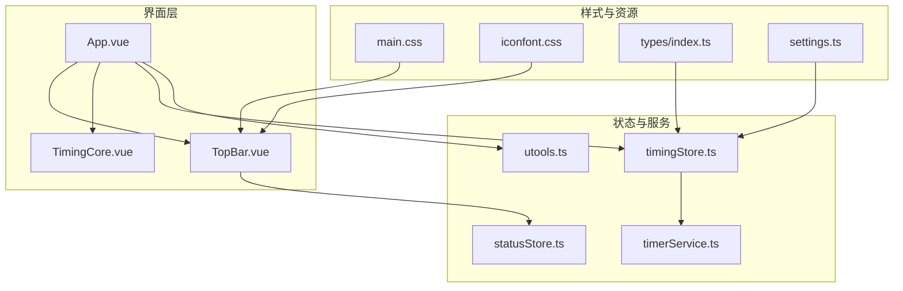
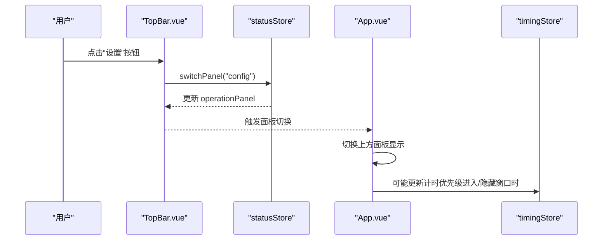
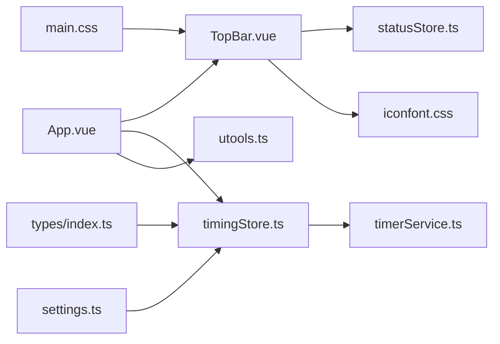
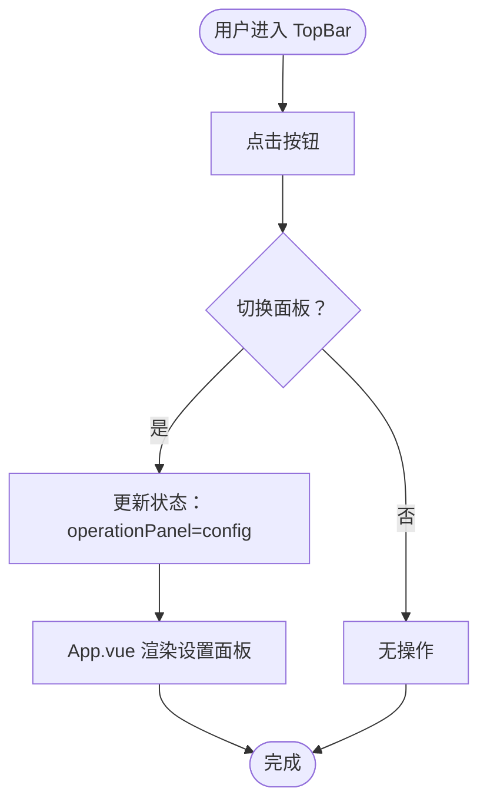

# 顶部栏组件

<cite>
**本文引用的文件列表**
- [TopBar.vue](file://src/components/TopBar.vue)
- [statusStore.ts](file://src/stores/statusStore.ts)
- [timerService.ts](file://src/services/timerService.ts)
- [App.vue](file://src/App.vue)
- [TimingCore.vue](file://src/components/TimingCore.vue)
- [utools.ts](file://src/utils/utools.ts)
- [timingStore.ts](file://src/stores/timingStore.ts)
- [main.css](file://src/main.css)
- [iconfont.css](file://src/assets/iconfonts/iconfont.css)
- [index.ts](file://src/types/index.ts)
- [settings.ts](file://src/settings.ts)
</cite>

## 目录
1. [简介](#简介)
2. [项目结构](#项目结构)
3. [核心组件](#核心组件)
4. [架构总览](#架构总览)
5. [组件详细分析](#组件详细分析)
6. [依赖关系分析](#依赖关系分析)
7. [性能与可用性考量](#性能与可用性考量)
8. [故障排查指南](#故障排查指南)
9. [结论](#结论)
10. [附录](#附录)

## 简介
本文件为“顶部栏组件（TopBar）”的详细技术文档，聚焦于其设计与实现细节，包括：
- 最小化/关闭等窗口控制能力的现状与扩展建议
- 状态指示器（计时状态）的呈现方式与交互
- 按钮事件处理机制（当前已实现的设置按钮，以及可扩展的窗口控制按钮）
- 样式设计（背景、文字、图标）与可访问性、跨平台兼容性
- 自定义按钮与状态指示器的扩展方法

需要特别说明的是：当前仓库中的 TopBar 组件仅包含一个“设置”按钮，尚未包含最小化/关闭等窗口控制按钮与完整的状态指示器。本文将基于现有实现进行分析，并给出扩展建议以满足顶部栏的完整功能需求。

## 项目结构
TopBar 所在的目录位于 src/components 下，与 App.vue、TimingCore.vue 等主要组件共同构成应用界面层；状态管理由 Pinia 的 stores 提供，计时与后台服务由独立的服务模块提供。

图表来源
- [App.vue:25-42](file://src/App.vue#L25-L42)
- [TopBar.vue:24-36](file://src/components/TopBar.vue#L24-L36)
- [TimingCore.vue:42-60](file://src/components/TimingCore.vue#L42-L60)
- [statusStore.ts:22-45](file://src/stores/statusStore.ts#L22-L45)
- [timingStore.ts:32-140](file://src/stores/timingStore.ts#L32-L140)
- [timerService.ts:24-161](file://src/services/timerService.ts#L24-L161)
- [utools.ts:13-165](file://src/utils/utools.ts#L13-L165)
- [main.css:16-54](file://src/main.css#L16-L54)
- [iconfont.css:1-40](file://src/assets/iconfonts/iconfont.css#L1-L40)
- [index.ts:1-83](file://src/types/index.ts#L1-L83)
- [settings.ts:19-47](file://src/settings.ts#L19-L47)

章节来源
- [App.vue:25-42](file://src/App.vue#L25-L42)
- [TopBar.vue:24-36](file://src/components/TopBar.vue#L24-L36)
- [TimingCore.vue:42-60](file://src/components/TimingCore.vue#L42-L60)

## 核心组件
- TopBar：顶部控制栏，当前包含“设置”按钮，用于切换上方面板（设置面板）。
- statusStore：管理当前操作面板（主面板/设置面板）与窗口显示状态。
- timingStore：管理计时状态（专注/休息）、剩余时间、定时器生命周期。
- timerService：封装后台计时与通知等服务接口。
- utools：封装 uTools 环境下的窗口控制、通知、存储等 API。

章节来源
- [TopBar.vue:38-48](file://src/components/TopBar.vue#L38-L48)
- [statusStore.ts:22-45](file://src/stores/statusStore.ts#L22-L45)
- [timingStore.ts:32-140](file://src/stores/timingStore.ts#L32-L140)
- [timerService.ts:24-161](file://src/services/timerService.ts#L24-L161)
- [utools.ts:13-165](file://src/utils/utools.ts#L13-L165)

## 架构总览
TopBar 作为界面层组件，通过 Pinia 状态管理与业务逻辑解耦。当前仅实现“设置”按钮的点击切换行为；计时状态与窗口显示由 App.vue 和 timingStore 协同控制。

图表来源
- [TopBar.vue:27-33](file://src/components/TopBar.vue#L27-L33)
- [statusStore.ts:35-44](file://src/stores/statusStore.ts#L35-L44)
- [App.vue:52-114](file://src/App.vue#L52-L114)
- [timingStore.ts:75-92](file://src/stores/timingStore.ts#L75-L92)

## 组件详细分析

### TopBar 组件结构与职责
- 定位与层级：绝对定位，z-index 较高，确保覆盖在内容之上。
- 右上角布局：右侧固定间距，顶部固定间距，便于放置控制按钮。
- 当前按钮：设置按钮，使用 SVG 图标，绑定点击事件切换到“设置”面板。
- 可访问性：按钮具备 hover 缩放反馈，但缺少键盘导航与焦点管理。

章节来源
- [TopBar.vue:1-22](file://src/components/TopBar.vue#L1-L22)
- [TopBar.vue:24-36](file://src/components/TopBar.vue#L24-L36)
- [TopBar.vue:38-48](file://src/components/TopBar.vue#L38-L48)

### 事件处理机制
- 点击事件：点击“设置”按钮触发状态切换。
- 状态切换：调用 statusStore.switchPanel("config")，将当前面板切换至“设置”。
- 面板切换：App.vue 监听状态变化，控制上方面板的展开/收起与内容渲染。

章节来源
- [TopBar.vue:27-33](file://src/components/TopBar.vue#L27-L33)
- [statusStore.ts:35-44](file://src/stores/statusStore.ts#L35-L44)
- [App.vue:107-125](file://src/App.vue#L107-L125)

### 状态指示器现状与扩展
- 现状：TopBar 未包含状态指示器；计时状态与剩余时间由 TimingCore.vue 展示。
- 扩展建议：
  - 在 TopBar 中添加状态指示器，根据 timingStore 的 isFocus/isRelax 状态显示不同图标或颜色。
  - 可结合 App.vue 的背景色与 TimingCore 的配色，统一视觉语言。
  - 支持点击切换计时状态（如“稍后提醒”），并与 timingStore 的 laterRemind 方法联动。

章节来源
- [TimingCore.vue:42-60](file://src/components/TimingCore.vue#L42-L60)
- [timingStore.ts:43-67](file://src/stores/timingStore.ts#L43-L67)
- [App.vue:28-28](file://src/App.vue#L28-L28)

### 样式设计
- 字体与全局样式：全局禁用滚动条、统一字体族，SVG 图标使用 currentColor 适配主题。
- TopBar 按钮样式：hover 缩放 1.1 倍，过渡 0.2s，提供直观反馈。
- 图标资源：iconfont.css 提供多套图标，TopBar 使用“设置”图标。

章节来源
- [main.css:16-54](file://src/main.css#L16-L54)
- [TopBar.vue:12-19](file://src/components/TopBar.vue#L12-L19)
- [iconfont.css:1-40](file://src/assets/iconfonts/iconfont.css#L1-L40)

### 可访问性与跨平台兼容性
- 可访问性：当前 TopBar 缺少键盘导航（Tab 键顺序、Space/Enter 触发）、焦点可见性与 ARIA 标注不足。
- 跨平台兼容性：utools.ts 封装了窗口控制、通知、存储等 API，在非 uTools 环境下提供降级方案（alert、localStorage 等）。

章节来源
- [utools.ts:13-165](file://src/utils/utools.ts#L13-L165)
- [App.vue:70-106](file://src/App.vue#L70-L106)

### 扩展方法：自定义按钮与状态指示器
- 新增按钮步骤：
  1) 在 TopBar.vue 模板中添加按钮元素与图标。
  2) 在 script 中引入所需 store 或工具函数。
  3) 为按钮绑定点击事件，调用对应 action 或工具方法。
- 状态指示器步骤：
  1) 在 TopBar.vue 中添加状态指示区域。
  2) 从 timingStore 获取 isFocus/isRelax 状态，动态渲染图标或颜色。
  3) 可选：添加点击切换逻辑，调用 timingStore 的 laterRemind 或其他方法。

章节来源
- [TopBar.vue:24-36](file://src/components/TopBar.vue#L24-L36)
- [timingStore.ts:69-139](file://src/stores/timingStore.ts#L69-L139)

## 依赖关系分析
TopBar 与各模块的依赖关系如下：

图表来源
- [TopBar.vue:38-48](file://src/components/TopBar.vue#L38-L48)
- [statusStore.ts:22-45](file://src/stores/statusStore.ts#L22-L45)
- [App.vue:25-42](file://src/App.vue#L25-L42)
- [timingStore.ts:32-140](file://src/stores/timingStore.ts#L32-L140)
- [timerService.ts:24-161](file://src/services/timerService.ts#L24-L161)
- [utools.ts:13-165](file://src/utils/utools.ts#L13-L165)
- [main.css:16-54](file://src/main.css#L16-L54)
- [iconfont.css:1-40](file://src/assets/iconfonts/iconfont.css#L1-L40)
- [index.ts:1-83](file://src/types/index.ts#L1-L83)
- [settings.ts:19-47](file://src/settings.ts#L19-L47)

章节来源
- [TopBar.vue:38-48](file://src/components/TopBar.vue#L38-L48)
- [statusStore.ts:22-45](file://src/stores/statusStore.ts#L22-L45)
- [App.vue:25-42](file://src/App.vue#L25-L42)
- [timingStore.ts:32-140](file://src/stores/timingStore.ts#L32-L140)
- [timerService.ts:24-161](file://src/services/timerService.ts#L24-L161)
- [utools.ts:13-165](file://src/utils/utools.ts#L13-L165)
- [main.css:16-54](file://src/main.css#L16-L54)
- [iconfont.css:1-40](file://src/assets/iconfonts/iconfont.css#L1-L40)
- [index.ts:1-83](file://src/types/index.ts#L1-L83)
- [settings.ts:19-47](file://src/settings.ts#L19-L47)

## 性能与可用性考量
- 性能
  - TopBar 的按钮 hover 缩放使用 CSS transition，开销较低。
  - 面板切换采用 Vue Transition，避免不必要的 DOM 重排。
- 可用性
  - 建议为按钮添加键盘导航（Tab/Space/Enter），并提供焦点可见性。
  - 为图标按钮添加 aria-label 或 tooltip，提升可访问性。
- 跨平台
  - utools.ts 已提供环境检测与降级策略，保证在浏览器环境下仍可运行。

章节来源
- [TopBar.vue:12-19](file://src/components/TopBar.vue#L12-L19)
- [App.vue:30-41](file://src/App.vue#L30-L41)
- [utools.ts:5-165](file://src/utils/utools.ts#L5-L165)

## 故障排查指南
- 点击“设置”按钮无响应
  - 检查 statusStore.switchPanel 是否正确调用。
  - 确认 App.vue 是否监听到面板切换事件并更新显示。
- 计时状态不一致
  - 检查 timingStore 的 isFocus/isRelax getter 与 changeState 行为。
  - 确认 App.vue 在窗口进入/隐藏时是否调整了计时器优先级。
- 通知或窗口控制异常
  - 检查 utools.ts 的环境检测与 API 调用路径。
  - 在浏览器环境下确认降级逻辑（alert、localStorage）是否生效。

章节来源
- [statusStore.ts:35-44](file://src/stores/statusStore.ts#L35-L44)
- [timingStore.ts:43-92](file://src/stores/timingStore.ts#L43-L92)
- [App.vue:70-114](file://src/App.vue#L70-L114)
- [utools.ts:70-165](file://src/utils/utools.ts#L70-L165)

## 结论
TopBar 当前实现了基础的“设置”按钮与面板切换功能，但在窗口控制（最小化/关闭）与状态指示器方面尚有扩展空间。建议按以下方向增强：
- 新增最小化/关闭按钮，调用 utools.ts 的窗口控制 API。
- 添加状态指示器，反映专注/休息状态，并支持点击切换。
- 完善可访问性：键盘导航、焦点管理、ARIA 标注。
- 保持与 TimingCore 的视觉一致性，统一配色与图标风格。

## 附录

### 事件流与状态流转（概念图）

[此图为概念流程示意，不直接映射具体源码文件]