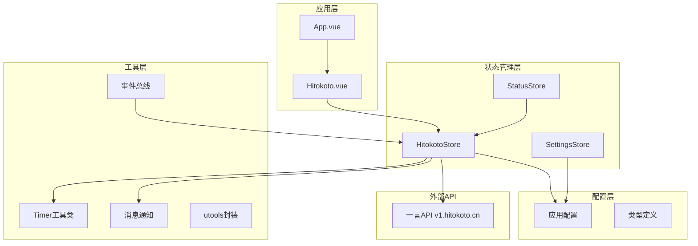
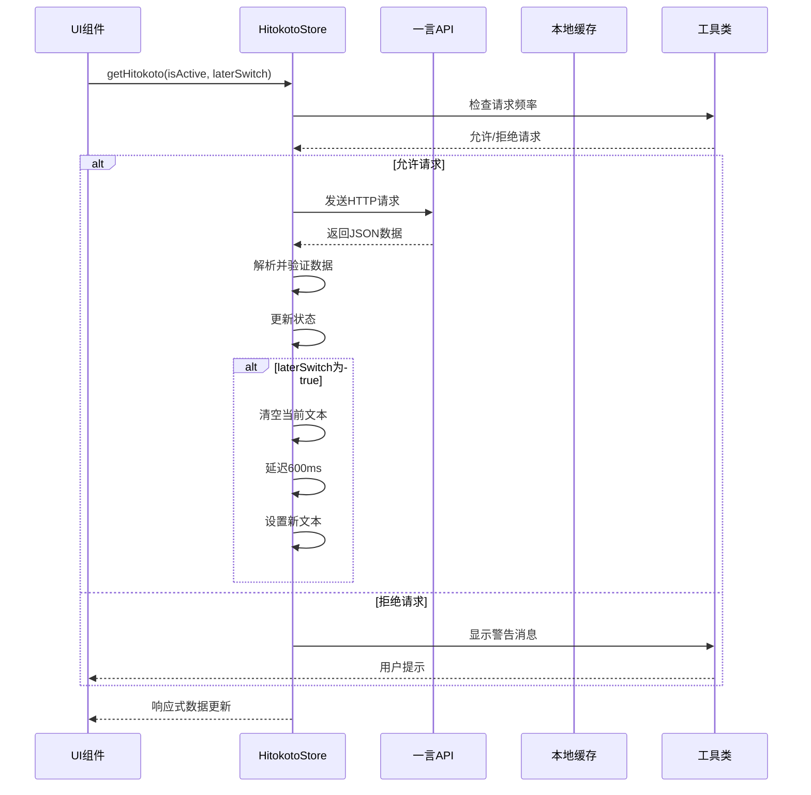
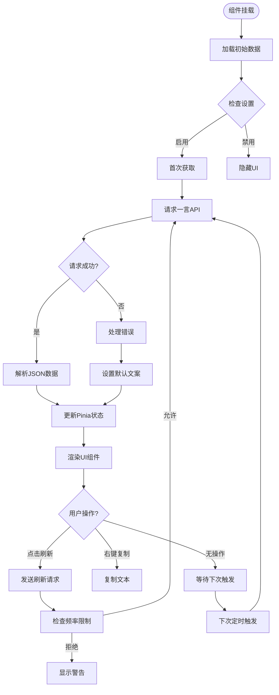
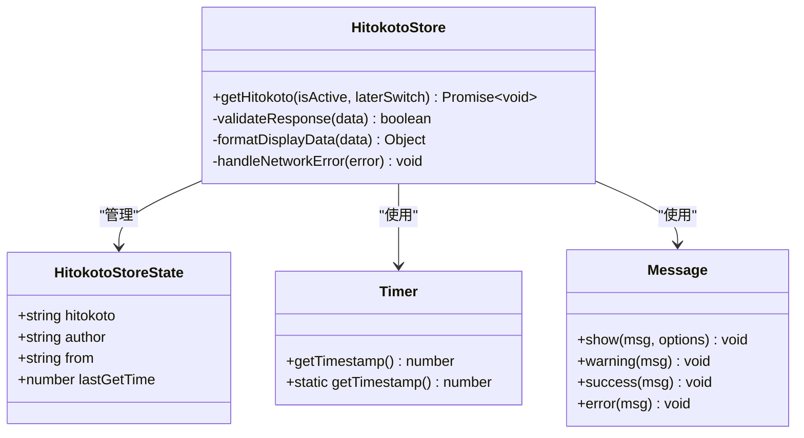
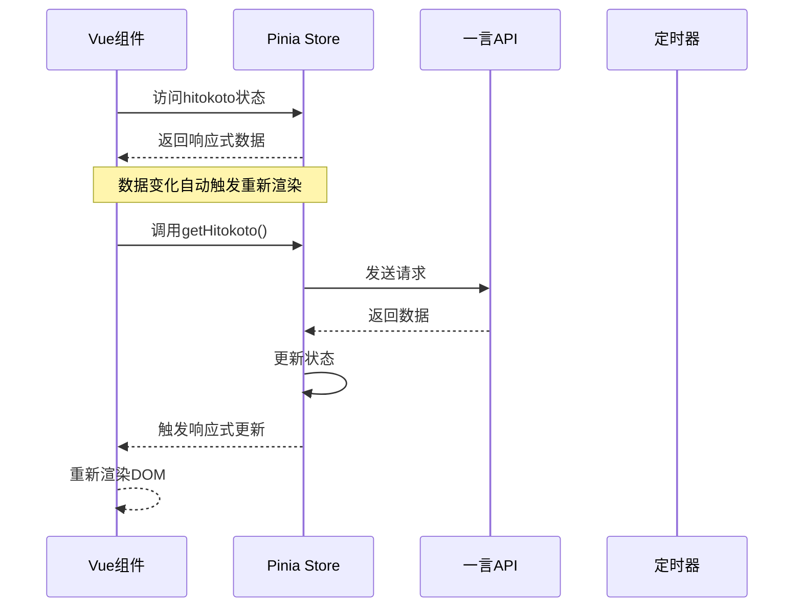
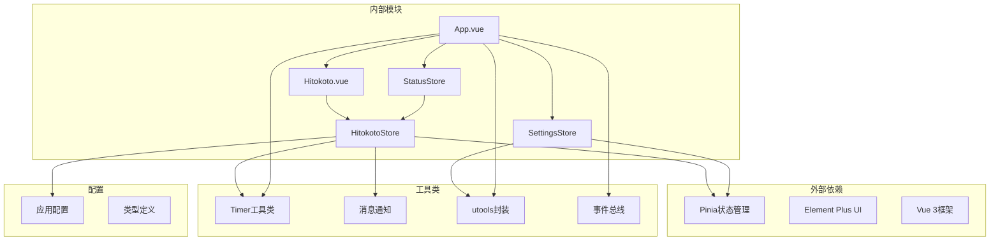
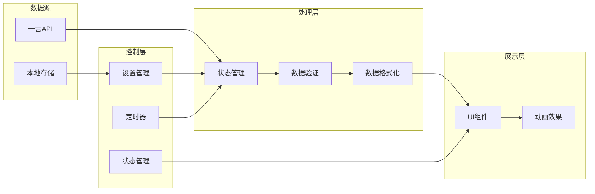
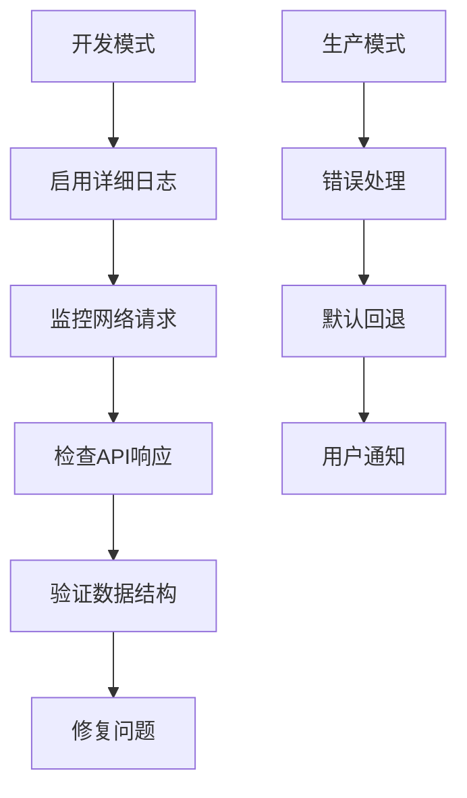

# 一言数据管理

<cite>
**本文档引用的文件**
- [src/stores/hitokotoStore.ts](file://src/stores/hitokotoStore.ts)
- [src/components/Hitokoto.vue](file://src/components/Hitokoto.vue)
- [src/types/index.ts](file://src/types/index.ts)
- [src/settings.ts](file://src/settings.ts)
- [src/utils/notifier.ts](file://src/utils/notifier.ts)
- [src/utils/timer.ts](file://src/utils/timer.ts)
- [src/utils/utools.ts](file://src/utils/utools.ts)
- [src/stores/settingsStore.ts](file://src/stores/settingsStore.ts)
- [src/stores/statusStore.ts](file://src/stores/statusStore.ts)
- [src/utils/eventBus.ts](file://src/utils/eventBus.ts)
- [src/App.vue](file://src/App.vue)
- [src/main.ts](file://src/main.ts)
</cite>

## 目录
1. [简介](#简介)
2. [项目结构](#项目结构)
3. [核心组件](#核心组件)
4. [架构概览](#架构概览)
5. [详细组件分析](#详细组件分析)
6. [依赖关系分析](#依赖关系分析)
7. [性能考虑](#性能考虑)
8. [故障排除指南](#故障排除指南)
9. [结论](#结论)
10. [附录](#附录)

## 简介

一言数据管理模块是休息提醒应用中的一个关键组件，负责获取、缓存和管理来自一言API的每日一句数据。该模块实现了完整的数据流管理，包括网络请求、错误处理、防抖控制、以及与UI组件的响应式集成。

本模块采用Pinia状态管理，结合Vue 3的响应式系统，提供了高效的一言数据获取和展示机制。通过合理的缓存策略和频率控制，确保了良好的用户体验和系统性能。

## 项目结构

一言数据管理模块位于应用的stores目录下，与UI组件、工具类和类型定义形成清晰的分层架构：



**图表来源**
- [src/main.ts:1-19](file://src/main.ts#L1-L19)
- [src/App.vue:121-144](file://src/App.vue#L121-L144)
- [src/stores/hitokotoStore.ts:15-71](file://src/stores/hitokotoStore.ts#L15-L71)

**章节来源**
- [src/main.ts:1-19](file://src/main.ts#L1-L19)
- [src/App.vue:25-42](file://src/App.vue#L25-L42)

## 核心组件

### HitokotoStore - 数据管理核心

HitokotoStore是Pinia状态管理的核心组件，负责一言数据的完整生命周期管理：

- **状态管理**: 维护当前一言内容、作者、出处等数据
- **数据获取**: 通过异步方法获取远程API数据
- **缓存控制**: 实现请求频率限制和数据缓存
- **错误处理**: 提供完善的异常处理和降级机制

### Hitokoto.vue - UI展示组件

UI组件负责一言数据的可视化展示，集成了用户交互功能：

- **响应式展示**: 基于Pinia状态的实时数据绑定
- **用户交互**: 支持点击刷新和右键复制功能
- **动画效果**: 实现平滑的切换动画和过渡效果
- **条件渲染**: 根据设置状态动态显示或隐藏

### 类型定义系统

系统提供了完整的类型定义，确保代码的类型安全性和可维护性：

- **HitokotoData**: 一言API数据结构定义
- **UserSettings**: 用户配置类型
- **EventMap**: 事件类型映射
- **TimerStatus**: 计时器状态类型

**章节来源**
- [src/stores/hitokotoStore.ts:8-21](file://src/stores/hitokotoStore.ts#L8-L21)
- [src/components/Hitokoto.vue:50-79](file://src/components/Hitokoto.vue#L50-L79)
- [src/types/index.ts:22-29](file://src/types/index.ts#L22-L29)

## 架构概览

一言数据管理模块采用分层架构设计，各层职责明确，耦合度低：



**图表来源**
- [src/stores/hitokotoStore.ts:31-69](file://src/stores/hitokotoStore.ts#L31-L69)
- [src/utils/notifier.ts:19-61](file://src/utils/notifier.ts#L19-L61)

### 数据流图



**图表来源**
- [src/components/Hitokoto.vue:65-67](file://src/components/Hitokoto.vue#L65-L67)
- [src/stores/hitokotoStore.ts:31-69](file://src/stores/hitokotoStore.ts#L31-L69)

## 详细组件分析

### HitokotoStore实现分析

#### 状态结构设计



**图表来源**
- [src/stores/hitokotoStore.ts:8-21](file://src/stores/hitokotoStore.ts#L8-L21)
- [src/utils/timer.ts:5-38](file://src/utils/timer.ts#L5-L38)
- [src/utils/notifier.ts:19-61](file://src/utils/notifier.ts#L19-L61)

#### 数据获取流程

数据获取方法实现了完整的请求生命周期管理：

1. **频率控制**: 检查上次获取时间与当前时间的差值
2. **网络请求**: 发送HTTP GET请求到一言API
3. **数据验证**: 验证响应状态和数据结构
4. **状态更新**: 更新Pinia状态并触发UI响应
5. **错误处理**: 处理网络异常和数据错误

#### 缓存策略实现

模块采用了基于时间戳的简单缓存机制：

- **lastGetTime**: 记录上次成功获取数据的时间
- **getInterval**: 配置请求间隔（默认2秒）
- **防抖控制**: 防止用户频繁点击导致的过度请求

**章节来源**
- [src/stores/hitokotoStore.ts:31-69](file://src/stores/hitokotoStore.ts#L31-L69)
- [src/settings.ts:32-35](file://src/settings.ts#L32-L35)

### UI组件集成分析

#### 响应式数据绑定



**图表来源**
- [src/components/Hitokoto.vue:34-48](file://src/components/Hitokoto.vue#L34-L48)
- [src/stores/hitokotoStore.ts:25-69](file://src/stores/hitokotoStore.ts#L25-L69)

#### 用户交互处理

UI组件实现了多种用户交互模式：

- **左键点击**: 主动刷新一言数据
- **右键点击**: 复制当前一言到剪贴板
- **自动加载**: 组件挂载时自动获取数据
- **条件显示**: 根据设置状态动态显示

**章节来源**
- [src/components/Hitokoto.vue:37-61](file://src/components/Hitokoto.vue#L37-L61)
- [src/App.vue:88-91](file://src/App.vue#L88-L91)

### 数据结构定义

#### 一言数据模型

| 字段名 | 类型 | 描述 | 必需 |
|--------|------|------|------|
| hitokoto | string | 一言内容 | 是 |
| from | string | 出处名称 | 是 |
| from_who | string | 作者姓名 | 是 |

#### 状态管理结构

| 字段名 | 类型 | 描述 | 默认值 |
|--------|------|------|--------|
| hitokoto | string | 当前显示的一言内容 | "" |
| author | string | 作者信息 | "" |
| from | string | 出处信息 | "" |
| lastGetTime | number | 上次获取时间戳 | 0 |

#### 配置参数

| 参数名 | 类型 | 默认值 | 描述 |
|--------|------|--------|------|
| apiBaseUrl | string | "https://v1.hitokoto.cn" | API基础URL |
| getInterval | number | 2000 | 请求间隔（毫秒） |
| hitokotoEnabled | boolean | true | 是否启用一言功能 |

**章节来源**
- [src/types/index.ts:22-29](file://src/types/index.ts#L22-L29)
- [src/stores/hitokotoStore.ts:8-21](file://src/stores/hitokotoStore.ts#L8-L21)
- [src/settings.ts:32-35](file://src/settings.ts#L32-L35)

## 依赖关系分析

### 组件间依赖图



**图表来源**
- [src/stores/hitokotoStore.ts:1-6](file://src/stores/hitokotoStore.ts#L1-L6)
- [src/components/Hitokoto.vue:70-78](file://src/components/Hitokoto.vue#L70-L78)
- [src/App.vue:121-137](file://src/App.vue#L121-L137)

### 数据流向分析



**图表来源**
- [src/stores/hitokotoStore.ts:43-68](file://src/stores/hitokotoStore.ts#L43-L68)
- [src/components/Hitokoto.vue:34-48](file://src/components/Hitokoto.vue#L34-L48)

**章节来源**
- [src/stores/hitokotoStore.ts:1-72](file://src/stores/hitokotoStore.ts#L1-L72)
- [src/stores/settingsStore.ts:1-87](file://src/stores/settingsStore.ts#L1-L87)
- [src/stores/statusStore.ts:1-46](file://src/stores/statusStore.ts#L1-L46)

## 性能考虑

### 请求频率控制

模块实现了智能的请求频率控制机制：

- **时间戳检查**: 每次请求前检查lastGetTime与当前时间的差值
- **配置化间隔**: 通过settings.hitokoto.getInterval配置请求间隔
- **用户行为响应**: 对于主动触发的请求显示警告消息

### 内存管理优化

- **状态最小化**: 仅存储必要的数据字段，避免内存浪费
- **及时清理**: 组件卸载时自动清理相关资源
- **响应式更新**: 利用Vue的响应式系统，只更新变化的数据

### 网络性能优化

- **连接复用**: 使用fetch API的连接复用特性
- **错误快速返回**: 网络异常时快速失败，避免长时间等待
- **降级策略**: 网络失败时提供默认文案，保证用户体验

**章节来源**
- [src/stores/hitokotoStore.ts:31-40](file://src/stores/hitokotoStore.ts#L31-L40)
- [src/settings.ts:32-35](file://src/settings.ts#L32-L35)

## 故障排除指南

### 常见问题及解决方案

#### 网络请求失败

**问题现象**: 一言数据无法加载，显示默认文案

**可能原因**:
- 网络连接异常
- API服务不可用
- CORS跨域限制

**解决方案**:
- 检查网络连接状态
- 验证API地址可达性
- 查看浏览器控制台错误信息

#### 请求过于频繁

**问题现象**: 用户点击刷新按钮时出现警告消息

**解决方法**:
- 等待至少2秒后再尝试刷新
- 调整settings.hitokoto.getInterval配置
- 避免连续快速点击

#### 数据格式错误

**问题现象**: API返回数据格式不符合预期

**处理机制**:
- 模块会捕获数据解析异常
- 自动回退到默认文案
- 控制台记录详细错误信息

### 调试技巧

#### 开发环境调试



**图表来源**
- [src/stores/hitokotoStore.ts:62-68](file://src/stores/hitokotoStore.ts#L62-L68)
- [src/utils/notifier.ts:23-32](file://src/utils/notifier.ts#L23-L32)

**章节来源**
- [src/stores/hitokotoStore.ts:62-68](file://src/stores/hitokotoStore.ts#L62-L68)
- [src/utils/notifier.ts:19-61](file://src/utils/notifier.ts#L19-L61)

## 结论

一言数据管理模块通过精心设计的状态管理、完善的错误处理机制和高效的性能优化，在保证用户体验的同时，实现了稳定可靠的数据获取和展示功能。

模块的主要优势包括：
- **简洁高效**: 最小化的状态管理和清晰的业务逻辑
- **健壮性强**: 完善的错误处理和降级策略
- **用户体验佳**: 智能的频率控制和流畅的动画效果
- **易于扩展**: 清晰的架构设计便于添加新的数据源

未来可以考虑的改进方向：
- 添加更丰富的缓存策略
- 实现数据预加载机制
- 增强数据验证和格式化能力
- 提供更多的自定义配置选项

## 附录

### 扩展新数据源指南

要为系统添加新的数据源，需要遵循以下步骤：

1. **定义数据接口**: 在types/index.ts中添加新的数据类型定义
2. **创建Store**: 创建对应的数据源Store，继承Pinia的基本功能
3. **实现数据获取**: 编写异步获取方法，处理网络请求和错误
4. **集成UI组件**: 创建或修改UI组件以支持新数据源
5. **配置集成**: 在settings.ts中添加新数据源的配置项
6. **测试验证**: 完成单元测试和集成测试

### 自定义数据处理指导

#### 数据格式化扩展

```typescript
// 示例：添加新的数据格式化方法
async formatCustomData(rawData: any): Promise<FormattedData> {
  // 实现自定义的数据格式化逻辑
  return {
    content: rawData.content.trim(),
    author: rawData.author || '未知',
    source: rawData.source || '自定义来源',
    rating: rawData.rating || 0,
    tags: rawData.tags || []
  };
}
```

#### 错误处理增强

```typescript
// 示例：增强的错误处理机制
async handleCustomError(error: Error): Promise<void> {
  // 记录详细的错误信息
  console.error(`[CustomDataSource] 请求失败:`, {
    error: error.message,
    timestamp: Date.now(),
    url: this.apiUrl,
    retryCount: this.retryCount
  });
  
  // 根据错误类型采取不同策略
  if (this.isNetworkError(error)) {
    await this.handleNetworkError();
  } else if (this.isRateLimitError(error)) {
    await this.handleRateLimitError();
  }
}
```

**章节来源**
- [src/types/index.ts:22-29](file://src/types/index.ts#L22-L29)
- [src/stores/hitokotoStore.ts:25-69](file://src/stores/hitokotoStore.ts#L25-L69)