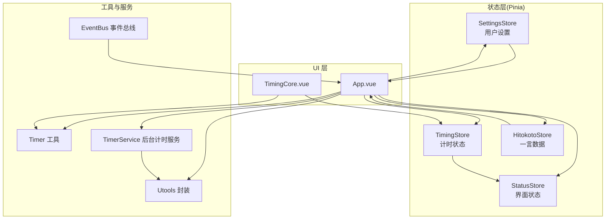
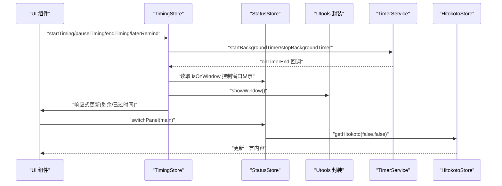
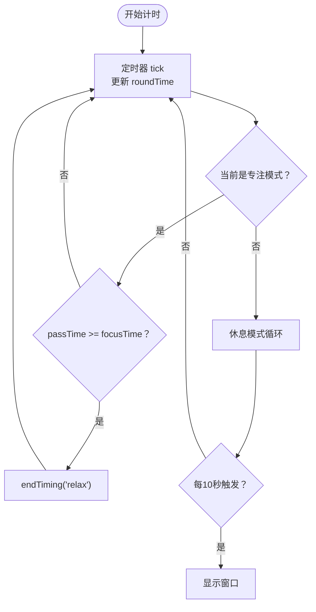
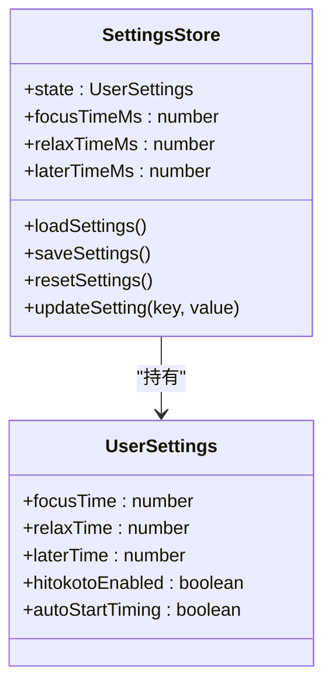
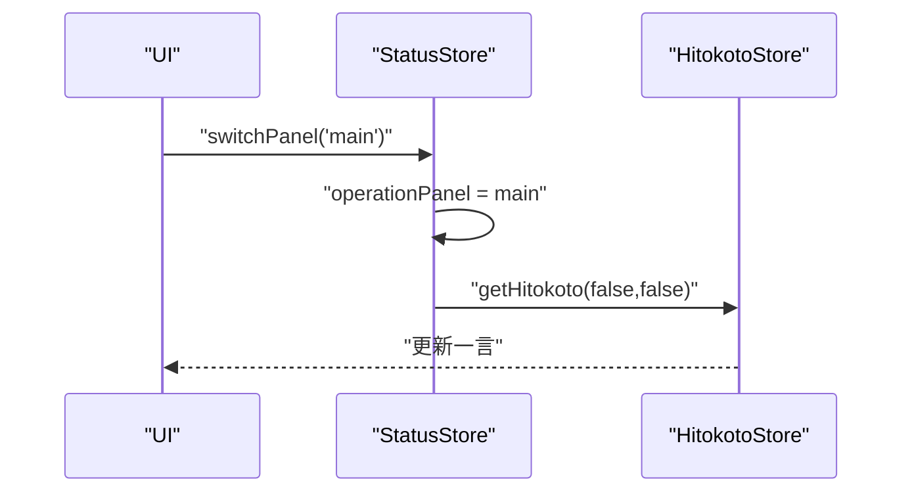
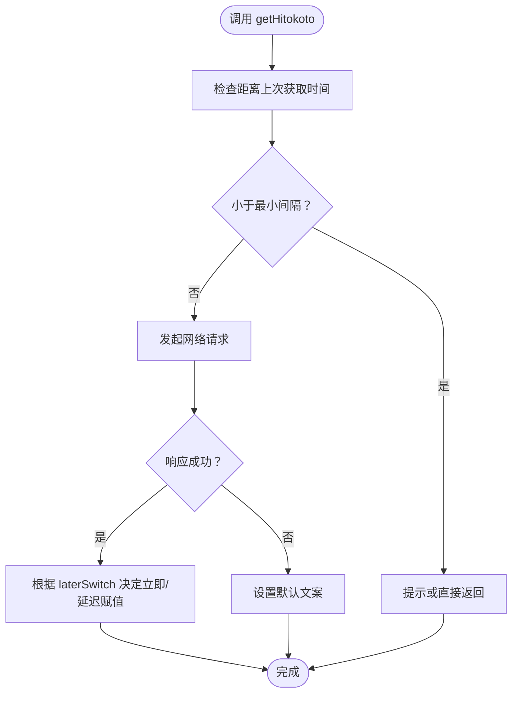
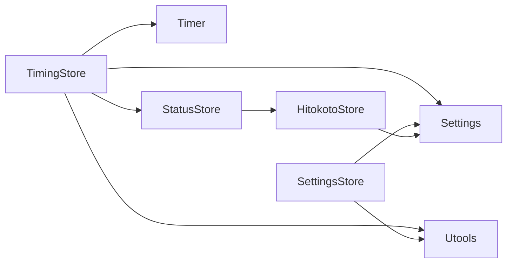

# 状态管理

<cite>
**本文引用的文件列表**
- [src/stores/timingStore.ts](file://src/stores/timingStore.ts)
- [src/stores/settingsStore.ts](file://src/stores/settingsStore.ts)
- [src/stores/statusStore.ts](file://src/stores/statusStore.ts)
- [src/stores/hitokotoStore.ts](file://src/stores/hitokotoStore.ts)
- [src/types/index.ts](file://src/types/index.ts)
- [src/settings.ts](file://src/settings.ts)
- [src/utils/timer.ts](file://src/utils/timer.ts)
- [src/utils/utools.ts](file://src/utils/utools.ts)
- [src/services/timerService.ts](file://src/services/timerService.ts)
- [src/components/TimingCore.vue](file://src/components/TimingCore.vue)
- [src/App.vue](file://src/App.vue)
- [src/main.ts](file://src/main.ts)
- [src/utils/eventBus.ts](file://src/utils/eventBus.ts)
</cite>

## 目录
1. [简介](#简介)
2. [项目结构与状态管理定位](#项目结构与状态管理定位)
3. [核心组件与职责](#核心组件与职责)
4. [架构总览](#架构总览)
5. [详细组件分析](#详细组件分析)
6. [依赖关系分析](#依赖关系分析)
7. [性能与响应式特性](#性能与响应式特性)
8. [持久化与数据同步策略](#持久化与数据同步策略)
9. [状态订阅与事件机制](#状态订阅与事件机制)
10. [故障排查指南](#故障排查指南)
11. [最佳实践与扩展建议](#最佳实践与扩展建议)
12. [结论](#结论)

## 简介
本文件面向“休息提醒”项目，系统性梳理基于 Pinia 的状态管理架构，重点覆盖以下方面：
- TimingStore 的计时状态管理：专注模式、休息模式与稍后提醒的状态转换逻辑
- SettingsStore 的用户配置管理：时间参数、功能开关与自动启动设置
- StatusStore 的界面状态控制：面板展开、窗口状态与通知状态
- HitokotoStore 的一言数据管理机制
- 状态订阅与响应式更新的工作原理
- 状态持久化与数据同步策略
- 新增状态与扩展的最佳实践

## 项目结构与状态管理定位
- 状态管理采用 Pinia，集中于 src/stores 目录下的四个模块：timingStore、settingsStore、statusStore、hitokotoStore
- 类型定义集中在 src/types/index.ts，统一约束状态结构与事件契约
- 工具层通过 src/utils/* 提供计时、uTools API 封装、事件总线等能力
- 服务层通过 src/services/timerService.ts 封装后台计时与跨环境存储/通知
- UI 层通过 Vue 组件订阅状态并驱动视图更新

图表来源
- [src/stores/timingStore.ts:1-141](file://src/stores/timingStore.ts#L1-L141)
- [src/stores/settingsStore.ts:1-87](file://src/stores/settingsStore.ts#L1-L87)
- [src/stores/statusStore.ts:1-46](file://src/stores/statusStore.ts#L1-L46)
- [src/stores/hitokotoStore.ts:1-72](file://src/stores/hitokotoStore.ts#L1-L72)
- [src/services/timerService.ts:1-161](file://src/services/timerService.ts#L1-L161)
- [src/utils/utools.ts:1-165](file://src/utils/utools.ts#L1-L165)
- [src/utils/timer.ts:1-66](file://src/utils/timer.ts#L1-L66)
- [src/App.vue:1-145](file://src/App.vue#L1-L145)
- [src/components/TimingCore.vue:1-101](file://src/components/TimingCore.vue#L1-L101)

章节来源
- [src/main.ts:1-19](file://src/main.ts#L1-L19)
- [src/App.vue:1-145](file://src/App.vue#L1-L145)

## 核心组件与职责
- TimingStore：负责计时状态、时间计算、定时器调度与状态切换
- SettingsStore：负责用户设置加载/保存/重置与时间参数换算
- StatusStore：负责界面面板状态与窗口可见性
- HitokotoStore：负责一言数据获取、防抖与回退策略

章节来源
- [src/stores/timingStore.ts:1-141](file://src/stores/timingStore.ts#L1-L141)
- [src/stores/settingsStore.ts:1-87](file://src/stores/settingsStore.ts#L1-L87)
- [src/stores/statusStore.ts:1-46](file://src/stores/statusStore.ts#L1-L46)
- [src/stores/hitokotoStore.ts:1-72](file://src/stores/hitokotoStore.ts#L1-L72)

## 架构总览
Pinia 状态通过 Vue 组件订阅，UI 根据状态变化自动渲染；同时通过 TimerService 实现后台计时与通知，Utools 封装提供跨环境的存储与窗口控制能力；EventBus 提供 Store 间解耦的事件通信。

图表来源
- [src/stores/timingStore.ts:75-139](file://src/stores/timingStore.ts#L75-L139)
- [src/stores/statusStore.ts:35-44](file://src/stores/statusStore.ts#L35-L44)
- [src/utils/utools.ts:75-86](file://src/utils/utools.ts#L75-L86)
- [src/services/timerService.ts:59-118](file://src/services/timerService.ts#L59-L118)
- [src/stores/hitokotoStore.ts:31-69](file://src/stores/hitokotoStore.ts#L31-L69)

## 详细组件分析

### TimingStore：计时状态管理
- 状态字段
  - 当前计时状态（focus/relax）
  - 定时器句柄
  - 专注/休息/稍后时间（毫秒）
  - 已过时间与本轮持续时间
- 关键计算
  - isFocus/isRelax/isTiming：基于当前状态键判断
  - passTime：roundTime + passedTime
  - restTime：max(focusTime - passTime, 0)
- 核心动作
  - changeState：切换 focus/relax
  - setTimingInterval：启动/重置定时器，周期性更新 roundTime，并在满足条件时触发 endTiming 或窗口显示
  - startTiming/pauseTiming/continueTiming/clearTimingInterval：完整的计时生命周期管理
  - endTiming：结束当前计时，显示窗口，重新开始并可切换目标状态
  - laterRemind：清空定时器，回到 focus 并从剩余时间倒推开始

图表来源
- [src/stores/timingStore.ts:75-92](file://src/stores/timingStore.ts#L75-L92)
- [src/stores/timingStore.ts:122-131](file://src/stores/timingStore.ts#L122-L131)

章节来源
- [src/stores/timingStore.ts:1-141](file://src/stores/timingStore.ts#L1-L141)
- [src/utils/timer.ts:1-66](file://src/utils/timer.ts#L1-L66)
- [src/utils/utools.ts:75-86](file://src/utils/utools.ts#L75-L86)

### SettingsStore：用户配置管理
- 状态字段：专注/休息/稍后时间（分钟）、一言开关、自动开始开关
- Getter：将分钟转换为毫秒（乘以 minMulti）
- 动作：
  - loadSettings：从本地存储读取并合并到当前状态
  - saveSettings：将当前状态写回本地存储
  - resetSettings：恢复默认值并保存
  - updateSetting：泛型更新单个设置项并保存

图表来源
- [src/stores/settingsStore.ts:11-87](file://src/stores/settingsStore.ts#L11-L87)
- [src/types/index.ts:14-20](file://src/types/index.ts#L14-L20)

章节来源
- [src/stores/settingsStore.ts:1-87](file://src/stores/settingsStore.ts#L1-L87)
- [src/settings.ts:22-47](file://src/settings.ts#L22-L47)

### StatusStore：界面状态控制
- 状态字段：窗口可见性、当前操作面板（main/config）
- Getter：isUpperPanel 判断是否处于非主面板
- 动作：switchPanel 切换面板；当切回 main 时触发一言刷新

图表来源
- [src/stores/statusStore.ts:35-44](file://src/stores/statusStore.ts#L35-L44)
- [src/stores/hitokotoStore.ts:31-69](file://src/stores/hitokotoStore.ts#L31-L69)

章节来源
- [src/stores/statusStore.ts:1-46](file://src/stores/statusStore.ts#L1-L46)

### HitokotoStore：一言数据管理
- 状态字段：hitokoto、author、from、lastGetTime
- 动作：getHitokoto(isActive, laterSwitch)
  - 防抖：限制请求频率
  - 请求：调用 API 获取数据
  - 动画切换：支持延迟切换以配合过渡动画
  - 错误回退：失败时设置默认文案

图表来源
- [src/stores/hitokotoStore.ts:31-69](file://src/stores/hitokotoStore.ts#L31-L69)

章节来源
- [src/stores/hitokotoStore.ts:1-72](file://src/stores/hitokotoStore.ts#L1-L72)
- [src/settings.ts:32-35](file://src/settings.ts#L32-L35)

### UI 与状态联动示例
- App.vue 在挂载时加载设置、初始化后台计时服务、处理窗口进入/隐藏事件，并按需自动开始计时
- TimingCore.vue 基于 TimingStore 的响应式状态渲染进度与时间

章节来源
- [src/App.vue:56-114](file://src/App.vue#L56-L114)
- [src/components/TimingCore.vue:62-101](file://src/components/TimingCore.vue#L62-L101)

## 依赖关系分析
- TimingStore 依赖：
  - Timer 工具：时间戳与持续时间计算
  - Settings：时间倍率换算
  - Utools：窗口显示
  - StatusStore：窗口可见性
- SettingsStore 依赖：
  - Settings：默认值与倍率
  - Utools：本地存储
- StatusStore 依赖：
  - HitokotoStore：面板切换时的数据刷新
- HitokotoStore 依赖：
  - Settings：API 地址与请求间隔
  - Notifier：错误提示（通过 Message）

图表来源
- [src/stores/timingStore.ts:1-10](file://src/stores/timingStore.ts#L1-L10)
- [src/stores/settingsStore.ts:1-6](file://src/stores/settingsStore.ts#L1-L6)
- [src/stores/statusStore.ts:1-4](file://src/stores/statusStore.ts#L1-L4)
- [src/stores/hitokotoStore.ts:1-6](file://src/stores/hitokotoStore.ts#L1-L6)
- [src/settings.ts:22-47](file://src/settings.ts#L22-L47)

章节来源
- [src/stores/timingStore.ts:1-10](file://src/stores/timingStore.ts#L1-L10)
- [src/stores/settingsStore.ts:1-6](file://src/stores/settingsStore.ts#L1-L6)
- [src/stores/statusStore.ts:1-4](file://src/stores/statusStore.ts#L1-L4)
- [src/stores/hitokotoStore.ts:1-6](file://src/stores/hitokotoStore.ts#L1-L6)

## 性能与响应式特性
- 响应式更新：Vue 组件通过 Pinia 的响应式 API 订阅状态，状态变更自动触发视图更新
- 定时器优先级：窗口进入时提高定时器精度（更短间隔），窗口隐藏时降低精度以节省资源
- 计算属性：restTime、passTime、百分比等通过 getter 计算，避免重复计算
- 防抖与节流：HitokotoStore 的请求频率限制与定时器间隔控制减少资源消耗

章节来源
- [src/App.vue:82-106](file://src/App.vue#L82-L106)
- [src/stores/timingStore.ts:43-67](file://src/stores/timingStore.ts#L43-L67)
- [src/stores/hitokotoStore.ts:31-39](file://src/stores/hitokotoStore.ts#L31-L39)

## 持久化与数据同步策略
- SettingsStore 使用 Utools 的 dbStorage 进行本地持久化，提供 load/save/reset/update 等完整生命周期
- TimerService 支持后台计时与跨环境存储，若无后台服务则降级至浏览器环境的 localStorage
- 数据同步：
  - 应用启动时先加载用户设置，再初始化计时器参数
  - SettingsStore.updateSetting 会立即保存，确保设置即时生效
  - 后台计时结束通过回调触发通知与窗口显示，保证前后端状态一致

章节来源
- [src/stores/settingsStore.ts:39-84](file://src/stores/settingsStore.ts#L39-L84)
- [src/utils/utools.ts:37-68](file://src/utils/utools.ts#L37-L68)
- [src/services/timerService.ts:123-156](file://src/services/timerService.ts#L123-L156)
- [src/App.vue:60-79](file://src/App.vue#L60-L79)

## 状态订阅与事件机制
- 组件订阅：Vue 组件通过 useXxxStore 引入各 Store 实例，直接访问 state/getters/actions
- 事件总线：EventBus 提供 on/off/emit 接口，支持组件外场景的事件通信；useEventBus Hook 自动管理生命周期
- Store 间解耦：StatusStore 在面板切换时主动调用 HitokotoStore，避免直接耦合

章节来源
- [src/utils/eventBus.ts:12-104](file://src/utils/eventBus.ts#L12-L104)
- [src/stores/statusStore.ts:35-44](file://src/stores/statusStore.ts#L35-L44)

## 故障排查指南
- 计时异常
  - 检查 isTiming 状态与定时器句柄是否正确清理/重启
  - 确认 setTimingInterval 的间隔设置是否合理
- 窗口不显示
  - 确认 StatusStore.isOnWindow 与 Utools.showWindow 的调用时机
- 一言不刷新
  - 检查请求间隔限制与 API 可用性
  - 确认 laterSwitch 参数与动画时序
- 设置未生效
  - 确认 SettingsStore.saveSettings 是否被调用
  - 检查 App.vue 初始化流程中是否正确读取并应用设置

章节来源
- [src/stores/timingStore.ts:75-139](file://src/stores/timingStore.ts#L75-L139)
- [src/utils/utools.ts:75-86](file://src/utils/utools.ts#L75-L86)
- [src/stores/hitokotoStore.ts:31-69](file://src/stores/hitokotoStore.ts#L31-L69)
- [src/stores/settingsStore.ts:39-84](file://src/stores/settingsStore.ts#L39-L84)
- [src/App.vue:60-114](file://src/App.vue#L60-L114)

## 最佳实践与扩展建议
- 新增状态字段
  - 在对应 Store 的 state 中声明新字段
  - 如涉及 UI，补充相应的 getter 与组件绑定
- 新增 Store
  - 使用 defineStore 创建独立模块，避免过度耦合
  - 通过 useEventBus 或显式调用进行跨 Store 通信
- 持久化策略
  - 仅对必要字段做持久化，避免冗余存储
  - 使用 updateSetting 的粒度更新，减少 IO 次数
- 性能优化
  - 合理设置定时器间隔，窗口隐藏时降低精度
  - 使用计算属性缓存复杂表达式
- 错误处理
  - 对网络请求与外部 API 调用增加 try/catch 与降级策略
  - 对关键状态提供默认值，保证 UI 稳定

## 结论
本项目采用 Pinia 实现清晰的状态分层：计时、设置、界面与数据三者职责明确，配合工具层与服务层实现跨环境兼容与后台计时能力。通过响应式更新与事件总线，实现了 UI 与状态的高效联动。遵循本文最佳实践，可安全地扩展新的状态与功能，保持系统的可维护性与稳定性。