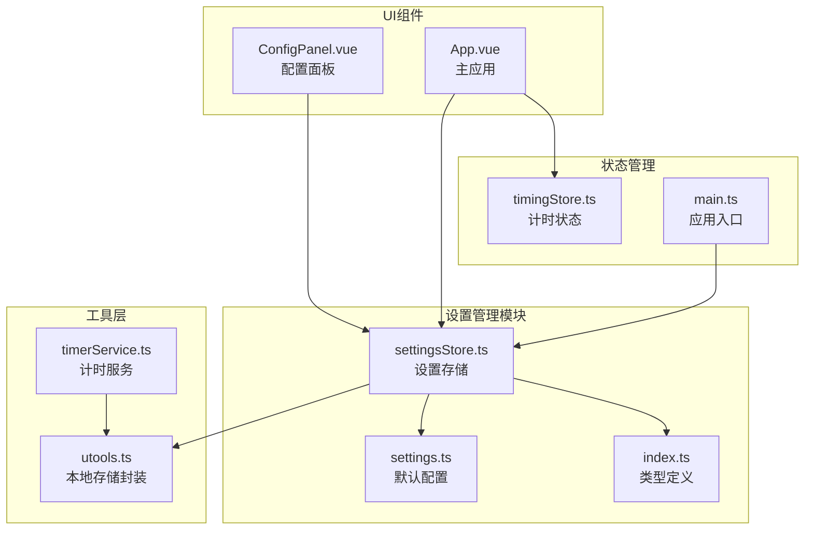
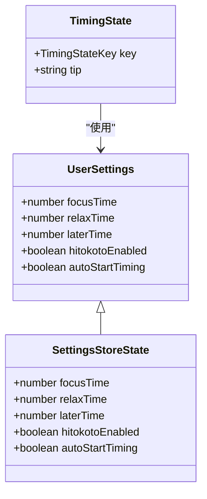
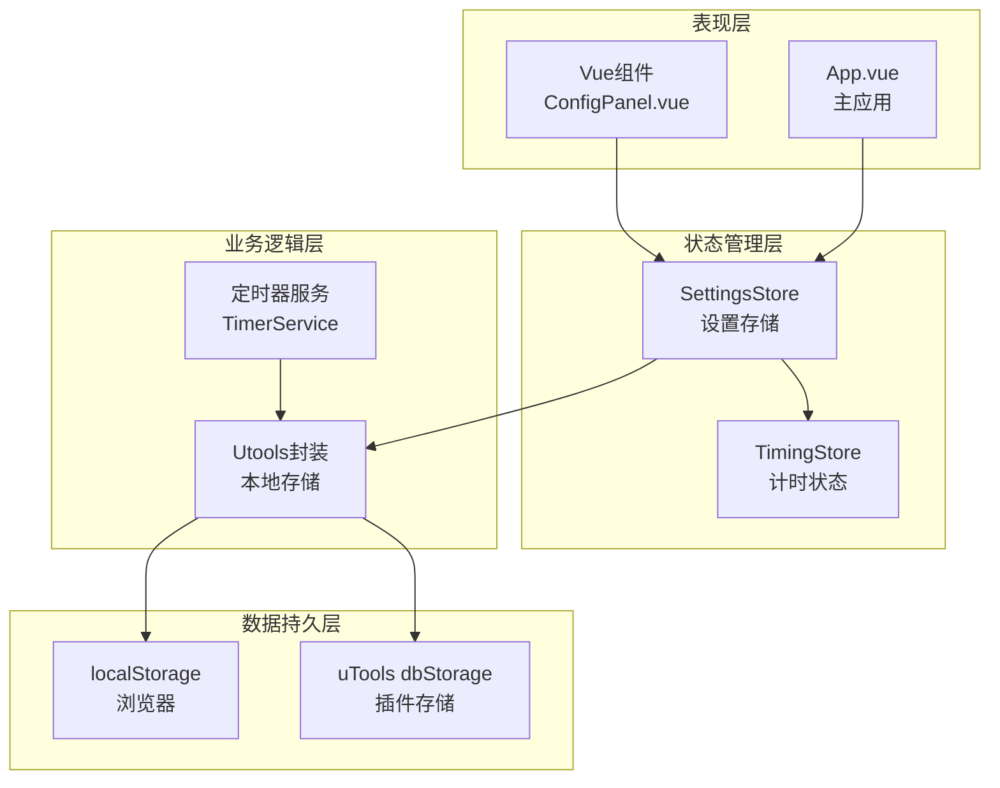
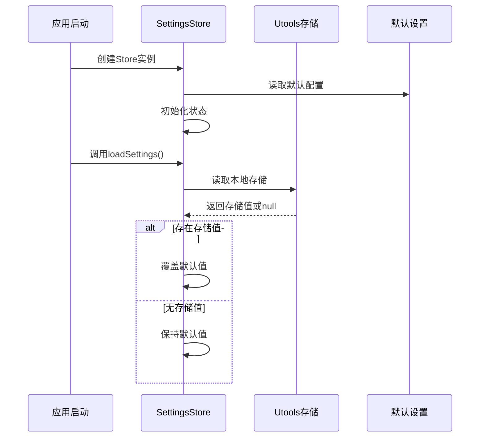
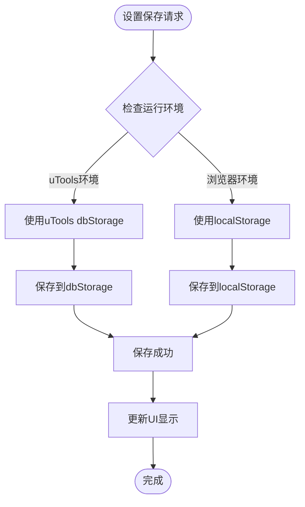
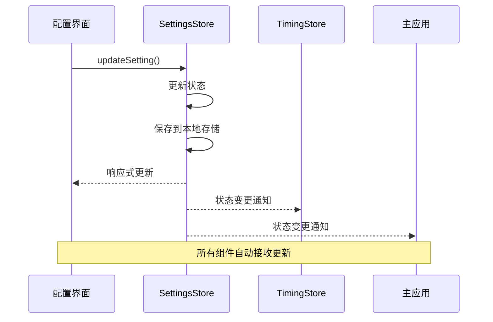
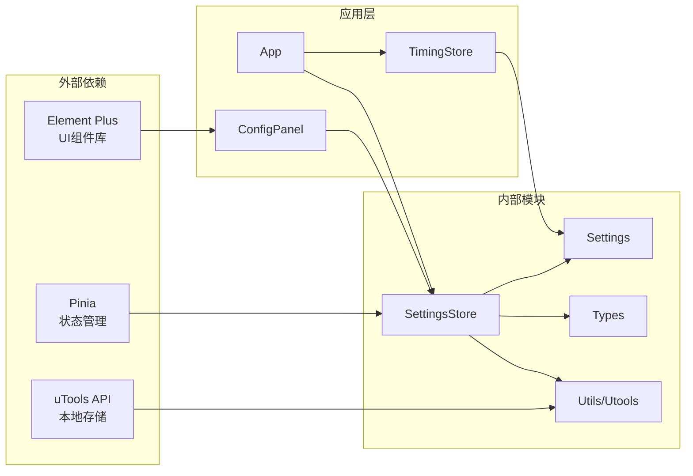

# 用户设置管理

<cite>
**本文档引用的文件**
- [settingsStore.ts](file://src/stores/settingsStore.ts)
- [settings.ts](file://src/settings.ts)
- [index.ts](file://src/types/index.ts)
- [utools.ts](file://src/utils/utools.ts)
- [ConfigPanel.vue](file://src/components/operationPanel/ConfigPanel.vue)
- [App.vue](file://src/App.vue)
- [timingStore.ts](file://src/stores/timingStore.ts)
- [timerService.ts](file://src/services/timerService.ts)
- [main.ts](file://src/main.ts)
</cite>

## 目录
1. [简介](#简介)
2. [项目结构](#项目结构)
3. [核心组件](#核心组件)
4. [架构概览](#架构概览)
5. [详细组件分析](#详细组件分析)
6. [依赖关系分析](#依赖关系分析)
7. [性能考虑](#性能考虑)
8. [故障排除指南](#故障排除指南)
9. [结论](#结论)
10. [附录](#附录)

## 简介

用户设置管理模块是休息提醒插件的核心配置系统，负责管理用户的时间参数、功能开关和自动启动设置。该模块采用Pinia状态管理，结合uTools本地存储API，实现了完整的设置持久化和响应式更新机制。

本模块主要包含以下功能：
- 默认配置定义与加载
- 用户自定义配置的覆盖机制
- 设置数据的持久化策略
- 跨组件的数据同步
- 设置变更的实时响应
- 设置导入导出功能

## 项目结构

用户设置管理相关的文件组织如下：

**图表来源**
- [settingsStore.ts:1-87](file://src/stores/settingsStore.ts#L1-L87)
- [settings.ts:1-50](file://src/settings.ts#L1-L50)
- [index.ts:1-83](file://src/types/index.ts#L1-L83)

**章节来源**
- [settingsStore.ts:1-87](file://src/stores/settingsStore.ts#L1-L87)
- [settings.ts:1-50](file://src/settings.ts#L1-L50)
- [index.ts:1-83](file://src/types/index.ts#L1-L83)

## 核心组件

### SettingsStore（设置存储）

SettingsStore是基于Pinia的状态管理容器，负责管理用户的所有配置信息。它继承了UserSettings接口的所有属性，并提供了完整的CRUD操作。

**主要特性：**
- 状态初始化：从默认配置加载初始值
- 数据持久化：自动保存到本地存储
- 响应式更新：支持Vue组件的双向绑定
- 类型安全：完整的TypeScript类型定义

**章节来源**
- [settingsStore.ts:11-87](file://src/stores/settingsStore.ts#L11-L87)

### 默认配置系统

默认配置定义在settings.ts文件中，包含了应用的所有默认设置值：

**时间参数默认值：**
- focusTime: 35分钟（专注时间）
- relaxTime: 5分钟（休息时间）
- laterTime: 3分钟（稍后提醒时间）

**功能开关默认值：**
- hitokotoEnabled: true（启用一言功能）
- autoStartTiming: true（自动开始计时）

**章节来源**
- [settings.ts:37-47](file://src/settings.ts#L37-L47)

### 类型系统

UserSettings接口定义了所有设置项的数据类型：

**图表来源**
- [index.ts:14-20](file://src/types/index.ts#L14-L20)
- [settingsStore.ts:9](file://src/stores/settingsStore.ts#L9)

**章节来源**
- [index.ts:14-20](file://src/types/index.ts#L14-L20)

## 架构概览

用户设置管理采用分层架构设计，确保了良好的可维护性和扩展性：

**图表来源**
- [ConfigPanel.vue:342-377](file://src/components/operationPanel/ConfigPanel.vue#L342-L377)
- [App.vue:44-145](file://src/App.vue#L44-L145)
- [settingsStore.ts:35-87](file://src/stores/settingsStore.ts#L35-L87)

## 详细组件分析

### SettingsStore实现分析

SettingsStore采用了标准的Pinia Store模式，包含完整的状态管理功能：

#### 状态初始化流程

**图表来源**
- [settingsStore.ts:39-48](file://src/stores/settingsStore.ts#L39-L48)
- [settings.ts:40-46](file://src/settings.ts#L40-L46)

#### 设置保存机制

SettingsStore提供了多种设置保存方式：

1. **批量保存**：saveSettings()方法保存所有设置项
2. **增量更新**：updateSetting()方法支持单个设置项的更新
3. **重置功能**：resetSettings()恢复到默认配置

**章节来源**
- [settingsStore.ts:35-87](file://src/stores/settingsStore.ts#L35-L87)

### 配置面板集成

ConfigPanel.vue作为用户界面，提供了完整的设置管理功能：

#### 时间设置组件

配置面板包含三个时间设置区域：
- 专注时长：5-120分钟，步长5分钟
- 休息时长：1-30分钟，步长1分钟  
- 稍后提醒：1-15分钟，步长1分钟

#### 功能开关组件

两个主要的功能开关：
- 显示一言：控制是否在界面上展示随机语录
- 自动开始：控制打开插件后是否自动开始计时

**章节来源**
- [ConfigPanel.vue:248-330](file://src/components/operationPanel/ConfigPanel.vue#L248-L330)

### 本地存储实现

系统采用多层存储策略，确保在不同环境下都能正常工作：

**图表来源**
- [utools.ts:34-68](file://src/utils/utools.ts#L34-L68)
- [timerService.ts:123-156](file://src/services/timerService.ts#L123-L156)

**章节来源**
- [utools.ts:34-68](file://src/utils/utools.ts#L34-L68)
- [timerService.ts:123-156](file://src/services/timerService.ts#L123-L156)

### 跨组件数据同步

设置变更通过Pinia的响应式机制实现自动同步：

**图表来源**
- [settingsStore.ts:78-84](file://src/stores/settingsStore.ts#L78-L84)
- [App.vue:109-111](file://src/App.vue#L109-L111)

**章节来源**
- [settingsStore.ts:78-84](file://src/stores/settingsStore.ts#L78-L84)
- [App.vue:109-111](file://src/App.vue#L109-L111)

## 依赖关系分析

用户设置管理模块的依赖关系清晰明确：

**图表来源**
- [main.ts:13-16](file://src/main.ts#L13-L16)
- [settingsStore.ts:1-5](file://src/stores/settingsStore.ts#L1-L5)

**章节来源**
- [main.ts:13-16](file://src/main.ts#L13-L16)
- [settingsStore.ts:1-5](file://src/stores/settingsStore.ts#L1-L5)

## 性能考虑

### 内存优化

- **懒加载策略**：设置仅在需要时加载到内存
- **增量更新**：支持单个设置项的更新，避免全量重绘
- **响应式优化**：利用Vue的响应式系统，只更新受影响的组件

### 存储效率

- **数据压缩**：存储的数据结构简洁，占用空间小
- **异步保存**：保存操作异步执行，不影响用户体验
- **版本兼容**：支持未来新增设置项的向后兼容

## 故障排除指南

### 常见问题及解决方案

#### 设置无法保存

**症状**：修改设置后重启应用发现设置未生效

**可能原因**：
1. 本地存储权限问题
2. 浏览器隐私模式限制
3. 存储空间不足

**解决方法**：
1. 检查浏览器存储权限设置
2. 关闭隐私模式重新尝试
3. 清理浏览器缓存和存储

#### 设置重置失效

**症状**：点击重置按钮后设置未恢复默认值

**排查步骤**：
1. 检查控制台是否有错误信息
2. 验证SettingsStore的resetSettings方法是否被调用
3. 确认本地存储中的设置已被删除

#### 跨组件同步问题

**症状**：一个组件的设置更改未反映到其他组件

**解决方法**：
1. 确保所有组件都使用同一个SettingsStore实例
2. 检查组件是否正确响应Pinia状态变化
3. 验证响应式绑定是否正常工作

**章节来源**
- [settingsStore.ts:66-73](file://src/stores/settingsStore.ts#L66-L73)
- [utools.ts:34-68](file://src/utils/utools.ts#L34-L68)

## 结论

用户设置管理模块通过精心设计的架构，成功实现了以下目标：

1. **完整的配置管理**：支持时间参数、功能开关和自动启动设置的完整管理
2. **可靠的持久化**：采用多层存储策略，确保在各种环境下都能正常工作
3. **响应式更新**：通过Pinia和Vue的响应式系统，实现跨组件的实时同步
4. **类型安全**：完整的TypeScript类型定义，提供编译时的类型检查
5. **易于扩展**：模块化的架构设计，便于添加新的设置项

该模块为用户提供了直观的设置管理体验，同时为开发者提供了清晰的扩展接口。

## 附录

### 设置项完整列表

| 设置项名称 | 数据类型 | 默认值 | 最小值 | 最大值 | 描述 |
|------------|----------|--------|--------|--------|------|
| focusTime | number | 35 | 5 | 120 | 专注时间（分钟） |
| relaxTime | number | 5 | 1 | 30 | 休息时间（分钟） |
| laterTime | number | 3 | 1 | 15 | 稍后提醒时间（分钟） |
| hitokotoEnabled | boolean | true | - | - | 是否启用一言功能 |
| autoStartTiming | boolean | true | - | - | 是否自动开始计时 |

### 设置验证规则

1. **数值范围验证**：
   - focusTime：5-120分钟
   - relaxTime：1-30分钟  
   - laterTime：1-15分钟

2. **类型验证**：
   - 所有数值必须为整数
   - 布尔值只能为true/false

3. **逻辑验证**：
   - focusTime > relaxTime（建议）
   - laterTime < focusTime（建议）

### 扩展新设置项最佳实践

#### 添加新设置项步骤

1. **定义类型**：在UserSettings接口中添加新字段
2. **设置默认值**：在defaultUserSettings中添加默认值
3. **更新Store**：在SettingsStore中添加状态初始化和getter
4. **更新UI**：在ConfigPanel中添加对应的输入控件
5. **更新文档**：更新设置项列表和验证规则

#### 注意事项

1. **向后兼容**：新增设置项必须有合理的默认值
2. **命名规范**：使用语义化的命名，遵循现有约定
3. **边界检查**：为数值设置添加适当的边界检查
4. **性能考虑**：避免添加过多的计算开销
5. **测试覆盖**：为新功能编写相应的测试用例