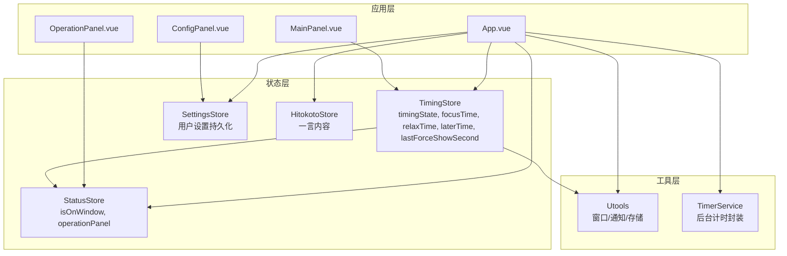
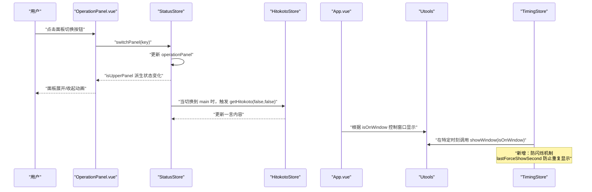
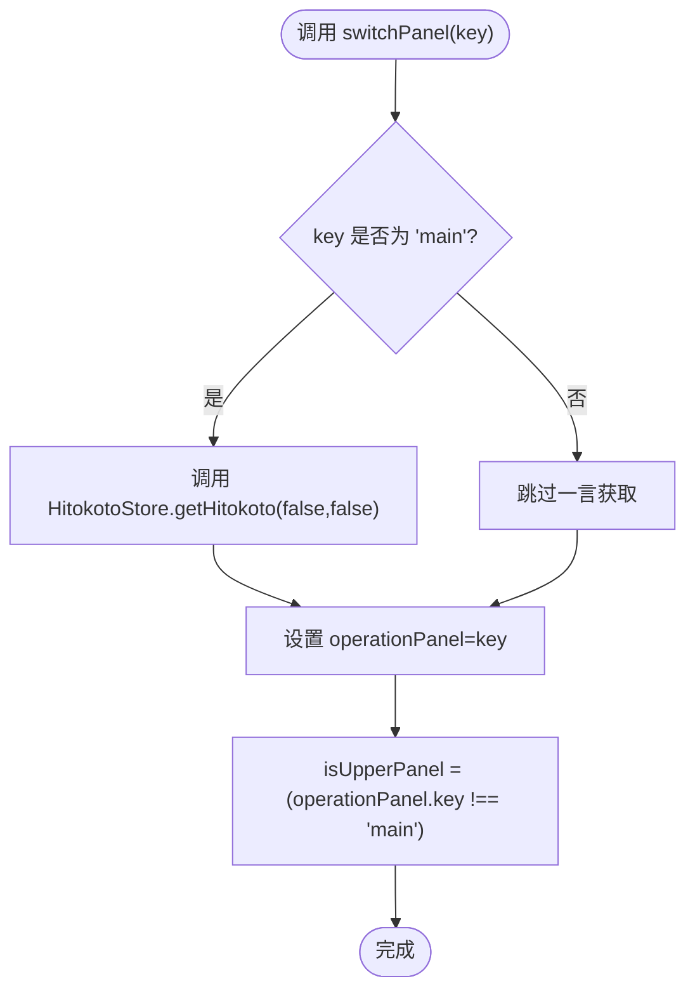
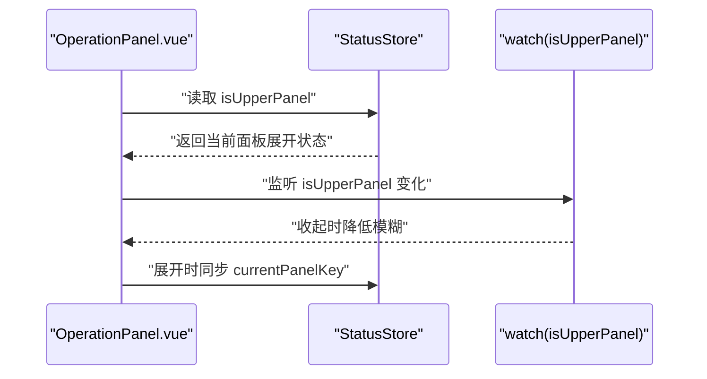
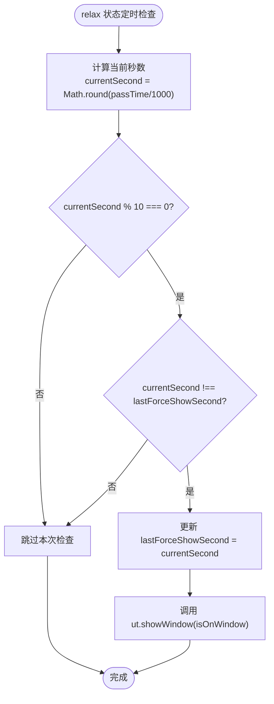
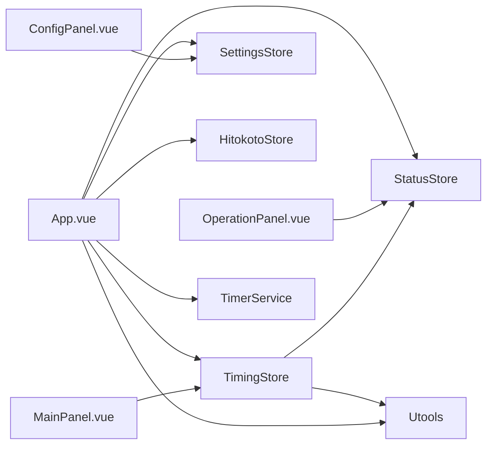
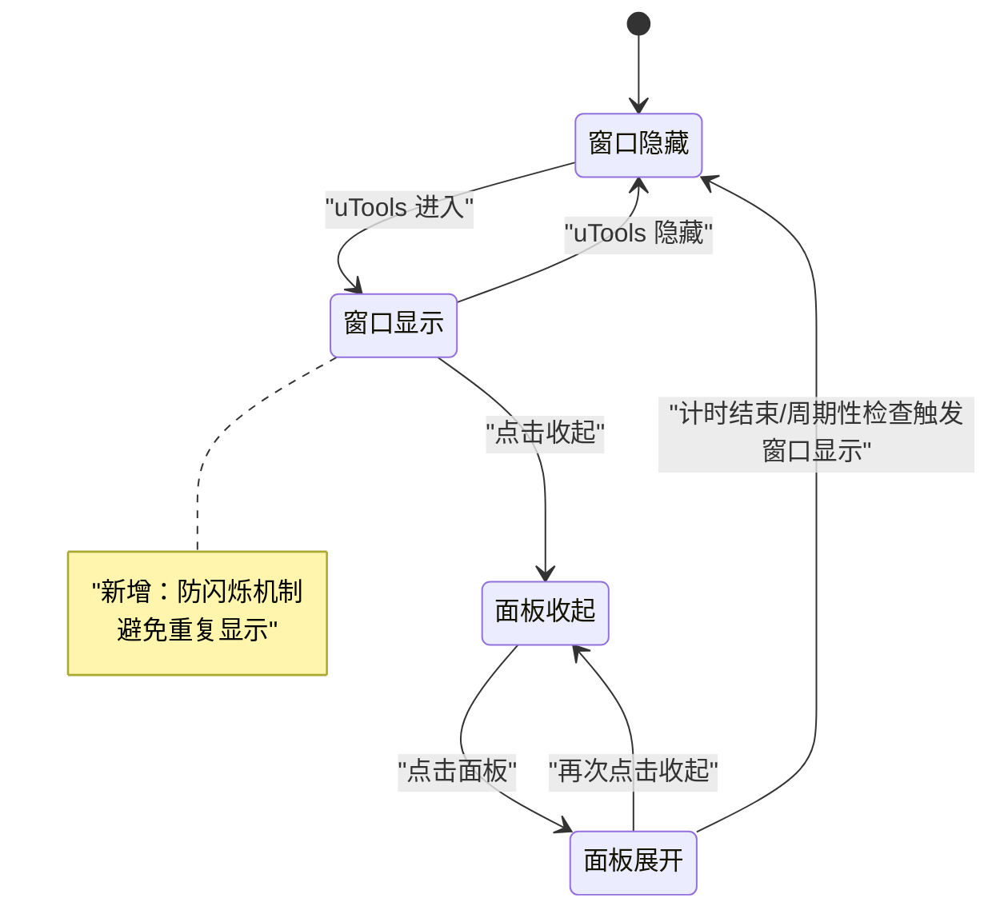

# 界面状态管理

<cite>
**本文引用的文件列表**
- [statusStore.ts](file://src/stores/statusStore.ts)
- [timingStore.ts](file://src/stores/timingStore.ts)
- [settingsStore.ts](file://src/stores/settingsStore.ts)
- [hitokotoStore.ts](file://src/stores/hitokotoStore.ts)
- [index.ts](file://src/types/index.ts)
- [utools.ts](file://src/utils/utools.ts)
- [App.vue](file://src/App.vue)
- [OperationPanel.vue](file://src/components/operationPanel/OperationPanel.vue)
- [MainPanel.vue](file://src/components/operationPanel/MainPanel.vue)
- [ConfigPanel.vue](file://src/components/operationPanel/ConfigPanel.vue)
- [timerService.ts](file://src/services/timerService.ts)
- [settings.ts](file://src/settings.ts)
- [main.ts](file://src/main.ts)
- [plugin.json](file://public/plugin.json)
</cite>

## 更新摘要
**变更内容**
- 新增防闪烁机制：在计时状态管理中引入 lastForceShowSecond 状态变量和条件检查
- 优化窗口闪烁显示：防止窗口在相同秒数内重复闪烁显示
- 增强用户体验：减少不必要的窗口显示/隐藏操作，提升界面稳定性

## 目录
1. [简介](#简介)
2. [项目结构](#项目结构)
3. [核心组件](#核心组件)
4. [架构总览](#架构总览)
5. [详细组件分析](#详细组件分析)
6. [防闪烁机制详解](#防闪烁机制详解)
7. [依赖关系分析](#依赖关系分析)
8. [性能考量](#性能考量)
9. [故障排查指南](#故障排查指南)
10. [结论](#结论)
11. [附录](#附录)

## 简介
本文件聚焦于界面状态管理模块，系统性阐述 StatusStore 如何控制应用的界面行为，包括：
- 面板展开状态与窗口显示状态的协同
- 通知状态管理与系统通知集成
- 点击事件对状态的影响路径
- 状态变化对组件渲染与布局的影响机制
- 状态持久化在界面状态中的作用与实现方式
- 界面状态转换的完整流程图与状态机模型
- 状态恢复与初始化的处理逻辑
- 与 TimingStore 的交互与协调机制
- **新增**：防闪烁机制优化，防止窗口重复闪烁显示
- 扩展与新增界面状态的指导原则

## 项目结构
本项目采用 Pinia 状态管理与 Vue 组件化架构，界面状态主要由 StatusStore 管理，同时与 TimingStore、SettingsStore、HitokotoStore 协同工作，并通过 Utools 工具类与系统窗口、通知等能力交互。

**图表来源**
- [App.vue:1-145](file://src/App.vue#L1-L145)
- [OperationPanel.vue:1-180](file://src/components/operationPanel/OperationPanel.vue#L1-L180)
- [MainPanel.vue:1-82](file://src/components/operationPanel/MainPanel.vue#L1-L82)
- [ConfigPanel.vue:1-378](file://src/components/operationPanel/ConfigPanel.vue#L1-L378)
- [statusStore.ts:1-46](file://src/stores/statusStore.ts#L1-L46)
- [timingStore.ts:1-156](file://src/stores/timingStore.ts#L1-L156)
- [settingsStore.ts:1-87](file://src/stores/settingsStore.ts#L1-L87)
- [hitokotoStore.ts:1-72](file://src/stores/hitokotoStore.ts#L1-L72)
- [utools.ts:1-178](file://src/utils/utools.ts#L1-L178)
- [timerService.ts:1-161](file://src/services/timerService.ts#L1-L161)

**章节来源**
- [main.ts:1-19](file://src/main.ts#L1-L19)
- [plugin.json:1-25](file://public/plugin.json#L1-L25)

## 核心组件
- StatusStore：负责"窗口显示状态"和"操作面板状态"的核心状态管理，提供面板切换动作与派生状态（如 isUpperPanel）。
- TimingStore：负责计时状态与计时器生命周期，与 StatusStore 协作以控制窗口显示与通知行为。**新增**：lastForceShowSecond 状态变量用于防闪烁机制。
- SettingsStore：负责用户设置的加载、保存与重置，间接影响界面初始状态与行为。
- HitokotoStore：负责一言内容的获取与缓存，与 StatusStore 的面板切换存在交互。
- Utools：封装窗口显示/隐藏、通知、本地存储等系统能力。
- TimerService：封装后台计时服务，提供跨进程计时与通知能力。

**章节来源**
- [statusStore.ts:17-45](file://src/stores/statusStore.ts#L17-L45)
- [timingStore.ts:22-156](file://src/stores/timingStore.ts#L22-L156)
- [settingsStore.ts:9-86](file://src/stores/settingsStore.ts#L9-L86)
- [hitokotoStore.ts:8-71](file://src/stores/hitokotoStore.ts#L8-L71)
- [utools.ts:13-178](file://src/utils/utools.ts#L13-L178)
- [timerService.ts:24-161](file://src/services/timerService.ts#L24-L161)

## 架构总览
界面状态管理围绕"窗口显示状态 + 面板状态"两条主线展开：
- 窗口显示状态（isOnWindow）：由 App.vue 监听 uTools 进入/隐藏事件更新，决定计时器优先级与窗口可见性。
- 面板状态（operationPanel + isUpperPanel）：由 StatusStore 管理，驱动 OperationPanel 的展开/收起与内容切换。
- **新增**：防闪烁机制（lastForceShowSecond）：在 relax 状态下每 10 秒检查一次，防止相同秒数内重复显示窗口。

**图表来源**
- [OperationPanel.vue:128-179](file://src/components/operationPanel/OperationPanel.vue#L128-L179)
- [statusStore.ts:35-44](file://src/stores/statusStore.ts#L35-L44)
- [hitokotoStore.ts:31-69](file://src/stores/hitokotoStore.ts#L31-L69)
- [App.vue:82-106](file://src/App.vue#L82-L106)
- [timingStore.ts:87-90](file://src/stores/timingStore.ts#L87-L90)

## 详细组件分析

### StatusStore：界面状态核心
- 状态字段
  - isOnWindow：布尔值，表示应用是否处于窗口中（uTools 进入/隐藏事件会更新该值）。
  - operationPanel：枚举型面板键，当前显示的面板（main/config）。
- 派生状态
  - isUpperPanel：当 operationPanel 不是 main 时为真，用于控制 OperationPanel 的展开状态。
- 行为
  - switchPanel(key)：切换面板；若切换到 main，会触发一次一言获取以更新内容。

**图表来源**
- [statusStore.ts:35-44](file://src/stores/statusStore.ts#L35-L44)
- [hitokotoStore.ts:31-69](file://src/stores/hitokotoStore.ts#L31-L69)

**章节来源**
- [statusStore.ts:17-45](file://src/stores/statusStore.ts#L17-L45)

### OperationPanel：面板容器与动画
- 展开/收起机制
  - 通过 isUpperPanel 控制 transform，实现平滑的面板展开/收起动画。
  - 收起时降低背景模糊度，提升动画性能。
  - 收起过程中保持内容面板不变，动画结束后再切换内容。
- 内容切换
  - 通过 currentPanelKey 与 operationPanel.key 同步，确保展开时即时切换内容。

**图表来源**
- [OperationPanel.vue:128-179](file://src/components/operationPanel/OperationPanel.vue#L128-L179)
- [statusStore.ts:28-33](file://src/stores/statusStore.ts#L28-L33)

**章节来源**
- [OperationPanel.vue:1-180](file://src/components/operationPanel/OperationPanel.vue#L1-L180)

### MainPanel：主面板与计时控制
- 提供"结束计时/暂停/继续/稍后提醒"等操作，直接调用 TimingStore 的对应动作。
- 与 TimingStore 紧密耦合，体现界面状态与业务状态的联动。

**章节来源**
- [MainPanel.vue:1-82](file://src/components/operationPanel/MainPanel.vue#L1-L82)
- [timingStore.ts:69-139](file://src/stores/timingStore.ts#L69-L139)

### ConfigPanel：设置面板与持久化
- 提供专注/休息/稍后提醒时间的滑块与输入框，绑定到 SettingsStore。
- 保存设置时会更新 TimingStore 的时间参数，实现界面状态与计时状态的联动。

**章节来源**
- [ConfigPanel.vue:1-378](file://src/components/operationPanel/ConfigPanel.vue#L1-L378)
- [settingsStore.ts:35-85](file://src/stores/settingsStore.ts#L35-L85)

### App.vue：初始化与窗口/通知协调
- 初始化流程
  - 加载用户设置并初始化计时器时间。
  - 初始化后台计时服务，注册计时结束回调（显示通知、窗口显示）。
  - 监听 uTools 进入/隐藏事件，更新 isOnWindow 并调整计时器优先级。
  - 根据设置自动开始计时。
- 与 Utools 的交互
  - showWindow/isOnWindow 控制窗口显示。
  - showNotification 显示系统通知。

**章节来源**
- [App.vue:56-114](file://src/App.vue#L56-L114)
- [utools.ts:75-86](file://src/utils/utools.ts#L75-L86)

### TimingStore：计时状态与窗口/通知协作
- 状态与时间
  - timingState：focus/relax。
  - focusTime/relaxTime/laterTime：来自 SettingsStore 的分钟数转换为毫秒。
  - **新增**：lastForceShowSecond：上次强制显示窗口的秒数，用于防闪烁机制。
- 计时器逻辑
  - setTimingInterval：按固定间隔更新 roundTime，检测焦点/休息状态切换。
  - endTiming：结束计时并根据状态切换，调用 ut.showWindow(isOnWindow)。
  - **更新**：在 relax 状态每 10 秒检查一次，使用 lastForceShowSecond 防止重复显示窗口。
- 与 StatusStore 的交互
  - 通过 useStatusStore 获取 isOnWindow，用于窗口显示策略。

**章节来源**
- [timingStore.ts:69-139](file://src/stores/timingStore.ts#L69-L139)
- [utools.ts:75-86](file://src/utils/utools.ts#L75-L86)

### Utools：系统能力封装
- 窗口控制：showWindow/hideWindow/outPlugin。
- 通知：showNotification。
- 存储：dbStorage 封装，支持默认值加载与持久化。

**章节来源**
- [utools.ts:13-178](file://src/utils/utools.ts#L13-L178)

### TimerService：后台计时封装
- 提供后台计时器启动/停止、剩余时间查询、通知显示、存储读写等能力。
- 在无后台支持时提供降级方案（直接调用 Utools 或浏览器 API）。

**章节来源**
- [timerService.ts:24-161](file://src/services/timerService.ts#L24-L161)

## 防闪烁机制详解

### 机制概述
防闪烁机制是为了解决 relax 状态下窗口重复闪烁显示的问题而设计的。当计时器在 relax 状态下每 10 秒检查一次窗口显示需求时，如果在同一秒内多次触发，会导致窗口反复显示/隐藏，造成视觉上的闪烁效果。

### 实现原理
- **状态变量**：lastForceShowSecond 记录上次强制显示窗口的秒数，默认值为 -1
- **条件检查**：每次 10 秒检查时，比较当前秒数与上次显示的秒数
- **防重复逻辑**：只有当当前秒数不同于上次显示的秒数时才执行窗口显示

### 关键实现细节

**图表来源**
- [timingStore.ts:89-99](file://src/stores/timingStore.ts#L89-L99)

### 生命周期管理
- **初始化**：startTiming() 中将 lastForceShowSecond 重置为 -1
- **状态切换**：endTiming() 中清空计时器后重新开始，lastForceShowSecond 重置
- **正常运行**：每 10 秒检查一次，避免重复显示

### 性能优化效果
- 减少不必要的窗口显示/隐藏操作
- 避免 UI 闪烁，提升用户体验
- 降低系统资源消耗
- 保持界面稳定性

**章节来源**
- [timingStore.ts:30-43](file://src/stores/timingStore.ts#L30-L43)
- [timingStore.ts:89-99](file://src/stores/timingStore.ts#L89-L99)
- [timingStore.ts:107](file://src/stores/timingStore.ts#L107)

## 依赖关系分析
- 组件依赖
  - App.vue 依赖所有 Store 与 Utools/TimerService。
  - OperationPanel.vue 依赖 StatusStore 的派生状态。
  - MainPanel.vue 依赖 TimingStore 的动作。
  - ConfigPanel.vue 依赖 SettingsStore 的设置与动作。
- Store 依赖
  - StatusStore 依赖 HitokotoStore（面板切换到 main 时）。
  - TimingStore 依赖 StatusStore（读取 isOnWindow）与 Utools。
  - SettingsStore 依赖 Utools 进行持久化。
- 类型与常量
  - types/index.ts 定义了面板键、计时状态键、事件映射等类型。
  - settings.ts 提供时间倍率与默认设置。

**图表来源**
- [App.vue:121-144](file://src/App.vue#L121-L144)
- [OperationPanel.vue:128-179](file://src/components/operationPanel/OperationPanel.vue#L128-L179)
- [MainPanel.vue:71-81](file://src/components/operationPanel/MainPanel.vue#L71-L81)
- [ConfigPanel.vue:342-377](file://src/components/operationPanel/ConfigPanel.vue#L342-L377)
- [statusStore.ts:3-4](file://src/stores/statusStore.ts#L3-L4)
- [timingStore.ts:6](file://src/stores/timingStore.ts#L6)
- [utools.ts:1-178](file://src/utils/utools.ts#L1-L178)
- [timerService.ts:1-161](file://src/services/timerService.ts#L1-L161)

**章节来源**
- [index.ts:1-83](file://src/types/index.ts#L1-L83)
- [settings.ts:1-50](file://src/settings.ts#L1-L50)

## 性能考量
- 动画性能
  - OperationPanel 使用 transform 替代改变 height，减少重排。
  - 收起过程降低背景模糊度，提升动画流畅度。
- 计时器优先级
  - uTools 进入/隐藏事件分别将计时器间隔从 2000ms 调整为 500ms，保证前台交互响应。
- 一言获取节流
  - HitokotoStore 对频繁刷新进行防抖，避免网络压力与用户体验下降。
- **新增**：防闪烁优化
  - lastForceShowSecond 状态变量避免重复的窗口显示操作
  - 减少 UI 闪烁，提升界面稳定性
  - 降低系统资源消耗

**章节来源**
- [OperationPanel.vue:24-42](file://src/components/operationPanel/OperationPanel.vue#L24-L42)
- [App.vue:82-106](file://src/App.vue#L82-L106)
- [hitokotoStore.ts:31-69](file://src/stores/hitokotoStore.ts#L31-L69)
- [timingStore.ts:30-43](file://src/stores/timingStore.ts#L30-L43)

## 故障排查指南
- 窗口不显示或显示异常
  - 检查 App.vue 中 onEnter/onHide 事件是否正确更新 isOnWindow。
  - 检查 TimingStore 在 endTiming 与周期性检查中是否调用 ut.showWindow(isOnWindow)。
  - **新增**：检查 lastForceShowSecond 状态是否正确更新，确认防闪烁机制正常工作。
- 面板无法展开/收起
  - 检查 StatusStore 的 isUpperPanel 派生状态是否正确。
  - 检查 OperationPanel.vue 的 watch 逻辑与 currentPanelKey 同步。
- 一言不更新
  - 检查 StatusStore 在切换到 main 时是否调用 HitokotoStore.getHitokoto。
  - 检查 HitokotoStore 的防抖逻辑与网络请求。
- 设置未生效
  - 检查 SettingsStore.saveSettings 是否被调用。
  - 检查 ConfigPanel 保存后是否更新 TimingStore 的时间参数。
- **新增**：防闪烁问题
  - 检查 relax 状态下的窗口显示逻辑是否正常。
  - 确认 lastForceShowSecond 状态变量在状态切换时正确重置。

**章节来源**
- [App.vue:82-106](file://src/App.vue#L82-L106)
- [timingStore.ts:87-90](file://src/stores/timingStore.ts#L87-L90)
- [OperationPanel.vue:156-174](file://src/components/operationPanel/OperationPanel.vue#L156-L174)
- [statusStore.ts:37-42](file://src/stores/statusStore.ts#L37-L42)
- [hitokotoStore.ts:31-69](file://src/stores/hitokotoStore.ts#L31-L69)
- [settingsStore.ts:53-61](file://src/stores/settingsStore.ts#L53-L61)
- [ConfigPanel.vue:348-358](file://src/components/operationPanel/ConfigPanel.vue#L348-L358)

## 结论
StatusStore 作为界面状态的核心，通过 isOnWindow 与 operationPanel 的组合，实现了窗口显示与面板展开的精细化控制。它与 TimingStore、SettingsStore、HitokotoStore 协同，结合 Utools 与 TimerService，构建了完整的界面状态管理闭环。

**新增的防闪烁机制**进一步优化了用户体验，通过 lastForceShowSecond 状态变量有效防止了 relax 状态下窗口的重复闪烁显示，提升了界面稳定性和性能表现。

通过合理的动画与计时器优先级策略，既保证了性能，也提升了用户体验。后续扩展应遵循"单一职责、最小耦合、明确边界"的原则，确保状态一致性与可维护性。

## 附录

### 界面状态转换流程图（含状态机）

**图表来源**
- [App.vue:82-106](file://src/App.vue#L82-L106)
- [OperationPanel.vue:142-154](file://src/components/operationPanel/OperationPanel.vue#L142-L154)
- [timingStore.ts:87-90](file://src/stores/timingStore.ts#L87-L90)

### 状态持久化与初始化
- SettingsStore 负责用户设置的加载/保存/重置，使用 Utools 的 dbStorage 进行持久化。
- App.vue 在初始化时加载设置并据此初始化计时器时间，确保状态恢复一致。
- TimerService 提供跨进程的存储与通知能力，支持在无后台支持时的降级方案。
- **新增**：lastForceShowSecond 在每次 startTiming 和 endTiming 时重置为 -1。

**章节来源**
- [settingsStore.ts:39-73](file://src/stores/settingsStore.ts#L39-L73)
- [App.vue:60-79](file://src/App.vue#L60-L79)
- [timerService.ts:120-156](file://src/services/timerService.ts#L120-L156)
- [timingStore.ts:107](file://src/stores/timingStore.ts#L107)

### 与其他 Store 的协调机制
- StatusStore 与 TimingStore
  - TimingStore 读取 isOnWindow 决定窗口显示策略。
  - TimingStore 在 endTiming 与周期性检查中调用 ut.showWindow。
  - **新增**：TimingStore 通过 lastForceShowSecond 协调防闪烁机制。
- StatusStore 与 HitokotoStore
  - 切换到 main 面板时触发一言获取，确保内容及时更新。
- SettingsStore 与 TimingStore
  - 设置变更后更新 TimingStore 的时间参数，保证界面与计时状态一致。

**章节来源**
- [timingStore.ts:87-90](file://src/stores/timingStore.ts#L87-L90)
- [statusStore.ts:37-42](file://src/stores/statusStore.ts#L37-L42)
- [ConfigPanel.vue:353-358](file://src/components/operationPanel/ConfigPanel.vue#L353-L358)

### 扩展与新增界面状态的指导原则
- 新增面板
  - 在 types/index.ts 中定义新的 PanelKey 与 Panel。
  - 在 statusStore.ts 中新增面板字典项与 switchPanel 分支。
  - 在 OperationPanel.vue 中增加内容容器与样式。
- 新增状态字段
  - 在 StatusStore.state 中声明新字段。
  - 在 App.vue/组件中根据需要读取/更新该字段。
  - **新增**：如涉及窗口显示逻辑，考虑是否需要防闪烁机制支持。
- 与 TimingStore 协作
  - 若新状态影响窗口显示或通知行为，需在 TimingStore 中相应分支调用 ut.showWindow。
  - **新增**：考虑是否需要新增类似 lastForceShowSecond 的防闪烁状态变量。
- 持久化策略
  - 若新状态需要持久化，将其纳入 SettingsStore 的 UserSettings 接口与持久化流程。
- 动画与性能
  - 使用 transform 控制布局变化，避免重排。
  - 在收起/展开动画中合理使用模糊度与过渡时间，平衡视觉与性能。
  - **新增**：考虑防闪烁机制对性能的影响，确保状态变量的合理使用。

**章节来源**
- [index.ts:34-50](file://src/types/index.ts#L34-L50)
- [statusStore.ts:6-15](file://src/stores/statusStore.ts#L6-L15)
- [OperationPanel.vue:107-126](file://src/components/operationPanel/OperationPanel.vue#L107-L126)
- [settingsStore.ts:12-18](file://src/stores/settingsStore.ts#L12-L18)
- [timingStore.ts:30-43](file://src/stores/timingStore.ts#L30-L43)