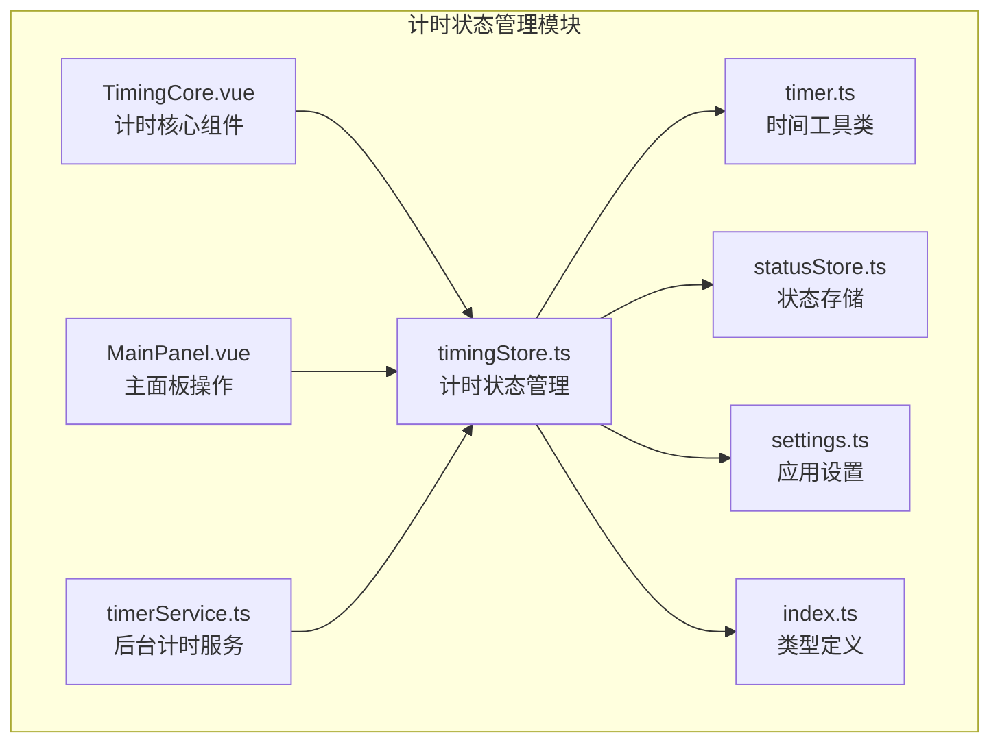
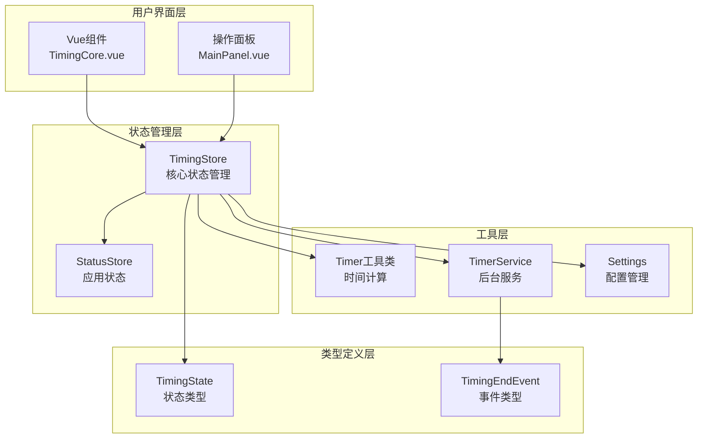
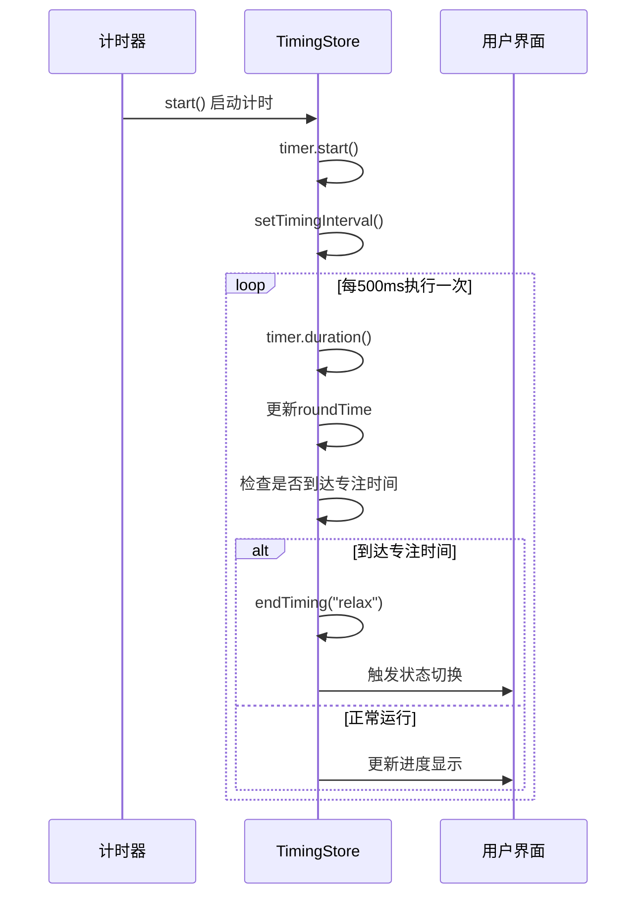
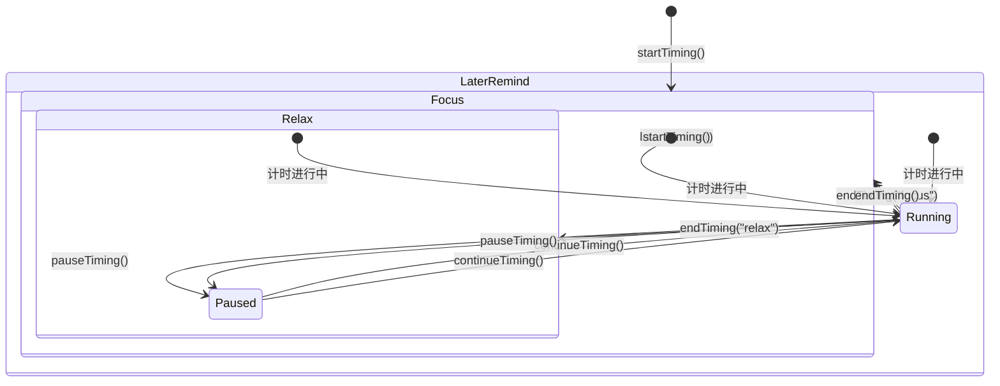
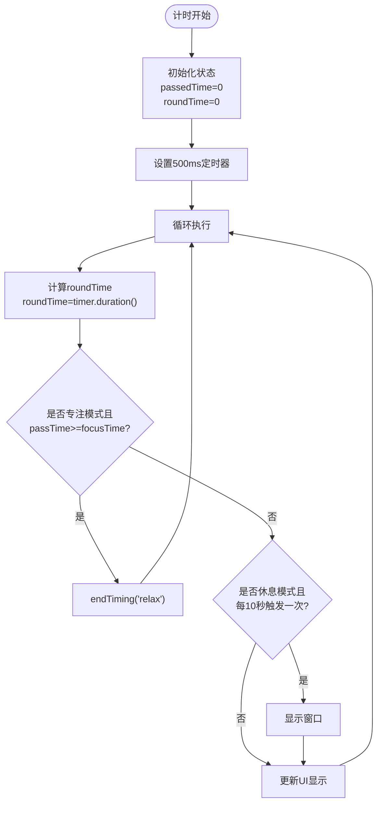
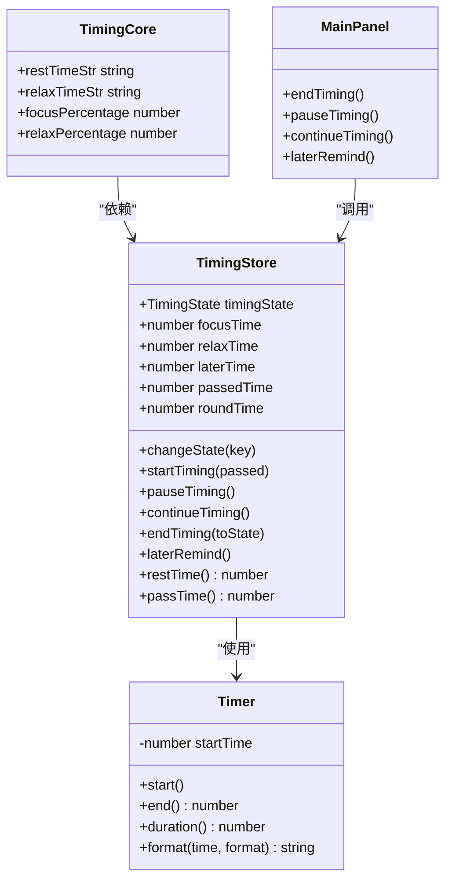
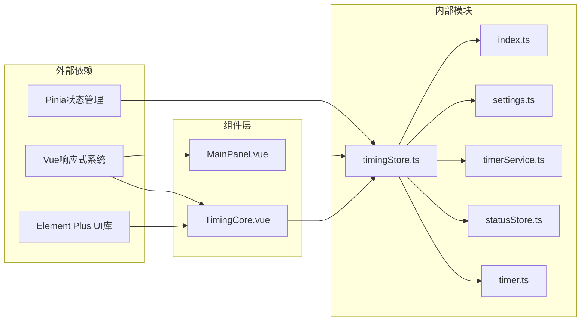

# 计时状态管理

<cite>
**本文档引用的文件**
- [src/stores/timingStore.ts](file://src/stores/timingStore.ts)
- [src/utils/timer.ts](file://src/utils/timer.ts)
- [src/components/TimingCore.vue](file://src/components/TimingCore.vue)
- [src/components/operationPanel/MainPanel.vue](file://src/components/operationPanel/MainPanel.vue)
- [src/stores/statusStore.ts](file://src/stores/statusStore.ts)
- [src/services/timerService.ts](file://src/services/timerService.ts)
- [src/settings.ts](file://src/settings.ts)
- [src/types/index.ts](file://src/types/index.ts)
</cite>

## 目录
1. [简介](#简介)
2. [项目结构](#项目结构)
3. [核心组件](#核心组件)
4. [架构概览](#架构概览)
5. [详细组件分析](#详细组件分析)
6. [依赖关系分析](#依赖关系分析)
7. [性能考虑](#性能考虑)
8. [故障排除指南](#故障排除指南)
9. [结论](#结论)

## 简介

计时状态管理模块是休息提醒应用的核心功能组件，负责管理专注模式和休息模式之间的状态转换，以及计时器的时间计算机制。该模块实现了完整的番茄工作法计时流程，包括时间计算、状态转换、用户交互等功能。

## 项目结构

计时状态管理模块主要分布在以下文件中：

**图表来源**
- [src/stores/timingStore.ts:1-141](file://src/stores/timingStore.ts#L1-L141)
- [src/utils/timer.ts:1-66](file://src/utils/timer.ts#L1-L66)
- [src/components/TimingCore.vue:1-101](file://src/components/TimingCore.vue#L1-L101)

**章节来源**
- [src/stores/timingStore.ts:1-141](file://src/stores/timingStore.ts#L1-L141)
- [src/utils/timer.ts:1-66](file://src/utils/timer.ts#L1-L66)
- [src/components/TimingCore.vue:1-101](file://src/components/TimingCore.vue#L1-L101)

## 核心组件

### TimingStore 状态管理器

TimingStore 是基于 Pinia 的状态管理器，负责维护计时器的所有状态信息：

**状态字段说明：**
- `timingState`: 当前计时状态（focus/relax）
- `timingInterval`: 计时器间隔句柄
- `focusTime`: 专注时间（毫秒）
- `relaxTime`: 休息时间（毫秒）
- `laterTime`: 稍后提醒时间（毫秒）
- `passedTime`: 已经过的时间（毫秒）
- `roundTime`: 当前轮次已过时间（毫秒）

**计算属性：**
- `isFocus`: 判断是否为专注模式
- `isRelax`: 判断是否为休息模式
- `isTiming`: 判断计时器是否正在运行
- `passTime`: 总经过时间 = roundTime + passedTime
- `restTime`: 剩余专注时间 = focusTime - passTime

**章节来源**
- [src/stores/timingStore.ts:22-67](file://src/stores/timingStore.ts#L22-L67)
- [src/stores/timingStore.ts:32-41](file://src/stores/timingStore.ts#L32-L41)

## 架构概览

计时状态管理采用分层架构设计，各组件职责明确：

**图表来源**
- [src/stores/timingStore.ts:1-141](file://src/stores/timingStore.ts#L1-L141)
- [src/components/TimingCore.vue:62-101](file://src/components/TimingCore.vue#L62-L101)
- [src/components/operationPanel/MainPanel.vue:71-82](file://src/components/operationPanel/MainPanel.vue#L71-L82)

## 详细组件分析

### 计时器时间计算机制

计时器采用双时间轴设计，确保精确的时间计算：

**图表来源**
- [src/stores/timingStore.ts:76-92](file://src/stores/timingStore.ts#L76-L92)
- [src/utils/timer.ts:15-31](file://src/utils/timer.ts#L15-L31)

#### 时间参数详解

| 参数名称 | 类型 | 单位 | 描述 | 计算方式 |
|---------|------|------|------|----------|
| focusTime | number | 毫秒 | 专注时间总时长 | 35 × settings.timing.minMulti |
| relaxTime | number | 毫秒 | 休息时间总时长 | 5 × settings.timing.minMulti |
| laterTime | number | 毫秒 | 稍后提醒时间 | 3 × settings.timing.minMulti |
| passedTime | number | 毫秒 | 已经过的时间 | 暂停时累计 |
| roundTime | number | 毫秒 | 当前轮次已过时间 | 实时计算 |

**章节来源**
- [src/stores/timingStore.ts:25-29](file://src/stores/timingStore.ts#L25-L29)
- [src/stores/timingStore.ts:36-38](file://src/stores/timingStore.ts#L36-L38)
- [src/settings.ts:25-30](file://src/settings.ts#L25-L30)

### 状态转换逻辑

系统支持两种核心状态：专注模式(focus)和休息模式(relax)，并通过状态转换实现完整的计时流程：

**图表来源**
- [src/stores/timingStore.ts:71-73](file://src/stores/timingStore.ts#L71-L73)
- [src/stores/timingStore.ts:122-131](file://src/stores/timingStore.ts#L122-L131)
- [src/stores/timingStore.ts:133-138](file://src/stores/timingStore.ts#L133-L138)

#### 关键方法实现原理

**startTiming 方法：**
- 设置 passedTime 为指定值
- 重置 roundTime 为 0
- 启动内部计时器
- 设置定时器间隔（默认500ms）

**pauseTiming 方法：**
- 使用 timer.end() 获取当前轮次耗时
- 将耗时累加到 passedTime
- 重置 roundTime 为 0
- 清除定时器

**continueTiming 方法：**
- 重新启动内部计时器
- 重新设置定时器间隔

**endTiming 方法：**
- 清除定时器
- 显示窗口（根据状态）
- 重新启动计时
- 可选地切换到指定状态

**laterRemind 方法：**
- 清除定时器
- 切换到专注模式
- 从剩余时间减去稍后提醒时间开始计时

**章节来源**
- [src/stores/timingStore.ts:94-138](file://src/stores/timingStore.ts#L94-L138)
- [src/utils/timer.ts:15-24](file://src/utils/timer.ts#L15-L24)

### 计时器时间计算算法

计时器采用增量计算方式，确保时间精度和性能平衡：

**图表来源**
- [src/stores/timingStore.ts:80-91](file://src/stores/timingStore.ts#L80-L91)

#### getter 计算属性逻辑

**restTime 计算：**
- 公式：max(focusTime - (roundTime + passedTime), 0)
- 确保不会出现负数时间
- 用于显示剩余专注时间

**passTime 计算：**
- 公式：roundTime + passedTime
- 累计所有经过的时间
- 包括历史时间和当前轮次时间

**章节来源**
- [src/stores/timingStore.ts:55-66](file://src/stores/timingStore.ts#L55-L66)

### 用户界面集成

计时核心组件与状态管理器紧密集成，提供实时的时间显示和状态反馈：

**图表来源**
- [src/stores/timingStore.ts:32-141](file://src/stores/timingStore.ts#L32-L141)
- [src/utils/timer.ts:5-66](file://src/utils/timer.ts#L5-L66)
- [src/components/TimingCore.vue:62-101](file://src/components/TimingCore.vue#L62-L101)

**章节来源**
- [src/components/TimingCore.vue:68-89](file://src/components/TimingCore.vue#L68-L89)
- [src/components/operationPanel/MainPanel.vue:44-64](file://src/components/operationPanel/MainPanel.vue#L44-L64)

## 依赖关系分析

计时状态管理模块的依赖关系清晰，遵循单一职责原则：

**图表来源**
- [src/stores/timingStore.ts:1-8](file://src/stores/timingStore.ts#L1-L8)
- [src/components/TimingCore.vue:95-99](file://src/components/TimingCore.vue#L95-L99)
- [src/components/operationPanel/MainPanel.vue:79-80](file://src/components/operationPanel/MainPanel.vue#L79-L80)

**章节来源**
- [src/stores/timingStore.ts:1-8](file://src/stores/timingStore.ts#L1-L8)
- [src/components/TimingCore.vue:95-99](file://src/components/TimingCore.vue#L95-L99)

## 性能考虑

### 时间计算优化

计时器采用500ms的更新间隔，在精度和性能之间取得平衡：
- 减少DOM更新频率，提高UI响应性
- 使用增量计算避免复杂的时间运算
- 实时计算当前轮次时间，确保准确性

### 内存管理

- 定时器句柄在适当时候清理，防止内存泄漏
- 状态数据结构简单明了，减少内存占用
- 组件卸载时自动清理相关资源

### 响应式更新策略

- 使用计算属性缓存复杂计算结果
- 条件渲染减少不必要的DOM操作
- 动画优化使用transform而非改变布局属性

## 故障排除指南

### 常见问题及解决方案

**问题1：计时器不工作**
- 检查定时器句柄是否正确设置
- 确认状态管理器的定时器间隔设置
- 验证时间单位转换是否正确

**问题2：状态转换异常**
- 检查状态切换逻辑中的条件判断
- 确认endTiming方法的参数传递
- 验证laterRemind方法的时间计算

**问题3：时间显示不准确**
- 检查roundTime和passedTime的累加逻辑
- 确认定时器更新频率设置
- 验证时间格式化函数的使用

**问题4：内存泄漏**
- 确认定时器在适当时候被清理
- 检查组件卸载时的状态清理
- 验证事件监听器的移除

**章节来源**
- [src/stores/timingStore.ts:76-114](file://src/stores/timingStore.ts#L76-L114)
- [src/utils/timer.ts:29-31](file://src/utils/timer.ts#L29-L31)

### 边界情况处理

**时间边界处理：**
- 确保restTime不会出现负数
- 处理时间溢出和精度丢失
- 验证时间单位转换的准确性

**状态边界处理：**
- 防止重复启动计时器
- 处理暂停和继续的配对调用
- 确保状态转换的原子性

**错误处理机制：**
- 定时器清理失败的回退处理
- 状态管理器异常的恢复机制
- 用户操作异常的防护措施

## 结论

计时状态管理模块通过精心设计的状态机和时间计算机制，实现了可靠的专注/休息计时功能。模块采用分层架构设计，职责分离明确，具有良好的可维护性和扩展性。

核心优势包括：
- 精确的时间计算和状态管理
- 用户友好的交互界面
- 良好的性能表现和内存管理
- 完善的错误处理和边界情况处理

该模块为休息提醒应用提供了稳定可靠的基础，支持完整的番茄工作法计时流程，能够有效帮助用户管理专注时间和休息时间。