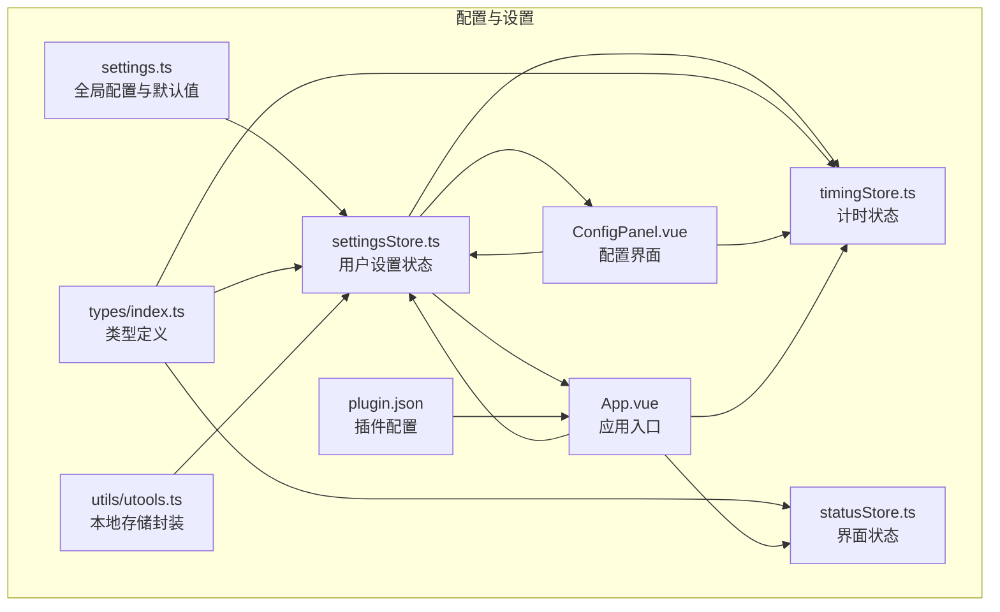
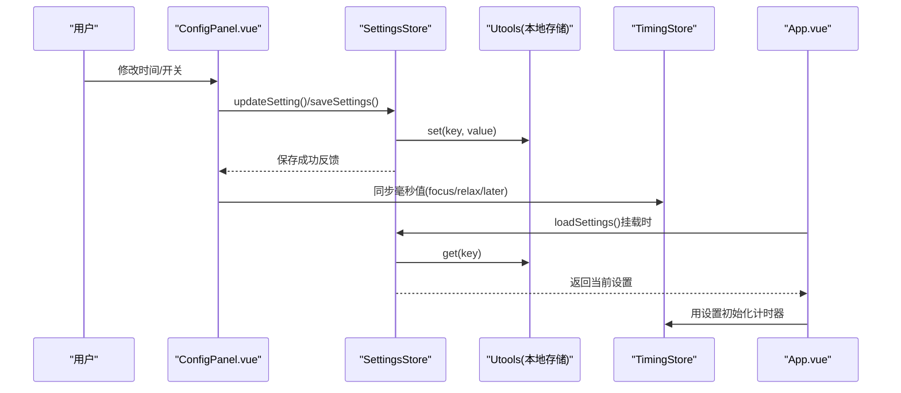
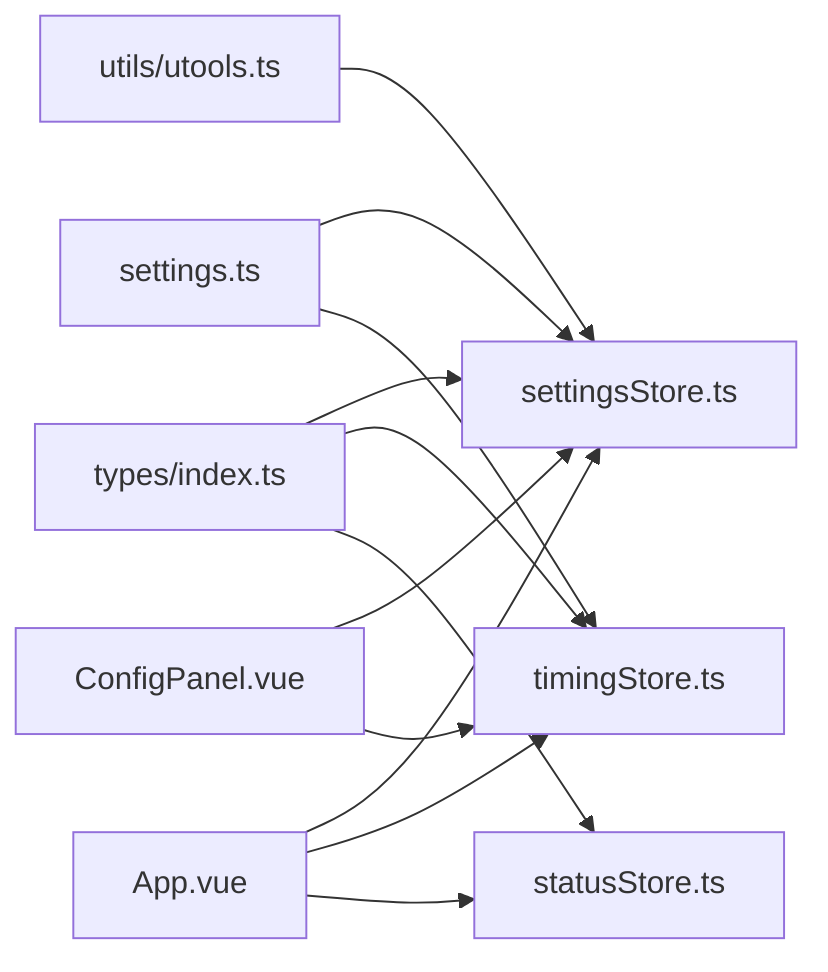

# 配置与设置

<cite>
**本文引用的文件**
- [settings.ts](file://src/settings.ts)
- [settingsStore.ts](file://src/stores/settingsStore.ts)
- [types/index.ts](file://src/types/index.ts)
- [utils/utools.ts](file://src/utils/utools.ts)
- [components/operationPanel/ConfigPanel.vue](file://src/components/operationPanel/ConfigPanel.vue)
- [stores/timingStore.ts](file://src/stores/timingStore.ts)
- [stores/statusStore.ts](file://src/stores/statusStore.ts)
- [App.vue](file://src/App.vue)
- [utils/notifier.ts](file://src/utils/notifier.ts)
- [public/plugin.json](file://public/plugin.json)
- [main.ts](file://src/main.ts)
- [package.json](file://package.json)
</cite>

## 目录
1. [简介](#简介)
2. [项目结构](#项目结构)
3. [核心组件](#核心组件)
4. [架构总览](#架构总览)
5. [详细组件分析](#详细组件分析)
6. [依赖关系分析](#依赖关系分析)
7. [性能考量](#性能考量)
8. [故障排查指南](#故障排查指南)
9. [结论](#结论)
10. [附录](#附录)

## 简介
本文件面向“休息提醒”项目的配置系统，系统性阐述默认配置参数的设计理念、用户设置管理机制、持久化存储策略、本地存储API使用、TypeScript类型设计与类型安全、utools插件配置文件结构、配置验证与错误处理、配置迁移与版本兼容策略、配置优化与性能调优建议，以及配置热更新与实时生效的实现方式。

## 项目结构
配置系统围绕以下关键模块协同工作：
- 全局配置常量与默认值：位于 settings.ts，提供时间倍率、默认用户设置等全局常量。
- Pinia 状态管理：settingsStore.ts 提供用户设置的读取、保存、重置与单点更新；timingStore.ts 提供计时参数与计时逻辑；statusStore.ts 管理界面面板与窗口状态。
- 类型系统：types/index.ts 定义用户设置、计时状态、事件与消息等类型，确保类型安全。
- 本地存储封装：utils/utools.ts 封装 uTools dbStorage 的 getItem/setItem/removeItem 等操作，并提供开发环境降级。
- 配置界面：components/operationPanel/ConfigPanel.vue 提供时间设置与功能开关的可视化配置入口，并负责将设置写回状态与计时器。
- 应用入口：App.vue 在挂载时加载用户设置、初始化计时器、注册窗口生命周期回调，并根据设置决定是否自动开始计时。
- 插件配置：public/plugin.json 定义插件元数据、窗口高度、快捷指令等。

图表来源
- [settings.ts:1-49](file://src/settings.ts#L1-L49)
- [settingsStore.ts:1-87](file://src/stores/settingsStore.ts#L1-L87)
- [types/index.ts:1-83](file://src/types/index.ts#L1-L83)
- [utils/utools.ts:1-165](file://src/utils/utools.ts#L1-L165)
- [components/operationPanel/ConfigPanel.vue:1-378](file://src/components/operationPanel/ConfigPanel.vue#L1-L378)
- [stores/timingStore.ts:1-141](file://src/stores/timingStore.ts#L1-L141)
- [stores/statusStore.ts:1-46](file://src/stores/statusStore.ts#L1-L46)
- [App.vue:1-145](file://src/App.vue#L1-L145)
- [public/plugin.json:1-25](file://public/plugin.json#L1-L25)

章节来源
- [settings.ts:1-49](file://src/settings.ts#L1-L49)
- [settingsStore.ts:1-87](file://src/stores/settingsStore.ts#L1-L87)
- [types/index.ts:1-83](file://src/types/index.ts#L1-L83)
- [utils/utools.ts:1-165](file://src/utils/utools.ts#L1-L165)
- [components/operationPanel/ConfigPanel.vue:1-378](file://src/components/operationPanel/ConfigPanel.vue#L1-L378)
- [stores/timingStore.ts:1-141](file://src/stores/timingStore.ts#L1-L141)
- [stores/statusStore.ts:1-46](file://src/stores/statusStore.ts#L1-L46)
- [App.vue:1-145](file://src/App.vue#L1-L145)
- [public/plugin.json:1-25](file://public/plugin.json#L1-L25)

## 核心组件
- 全局配置与默认值
  - 设计理念：以常量形式集中管理时间倍率与默认用户设置，避免魔法数，统一换算口径。
  - 关键点：默认专注时长、休息时长、稍后提醒时长、一言开关、自动开始开关均在 settings.ts 中集中定义，便于维护与演进。
- 用户设置状态（Pinia）
  - 负责：加载、保存、重置、单点更新用户设置；提供毫秒换算 getter；触发持久化。
  - 存储键：固定为 userSettings，通过本地存储封装进行读写。
- 计时状态（Pinia）
  - 负责：维护 focus/relax 状态、计时器周期、剩余/过去时间等；根据用户设置初始化计时参数。
- 类型系统（TypeScript）
  - 覆盖：用户设置、计时状态、事件、消息、面板等类型，确保跨模块类型一致与编译期检查。
- 本地存储封装（utools）
  - 负责：getItem/setItem/removeItem 的统一封装；开发环境降级；提供 load(key, defaultValue) 便捷方法。
- 配置界面（ConfigPanel.vue）
  - 负责：可视化时间滑块与输入框、功能开关；保存设置并同步到计时器；重置为默认值。
- 应用入口（App.vue）
  - 负责：挂载时加载设置、初始化计时器、注册窗口生命周期回调、按需自动开始计时。
- 插件配置（plugin.json）
  - 负责：声明插件元信息、窗口高度、开发模式入口、功能码与命令等。

章节来源
- [settings.ts:19-47](file://src/settings.ts#L19-L47)
- [settingsStore.ts:11-86](file://src/stores/settingsStore.ts#L11-L86)
- [stores/timingStore.ts:32-141](file://src/stores/timingStore.ts#L32-L141)
- [types/index.ts:11-20](file://src/types/index.ts#L11-L20)
- [utils/utools.ts:34-68](file://src/utils/utools.ts#L34-L68)
- [components/operationPanel/ConfigPanel.vue:242-378](file://src/components/operationPanel/ConfigPanel.vue#L242-L378)
- [App.vue:56-114](file://src/App.vue#L56-L114)
- [public/plugin.json:1-25](file://public/plugin.json#L1-L25)

## 架构总览
配置系统的数据流从“用户设置”出发，经由 Pinia 状态与本地存储，驱动“计时器”与“界面”实时生效；同时“配置界面”作为入口，负责将用户修改写回状态并同步到计时器。

图表来源
- [components/operationPanel/ConfigPanel.vue:348-358](file://src/components/operationPanel/ConfigPanel.vue#L348-L358)
- [settingsStore.ts:39-61](file://src/stores/settingsStore.ts#L39-L61)
- [utils/utools.ts:37-48](file://src/utils/utools.ts#L37-L48)
- [stores/timingStore.ts:32-41](file://src/stores/timingStore.ts#L32-L41)
- [App.vue:60-67](file://src/App.vue#L60-L67)

## 详细组件分析

### 默认配置参数与设计理念
- 时间倍率常量
  - 作用：统一将“分钟”转换为“毫秒”的换算因子，确保跨模块一致性。
  - 设计要点：以常量形式集中定义，避免重复计算与不一致。
- 默认用户设置
  - 专注时长：默认 35 分钟，符合番茄工作法常用区间。
  - 休息时长：默认 5 分钟，兼顾放松与效率。
  - 稍后提醒：默认 3 分钟，用于快速跳过当前阶段。
  - 一言开关：默认开启，提供积极语录提升体验。
  - 自动开始：默认开启，提升首次使用的便利性。
- 一言接口配置
  - 提供 API 基础地址与获取间隔，便于扩展或替换。

章节来源
- [settings.ts:10-17](file://src/settings.ts#L10-L17)
- [settings.ts:40-46](file://src/settings.ts#L40-L46)
- [settings.ts:32-35](file://src/settings.ts#L32-L35)

### 用户设置管理机制
- 状态初始化
  - 从 settings.defaultUserSettings 初始化 Pinia 状态，确保首次加载即有合理默认值。
- 加载与保存
  - loadSettings：从本地存储读取，若存在则覆盖当前状态；否则沿用默认值。
  - saveSettings：将当前状态写入本地存储，键名为 userSettings。
- 重置与单点更新
  - resetSettings：恢复默认值并保存。
  - updateSetting：泛型约束确保键名与值类型匹配，更新后立即保存。
- Getter 换算
  - 提供 focusTimeMs、relaxTimeMs、laterTimeMs 的毫秒换算，避免各处重复计算。

章节来源
- [settingsStore.ts:11-18](file://src/stores/settingsStore.ts#L11-L18)
- [settingsStore.ts:39-48](file://src/stores/settingsStore.ts#L39-L48)
- [settingsStore.ts:53-61](file://src/stores/settingsStore.ts#L53-L61)
- [settingsStore.ts:66-73](file://src/stores/settingsStore.ts#L66-L73)
- [settingsStore.ts:78-84](file://src/stores/settingsStore.ts#L78-L84)
- [settingsStore.ts:22-32](file://src/stores/settingsStore.ts#L22-L32)

### 配置数据持久化与本地存储API
- 存储键名
  - 固定为 userSettings，便于统一管理与迁移。
- utools 封装能力
  - get/set/remove：对 dbStorage 的直接封装，提供空值检测与降级。
  - load：若键不存在或为空，则使用默认值并写回，确保健壮性。
- 开发环境降级
  - 在非 uTools 环境下，get/set 返回空值或执行降级逻辑，保证可测试性与可移植性。

章节来源
- [utils/utools.ts:37-68](file://src/utils/utools.ts#L37-L68)
- [settingsStore.ts:7](file://src/stores/settingsStore.ts#L7)
- [settingsStore.ts:40](file://src/stores/settingsStore.ts#L40)

### TypeScript 类型定义与类型安全
- 用户设置类型
  - 包含专注/休息/稍后时长（分钟）、一言开关、自动开始开关，字段明确、类型严格。
- 计时状态与计时器状态
  - 明确区分 focus/relax 状态、剩余/总时间、是否运行等，避免状态错乱。
- 事件与消息
  - 定义计时结束、面板切换、一言刷新等事件，确保跨组件通信契约清晰。
- 泛型约束
  - updateSetting 使用泛型键约束，保证键与值一一对应，防止拼写错误与类型不匹配。

章节来源
- [types/index.ts:14-20](file://src/types/index.ts#L14-L20)
- [types/index.ts:64-69](file://src/types/index.ts#L64-L69)
- [types/index.ts:55-59](file://src/types/index.ts#L55-L59)
- [settingsStore.ts:78-84](file://src/stores/settingsStore.ts#L78-L84)

### utools 插件配置文件（plugin.json）结构与参数
- 基本信息
  - name/version/description/author/logo：标识插件基本信息。
- 运行入口
  - main：生产环境入口 HTML。
  - development.main：开发环境入口地址，便于本地调试。
- 预加载脚本
  - preload：预加载的服务脚本路径，用于注入插件运行所需的上下文。
- 界面设置
  - pluginSetting.height：设置窗口高度，影响插件面板尺寸。
- 功能特性
  - features[].code/explain/cmds：定义功能码、说明与触发命令，如“休息提醒”。

章节来源
- [public/plugin.json:1-25](file://public/plugin.json#L1-L25)

### 配置验证规则与错误处理
- 现状
  - 代码未显式实现针对用户设置范围的校验（如时间范围、布尔开关）。
- 建议
  - 在 updateSetting 内部增加范围校验与默认回退逻辑，例如：
    - 专注/休息/稍后时长限定最小/最大值，越界则回退到最近有效值或默认值。
    - 一言开关与自动开始开关强制布尔类型。
  - 对本地存储读取失败或数据损坏的情况，采用 load(key, defaultValue) 保障可用性。

章节来源
- [settingsStore.ts:78-84](file://src/stores/settingsStore.ts#L78-L84)
- [utils/utools.ts:53-60](file://src/utils/utools.ts#L53-L60)

### 配置迁移与版本兼容策略
- 版本演进
  - 当新增配置项时，可在 loadSettings 或 load 方法中检测旧键/新键，进行迁移与合并。
- 兼容性
  - 通过默认值与类型约束保证旧版本数据在新版本中的可用性。
- 建议实践
  - 引入版本号字段，迁移流程中按版本号顺序执行迁移步骤，失败时回滚或记录日志。

章节来源
- [utils/utools.ts:53-60](file://src/utils/utools.ts#L53-L60)
- [settingsStore.ts:39-48](file://src/stores/settingsStore.ts#L39-L48)

### 配置热更新与实时生效
- 实现方式
  - 配置界面保存后，直接更新 TimingStore 的 focus/relax/later 毫秒值，无需重启即可生效。
  - 应用入口在挂载时加载设置并初始化计时器；窗口进入/隐藏时调整计时器精度，保证交互响应。
- 触发链路
  - ConfigPanel.vue -> SettingsStore.saveSettings -> 本地存储 -> App.vue 初始化计时器 -> TimingStore 实时生效。

章节来源
- [components/operationPanel/ConfigPanel.vue:348-358](file://src/components/operationPanel/ConfigPanel.vue#L348-L358)
- [App.vue:60-67](file://src/App.vue#L60-L67)
- [stores/timingStore.ts:76-92](file://src/stores/timingStore.ts#L76-L92)

### 配置界面与用户交互
- 时间设置
  - 支持滑块与数值输入联动，范围限制与单位提示明确。
- 功能开关
  - 一言开关与自动开始开关，分别控制界面展示与计时行为。
- 操作反馈
  - 保存与重置后通过消息通知反馈结果。

章节来源
- [components/operationPanel/ConfigPanel.vue:246-330](file://src/components/operationPanel/ConfigPanel.vue#L246-L330)
- [utils/notifier.ts:19-61](file://src/utils/notifier.ts#L19-L61)

## 依赖关系分析
- 模块耦合
  - settings.ts 为全局配置中心，被 settingsStore.ts、timingStore.ts、App.vue 广泛引用。
  - settingsStore.ts 依赖 utils/utools.ts 进行持久化。
  - ConfigPanel.vue 依赖 settingsStore.ts 与 timingStore.ts 进行读写与同步。
  - App.vue 依赖 settingsStore.ts、timingStore.ts、statusStore.ts、utils/utools.ts 进行初始化与生命周期管理。
- 类型依赖
  - types/index.ts 为所有状态与事件提供类型基础，确保跨模块类型一致。

图表来源
- [types/index.ts:1-83](file://src/types/index.ts#L1-L83)
- [settings.ts:1-49](file://src/settings.ts#L1-L49)
- [settingsStore.ts:1-87](file://src/stores/settingsStore.ts#L1-L87)
- [stores/timingStore.ts:1-141](file://src/stores/timingStore.ts#L1-L141)
- [stores/statusStore.ts:1-46](file://src/stores/statusStore.ts#L1-L46)
- [utils/utools.ts:1-165](file://src/utils/utools.ts#L1-L165)
- [components/operationPanel/ConfigPanel.vue:1-378](file://src/components/operationPanel/ConfigPanel.vue#L1-L378)
- [App.vue:1-145](file://src/App.vue#L1-L145)

章节来源
- [types/index.ts:1-83](file://src/types/index.ts#L1-L83)
- [settings.ts:1-49](file://src/settings.ts#L1-L49)
- [settingsStore.ts:1-87](file://src/stores/settingsStore.ts#L1-L87)
- [stores/timingStore.ts:1-141](file://src/stores/timingStore.ts#L1-L141)
- [stores/statusStore.ts:1-46](file://src/stores/statusStore.ts#L1-L46)
- [utils/utools.ts:1-165](file://src/utils/utools.ts#L1-L165)
- [components/operationPanel/ConfigPanel.vue:1-378](file://src/components/operationPanel/ConfigPanel.vue#L1-L378)
- [App.vue:1-145](file://src/App.vue#L1-L145)

## 性能考量
- 计时器精度与节流
  - 前台窗口：高频（如 500ms）更新，保证交互流畅。
  - 后台窗口：降低频率（如 2000ms），减少资源消耗。
- 本地存储访问
  - 仅在设置变更时写入，避免频繁 IO；读取在应用启动时一次性完成。
- UI 渲染
  - 配置界面采用受控组件与最小化响应式更新，避免不必要的重渲染。

章节来源
- [App.vue:117-119](file://src/App.vue#L117-L119)
- [stores/timingStore.ts:76-92](file://src/stores/timingStore.ts#L76-L92)
- [components/operationPanel/ConfigPanel.vue:348-358](file://src/components/operationPanel/ConfigPanel.vue#L348-L358)

## 故障排查指南
- 设置未生效
  - 检查 settingsStore.saveSettings 是否被调用；确认本地存储键名 userSettings 是否正确。
- 设置丢失或异常
  - 使用 utils/utools.ts 的 load(key, defaultValue) 读取默认值并写回，确保可用性。
- 计时器不更新
  - 确认 ConfigPanel.vue 是否同步更新了 timingStore 的毫秒值；检查 App.vue 初始化流程。
- 窗口生命周期异常
  - 检查 App.vue 中 onEnter/onHide 的回调逻辑，确保前台/后台切换时计时器精度调整正确。

章节来源
- [settingsStore.ts:53-61](file://src/stores/settingsStore.ts#L53-L61)
- [utils/utools.ts:53-60](file://src/utils/utools.ts#L53-L60)
- [components/operationPanel/ConfigPanel.vue:354-358](file://src/components/operationPanel/ConfigPanel.vue#L354-L358)
- [App.vue:82-106](file://src/App.vue#L82-L106)

## 结论
本配置系统以 settings.ts 为中心，结合 Pinia 状态与本地存储封装，实现了默认值、持久化、类型安全与热更新的闭环。通过明确的类型定义与严格的存取流程，保证了配置的一致性与可靠性。建议后续补充配置验证与迁移策略，进一步增强健壮性与可维护性。

## 附录

### 配置项一览与推荐范围
- 专注时长（分钟）
  - 推荐范围：5–120；默认 35。
- 休息时长（分钟）
  - 推荐范围：1–30；默认 5。
- 稍后提醒（分钟）
  - 推荐范围：1–15；默认 3。
- 一言开关（布尔）
  - 默认 true；建议保留以提升体验。
- 自动开始（布尔）
  - 默认 true；建议保留以提升首用体验。

章节来源
- [settings.ts:40-46](file://src/settings.ts#L40-L46)
- [components/operationPanel/ConfigPanel.vue:260-264](file://src/components/operationPanel/ConfigPanel.vue#L260-L264)
- [components/operationPanel/ConfigPanel.vue:278-282](file://src/components/operationPanel/ConfigPanel.vue#L278-L282)
- [components/operationPanel/ConfigPanel.vue:296-300](file://src/components/operationPanel/ConfigPanel.vue#L296-L300)