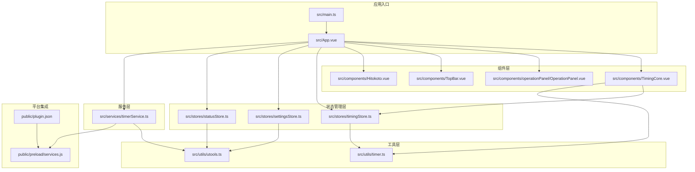
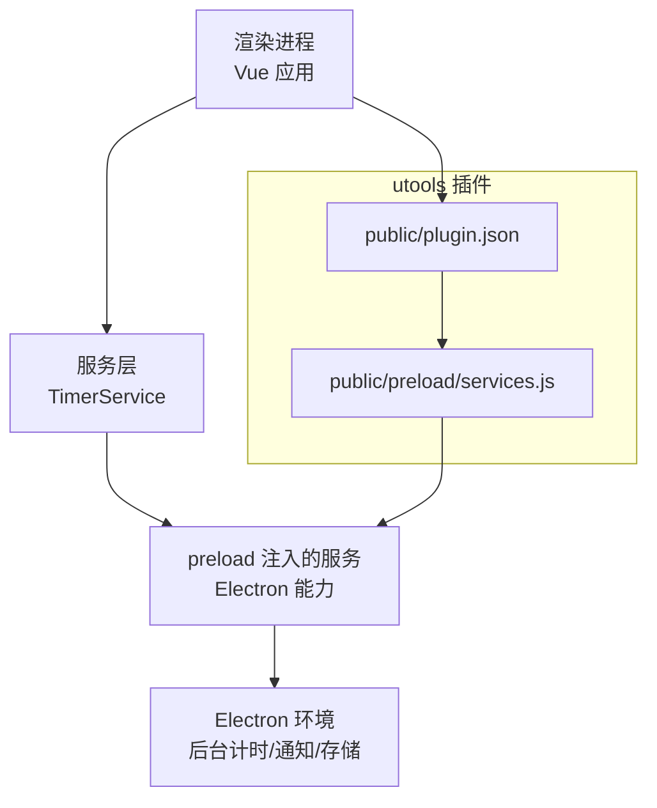
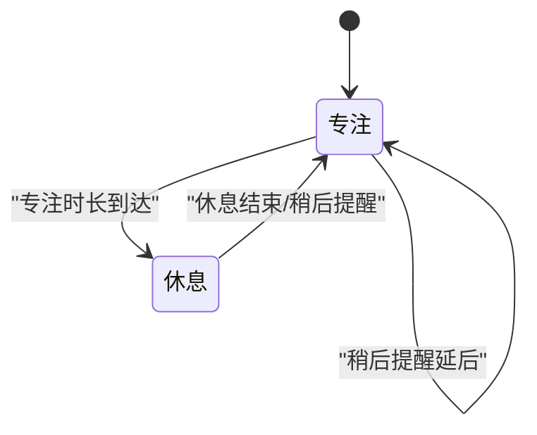
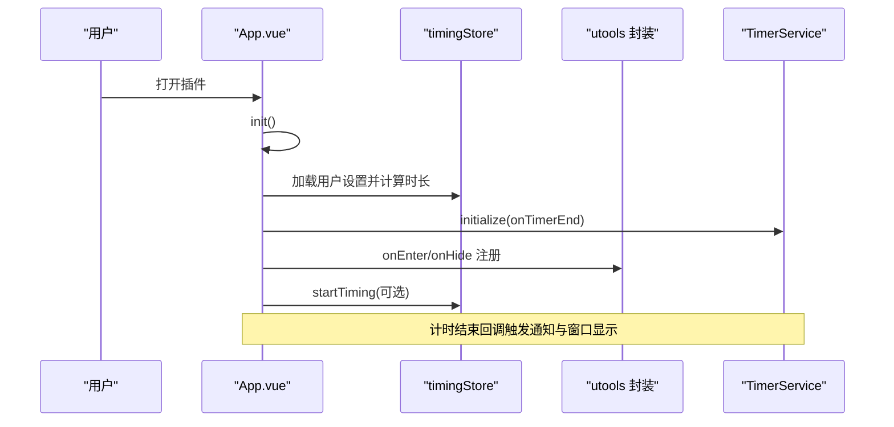
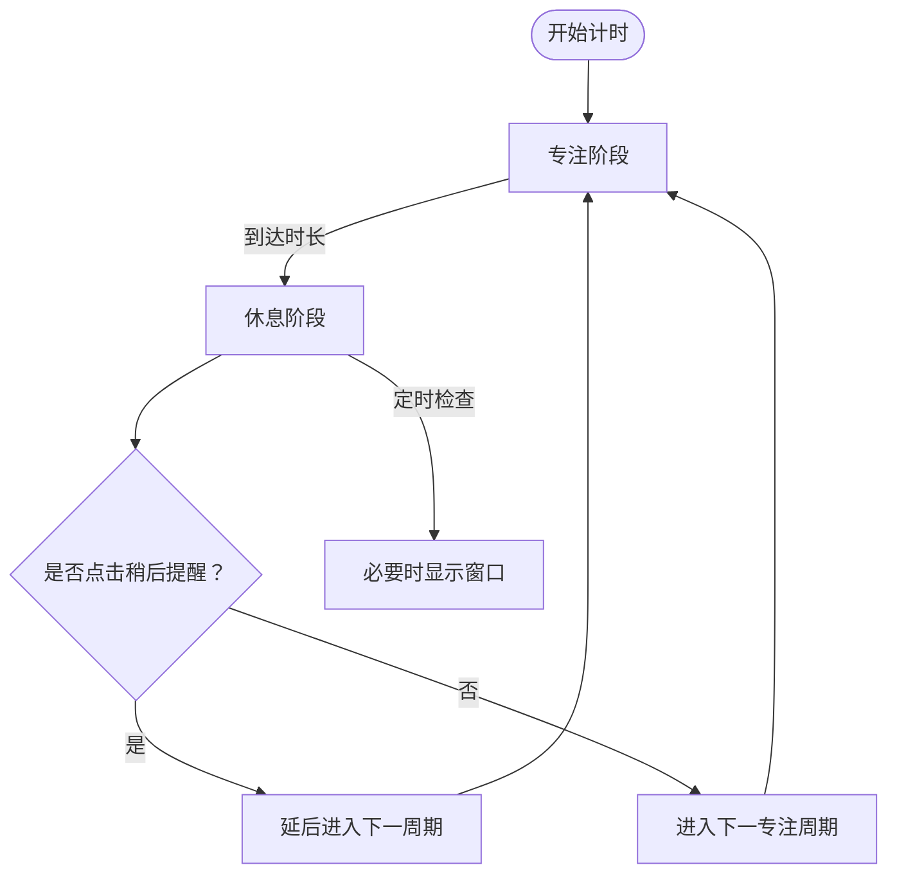
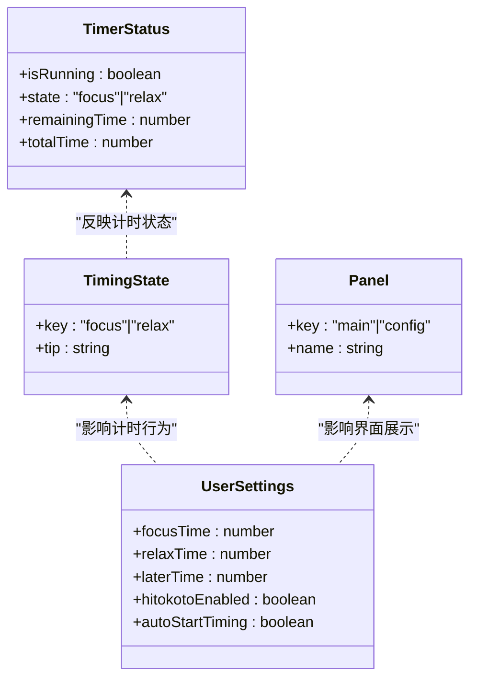
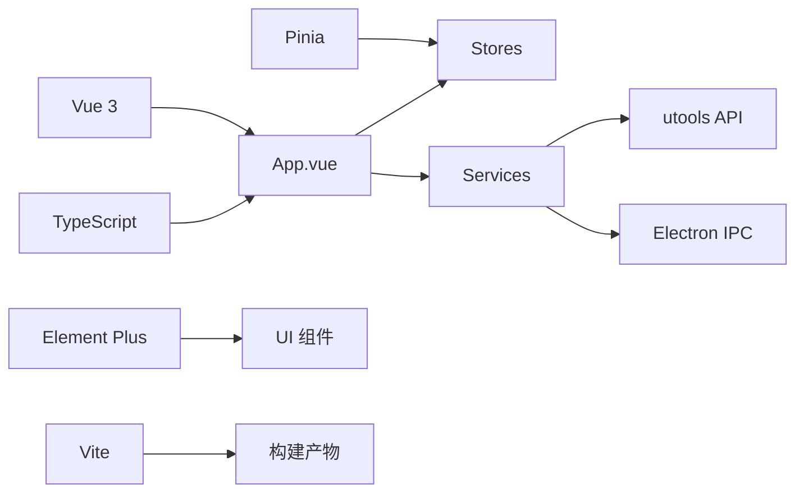

# 项目概述

<cite>
**本文引用的文件**
- [package.json](file://package.json)
- [main.ts](file://src/main.ts)
- [App.vue](file://src/App.vue)
- [plugin.json](file://public/plugin.json)
- [settings.ts](file://src/settings.ts)
- [timingStore.ts](file://src/stores/timingStore.ts)
- [timerService.ts](file://src/services/timerService.ts)
- [TimingCore.vue](file://src/components/TimingCore.vue)
- [timer.ts](file://src/utils/timer.ts)
- [utools.ts](file://src/utils/utools.ts)
- [settingsStore.ts](file://src/stores/settingsStore.ts)
- [statusStore.ts](file://src/stores/statusStore.ts)
- [index.ts](file://src/types/index.ts)
- [OperationPanel.vue](file://src/components/operationPanel/OperationPanel.vue)
- [services.js](file://public/preload/services.js)
</cite>

## 目录
1. [引言](#引言)
2. [项目结构](#项目结构)
3. [核心组件](#核心组件)
4. [架构总览](#架构总览)
5. [详细组件分析](#详细组件分析)
6. [依赖关系分析](#依赖关系分析)
7. [性能考量](#性能考量)
8. [故障排查指南](#故障排查指南)
9. [结论](#结论)
10. [附录](#附录)

## 引言
“休息提醒”是一个基于 Vue 3 与 utools 平台开发的桌面健康提醒应用，旨在通过定时提醒机制帮助用户预防长时间用眼疲劳。项目遵循番茄工作法的健康管理理念，将工作与休息周期化，配合可视化进度与系统通知，形成可持续的用眼健康习惯。

本项目同时具备现代化前端技术栈与桌面应用特性：采用 Vite 构建、TypeScript 类型保障、Pinia 状态管理、Element Plus UI 组件库；通过 utools 插件机制实现跨平台桌面集成，支持后台计时与系统通知，兼顾开发效率与用户体验。

## 项目结构
项目采用“功能域+层”混合组织方式：
- 入口与应用根：入口脚本负责应用初始化与全局依赖挂载；根组件负责布局与生命周期初始化。
- 组件层：包含计时核心、顶部栏、操作面板、一言展示等可复用 UI 组件。
- 状态管理层：使用 Pinia 管理计时状态、用户设置、应用状态与一言数据。
- 服务层：封装计时服务与后台计时能力，屏蔽平台差异。
- 工具层：提供时间格式化、utools API 封装、事件总线等通用工具。
- 平台集成：通过 preload 注入 Electron 的 Node 能力，实现后台计时与系统通知。

图表来源
- [main.ts:1-19](file://src/main.ts#L1-L19)
- [App.vue:1-145](file://src/App.vue#L1-L145)
- [TimingCore.vue:1-101](file://src/components/TimingCore.vue#L1-L101)
- [OperationPanel.vue:1-180](file://src/components/operationPanel/OperationPanel.vue#L1-L180)
- [timingStore.ts:1-141](file://src/stores/timingStore.ts#L1-L141)
- [settingsStore.ts:1-87](file://src/stores/settingsStore.ts#L1-L87)
- [statusStore.ts:1-46](file://src/stores/statusStore.ts#L1-L46)
- [timerService.ts:1-161](file://src/services/timerService.ts#L1-L161)
- [timer.ts:1-66](file://src/utils/timer.ts#L1-L66)
- [utools.ts:1-165](file://src/utils/utools.ts#L1-L165)
- [plugin.json:1-25](file://public/plugin.json#L1-L25)
- [services.js:1-102](file://public/preload/services.js#L1-L102)

章节来源
- [package.json:1-23](file://package.json#L1-L23)
- [main.ts:1-19](file://src/main.ts#L1-L19)
- [App.vue:1-145](file://src/App.vue#L1-L145)
- [plugin.json:1-25](file://public/plugin.json#L1-L25)

## 核心组件
- 计时核心组件：以仪表盘形式展示专注/休息阶段的剩余时间与进度，支持时间格式化与颜色区分。
- 操作面板：采用抽屉式交互，支持主面板与设置面板切换，内置模糊背景与高性能动画。
- 状态管理：计时状态、用户设置、应用面板状态三类 Store 协同，确保 UI 与业务逻辑解耦。
- 计时服务：封装前台/后台计时逻辑，统一通知与存储策略，提供多环境降级方案。
- 平台集成：通过 preload 注入 Electron 能力，实现后台计时、系统通知与持久化存储。

章节来源
- [TimingCore.vue:1-101](file://src/components/TimingCore.vue#L1-L101)
- [OperationPanel.vue:1-180](file://src/components/operationPanel/OperationPanel.vue#L1-L180)
- [timingStore.ts:1-141](file://src/stores/timingStore.ts#L1-L141)
- [settingsStore.ts:1-87](file://src/stores/settingsStore.ts#L1-L87)
- [statusStore.ts:1-46](file://src/stores/statusStore.ts#L1-L46)
- [timerService.ts:1-161](file://src/services/timerService.ts#L1-L161)
- [utools.ts:1-165](file://src/utils/utools.ts#L1-L165)
- [services.js:1-102](file://public/preload/services.js#L1-L102)

## 架构总览
应用采用“渲染进程 + preload 注入 + Electron Node 能力”的桌面架构：
- 渲染进程负责 UI 与交互逻辑，通过 Pinia 管理状态，通过服务层调用后台计时与通知。
- preload 注入提供 Electron 的 Node 能力，包括后台计时器、系统通知与持久化存储。
- utools 插件配置定义了入口页面、预加载脚本与功能指令，使应用可在 utools 中作为插件运行。

图表来源
- [App.vue:60-114](file://src/App.vue#L60-L114)
- [timerService.ts:59-101](file://src/services/timerService.ts#L59-L101)
- [services.js:13-101](file://public/preload/services.js#L13-L101)
- [plugin.json:1-25](file://public/plugin.json#L1-L25)

## 详细组件分析

### 计时流程与状态机
应用围绕“专注-休息”两态循环构建，计时器在前台与后台协同工作，确保即使窗口隐藏也能准确计时与提醒。

图表来源
- [timingStore.ts:70-139](file://src/stores/timingStore.ts#L70-L139)
- [timerService.ts:75-93](file://src/services/timerService.ts#L75-L93)

章节来源
- [timingStore.ts:1-141](file://src/stores/timingStore.ts#L1-L141)
- [timerService.ts:1-161](file://src/services/timerService.ts#L1-L161)

### 初始化与生命周期
应用在挂载时完成设置加载、计时器初始化、事件监听注册与自动启动逻辑，并根据窗口状态动态调整计时精度。

图表来源
- [App.vue:56-114](file://src/App.vue#L56-L114)
- [timingStore.ts:94-100](file://src/stores/timingStore.ts#L94-L100)
- [timerService.ts:59-70](file://src/services/timerService.ts#L59-L70)
- [utools.ts:19-30](file://src/utils/utools.ts#L19-L30)

章节来源
- [App.vue:1-145](file://src/App.vue#L1-L145)
- [utools.ts:1-165](file://src/utils/utools.ts#L1-L165)

### 略读提醒与窗口优先级
应用支持“稍后提醒”，在休息阶段按设定时长延后进入下一周期；同时根据窗口可见性动态调整计时轮询频率，降低资源消耗。

图表来源
- [timingStore.ts:133-139](file://src/stores/timingStore.ts#L133-L139)
- [timingStore.ts:87-90](file://src/stores/timingStore.ts#L87-L90)
- [App.vue:94-106](file://src/App.vue#L94-L106)

章节来源
- [timingStore.ts:1-141](file://src/stores/timingStore.ts#L1-L141)
- [App.vue:1-145](file://src/App.vue#L1-L145)

### 数据模型与类型体系
项目通过 TypeScript 定义清晰的数据模型，涵盖计时状态、用户设置、面板类型与事件映射，保证状态变更与 UI 行为的一致性。

图表来源
- [index.ts:4-83](file://src/types/index.ts#L4-L83)

章节来源
- [index.ts:1-83](file://src/types/index.ts#L1-L83)

### utools 插件集成要点
- 插件元信息定义了入口页面、预加载脚本、功能指令与开发模式地址。
- 预加载脚本注入后台计时器、系统通知与存储接口，供渲染进程统一调用。
- utools 封装提供事件回调、窗口控制、通知与存储等 API，支持多环境降级。

章节来源
- [plugin.json:1-25](file://public/plugin.json#L1-L25)
- [services.js:13-101](file://public/preload/services.js#L13-L101)
- [utools.ts:1-165](file://src/utils/utools.ts#L1-L165)

## 依赖关系分析
- 技术栈：Vue 3、TypeScript、Pinia、Element Plus、Vite。
- 平台依赖：utools API 类型、Electron IPC 与 Notification。
- 运行时：渲染进程与 preload 注入的 Node 能力协作。

图表来源
- [package.json:8-21](file://package.json#L8-L21)
- [main.ts:4-16](file://src/main.ts#L4-L16)
- [App.vue:125-143](file://src/App.vue#L125-L143)

章节来源
- [package.json:1-23](file://package.json#L1-L23)
- [main.ts:1-19](file://src/main.ts#L1-L19)

## 性能考量
- 动画与渲染优化：操作面板使用 transform 替代高度变化，减少重排；在收起动画过程中降低模糊值以提升性能。
- 计时精度自适应：根据窗口可见性动态调整轮询间隔，降低后台资源占用。
- 状态与存储：Pinia 管理状态，utools 封装提供本地存储与通知，避免重复实现。

章节来源
- [OperationPanel.vue:23-42](file://src/components/operationPanel/OperationPanel.vue#L23-L42)
- [App.vue:84-105](file://src/App.vue#L84-L105)
- [timingStore.ts:76-92](file://src/stores/timingStore.ts#L76-L92)

## 故障排查指南
- 无法收到系统通知：检查后台计时服务是否可用与通知权限；确认渲染进程降级路径（utools API 或浏览器 alert）是否生效。
- 计时不准确或窗口不弹出：确认 onEnter/onHide 事件是否正确注册，以及窗口优先级切换逻辑是否执行。
- 设置未生效：检查设置存储键名与加载/保存流程，确保默认值回退逻辑正常。

章节来源
- [timerService.ts:106-118](file://src/services/timerService.ts#L106-L118)
- [App.vue:82-106](file://src/App.vue#L82-L106)
- [settingsStore.ts:39-61](file://src/stores/settingsStore.ts#L39-L61)

## 结论
“休息提醒”以简洁的 UI 与稳健的后台计时为核心，结合 utools 插件生态与 Electron 能力，实现了跨平台桌面健康提醒。其模块化设计与类型安全为后续扩展提供了良好基础，既适合初学者快速上手，也为有经验的开发者提供了清晰的技术亮点与优化方向。

## 附录
- 功能演示示例（步骤说明）
  - 打开插件：在 utools 中输入“休息提醒”命令，打开主界面。
  - 查看计时：专注阶段显示剩余时间，休息阶段显示已过时间。
  - 切换面板：点击面板顶部拖条展开设置面板，修改专注/休息时长。
  - 稍后提醒：在休息阶段点击“稍后提醒”，延后进入下一周期。
  - 自动启动：若开启自动启动，应用挂载后即开始计时。
  - 系统通知：计时结束时弹出系统通知并显示主界面。

章节来源
- [plugin.json:15-23](file://public/plugin.json#L15-L23)
- [App.vue:108-114](file://src/App.vue#L108-L114)
- [timingStore.ts:133-139](file://src/stores/timingStore.ts#L133-L139)
- [settingsStore.ts:39-73](file://src/stores/settingsStore.ts#L39-L73)